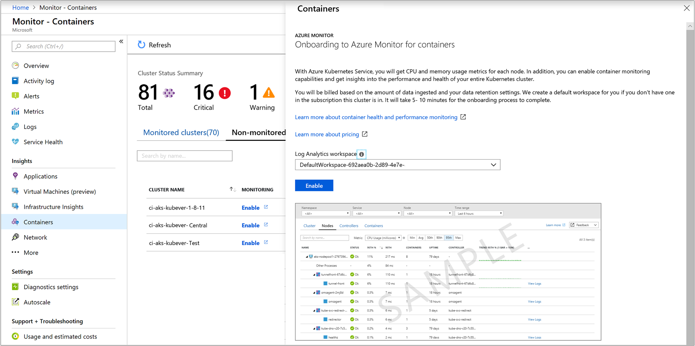
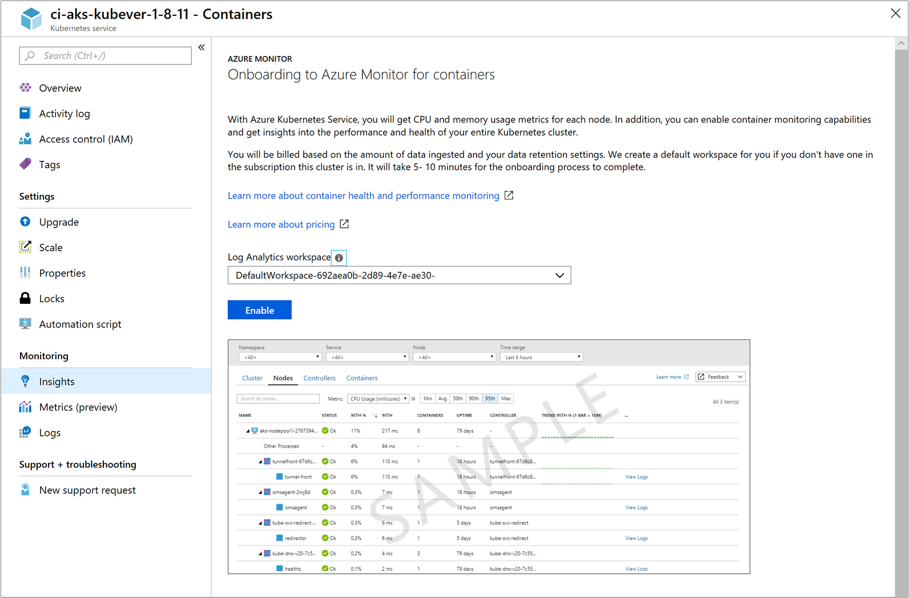

# Enable monitoring of Azure Kubernetes Service (AKS) cluster already deployed

This article describes how to set up Azure Monitor for containers to monitor managed Kubernetes cluster hosted on [Azure Kubernetes Service](https://docs.microsoft.com/azure/aks/) that have already been deployed in your subscription.

You can enable monitoring of an AKS cluster that's already deployed using one of the supported methods:

* Azure CLI
* Terraform
* [From Azure Monitor](#enable-from-azure-monitor-in-the-portal) or [directly from the AKS cluster](#enable-directly-from-aks-cluster-in-the-portal) in the Azure portal 
* With the [provided Azure Resource Manager template](#enable-using-an-azure-resource-manager-template) by using the Azure PowerShell cmdlet `New-AzResourceGroupDeployment` or with Azure CLI. 

## Sign in to the Azure portal

Sign in to the [Azure portal](https://portal.azure.com). 

## Enable using Azure CLI

The following step enables monitoring of your AKS cluster using Azure CLI. In this example, you are not required to per-create or specify an existing workspace. This command simplifies the process for you by creating a default workspace in the default resource group of the AKS cluster subscription if one does not already exist in the region.  The default workspace created resembles the format of *DefaultWorkspace-\<GUID>-\<Region>*.  

```azurecli
az aks enable-addons -a monitoring -n MyExistingManagedCluster -g MyExistingManagedClusterRG  
```

The output will resemble the following:

```azurecli
provisioningState       : Succeeded
```

If you would rather integrate with an existing workspace, use the following command to specify that workspace.

```azurecli
az aks enable-addons -a monitoring -n MyExistingManagedCluster -g MyExistingManagedClusterRG --workspace-resource-id <ExistingWorkspaceResourceID> 
```

The output will resemble the following:

```azurecli
provisioningState       : Succeeded
```

## Enable using Terraform

1. Add the **oms_agent** add-on profile to the existing [azurerm_kubernetes_cluster resource](https://www.terraform.io/docs/providers/azurerm/d/kubernetes_cluster.html#addon_profile)

   ```
   addon_profile {
    oms_agent {
      enabled                    = true
      log_analytics_workspace_id = "${azurerm_log_analytics_workspace.test.id}"
     }
   }
   ```

2. Add the [azurerm_log_analytics_solution](https://www.terraform.io/docs/providers/azurerm/r/log_analytics_solution.html) following the steps in the Terraform documentation.

## Enable from Azure Monitor in the portal 

To enable monitoring of your AKS cluster in the Azure portal from Azure Monitor, do the following:

1. In the Azure portal, select **Monitor**. 
2. Select **Containers** from the list.
3. On the **Monitor - containers** page, select **Non-monitored clusters**.
4. From the list of non-monitored clusters, find the container in the list and click **Enable**.   
5. On the **Onboarding to Azure Monitor for containers** page, if you have an existing Log Analytics workspace in the same subscription as the cluster, select it from the drop-down list.  
    The list preselects the default workspace and location that the AKS container is deployed to in the subscription. 

    

    >[!NOTE]
    >If you want to create a new Log Analytics workspace for storing the monitoring data from the cluster, follow the instructions in [Create a Log Analytics workspace](../../azure-monitor/learn/quick-create-workspace.md). Be sure to create the workspace in the same subscription that the AKS container is deployed to. 
 
After you've enabled monitoring, it might take about 15 minutes before you can view health metrics for the cluster. 

## Enable directly from AKS cluster in the portal

To enable monitoring directly from one of your AKS clusters in the Azure portal, do the following:

1. In the Azure portal, select **All services**. 
2. In the list of resources, begin typing **Containers**.  
	The list filters based on your input. 
3. Select **Kubernetes services**.  

    

4. In the list of containers, select a container.
5. On the container overview page, select **Monitor Containers**.  
6. On the **Onboarding to Azure Monitor for containers** page, if you have an existing Log Analytics workspace in the same subscription as the cluster, select it in the drop-down list.  
    The list preselects the default workspace and location that the AKS container is deployed to in the subscription. 

    

    >[!NOTE]
    >If you want to create a new Log Analytics workspace for storing the monitoring data from the cluster, follow the instructions in [Create a Log Analytics workspace](../../azure-monitor/learn/quick-create-workspace.md). Be sure to create the workspace in the same subscription that the AKS container is deployed to. 
 
After you've enabled monitoring, it might take about 15 minutes before you can view operational data for the cluster. 

## Enable using an Azure Resource Manager template

This method includes two JSON templates. One template specifies the configuration to enable monitoring, and the other contains parameter values that you configure to specify the following:

* The AKS container resource ID. 
* The resource group that the cluster is deployed in.

>[!NOTE]
>The template needs to be deployed in the same resource group as the cluster.
>

The Log Analytics workspace has to be created before you enable monitoring using Azure PowerShell or CLI. To create the workspace, you can set it up through [Azure Resource Manager](../../azure-monitor/platform/template-workspace-configuration.md), through [PowerShell](../scripts/powershell-sample-create-workspace.md?toc=%2fpowershell%2fmodule%2ftoc.json), or in the [Azure portal](../../azure-monitor/learn/quick-create-workspace.md).

If you are unfamiliar with the concept of deploying resources by using a template, see:
* [Deploy resources with Resource Manager templates and Azure PowerShell](../../azure-resource-manager/resource-group-template-deploy.md)
* [Deploy resources with Resource Manager templates and the Azure CLI](../../azure-resource-manager/resource-group-template-deploy-cli.md)

If you choose to use the Azure CLI, you first need to install and use the CLI locally. You must be running the Azure CLI version 2.0.59 or later. To identify your version, run `az --version`. If you need to install or upgrade the Azure CLI, see [Install the Azure CLI](https://docs.microsoft.com/cli/azure/install-azure-cli). 

### Create and execute a template

1. Copy and paste the following JSON syntax into your file:

    ```json
	{
	"$schema": "https://schema.management.azure.com/schemas/2015-01-01/deploymentTemplate.json#",
	"contentVersion": "1.0.0.0",
	"parameters": {
	  "aksResourceId": {
		"type": "string",
		"metadata": {
		   "description": "AKS Cluster Resource ID"
		   }
	},
	"aksResourceLocation": {
	"type": "string",
	 "metadata": {
		"description": "Location of the AKS resource e.g. \"East US\""
	   }
	},
	"workspaceResourceId": {
	  "type": "string",
	  "metadata": {
		 "description": "Azure Monitor Log Analytics Resource ID"
	   }
	}
	},
	"resources": [
	  {
	"name": "[split(parameters('aksResourceId'),'/')[8]]",
	"type": "Microsoft.ContainerService/managedClusters",
	"location": "[parameters('aksResourceLocation')]",
	"apiVersion": "2018-03-31",
	"properties": {
	  "mode": "Incremental",
	  "id": "[parameters('aksResourceId')]",
	  "addonProfiles": {
		"omsagent": {
		  "enabled": true,
		  "config": {
			"logAnalyticsWorkspaceResourceID": "[parameters('workspaceResourceId')]"
		  }
		 }
	   }
	  }
	 }
	 ]
	}
    ```

2. Save this file as **existingClusterOnboarding.json** to a local folder.
3. Paste the following JSON syntax into your file:

    ```json
	{
	   "$schema": "https://schema.management.azure.com/schemas/2015-01-01/deploymentParameters.json#",
	   "contentVersion": "1.0.0.0",
	   "parameters": {
		 "aksResourceId": {
		   "value": "/subscriptions/<SubscriptionId>/resourcegroups/<ResourceGroup>/providers/Microsoft.ContainerService/managedClusters/<ResourceName>"
	   },
	   "aksResourceLocation": {
		 "value": "<aksClusterLocation>"
	   },
	   "workspaceResourceId": {
		 "value": "/subscriptions/<SubscriptionId>/resourceGroups/<ResourceGroup>/providers/Microsoft.OperationalInsights/workspaces/<workspaceName>"
	   }  
	 }
	}
    ```

4. Edit the values for **aksResourceId** and **aksResourceLocation** using the values on the **AKS Overview** page for the AKS cluster. The value for **workspaceResourceId** is the full resource ID of your Log Analytics workspace, which includes the workspace name. 
5. Save this file as **existingClusterParam.json** to a local folder.
6. You are ready to deploy this template. 

   * To deploy with Azure PowerShell, use the following commands in the folder that contains the template:

       ```powershell
       New-AzResourceGroupDeployment -Name OnboardCluster -ResourceGroupName <ResourceGroupName> -TemplateFile .\existingClusterOnboarding.json -TemplateParameterFile .\existingClusterParam.json
       ```
       The configuration change can take a few minutes to complete. When it's completed, a message is displayed that's similar to the following and includes the result:

       ```powershell
       provisioningState       : Succeeded
       ```

   * To deploy with Azure CLI, run the following commands:
    
       ```azurecli
       az login
       az account set --subscription "Subscription Name"
       az group deployment create --resource-group <ResourceGroupName> --template-file ./existingClusterOnboarding.json --parameters @./existingClusterParam.json
       ```

       The configuration change can take a few minutes to complete. When it's completed, a message is displayed that's similar to the following and includes the result:

       ```azurecli
       provisioningState       : Succeeded
       ```
     After you've enabled monitoring, it might take about 15 minutes before you can view health metrics for the cluster. 

## Verify agent and solution deployment

With agent version *06072018* or later, you can verify that both the agent and the solution were deployed successfully. With earlier versions of the agent, you can verify only agent deployment.

### Agent version 06072018 or later

Run the following command to verify that the agent is deployed successfully. 

```
kubectl get ds omsagent --namespace=kube-system
```

The output should resemble the following, which indicates that it was deployed properly:

```
User@aksuser:~$ kubectl get ds omsagent --namespace=kube-system 
NAME       DESIRED   CURRENT   READY     UP-TO-DATE   AVAILABLE   NODE SELECTOR                 AGE
omsagent   2         2         2         2            2           beta.kubernetes.io/os=linux   1d
```  

To verify deployment of the solution, run the following command:

```
kubectl get deployment omsagent-rs -n=kube-system
```

The output should resemble the following, which indicates that it was deployed properly:

```
User@aksuser:~$ kubectl get deployment omsagent-rs -n=kube-system 
NAME       DESIRED   CURRENT   UP-TO-DATE   AVAILABLE    AGE
omsagent   1         1         1            1            3h
```

### Agent version earlier than 06072018

To verify that the Log Analytics agent version released before *06072018* is deployed properly, run the following command:  

```
kubectl get ds omsagent --namespace=kube-system
```

The output should resemble the following, which indicates that it was deployed properly:  

```
User@aksuser:~$ kubectl get ds omsagent --namespace=kube-system 
NAME       DESIRED   CURRENT   READY     UP-TO-DATE   AVAILABLE   NODE SELECTOR                 AGE
omsagent   2         2         2         2            2           beta.kubernetes.io/os=linux   1d
```  

## View configuration with CLI

Use the `aks show` command to get details such as is the solution enabled or not, what is the Log Analytics workspace resourceID, and summary details about the cluster.  

```azurecli
az aks show -g <resourceGroupofAKSCluster> -n <nameofAksCluster>
```

After a few minutes, the command completes and returns JSON-formatted information about solution.  The results of the command should show the monitoring add-on profile and resembles the following example output:

```
"addonProfiles": {
    "omsagent": {
      "config": {
        "logAnalyticsWorkspaceResourceID": "/subscriptions/<WorkspaceSubscription>/resourceGroups/<DefaultWorkspaceRG>/providers/Microsoft.OperationalInsights/workspaces/<defaultWorkspaceName>"
      },
      "enabled": true
    }
  }
```

## Next steps

* If you experience issues while attempting to onboard the solution, review the [troubleshooting guide](container-insights-troubleshoot.md)

* With monitoring enabled to capture health metrics for both the AKS cluster nodes and pods, these health metrics are available in the Azure portal. To learn how to use Azure Monitor for containers, see [View Azure Kubernetes Service health](container-insights-analyze.md).
