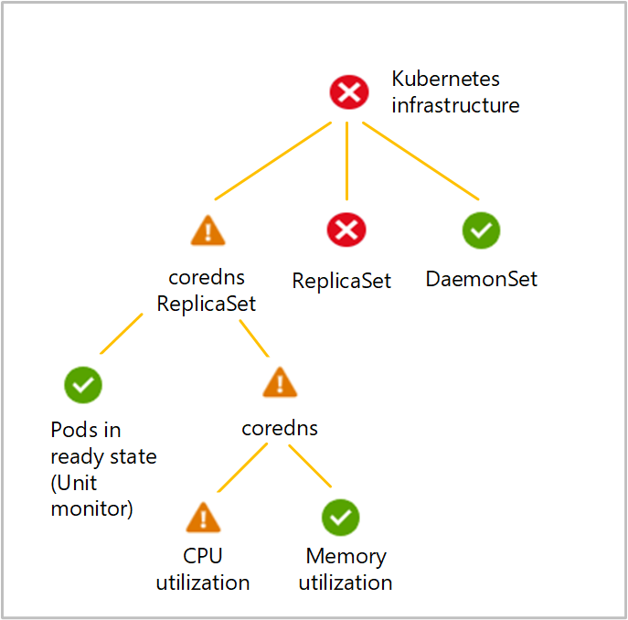

# Azure Monitor for containers health monitor configuration guide

Monitors are the primary element for measuring health and detecting errors in Azure Monitor for containers. This article helps you understand the concepts of how health is measured and the elements that comprise the health model to monitor and report on the health of your Kubernetes cluster with the [Health (preview)](container-insights-health.md) feature.

>[!NOTE]
>The Health feature is in public preview at this time.
>

## Monitors

A monitor measures the health of some aspect of a managed object. Monitors each have either two or three health states. A monitor will be in one and only one of its potential states at any given time. When a monitor loaded by the containerized agent, it is initialized to a healthy state. The state changes only if the specified conditions for another state are detected.

The overall health of a particular object is determined from the health of each of its monitors. This hierarchy is illustrated in the Health Hierarchy pane in Azure Monitor for containers. The policy for how health is rolled up is part of the configuration of the aggregate monitors.

## Types of monitors

|Monitor | Description | 
|--------|-------------|
| Unit monitor |A unit monitor measures some aspect of a resource or application. This might be checking a performance counter to determine the performance of the resource, or its availability. |
|Aggregate Monitor | Aggregate monitors group multiple monitors to provide a single health aggregated health state. Unit monitors are typically configured under a particular aggregate monitor. For example, a Node aggregate monitor rolls up the status of the Node CPU utilization, memory utilization, and Node status.
 |

### Aggregate monitor health rollup policy

Each aggregate monitor defines a health rollup policy, which is the logic that is used to determine the health of the aggregate monitor based on the health of the monitors under it. The possible health rollup policies for an aggregate monitor are as follows:

#### Worst state policy

The state of the aggregate monitor matches the state of the child monitor with the worst health state. This is the most common policy used by aggregate monitors.

### Percentage policy

The source object matches the worst state of a single member of a specified percentage of target objects in the best state. This policy is used when a certain percentage of target objects must be healthy for the target object to be considered healthy. Percentage policy sorts the monitors in descending order of severity of state, and the aggregate monitor's state is computed as the worst state of N% (N is dictated by the configuration parameter *StateThresholdPercentage*).

For example, suppose there are five container instances of a container image, and their individual states are **Critical**, **Warning**, **Healthy**, **Healthy**, **Healthy**.  The status of the container CPU utilization monitor will be **Critical**, since the worst state of 90% of the containers is **Critical** when sorted in descending order of severity.

## Understand the monitoring configuration

Azure Monitor for containers includes a number of key monitoring scenarios that are configured as follows.

### Unit monitors

|**Monitor name** | Monitor type | **Description** | **Parameter** | **Value** |
|-----------------|--------------|-----------------|---------------|-----------|
|Node Memory Utilization |Unit monitor |This monitor evaluates the memory utilization of a node every minute, using the cadvisor reported data. |ConsecutiveSamplesForStateTransition  FailIfGreaterThanPercentage  WarnIfGreaterThanPercentage | 3  90  80  ||
|Node CPU Utilization |Unit Monitor |This monitor checks the CPU utilization of the node every minute, using the cadvisor reported data. | ConsecutiveSamplesForStateTransition  FailIfGreaterThanPercentage  WarnIfGreaterThanPercentage | 3  90  80  ||
|Node Status |Unit monitor |This monitor checks node conditions reported by Kubernetes.  Currently the following node conditions are checked: Disk Pressure, Memory Pressure, PID Pressure, Out of Disk, Network unavailable, Ready status for the node.  Out of the above conditions, if either *Out of Disk* or *Network Unavailable* is **true**, the monitor changes to **Critical** state.  If any other conditions equal **true**, other than a **Ready** status, the monitor changes to a **Warning** state. | NodeConditionTypeForFailedState | outofdisk,networkunavailable ||
|Container memory utilization |Unit monitor |This monitor reports combined health status of the Memory utilization(RSS) of the instances of the container.  It performs a simple comparison that compares each sample to a single threshold, and specified by the configuration parameter **ConsecutiveSamplesForStateTransition**.  Its state is calculated as the worst state of 90% of the container (StateThresholdPercentage) instances, sorted in descending order of severity of container health state (that is, Critical, Warning, Healthy).  If no record is received from a container instance, then the health state of the container instance is reported as **Unknown**, and has higher precedence in the sorting order over the **Critical** state.  Each individual container instance's state is calculated using the thresholds specified in the configuration. If the usage is over critical threshold (90%), then the instance is in a **Critical** state, if it is less than critical threshold (90%) but greater than warning threshold (80%), then the instance is in a **Warning** state. Otherwise, it is in **Healthy** state. |ConsecutiveSamplesForStateTransition  FailIfLessThanPercentage  StateThresholdPercentage  WarnIfGreaterThanPercentage| 3  90  90  80 ||
|Container CPU utilization |Unit monitor |This monitor reports combined health status of the CPU utilization of the instances of the container.  It performs a simple comparison that compares each sample to a single threshold, and specified by the configuration parameter **ConsecutiveSamplesForStateTransition**.  Its state is calculated as the worst state of 90% of the container (StateThresholdPercentage) instances, sorted in descending order of severity of container health state (that is, Critical, Warning, Healthy).  If no record is received from a container instance, then the health state of the container instance is reported as **Unknown**, and has higher precedence in the sorting order over the **Critical** state.  Each individual container instance's state is calculated using the thresholds specified in the configuration. If the usage is over critical threshold (90%), then the instance is in a **Critical** state, if it is less than critical threshold (90%) but greater than warning threshold (80%), then the instance is in a **Warning** state. Otherwise, it is in **Healthy** state. |ConsecutiveSamplesForStateTransition  FailIfLessThanPercentage  StateThresholdPercentage  WarnIfGreaterThanPercentage| 3  90  90  80 ||
|System workload pods ready |Unit monitor |This monitor reports status based on percentage of pods in ready state in a given workload. Its state is set to **Critical** if less than 100% of the pods are in a **Healthy** state |ConsecutiveSamplesForStateTransition  FailIfLessThanPercentage |2  100 ||
|Kube API status |Unit monitor |This monitor reports status of Kube API service. Monitor is in critical state in case Kube API endpoint is unavailable. For this particular monitor, the state is determined by making a query to the 'nodes' endpoint for the kube-api server. Anything other than an OK response code changes the monitor to a **Critical** state. | No configuration properties |||

### Aggregate monitors

|**Monitor name** | **Description** | **Algorithm** |
|-----------------|-----------------|---------------|
|Node |This monitor is an aggregate of the all the node monitors. It matches the state of the child monitor with the worst health state:  Node CPU utilization  Node memory utilization  Node Status | Worst of|
|Node pool |This monitor reports combined health status of all nodes in the node pool *agentpool*. This is a three state monitor, whose state is based on the worst state of 80% of the nodes in the node pool, sorted in descending order of severity of node states (that is, Critical, Warning, Healthy).|Percentage |
|Nodes (parent of Node pool) |This is an aggregate monitor of all the node pools. Its state is based on the worst state of its child monitors (that is, the node pools present in the cluster). |Worst of |
|Cluster (parent of nodes/  Kubernetes infrastructure) |This is the parent monitor that matches the state of the child monitor with the worst health state, that is kubernetes infrastructure and nodes. |Worst of |
|Kubernetes infrastructure |This monitor reports combined health status of the managed infrastructure components of the cluster. its status is calculated as the 'worst of' its child monitor states i.e. kube-system workloads and API Server status. |Worst of|
|System workload |This monitor reports health status of a kube-system workload. This monitor matches the state of the child monitor with the worst health state, that is the **Pods in ready state** (monitor and the containers in the workload). |Worst of |
|Container |This monitor reports overall health status of a container in a given workload. This monitor matches the state of the child monitor with the worst health state, that is the **CPU utilization** and **Memory utilization** monitors. |Worst of |

## Next steps

View [monitor cluster health](container-insights-health.md) to learn about viewing the health status your Kubernetes cluster.
