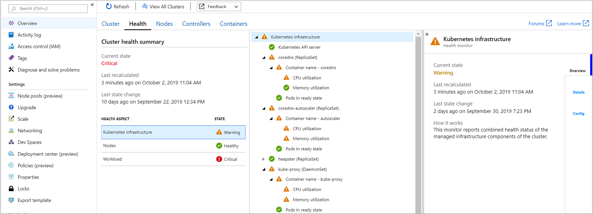

# Understand AKS cluster health with Azure Monitor for containers

With Azure Monitor for containers, it monitors and reports health status of the managed infrastructure components, all nodes, and workloads running on a cluster deployed on Azure Kubernetes Service (AKS) and AKS Engine running on-premises and on Azure Stack. This experience extends beyond the cluster health status calculated and reported on the [multi-cluster view](container-insights-analyze.md#multi-cluster-view-from-azure-monitor), where now you can understand if one or more nodes in the cluster are resource constrained, or a node or pod are unavailable that could impact a running application in the cluster based on curated metrics. 

For information about how to enable Azure Monitor for containers, see [Onboard Azure Monitor for containers](container-insights-onboard.md).

## Overview

In Azure Monitor for containers, the Health feature provides proactive health monitoring of your Kubernetes cluster to help you identify and diagnose issues. It gives you the ability to view these significant issues detected. 

Kubernetes cluster health is based on a number of monitoring scenarios organized by the following Kubernetes objects and abstractions:

- Kubernetes infrastructure - provides a rollup of the Kubernetes API server, ReplicaSets, and DaemonSets running on nodes deployed in your cluster by evaluating CPU and memory utilization, and a Pods availability

    

- Nodes - provides a rollup of the Node pools and state of individual Nodes in each pool, by evaluating CPU and memory utilization, and a Nodes availability.

    

All monitors are shown in a hierarchical layout, where an aggregate monitor representing the Kubernetes object or abstraction (that is, Kubernetes infrastructure or Nodes) are the top-most monitor reflecting the combined health of all dependent child monitors. The key monitoring scenarios used to derive health are:

* Evaluate CPU utilization from the node and container.
* Evaluate memory utilization from the node and container.
* Status of Pods and Nodes based on calculation of their ready state reported by Kubernetes.

The icons used to indicate state are as follows:

|Icon|Meaning|  
|--------|-----------|  
||Success, health is OK (green)|  
||Warning (yellow)|  
||Critical (red)|  
||Unknown (gray)|  

## Monitor configuration (put into its own article)

To understand the behavior and configuration of each monitor supporting Azure Monitor for containers Health feature, see [article name].

## Sign in to the Azure portal

Sign in to the [Azure portal](https://portal.azure.com). 

## View health from an AKS cluster

Access to the Azure Monitor for containers Health feature is available directly from an AKS cluster by selecting **Insights** from the left pane in the Azure portal. Select the **Health** tab and the Health page appears.  

## View health from non-AKS clusters

To view health from a non-AKS cluster, that is an AKS Engine cluster hosted on-premises or on Azure Stack, i

Go to the multi-cluster view and then select the non-AKS cluster from the list to drill-down and view health for that specific cluster.

## Alerting

## Next steps