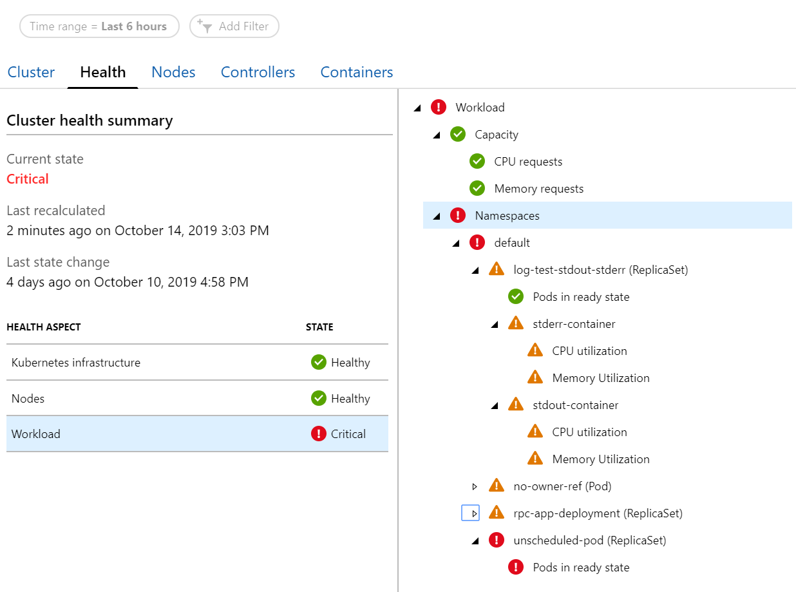

# Understand AKS cluster health with Azure Monitor for containers

With Azure Monitor for containers, it monitors and reports health status of the managed infrastructure components, all nodes, and workloads running on a cluster deployed on Azure Kubernetes Service (AKS) and AKS Engine running on-premises and on Azure Stack. This experience extends beyond the cluster health status calculated and reported on the [multi-cluster view](container-insights-analyze.md#multi-cluster-view-from-azure-monitor), where now you can understand if one or more nodes in the cluster are resource constrained, or a node or pod are unavailable that could impact a running application in the cluster based on curated metrics. 

For information about how to enable Azure Monitor for containers, see [Onboard Azure Monitor for containers](container-insights-onboard.md).

## Overview

In Azure Monitor for containers, the Health feature helps you identify and diagnose failures in your Kubernetes cluster. It gives you the ability to view significant issues detected, and create [alerts](../platform/alerts-unified-log.md) when state changes occur. The icons used to indicate state are as follows:

|Icon|Meaning|  
|--------|-----------|  
||Success, health is OK (green)|  
||Warning (yellow)|  
||Critical (red)|  
||Out of contact (gray)|  

## Monitor configuration (put into its own article)

Describe the behavior and configuration of each monitor (describe difference between unit monitor and aggregate monitor, the config of each

## Sign in to the Azure portal

Sign in to the [Azure portal](https://portal.azure.com). 

## View health from an AKS cluster

Access to the Azure Monitor for containers health feature is available directly from an AKS cluster by selecting **Insights** from the left pane in the Azure portal. From the **Cluster** performance tab, select **Health**.  

Immediately you can see the overall health of the cluster without having to view from each tab - **Node**, **Controllers**, and **Pods**. Under the **Cluster health summary**, an overall health perspective is provided for:

- Kubernetes infrastructure - provides a rollup of the Kubernetes API server, ReplicaSets, and DaemonSets running on nodes deployed in your cluster.

    

- Nodes - provides a rollup of the node pools and state of individual nodes in each pool, by evaluating CPU and memory utilization, and a nodes availability.

    

- Workloads - provides a rollup of overall utilization of the cluster and for each containerized application or other workload running across all namespaces in the cluster.

    

Selecting 

## View health from non-AKS clusters

Go to the multi-cluster view and then select the non-AKS cluster from the list to drill-down and view health for that specific cluster.

## Alerting

## Next steps