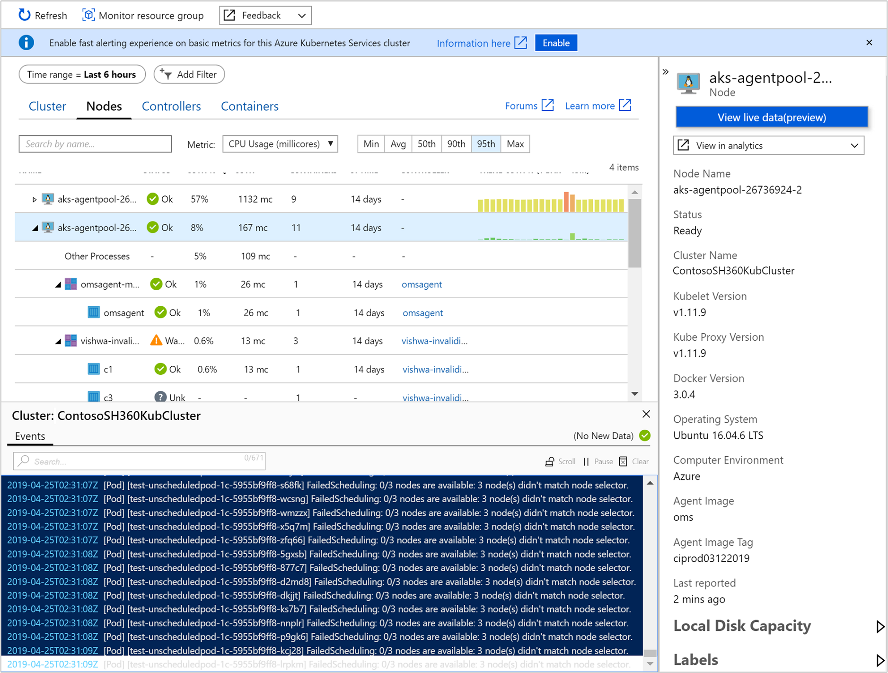
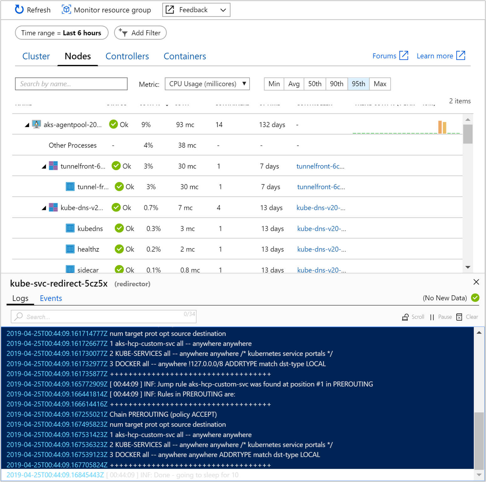
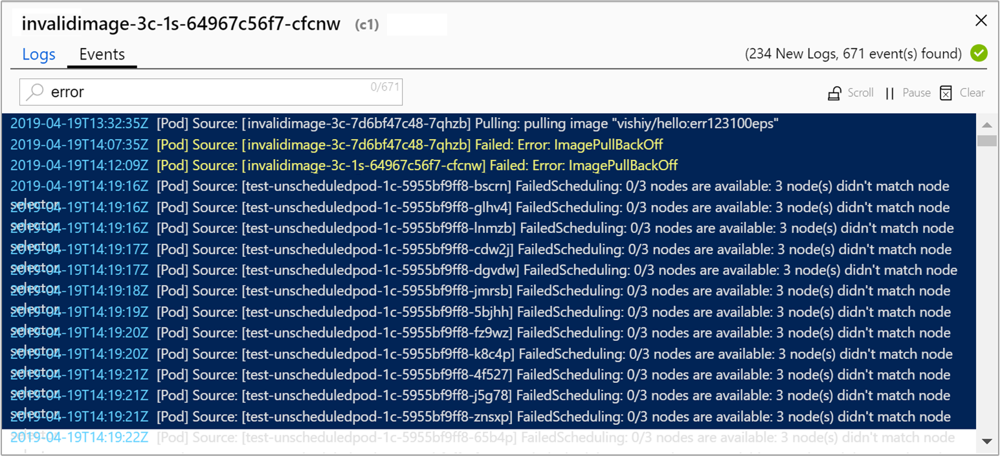
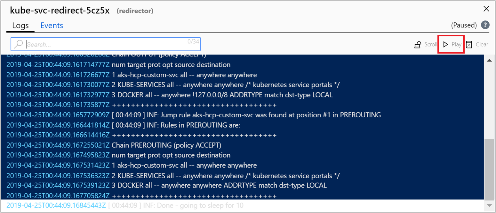

# How to view logs and events in real time (preview)
Azure Monitor for containers includes a feature, which is currently in preview, that provides a live view into your Azure Kubernetes Service (AKS) container logs (stdout/stderr) and events without having to run kubectl commands. When you select either option, a new pane appears below the performance data table on the **Nodes**, **Controllers**, and **Containers** view. It shows live logging and events generated by the container engine to further assist in troubleshooting issues in real time.

>[!NOTE]
>**Contributor** access to the cluster resource is required for this feature to work.
>

Live logs support three different methods to control access to the logs:

1. AKS without Kubernetes RBAC authorization enabled
2. AKS enabled with Kubernetes RBAC authorization
3. AKS enabled with Azure Active Directory (AD) SAML-based single-sign on

## Kubernetes cluster without RBAC enabled
 
If you have a Kubernetes cluster that is not configured with Kubernetes RBAC authorization or integrated with Azure AD single-sign on, you do not need to follow these steps. Because Kubernetes authorization uses the kube-api, read-only permissions are required.

## Kubernetes RBAC authorization
If you have enabled Kubernetes RBAC authorization, you will need to apply cluster role binding. The following example steps demonstrate how to configure cluster role binding from this yaml configuration template. 

1. Copy and paste the yaml file and save it as LogReaderRBAC.yaml.  

    ```
    apiVersion: rbac.authorization.k8s.io/v1 
    kind: ClusterRole 
    metadata: 
       name: containerHealth-log-reader 
    rules: 
       - apiGroups: [""] 
         resources: ["pods/log", "events"] 
         verbs: ["get", "list"]  
    --- 
    apiVersion: rbac.authorization.k8s.io/v1 
    kind: ClusterRoleBinding 
    metadata: 
       name: containerHealth-read-logs-global 
    roleRef: 
        kind: ClusterRole 
        name: containerHealth-log-reader 
        apiGroup: rbac.authorization.k8s.io 
    subjects: 
       - kind: User 
         name: clusterUser 
         apiGroup: rbac.authorization.k8s.io
    ```

2. If you are configuring it for the first time, you create the cluster rule binding by running the following command: `kubectl create -f LogReaderRBAC.yaml`. If you previously enabled support for live logs preview before we introduced live event logs, to update your configuration, run the following command: `kubectl apply -f LogReaderRBAC.yaml`.

## Configure AKS with Azure Active Directory

AKS can be configured to use Azure Active Directory (AD) for user authentication. If you are configuring it for the first time, see [Integrate Azure Active Directory with Azure Kubernetes Service](../../aks/azure-ad-integration.md). During the steps to create the [client application](../../aks/azure-ad-integration.md#create-the-client-application), specify the following:

- **Redirect URI (optional)**: This is a **Web** application type and the base URL value should be `https://afd.hosting.portal.azure.net/monitoring/Content/iframe/infrainsights.app/web/base-libs/auth/auth.html`.
- After registering the application, from the **Overview** page select **Authentication** from the left-hand pane. On the **Authentication** page, under **Advanced settings** implicitly grant **Access tokens** and **ID tokens** and then save your changes.

>[!NOTE]
>Configuring authentication with Azure Active Directory for single-sign on can only be accomplished during initial deployment of a new AKS cluster. You cannot configure single-sign on for an AKS cluster already deployed.
  
>[!IMPORTANT]
>If you reconfigured Azure AD for user authentication using the updated URI, clear your browser's cache to ensure the updated authentication token is downloaded and applied.   

## View live logs and events

You can view real-time log events as they are generated by the container engine from the **Nodes**, **Controllers**, and **Containers** view. From the properties pane, you select **View live data (preview)** option and a pane is presented below the performance data table where you can view log and events in a continuous stream.

  

Log and event messages are limited based on what resource type is selected in the view.

| View | Resource type | Log or event | Data presented |
|------|---------------|--------------|----------------|
| Nodes | Node | Event | When a node is selected events are not filtered and show cluster-wide Kubernetes events. The pane title shows the name of the cluster. |
| Nodes | Pod | Event | When a pod is selected events are filtered to its namespace. The pane title shows the namespace of the pod. | 
| Controllers | Pod | Event | When a pod is selected events are filtered to its namespace. The pane title shows the namespace of the pod. |
| Controllers | Controller | Event | When a controller is selected events are filtered to its namespace. The pane title shows the namespace of the controller. |
| Nodes/Controllers/Containers | Container | Logs | The pane title shows the name of the pod the container is grouped with. |

If the AKS cluster is configured with SSO using AAD, you are prompted to authenticate on first use during that browser session. Select your account and complete authentication with Azure.  

After successfully authenticating, the live log pane will appear in the bottom section of the middle pane. If the fetch status indicator shows a green check mark, which is on the far right of the pane, it means it can retrieve data.
    
    

In the search bar, you can filter by key word to highlight that text in the log or event, and in the search bar on the far right, it shows how many results match out the filter.

  

While viewing events, you can additionally limit the results using the **Filter** pill found to the right of the search bar. Depending on what resource you have selected, the pill lists a pod, namespace, or cluster to chose from.  

To suspend autoscroll and control the behavior of the pane and allow you to manually scroll through the new data read, click on the **Scroll** option. To re-enable autoscroll, simply click the **Scroll** option again. You can also pause retrieval of log or event data by clicking on the **Pause** option and when you are ready to resume, simply click **Play**.  



You can go to Azure Monitor Logs to see historical container logs by selecting **View container logs** from the drop-down list **View in analytics**.

## Next steps

- To continue learning how to use Azure Monitor and monitor other aspects of your AKS cluster, see [View Azure Kubernetes Service health](container-insights-analyze.md).

- View [log query examples](container-insights-log-search.md#search-logs-to-analyze-data) to see pre-defined queries and examples to evaluate or customize for alerting, visualizing, or analyzing your clusters.
