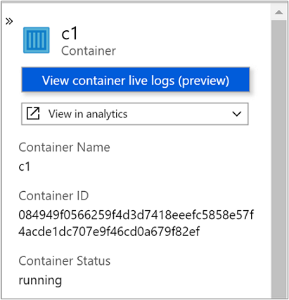
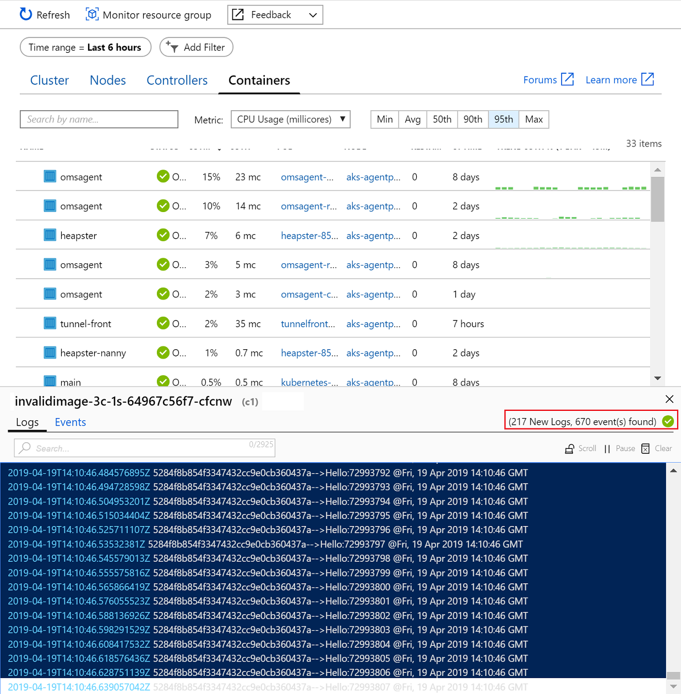

# How to view container logs and events in real time (preview)
Azure Monitor for containers includes a feature, which is currently in preview, that provides a live view into your Azure Kubernetes Service (AKS) container logs (stdout/stderr) and events without having to run kubectl commands. When you select either option, a new pane appears below the performance data table on the **Nodes**, **Controllers**, and **Containers** view. It shows live logging and events generated by the container engine to further assist in troubleshooting issues in real time. 

>[!NOTE]
>**Contributor** access to the cluster resource is required for this feature to work.
>

Live logs supports three different methods to control access to the logs:

1. AKS without Kubernetes RBAC authorization enabled 
2. AKS enabled with Kubernetes RBAC authorization
3. AKS enabled with Azure Active Directory (AD) SAML-based single-sign on 

## Kubernetes cluster without RBAC enabled
 
If you have a Kubernetes cluster that is not configured with Kubernetes RBAC authorization or integrated with Azure AD single-sign on, you do not need to follow these steps. Because Kubernetes authorization uses the kube-api, read-only permissions are required.

## Kubernetes RBAC authorization
If you have enabled Kubernetes RBAC authorization, you will need to apply cluster role binding. The following example steps demonstrate how to configure cluster role binding from this yaml configuration template. 

1. Copy and paste the yaml file and save it as LogReaderRBAC.yaml.  

    ```
    apiVersion: rbac.authorization.k8s.io/v1 
    kind: ClusterRole 
    metadata: 
       name: containerHealth-log-reader 
    rules: 
      - apiGroups: [""] 
     resources: ["pods/log", "events"] 
     verbs: ["get", "list"]  
    --- 
    apiVersion: rbac.authorization.k8s.io/v1 
    kind: ClusterRoleBinding 
    metadata: 
       name: containerHealth-read-logs-global 
    roleRef: 
       kind: ClusterRole 
       name: containerHealth-log-reader 
      apiGroup: rbac.authorization.k8s.io 
    subjects: 
      - kind: User 
        name: clusterUser 
       apiGroup: rbac.authorization.k8s.io
    ```

2. If you are configuring this for the first time, you create the cluster rule binding by running the following command: `kubectl create -f LogReaderRBAC.yaml`. If you previously enabled support for live logs preview before we introduced live event logs, to update your configuration, run the following command: `kubectl apply -f LiveLogRBAC.yml`. 

## Configure AKS with Azure Active Directory
AKS can be configured to use Azure Active Directory (AD) for user authentication. If you are configuring this for the first time, see [Integrate Azure Active Directory with Azure Kubernetes Service](../../aks/azure-ad-integration.md). During the steps to create the [client application](../../aks/azure-ad-integration.md#create-client-application) and specify the **redirect URI**, you need to add another URI to the list `https://ininprodeusuxbase.microsoft.com/*`.  

>[!NOTE]
>Configuring authentication with Azure Active Directory for single-sign on can only be accomplished during intial deployment of a new AKS cluster. You cannot configure single-sign on for an AKS cluster already deployed.  
> 

## View live logs and events
While you are reviewing a specific container from the **Nodes**, **Controllers**, and **Containers** view, from the properties pane you can select **View live data (preview)** to see live logging or events generated by the container engine. A new pane appears below the performance data table where you can chose to view logs and events, and which live data you can view depends on what object is selected.  

| View | Selection | Data presented |
|------|-----------|----------------|
| Nodes | Node | When a node is selected events are not filtered and show cluster-wide Kubernetes events.|
| Nodes | Pod | When a pod is selected events are filtered to its namespace. The pane title shows the namespace of the pod. | 
| Controllers | Pod | When a pod is selected events are filtered to its namespace. The pane title shows the namespace of the pod. |
| Controllers | Controller | When a controller is selected events are filtered to its namespace. The pane title shows the namespace of the controller. |


1. Sign in to the [Azure portal](https://portal.azure.com). 

2. From the **Microsoft Azure** menu, select **Monitor** and then select **Containers**.  

3. Select a container from the list under the **Monitored containers** view.  

4. Select the **Containers** view and on the properties panel for a selected container, the  link **View container live logs** is listed. 

      

5. If the AKS cluster is configured with SSO using AAD, you are prompted to authenticate on first use during that browser session. Select your account and complete authentication with Azure.  

After successfully authenticating, the live log pane will appear in the bottom section of the middle pane. If the fetch status indicator shows a green check mark, which is on the far right of the pane, it means it can retrieve data.
    
    

In the search bar, you can filter by key word to highlight that text in the log or event.   

  

To suspend autoscroll and control the behavior of the pane and allow you to manually scroll through the new data read, click on the **Scroll** option. To re-enable autoscroll, simply click the **Scroll** option again. You can also pause retrieval of log or event data by clicking on the **Pause** option and when you are ready to resume, simply click **Play**.  


## Next steps
- To continue learning how to use Azure Monitor and monitor other aspects of your AKS cluster, see [View Azure Kubernetes Service health](container-insights-analyze.md).
- View [log query examples](container-insights-log-search.md#search-logs-to-analyze-data) to see pre-defined queries and examples to evaluate or customize for alerting, visualizing, or analyzing your clusters.
