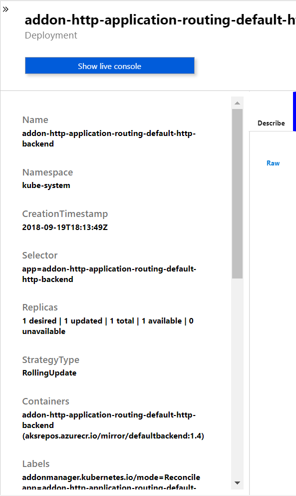
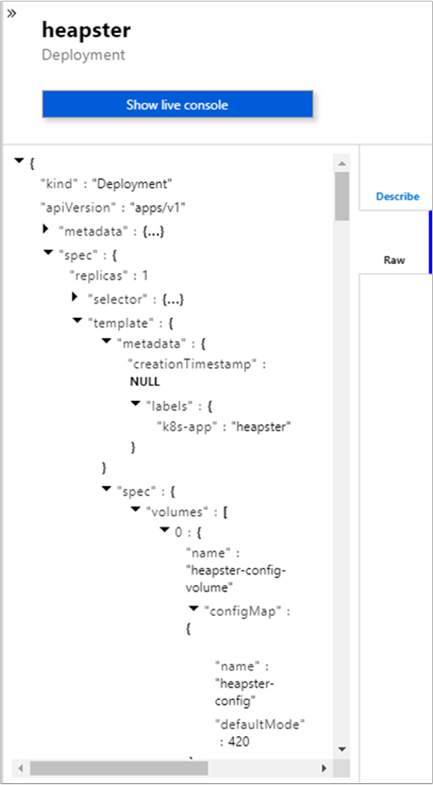
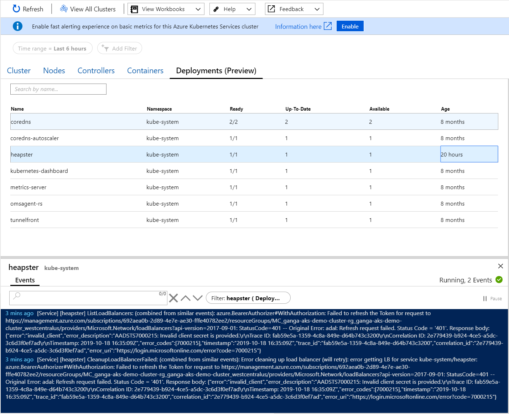

# How to view Deployments (preview) in real-time

With Azure Monitor for containers, the view Deployments (preview) feature emulates direct access to Kubernetes Deployment objects in real time by exposing the `kubeclt get deployments` and `kubectl describe deployment {your deployment}` commands. 

>[!NOTE]
>AKS clusters enabled as [private clusters](https://azure.microsoft.com/updates/aks-private-cluster/) are not supported with this feature. This feature relies on directly accessing the Kubernetes API through a proxy server from your browser. Enabling networking security to block the Kubernetes API from this proxy will block this traffic. 

>[!NOTE]
>This feature is available in all Azure regions, including Azure China. It is currently not available in Azure US Government.

To learn more, review the Kubernetes documentation about [Deployments](https://kubernetes.io/docs/concepts/workloads/controllers/deployment/). 

## How it works

The Live Data (preview) feature directly access the Kubernetes API, and additional information about the authentication model can be found [here](https://kubernetes.io/docs/concepts/overview/kubernetes-api/). 

The Deployments (preview) feature performs a one time (refreshable) load against the deployments endpoint `/apis/apps/v1/deployments`. It allows you to select a given deployment and load the describe details for that specific deployment against the deployment endpoint `/apis/apps/v1/namespaces/${nameSpace}/deployments/${deploymentName}`. 

Selecting **Refresh** in the top left of the page refreshes the deployment list. This simulates re-running the `kubectl` command. 

>[!IMPORTANT]
>No data is stored permanently during operation of this feature. All information captured during the session is deleted when you close your browser or navigate away from it.  

>[!NOTE]
>You cannot pin Live Data (Preview) data from the console to an Azure dashboard.

## Deployments describe

To view Describe details for a deployment, which is the equivalent to `kubectl describe deployment`, perform the following steps.

1. In the Azure portal, browse to the AKS cluster resource group and select your AKS resource.

2. On the AKS cluster dashboard, under **Monitoring** on the left-hand side, choose **Insights**. 

3. Select the **Deployments (preview)** tab.

    

The view shows a list of all the running deployments along with the namespace and other detailed information, emulating execution of the command `kubectl get deployments –all-namespaces`. You can sort the results by selecting any one of the columns. 

When you select a deployment from the list, a property pane automatically displays on the right side of the page. It shows information related to the selected deployment that you would view if you ran the command `kubectl describe deployment {deploymentName}`. You may have noticed that the describe information is missing some details. Most notably the **Template** is missing. Selecting the **Raw** tab allows you to navigate to the un-parsed Describe details.  

While you review deployment details, you can see container logs and events in real time. Select the **Show live console** and the Live Data (preview) console pane will appear below the deployments data grid where you can view live log data in a continuous stream. If the fetch status indicator shows a green check mark, which is on the far right of the pane, it means data can be retrieved and it begins streaming to your console.

You can also filter by namespace or cluster level events. To learn more about the viewing data real-time in the console, see [View Live Data (preview) with Azure Monitor for containers](container-insights-livedata-overview.md). 

## Next steps

- To continue learning how to use Azure Monitor and monitor other aspects of your AKS cluster, see [View Azure Kubernetes Service health](container-insights-analyze.md).

- View [log query examples](container-insights-log-search.md#search-logs-to-analyze-data) to see predefined queries and examples to create alerts, visualizations, or perform further analysis of your clusters.
