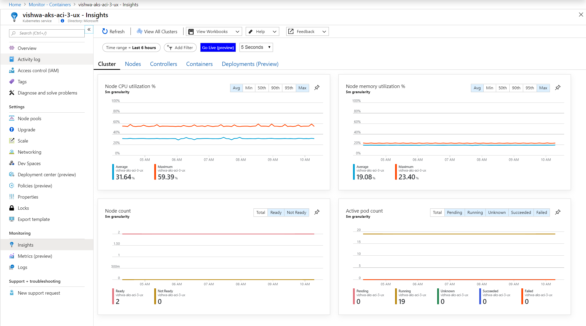

--
title: Azure Monitor for containers live metrics (preview) | Microsoft Docs
description: This article describes the real-time view of metrics without using kubectl with Azure Monitor for containers.
services: azure-monitor
documentationcenter: ''
author: mgoedtel
manager: carmonm
editor: 
ms.assetid: 
ms.service: azure-monitor
ms.topic: article
ms.tgt_pltfrm: na
ms.workload: infrastructure-services
ms.date: 10/15/2019
ms.author: magoedte
---

# How to view metrics in real time (preview)

Azure Monitor for containers live metrics and data (preview) feature allows you to directly visualize metrics about node and pod state in a cluster. It emulates direct access to the `kubectl top nodes`, `kubectl get pods –all-namespaces` and `kubectl get nodes` commands to call, parse, and visualize the data in performance charts that are included with this Insight. 

This article helps you understand utilization and limitations of this feature. 

>[!NOTE]
>AKS clusters enabled as [private clusters](https://azure.microsoft.com/updates/aks-private-cluster/) are not supported with this feature. This feature relies on directly accessing the Kubernetes API through a proxy server from your browser. Enabling networking security to block the Kubernetes API from this proxy will block this traffic. 

>[!NOTE]
>This feature is available in all Azure regions, including Azure China. It is currently not available in Azure US Government.

For help setting up or troubleshooting the live metrics and data feature, review our [setup guide](container-insights-livelogs-setup.md).

## How it Works 

The live metrics and data feature directly access the Kubernetes API. Additional information can be found [here](container-insights-livelogs-setup.md). 

Live metrics feature performs a polling operation against the metrics endpoints (including `/api/v1/nodes`, `/apis/metrics.k8s.io/v1beta1/nodes` and `/api/v1/pods`), which is five seconds by default. This data is cached in your browser and charted in the performance charts included in Azure Monitor for containers on the **Cluster** tab. Each subsequent poll will be charted into a rolling five-minute visualization window. 

The polling interval is configured from the **Set interval** drop down allowing you to set polling for new data every 1, 5, 15 and 30 seconds. 

>[!IMPORTANT]
>We recommend setting the polling interval to one second when troubleshooting an issue for a short period of time. These requests may impact the availability and throttling of the Kubernetes API on your cluster. Afterwards, reconfigure to a longer polling interval. 

>[!IMPORTANT]
>No data is stored permanently during operation of this feature. All information captured during this session is immediately deleted when you close your browser or navigate away from the feature. Data only remains present for visualization inside the five minute window; any metrics older than five minutes are also permanently deleted.

These charts cannot be pinned to the last Azure dashboard you viewed in live mode.

## Metrics captured

### Node CPU utilization % / Node Memory utilization % 

These two performance charts map to an equivalent of invoking `kubectl top nodes` and capturing the results of the **CPU%** and **MEMORY%** columns to a chart. 

The percentile calculations will function in larger clusters to help identify outlier nodes in your cluster. For example, to understand if there are nodes being under utilized for scale down purposes. Utilizing the **Min** aggregation you can see if there are nodes with extremely low utilization in the cluster. For further investigation, you would select the **Nodes** tab and sort the grid by CPU or memory utilization.

This also helps you understand if there are nodes being pushed to their limits and if a scale out may be required. Utilizing both the **Max** and **P95** aggregations can help you see if there are nodes in the cluster with high resource utilization. For further investigation, you would again switch to the **Nodes** tab.

