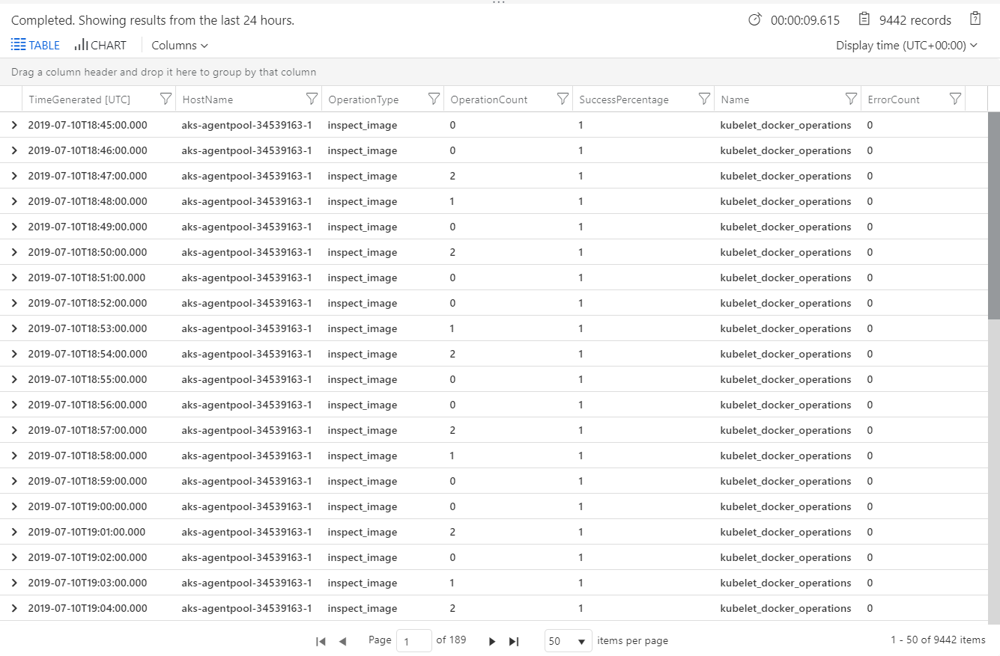

# How to query logs from Azure Monitor for containers

Azure Monitor for containers collects performance metrics, inventory data, and health state information from container hosts and containers, and forwards it to the Log Analytics workspace in Azure Monitor. Data is collected every three minutes. This data is available for [query](../../azure-monitor/log-query/log-query-overview.md) in Azure Monitor. You can apply this data to scenarios that include migration planning, capacity analysis, discovery, and on-demand performance troubleshooting.

## Container records

Examples of records that are collected by Azure Monitor for containers and the data types that appear in log search results are displayed in the following table:

| Data type | Data type in Log Search | Fields |
| --- | --- | --- |
| Performance for hosts and containers | `Perf` | Computer, ObjectName, CounterName &#40;%Processor Time, Disk Reads MB, Disk Writes MB, Memory Usage MB, Network Receive Bytes, Network Send Bytes, Processor Usage sec, Network&#41;, CounterValue, TimeGenerated, CounterPath, SourceSystem |
| Container inventory | `ContainerInventory` | TimeGenerated, Computer, container name, ContainerHostname, Image, ImageTag, ContainerState, ExitCode, EnvironmentVar, Command, CreatedTime, StartedTime, FinishedTime, SourceSystem, ContainerID, ImageID |
| Container log | `ContainerLog` | TimeGenerated, Computer, image ID, container name, LogEntrySource, LogEntry, SourceSystem, ContainerID |
| Container node inventory | `ContainerNodeInventory`| TimeGenerated, Computer, ClassName_s, DockerVersion_s, OperatingSystem_s, Volume_s, Network_s, NodeRole_s, OrchestratorType_s, InstanceID_g, SourceSystem|
| Inventory of pods in a Kubernetes cluster | `KubePodInventory` | TimeGenerated, Computer, ClusterId, ContainerCreationTimeStamp, PodUid, PodCreationTimeStamp, ContainerRestartCount, PodRestartCount, PodStartTime, ContainerStartTime, ServiceName, ControllerKind, ControllerName, ContainerStatus,  ContainerStatusReason, ContainerID, ContainerName, Name, PodLabel, Namespace, PodStatus, ClusterName, PodIp, SourceSystem |
| Inventory of nodes part of a Kubernetes cluster | `KubeNodeInventory` | TimeGenerated, Computer, ClusterName, ClusterId, LastTransitionTimeReady, Labels, Status, KubeletVersion, KubeProxyVersion, CreationTimeStamp, SourceSystem | 
| Kubernetes Events | `KubeEvents` | TimeGenerated, Computer, ClusterId_s, FirstSeen_t, LastSeen_t, Count_d, ObjectKind_s, Namespace_s, Name_s, Reason_s, Type_s, TimeGenerated_s, SourceComponent_s, ClusterName_s, Message,  SourceSystem | 
| Services in the Kubernetes cluster | `KubeServices` | TimeGenerated, ServiceName_s, Namespace_s, SelectorLabels_s, ClusterId_s, ClusterName_s, ClusterIP_s, ServiceType_s, SourceSystem | 
| Performance metrics for nodes part of the Kubernetes cluster | Perf &#124; where ObjectName == “K8SNode” | Computer, ObjectName, CounterName &#40;cpuAllocatableBytes, memoryAllocatableBytes, cpuCapacityNanoCores, memoryCapacityBytes, memoryRssBytes, cpuUsageNanoCores, memoryWorkingsetBytes, restartTimeEpoch&#41;, CounterValue, TimeGenerated, CounterPath, SourceSystem | 
| Performance metrics for containers part of the Kubernetes cluster | Perf &#124; where ObjectName == “K8SContainer” | CounterName &#40; cpuRequestNanoCores, memoryRequestBytes, cpuLimitNanoCores, memoryWorkingSetBytes, restartTimeEpoch, cpuUsageNanoCores, memoryRssBytes&#41;, CounterValue, TimeGenerated, CounterPath, SourceSystem | 
| Custom Metrics |`InsightsMetrics` | Computer, Name, Namespace, Origin, SourceSystem, Tags<sup>1</sup>, TimeGenerated, Type, Va, _ResourceId | 

<sup>1</sup> The *Tags* property represents [multiple dimensions](../platform/data-platform-metrics.md#multi-dimensional-metrics) for the corresponding metric. For additional information about the metrics collected and stored in the `InsightsMetrics` table and a description of the record properties, see [InsightsMetrics overview](https://github.com/microsoft/OMS-docker/blob/vishwa/june19agentrel/docs/InsightsMetrics.md).

## Search logs to analyze data

Azure Monitor Logs can help you look for trends, diagnose bottlenecks, forecast, or correlate data that can help you determine whether the current cluster configuration is performing optimally. Pre-defined log searches are provided for you to immediately start using or to customize to return the information the way you want.

You can perform interactive analysis of data in the workspace by selecting the **View Kubernetes event logs** or **View container logs** option in the preview pane. The **Log Search** page appears to the right of the Azure portal page that you were on.

   

The container logs output that's forwarded to your workspace are STDOUT and STDERR. Because Azure Monitor is monitoring Azure-managed Kubernetes (AKS), Kube-system is not collected today because of the large volume of generated data. 

### Example log search queries

It's often useful to build queries that start with an example or two and then modify them to fit your requirements. To help build more advanced queries, you can experiment with the following sample queries:

| Query | Description | 
|-------|-------------|
| ContainerInventory<br> &#124; project Computer, Name, Image, ImageTag, ContainerState, CreatedTime, StartedTime, FinishedTime<br> &#124; render table | List all of a container's lifecycle information| 
| KubeEvents_CL<br> &#124; where not(isempty(Namespace_s))<br> &#124; sort by TimeGenerated desc<br> &#124; render table | Kubernetes events|
| ContainerImageInventory<br> &#124; summarize AggregatedValue = count() by Image, ImageTag, Running | Image inventory | 
| **Select the Line chart display option**:<br> Perf<br> &#124; where ObjectName == "K8SContainer" and CounterName == "cpuUsageNanoCores" &#124; summarize AvgCPUUsageNanoCores = avg(CounterValue) by bin(TimeGenerated, 30m), InstanceName | Container CPU | 
| **Select the Line chart display option**:<br> Perf<br> &#124; where ObjectName == "K8SContainer" and CounterName == "memoryRssBytes" &#124; summarize AvgUsedRssMemoryBytes = avg(CounterValue) by bin(TimeGenerated, 30m), InstanceName | Container memory |

The following example is a Prometheus metrics query. The metrics collected are counts and in order to determine how many errors occurred within a specific time period, we have to subtract from the count. The dataset is partitioned by *partitionKey*, meaning for each unique set of *Name*, *HostName*, and *OperationType*, we run a subquery on that set that orders the logs by *TimeGenerated*, a process that makes it possible to find the previous *TimeGenerated* and the count recorded for that time, to determine a rate.

```
let data = InsightsMetrics 
| where Namespace contains 'prometheus' 
| where Name == 'kubelet_docker_operations' or Name == 'kubelet_docker_operations_errors'    
| extend Tags = todynamic(Tags) 
| extend OperationType = tostring(Tags['operation_type']), HostName = tostring(Tags.hostName) 
| extend partitionKey = strcat(HostName, '/' , Name, '/', OperationType) 
| partition by partitionKey ( 
    order by TimeGenerated asc 
    | extend PrevVal = prev(Val, 1), PrevTimeGenerated = prev(TimeGenerated, 1) 
    | extend Rate = iif(TimeGenerated == PrevTimeGenerated, 0.0, Val - PrevVal) 
    | where isnull(Rate) == false 
) 
| project TimeGenerated, Name, HostName, OperationType, Rate; 
let operationData = data 
| where Name == 'kubelet_docker_operations' 
| project-rename OperationCount = Rate; 
let errorData = data 
| where Name == 'kubelet_docker_operations_errors' 
| project-rename ErrorCount = Rate; 
operationData 
| join kind = inner ( errorData ) on TimeGenerated, HostName, OperationType 
| project-away TimeGenerated1, Name1, HostName1, OperationType1 
| extend SuccessPercentage = iif(OperationCount == 0, 1.0, 1 - (ErrorCount / OperationCount))
```

The output will show results similar to the following:



## Next steps

Azure Monitor for containers does not include a predefined set of alerts. Review the [Create performance alerts with Azure Monitor for containers](container-insights-alerts.md) to learn how to create recommended alerts for high CPU and memory utilization to support your DevOps or operational processes and procedures. 