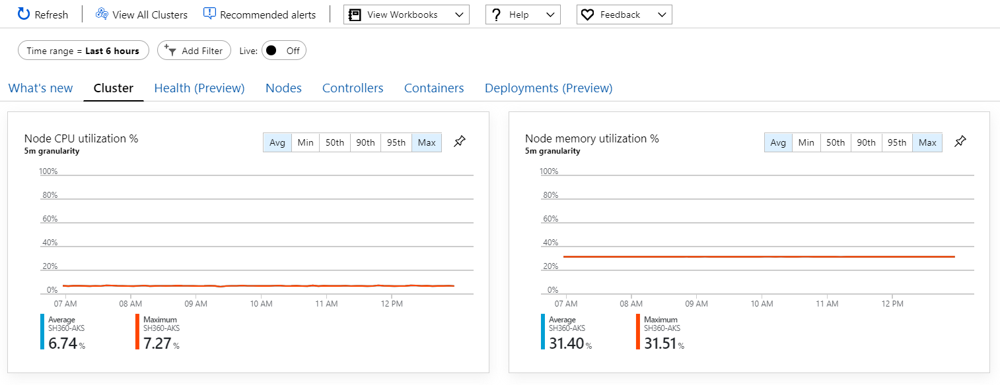
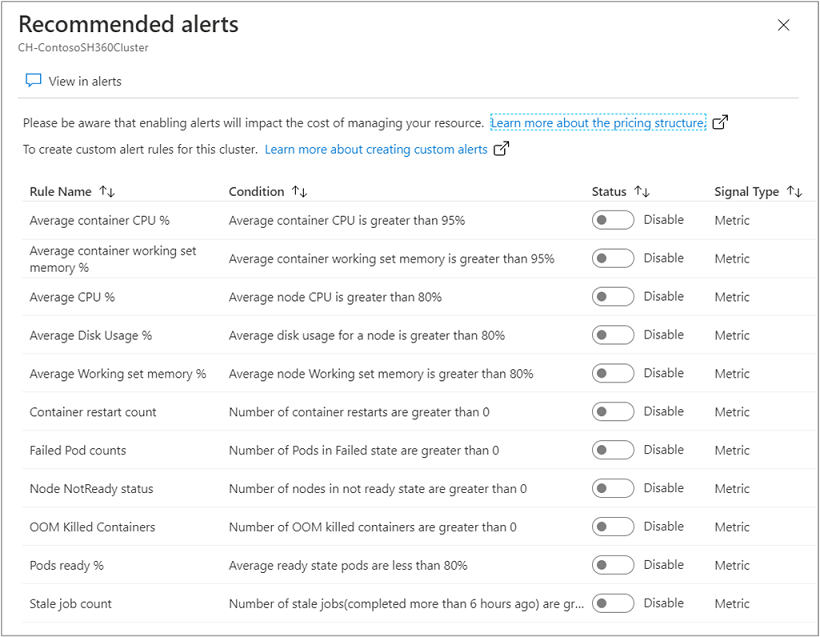

# Pre-defined metric alerts (preview) from Azure Monitor for containers

To alert on performance issues with Azure Monitor for containers, you would create a log alert based on performance data stored in Azure Monitor Logs. Azure Monitor for containers now includes pre-configured metric alert rules for your AKS clusters, which is in public preview. This article reviews the experience and provides guidance on configuring and managing these alert rules.

## Alert rules overview

To alert on what matters, Azure Monitor for containers includes the following metric alerts for your AKS clusters:

|Name| Description |
|----|-------------|
| Average CPU % | Calculates average CPU used per node.  Alerts when average CPU usage per node is greater than 80%.| 
| Average Working set memory % | Calculates average working set memory used per node.  Alerts when average working set memory usage per node is greater than 80%. |
| Failed Pod Counts | Calculates if any pod in failed state.  Alerts when a number of pods in failed state are greater than 0. |
| Node NotReady status | Calculates if any node is in NotReady state.  Alerts when a number of nodes in NotReady state are greater than 0. |
| Metric heartbeat | Alerts when all nodes are down and metric data is not received.  Alerts when a number of nodes not sending metric data are less than or equal to 0.|

There are common properties across all of these alert rules:

* All alert rules are metric based.

* All alert rules are disabled by default.

* All alert rules are evaluated once per minute and they look back at last 5 minutes of data.

* Alerts rules do not have an action group assigned to them by default. You can add an [action group](../platform/action-groups.md) to the alert either by selecting an existing action group or creating a new action group while editing the alert rule.

* You can modify the threshold for alert rules by directly editing them. However, refer to the guidance provided in each alert rule before modifying the threshold

## Enable alert rules

This section walks through enabling Azure Monitor for containers metric alert (preview).

1. Sign in to the Azure portal using the following URL - https://aka.ms/cialerts. This URL contains the feature flag for accessing the preview from your account.

2. Access to the Azure Monitor for containers metrics alert (preview) feature is available directly from an AKS cluster by selecting **Insights** from the left pane in the Azure portal. Under the **Insights** section, select **Containers**.

3. From the command bar, select **Recommended alerts**.

    

4. The **Recommended alerts** property pane automatically displays on the right side of the page. By default, all alert rules in the list are disabled. After selecting **Enable**, the alert rule is created and the rule name updates to include a link to the alert resource.

    

After clicking on the enable radio button the alert rule is created, and the rule name updates to include a link to the actual alert resource. 

## Edit alert rules
