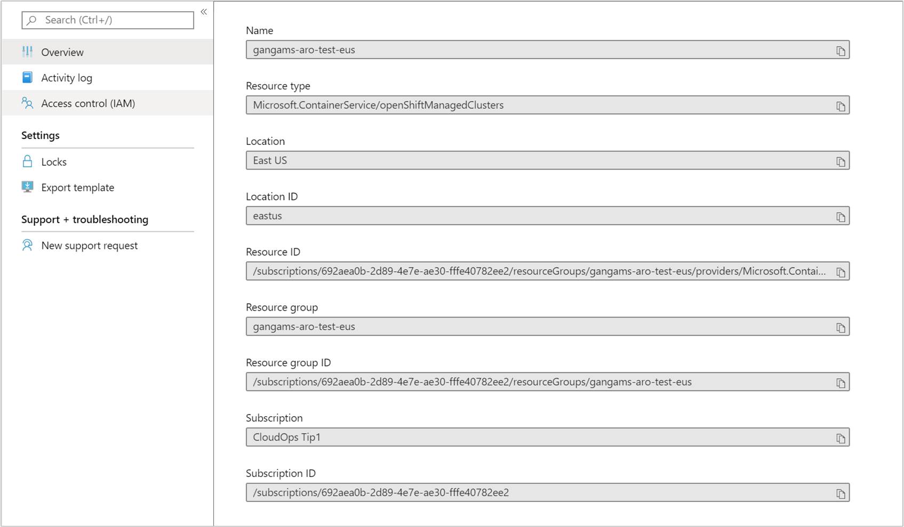

# How to stop monitoring your Azure Red Hat OpenShift cluster with Azure Monitor for containers

After you enable monitoring of your Azure Red Hat OpenShift cluster, you can stop monitoring the cluster if you decide you no longer want to monitor it. This article shows how to accomplish this using the provided Azure Resource Manager templates.  

## Azure Resource Manager template

Provided are two Azure Resource Manager template to support removing the solution resources consistently and repeatedly in your resource group. One is a JSON template specifying the configuration to stop monitoring and the other contains parameter values that you configure to specify the OpenShift cluster resource ID and Azure region that the cluster is deployed in.

If you're unfamiliar with the concept of deploying resources by using a template, see:
* [Deploy resources with Resource Manager templates and Azure PowerShell](../../azure-resource-manager/templates/deploy-powershell.md)
* [Deploy resources with Resource Manager templates and the Azure CLI](../../azure-resource-manager/templates/deploy-cli.md)

If you choose to use the Azure CLI, you first need to install and use the CLI locally. You must be running the Azure CLI version 2.0.65 or later. To identify your version, run `az --version`. If you need to install or upgrade the Azure CLI, see [Install the Azure CLI](https://docs.microsoft.com/cli/azure/install-azure-cli).

### Create template

1. Copy and paste the following JSON syntax into your file:

    ```json
    {
       "$schema": "https://schema.management.azure.com/schemas/2015-01-01/deploymentTemplate.json#",
       "contentVersion": "1.0.0.0",
       "parameters": {
         "aroResourceId": {
           "type": "string",
           "metadata": {
             "description": "ARO Cluster Resource ID"
          }
        },
        "aroResourceLocation": {
          "type": "string",
          "metadata": {
            "description": "Location of the aro cluster resource e.g. westcentralus"
          }
        }
      },
      "resources": [
        {
           "name": "[split(parameters('aroResourceId'),'/')[8]]",
           "type": "Microsoft.ContainerService/openShiftManagedClusters",
           "location": "[parameters('aroResourceLocation')]",
           "apiVersion": "2019-09-30-preview",
           "properties": {
             "mode": "Incremental",
             "id": "[parameters('aroResourceId')]",
             "monitorProfile": {
               "workspaceResourceID": null,
               "enabled": false
            }
          }
        }
      ]
    }
    ```

2. Save this file as **OptOutTemplate.json** to a local folder.

3. Paste the following JSON syntax into your file:

    ```json
    {
      "$schema": "https://schema.management.azure.com/schemas/2015-01-01/deploymentParameters.json#",
      "contentVersion": "1.0.0.0",
      "parameters": {
        "aroResourceId": {
          "value": "/subscriptions/<subscriptionId>/resourceGroups/<ResourceGroupName>/providers/Microsoft.ContainerService/openShiftManagedClusters/<clusterName>"
        },
        "aroResourceLocation": {
          "value": "<azure region of the cluster e.g. westcentralus>"
        }
      }
    }
    ```

4. Edit the values for **aroResourceId** and **aroResourceLocation** by using the values of the OpenShift cluster, which you can find on the **Properties** page for the selected cluster.

    

5. Save this file as **OptOutParam.json** to a local folder.

6. You are ready to deploy this template.

### Remove the solution using Azure CLI

Execute the following command with Azure CLI on Linux to remove the solution and clean up the configuration on your cluster.

```azurecli
az login   
az account set --subscription "Subscription Name"
az group deployment create --resource-group <ResourceGroupName> --template-file ./OptOutTemplate.json --parameters @./OptOutParam.json  
```

The configuration change can take a few minutes to complete. When it's completed, a message similar to the following that includes the result is returned:

```azurecli
ProvisioningState       : Succeeded
```

### Remove the solution using PowerShell

[!INCLUDE [updated-for-az](../../../includes/updated-for-az.md)]

Execute the following PowerShell commands in the folder containing the template to remove the solution and clean up the configuration from your cluster.    

```powershell
Connect-AzAccount
Select-AzSubscription -SubscriptionName <yourSubscriptionName>
New-AzResourceGroupDeployment -Name opt-out -ResourceGroupName <ResourceGroupName> -TemplateFile .\OptOutTemplate.json -TemplateParameterFile .\OptOutParam.json
```

The configuration change can take a few minutes to complete. When it's completed, a message similar to the following that includes the result is returned:

```powershell
ProvisioningState       : Succeeded
```

## Next steps

If the workspace was created only to support monitoring the cluster and it's no longer needed, you have to manually delete it. If you are not familiar with how to delete a workspace, see [Delete an Azure Log Analytics workspace](../../log-analytics/log-analytics-manage-del-workspace.md).
