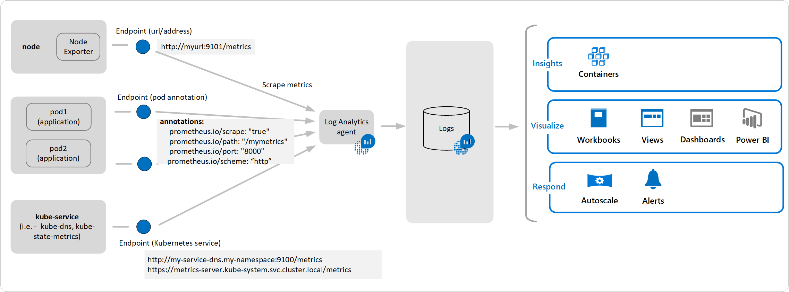
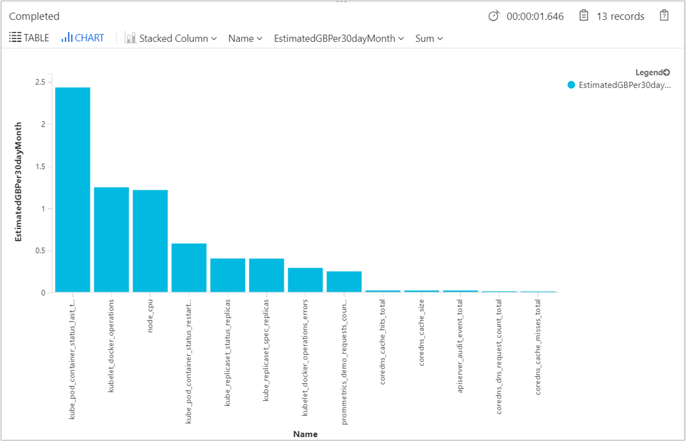

# Configure scraping of Prometheus metrics with Azure Monitor for containers

[Prometheus](https://prometheus.io/) is a popular open source metric monitoring solution and is a part of the [Cloud Native Compute Foundation](https://www.cncf.io/). Azure Monitor for containers provides a seamless onboarding experience to collect Prometheus metrics. Typically, to use Prometheus, you need to set up and manage a Prometheus server with a store. By integrating with Azure Monitor, a Prometheus server is not required. You just need to expose the Prometheus metrics endpoint through your exporters or pods (application), and the containerized agent for Azure Monitor for containers can scrape the metrics for you. 



>[!NOTE]
>The minimum agent version supported for scraping Prometheus metrics is ciprod07092019 or later, and the agent version supported for writing configuration and agent errors in the `KubeMonAgentEvents` table is ciprod10112019. For Azure Red Hat OpenShift and Red Hat OpenShift v4, agent version ciprod04162020 or higher. 
>
>For more information about the agent versions and what's included in each release, see [agent release notes](https://github.com/microsoft/Docker-Provider/tree/ci_feature_prod). 
>To verify your agent version, from the **Node** tab select a node, and in the properties pane note value of the **Agent Image Tag** property.

Scraping of Prometheus metrics is supported with Kubernetes clusters hosted on:

- Azure Kubernetes Service (AKS)
- Azure Stack or on-premises
- Azure Red Hat OpenShift version 3.x
- Azure Red Hat OpenShift and Red Hat OpenShift version 4.x

### Prometheus scraping settings

Active scraping of metrics from Prometheus is performed from one of two perspectives:

* Cluster-wide - HTTP URL and discover targets from listed endpoints of a service. For example, k8s services such as kube-dns and kube-state-metrics, and pod annotations specific to an application. Metrics collected in this context will be defined in the ConfigMap section *[Prometheus data_collection_settings.cluster]*.
* Node-wide - HTTP URL and discover targets from listed endpoints of a service. Metrics collected in this context will be defined in the ConfigMap section *[Prometheus_data_collection_settings.node]*.

| Endpoint | Scope | Example |
|----------|-------|---------|
| Pod annotation | Cluster-wide | annotations: <br>`prometheus.io/scrape: "true"` <br>`prometheus.io/path: "/mymetrics"` <br>`prometheus.io/port: "8000"` <br>`prometheus.io/scheme: "http"` |
| Kubernetes service | Cluster-wide | `http://my-service-dns.my-namespace:9100/metrics` <br>`https://metrics-server.kube-system.svc.cluster.local/metrics`​ |
| url/endpoint | Per-node and/or cluster-wide | `http://myurl:9101/metrics` |

When a URL is specified, Azure Monitor for containers only scrapes the endpoint. When Kubernetes service is specified, the service name is resolved with the cluster DNS server to get the IP address and then the resolved service is scraped.

|Scope | Key | Data type | Value | Description |
|------|-----|-----------|-------|-------------|
| Cluster-wide | | | | Specify any one of the following three methods to scrape endpoints for metrics. |
| | `urls` | String | Comma-separated array | HTTP endpoint (Either IP address or valid URL path specified). For example: `urls=[$NODE_IP/metrics]`. ($NODE_IP is a specific Azure Monitor for containers parameter and can be used instead of node IP address. Must be all uppercase.) |
| | `kubernetes_services` | String | Comma-separated array | An array of Kubernetes services to scrape metrics from kube-state-metrics. For example,`kubernetes_services = ["https://metrics-server.kube-system.svc.cluster.local/metrics",http://my-service-dns.my-namespace:9100/metrics]`.|
| | `monitor_kubernetes_pods` | Boolean | true or false | When set to `true` in the cluster-wide settings, Azure Monitor for containers agent will scrape Kubernetes pods across the entire cluster for the following Prometheus annotations:<br> `prometheus.io/scrape:`<br> `prometheus.io/scheme:`<br> `prometheus.io/path:`<br> `prometheus.io/port:` |
| | `prometheus.io/scrape` | Boolean | true or false | Enables scraping of the pod. `monitor_kubernetes_pods` must be set to `true`. |
| | `prometheus.io/scheme` | String | http or https | Defaults to scrapping over HTTP. If necessary, set to `https`. | 
| | `prometheus.io/path` | String | Comma-separated array | The HTTP resource path on which to fetch metrics from. If the metrics path is not `/metrics`, define it with this annotation. |
| | `prometheus.io/port` | String | 9102 | Specify a port to scrape from. If port is not set, it will default to 9102. |
| | `monitor_kubernetes_pods_namespaces` | String | Comma-separated array | An allow list of namespaces to scrape metrics from Kubernetes pods.<br> For example, `monitor_kubernetes_pods_namespaces = ["default1", "default2", "default3"]` |
| Node-wide | `urls` | String | Comma-separated array | HTTP endpoint (Either IP address or valid URL path specified). For example: `urls=[$NODE_IP/metrics]`. ($NODE_IP is a specific Azure Monitor for containers parameter and can be used instead of node IP address. Must be all uppercase.) |
| Node-wide or Cluster-wide | `interval` | String | 60s | The collection interval default is one minute (60 seconds). You can modify the collection for either the *[prometheus_data_collection_settings.node]* and/or *[prometheus_data_collection_settings.cluster]* to time units such as s, m, h. |
| Node-wide or Cluster-wide | `fieldpass`<br> `fielddrop`| String | Comma-separated array | You can specify certain metrics to be collected or not from the endpoint by setting the allow (`fieldpass`) and disallow (`fielddrop`) listing. You must set the allow list first. |

ConfigMaps is a global list and there can be only one ConfigMap applied to the agent. You cannot have another ConfigMaps overruling the collections.

## Configure and deploy ConfigMaps

Perform the following steps to configure your ConfigMap configuration file for the following clusters:

* Azure Kubernetes Service (AKS)
* Azure Stack or on-premises
* Azure Red Hat OpenShift version 4.x and Red Hat OpenShift version 4.x

1. [Download](https://aka.ms/container-azm-ms-agentconfig) the template ConfigMap yaml file and save it as container-azm-ms-agentconfig.yaml.

   >[!NOTE]
   >This step is not required when working with Azure Red Hat OpenShift since the ConfigMap template already exists on the cluster.

2. Edit the ConfigMap yaml file with your customizations to scrape Prometheus metrics.

    >[!NOTE]
    >If you are editing the ConfigMap yaml file for Azure Red Hat OpenShift, first run the command `oc edit configmaps container-azm-ms-agentconfig -n openshift-azure-logging` to open the file in a text editor.

    >[!NOTE]
    >The following annotation `openshift.io/reconcile-protect: "true"` must be added under the metadata of *container-azm-ms-agentconfig* ConfigMap to prevent reconciliation. 
    >```
    >metadata:
    >   annotations:
    >       openshift.io/reconcile-protect: "true"
    >```

    - To collect of Kubernetes services cluster-wide, configure the ConfigMap file using the following example.

        ```
        prometheus-data-collection-settings: |- ​
        # Custom Prometheus metrics data collection settings
        [prometheus_data_collection_settings.cluster] ​
        interval = "1m"  ## Valid time units are s, m, h.
        fieldpass = ["metric_to_pass1", "metric_to_pass12"] ## specify metrics to pass through ​
        fielddrop = ["metric_to_drop"] ## specify metrics to drop from collecting
        kubernetes_services = ["http://my-service-dns.my-namespace:9102/metrics"]
        ```

    - To configure scraping of Prometheus metrics from a specific URL across the cluster, configure the ConfigMap file using the following example.

        ```
        prometheus-data-collection-settings: |- ​
        # Custom Prometheus metrics data collection settings
        [prometheus_data_collection_settings.cluster] ​
        interval = "1m"  ## Valid time units are s, m, h.
        fieldpass = ["metric_to_pass1", "metric_to_pass12"] ## specify metrics to pass through ​
        fielddrop = ["metric_to_drop"] ## specify metrics to drop from collecting
        urls = ["http://myurl:9101/metrics"] ## An array of urls to scrape metrics from
        ```

    - To configure scraping of Prometheus metrics from an agent's DaemonSet for every individual node in the cluster, configure the following in the ConfigMap:
    
        ```
        prometheus-data-collection-settings: |- ​
        # Custom Prometheus metrics data collection settings ​
        [prometheus_data_collection_settings.node] ​
        interval = "1m"  ## Valid time units are s, m, h. 
        urls = ["http://$NODE_IP:9103/metrics"] ​
        fieldpass = ["metric_to_pass1", "metric_to_pass2"] ​
        fielddrop = ["metric_to_drop"] ​
        ```

        >[!NOTE]
        >$NODE_IP is a specific Azure Monitor for containers parameter and can be used instead of node IP address. It must be all uppercase. 

    - To configure scraping of Prometheus metrics by specifying a pod annotation, perform the following steps:

       1. In the ConfigMap, specify the following:

            ```
            prometheus-data-collection-settings: |- ​
            # Custom Prometheus metrics data collection settings
            [prometheus_data_collection_settings.cluster] ​
            interval = "1m"  ## Valid time units are s, m, h
            monitor_kubernetes_pods = true 
            ```

       2. Specify the following configuration for pod annotations:

           ```
           - prometheus.io/scrape:"true" #Enable scraping for this pod ​
           - prometheus.io/scheme:"http:" #If the metrics endpoint is secured then you will need to set this to `https`, if not default ‘http’​
           - prometheus.io/path:"/mymetrics" #If the metrics path is not /metrics, define it with this annotation. ​
           - prometheus.io/port:"8000" #If port is not 9102 use this annotation​
           ```
	
          If you want to restrict monitoring to specific namespaces for pods that have annotations, for example only include pods dedicated for production workloads, set the `monitor_kubernetes_pod` to `true` in ConfigMap, and add the namespace filter `monitor_kubernetes_pods_namespaces` specifying the namespaces to scrape from. For example, `monitor_kubernetes_pods_namespaces = ["default1", "default2", "default3"]`

3. Run the following kubectl command: `kubectl apply -f <configmap_yaml_file.yaml>`.
    
    Example: `kubectl apply -f container-azm-ms-agentconfig.yaml`. 

The configuration change can take a few minutes to finish before taking effect, and all omsagent pods in the cluster will restart. The restart is a rolling restart for all omsagent pods, not all restart at the same time. When the restarts are finished, a message is displayed that's similar to the following and includes the result: `configmap "container-azm-ms-agentconfig" created`.

## Configure and deploy ConfigMaps - Azure Red Hat OpenShift v3

This section includes the requirements and steps to successfully configure your ConfigMap configuration file for Azure Red Hat OpenShift v3.x cluster.

>[!NOTE]
>For Azure Red Hat OpenShift v3.x, a template ConfigMap file is created in the *openshift-azure-logging* namespace. It is not configured to actively scrape metrics or data collection from the agent.

### Prerequisites

Before you start, confirm you are a member of the Customer Cluster Admin role of your Azure Red Hat OpenShift cluster to configure the containerized agent and Prometheus scraping settings. To verify you are a member of the *osa-customer-admins* group, run the following command:

``` bash
  oc get groups
```

The output will resemble the following:

``` bash
NAME                  USERS
osa-customer-admins   <your-user-account>@<your-tenant-name>.onmicrosoft.com
```

If you are member of *osa-customer-admins* group, you should be able to list the `container-azm-ms-agentconfig` ConfigMap using the following command:

``` bash
oc get configmaps container-azm-ms-agentconfig -n openshift-azure-logging
```

The output will resemble the following:

``` bash
NAME                           DATA      AGE
container-azm-ms-agentconfig   4         56m
```

### Enable monitoring

Perform the following steps to configure your ConfigMap configuration file for your Azure Red Hat OpenShift v3.x cluster.

1. Edit the ConfigMap yaml file with your customizations to scrape Prometheus metrics. The ConfigMap template already exists on the Red Hat OpenShift v3 cluster. Run the command `oc edit configmaps container-azm-ms-agentconfig -n openshift-azure-logging` to open the file in a text editor.

    >[!NOTE]
    >The following annotation `openshift.io/reconcile-protect: "true"` must be added under the metadata of *container-azm-ms-agentconfig* ConfigMap to prevent reconciliation. 
    >```
    >metadata:
    >   annotations:
    >       openshift.io/reconcile-protect: "true"
    >```

    - To collect of Kubernetes services cluster-wide, configure the ConfigMap file using the following example.

        ```
        prometheus-data-collection-settings: |- ​
        # Custom Prometheus metrics data collection settings
        [prometheus_data_collection_settings.cluster] ​
        interval = "1m"  ## Valid time units are s, m, h.
        fieldpass = ["metric_to_pass1", "metric_to_pass12"] ## specify metrics to pass through ​
        fielddrop = ["metric_to_drop"] ## specify metrics to drop from collecting
        kubernetes_services = ["http://my-service-dns.my-namespace:9102/metrics"]
        ```

    - To configure scraping of Prometheus metrics from a specific URL across the cluster, configure the ConfigMap file using the following example.

        ```
        prometheus-data-collection-settings: |- ​
        # Custom Prometheus metrics data collection settings
        [prometheus_data_collection_settings.cluster] ​
        interval = "1m"  ## Valid time units are s, m, h.
        fieldpass = ["metric_to_pass1", "metric_to_pass12"] ## specify metrics to pass through ​
        fielddrop = ["metric_to_drop"] ## specify metrics to drop from collecting
        urls = ["http://myurl:9101/metrics"] ## An array of urls to scrape metrics from
        ```

    - To configure scraping of Prometheus metrics from an agent's DaemonSet for every individual node in the cluster, configure the following in the ConfigMap:
    
        ```
        prometheus-data-collection-settings: |- ​
        # Custom Prometheus metrics data collection settings ​
        [prometheus_data_collection_settings.node] ​
        interval = "1m"  ## Valid time units are s, m, h. 
        urls = ["http://$NODE_IP:9103/metrics"] ​
        fieldpass = ["metric_to_pass1", "metric_to_pass2"] ​
        fielddrop = ["metric_to_drop"] ​
        ```

        >[!NOTE]
        >$NODE_IP is a specific Azure Monitor for containers parameter and can be used instead of node IP address. It must be all uppercase. 

    - To configure scraping of Prometheus metrics by specifying a pod annotation, perform the following steps:

       1. In the ConfigMap, specify the following:

            ```
            prometheus-data-collection-settings: |- ​
            # Custom Prometheus metrics data collection settings
            [prometheus_data_collection_settings.cluster] ​
            interval = "1m"  ## Valid time units are s, m, h
            monitor_kubernetes_pods = true 
            ```

       2. Specify the following configuration for pod annotations:

           ```
           - prometheus.io/scrape:"true" #Enable scraping for this pod ​
           - prometheus.io/scheme:"http:" #If the metrics endpoint is secured then you will need to set this to `https`, if not default ‘http’​
           - prometheus.io/path:"/mymetrics" #If the metrics path is not /metrics, define it with this annotation. ​
           - prometheus.io/port:"8000" #If port is not 9102 use this annotation​
           ```
	
          If you want to restrict monitoring to specific namespaces for pods that have annotations, for example only include pods dedicated for production workloads, set the `monitor_kubernetes_pod` to `true` in ConfigMap, and add the namespace filter `monitor_kubernetes_pods_namespaces` specifying the namespaces to scrape from. For example, `monitor_kubernetes_pods_namespaces = ["default1", "default2", "default3"]`

2. Save your changes in the editor.

The configuration change can take a few minutes to finish before taking effect, and all omsagent pods in the cluster will restart. The restart is a rolling restart for all omsagent pods, not all restart at the same time. When the restarts are finished, a message is displayed that's similar to the following and includes the result: `configmap "container-azm-ms-agentconfig" created`.

You can view the updated ConfigMap by running the command, `oc describe configmaps container-azm-ms-agentconfig -n openshift-azure-logging`. 

## Applying updated ConfigMap

If you have already deployed a ConfigMap to your cluster and you want to update it with a newer configuration, you can edit the ConfigMap file you've previously used, and then apply using the same commands as before.

For the following Kubernetes environments:

- Azure Kubernetes Service (AKS)
- Azure Stack or on-premises
- Azure Red Hat OpenShift and Red Hat OpenShift version 4.x

run the command `kubectl apply -f <configmap_yaml_file.yaml`. 

For an Azure Red Hat OpenShift v3.x cluster, run the command, `oc edit configmaps container-azm-ms-agentconfig -n openshift-azure-logging` to open the file in your default editor to modify and then save it.

The configuration change can take a few minutes to finish before taking effect, and all omsagent pods in the cluster will restart. The restart is a rolling restart for all omsagent pods, not all restart at the same time. When the restarts are finished, a message is displayed that's similar to the following and includes the result: `configmap "container-azm-ms-agentconfig" updated`.

## Verify configuration

To verify the configuration was successfully applied to a cluster, use the following command to review the logs from an agent pod: `kubectl logs omsagent-fdf58 -n=kube-system`. 

>[!NOTE]
>This command is not applicable to Azure Red Hat OpenShift v3.x cluster.
> 

If there are configuration errors from the omsagent pods, the output will show errors similar to the following:

``` 
***************Start Config Processing******************** 
config::unsupported/missing config schema version - 'v21' , using defaults
```

Errors related to applying configuration changes are also available for review. The following options are available to perform additional troubleshooting of configuration changes and scraping of Prometheus metrics:

- From an agent pod logs using the same `kubectl logs` command 
    >[!NOTE]
    >This command is not applicable to Azure Red Hat OpenShift cluster.
    > 

- From Live Data (preview). Live Data (preview) logs show errors similar to the following:

    ```
    2019-07-08T18:55:00Z E! [inputs.prometheus]: Error in plugin: error making HTTP request to http://invalidurl:1010/metrics: Get http://invalidurl:1010/metrics: dial tcp: lookup invalidurl on 10.0.0.10:53: no such host
    ```

- From the **KubeMonAgentEvents** table in your Log Analytics workspace. Data is sent every hour with *Warning* severity for scrape errors and *Error* severity for configuration errors. If there are no errors, the entry in the table will have data with severity *Info*, which reports no errors. The **Tags** property contains more information about the pod and container ID on which the error occurred and also the first occurrence, last occurrence, and count in the last hour.

- For Azure Red Hat OpenShift v3.x and v4.x, check the omsagent logs by searching the **ContainerLog** table to verify if log collection of openshift-azure-logging is enabled.

Errors prevent omsagent from parsing the file, causing it to restart and use the default configuration. After you correct the error(s) in ConfigMap on clusters other than Azure Red Hat OpenShift v3.x, save the yaml file and apply the updated ConfigMaps by running the command: `kubectl apply -f <configmap_yaml_file.yaml`. 

For Azure Red Hat OpenShift v3.x, edit and save the updated ConfigMaps by running the command: `oc edit configmaps container-azm-ms-agentconfig -n openshift-azure-logging`.

## Query Prometheus metrics data

To view prometheus metrics scraped by Azure Monitor and any configuration/scraping errors reported by the agent, review [Query Prometheus metrics data](container-insights-log-search.md#query-prometheus-metrics-data) and [Query config or scraping errors](container-insights-log-search.md#query-config-or-scraping-errors).

## View Prometheus metrics in Grafana

Azure Monitor for containers supports viewing metrics stored in your Log Analytics workspace in Grafana dashboards. We have provided a template that you can download from Grafana's [dashboard repository](https://grafana.com/grafana/dashboards?dataSource=grafana-azure-monitor-datasource&category=docker) to get you started and  reference to help you learn how to query additional data from your monitored clusters to visualize in custom Grafana dashboards. 

## Review Prometheus data usage

To identify the ingestion volume of each metrics size in GB per day to understand if it is high, the following query is provided.

```
InsightsMetrics
| where Namespace contains "prometheus"
| where TimeGenerated > ago(24h)
| summarize VolumeInGB = (sum(_BilledSize) / (1024 * 1024 * 1024)) by Name
| order by VolumeInGB desc
| render barchart
```

The output will show results similar to the following:


To estimate what each metrics size in GB is for a month to understand if the volume of data ingested received in the workspace is high, the following query is provided.

```
InsightsMetrics
| where Namespace contains "prometheus"
| where TimeGenerated > ago(24h)
| summarize EstimatedGBPer30dayMonth = (sum(_BilledSize) / (1024 * 1024 * 1024)) * 30 by Name
| order by EstimatedGBPer30dayMonth desc
| render barchart
```

The output will show results similar to the following:



Further information on how to monitor data usage and analyze cost is available in [Manage usage and costs with Azure Monitor Logs](../platform/manage-cost-storage.md).

## Next steps

Learn more about configuring the agent collection settings for stdout, stderr, and environmental variables from container workloads [here](container-insights-agent-config.md). 
