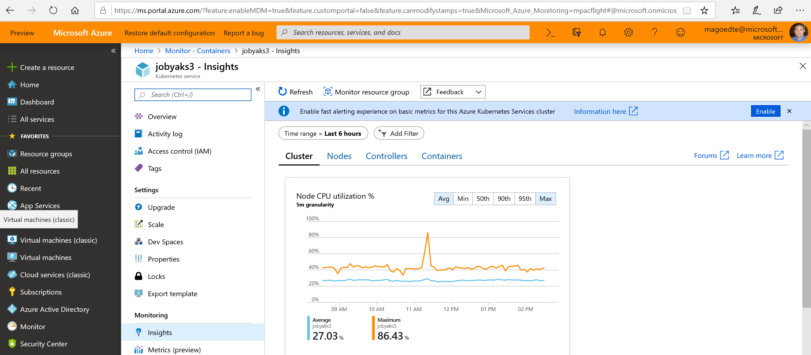

# How to update Azure Monitor for containers to enable metrics

Azure Monitor for containers is introducing support for collecting metrics from Azure Kubernetes Services (AKS) clusters nodes and pods and writing them to the Azure Monitor metrics store. This change is intended to deliver improved timeliness when presenting aggregate calculations (Avg, Count, Max, Min, Sum) in performance charts, support pinning performance charts in Azure portal dashboards, and support metric alerts.

>[!NOTE]
>This feature does not currently support Azure Red Hat OpenShift clusters.
>

The following metrics are enabled as part of this feature:

| Metric namespace | Metric | Description |
|------------------|--------|-------------|
| insights.container/nodes | cpuUsageMillicores, cpuUsagePercentage, memoryRssBytes, memoryRssPercentage, memoryWorkingSetBytes, memoryWorkingSetPercentage, nodesCount | These are *node* metrics and include *host* as a dimension, and they also include the<br> node's name as value for the *host* dimension. |
| insights.container/pods | podCount | These are *pod* metrics and include the following as dimensions - ControllerName, Kubernetes namespace, name, phase. |

Updating the cluster to support these new capabilities can be performed from the Azure portal, Azure PowerShell, or with Azure CLI. With Azure PowerShell and CLI, you can enable this per-cluster or for all clusters in your subscription. New deployments of AKS will automatically include this configuration change and capabilities.

Either process assigns the **Monitoring Metrics Publisher** role to the cluster's service principal or User assigned MSI for the monitoring add-on so that the data collected by the agent can be published to your clusters resource. Monitoring Metrics Publisher has permission only to push metrics to the resource, it cannot alter any state, update the resource, or read any data. For further information about the role, see [Monitoring Metrics Publisher role](../../role-based-access-control/built-in-roles.md#monitoring-metrics-publisher).

## Prerequisites

Before you start, confirm the following:

* Custom metrics are only available in a subset of Azure regions. A list of supported regions is documented [here](../platform/metrics-custom-overview.md#supported-regions).
* You are a member of the **[Owner](../../role-based-access-control/built-in-roles.md#owner)** role on the AKS cluster resource to enable collection of node and pod custom performance metrics. 

If you choose to use the Azure CLI, you first need to install and use the CLI locally. You must be running the Azure CLI version 2.0.59 or later. To identify your version, run `az --version`. If you need to install or upgrade the Azure CLI, see [Install the Azure CLI](https://docs.microsoft.com/cli/azure/install-azure-cli). 

## Upgrade a cluster from the Azure portal

For existing AKS clusters monitored by Azure Monitor for containers, after selecting the cluster to view its health from the multi-cluster view in Azure Monitor or directly from the cluster by selecting **Insights** from the left-hand pane, you should see a banner at the top of the portal.



Clicking **Enable** will initiate the process to upgrade the cluster. This process can take several seconds to finish, and you can track its progress under Notifications from the menu.

## Upgrade all clusters using Bash in Azure Command Shell

Perform the following steps to update all clusters in your subscription using Bash in Azure Command Shell.

1. Run the following command by using the Azure CLI.  Edit the value for **subscriptionId** using the value from the **AKS Overview** page for the AKS cluster.

    ```azurecli
    az login
    az account set --subscription "Subscription Name"
    curl -sL https://aka.ms/ci-md-onboard-atscale | bash -s subscriptionId   
    ```

    The configuration change can take a few seconds to complete. When it's completed, a message is displayed that's similar to the following and includes the result:

    ```azurecli
    completed role assignments for all AKS clusters in subscription: <subscriptionId>
    ```

## Upgrade per cluster using Azure CLI

Perform the following steps to update a specific cluster in your subscription using Azure CLI.

1. Run the following command by using the Azure CLI. Edit the values for **subscriptionId**, **resourceGroupName**, and **clusterName** using the values on the **AKS Overview** page for the AKS cluster.  To get the value of **clientIdOfSPN**, it is returned when you run the command `az aks show` as shown in the example below.

    ```azurecli
    az login
    az account set --subscription "<subscriptionName>"
    az aks show -g <resourceGroupName> -n <clusterName> 
    az role assignment create --assignee <clientIdOfSPN> --scope <clusterResourceId> --role "Monitoring Metrics Publisher" 
    ```

    To get the value for **clientIdOfSPNOrMsi**, you can run the command `az aks show` as shown in the example below. If the **servicePrincipalProfile** object has a valid *clientid* value you can use that. Otherwise, if it is set to *msi*, you need to pass in the clientid from `addonProfiles.omsagent.identity.clientId`.

    ```azurecli
    az login
    az account set --subscription "<subscriptionName>"
    az aks show -g <resourceGroupName> -n <clusterName> 
    az role assignment create --assignee <clientIdOfSPNOrMsi> --scope <clusterResourceId> --role "Monitoring Metrics Publisher"
    ```

## Upgrade all clusters using Azure PowerShell

Perform the following steps to update all clusters in your subscription using Azure PowerShell.

1. [Download](https://github.com/microsoft/OMS-docker/blob/ci_feature_prod/docs/aks/mdmonboarding/mdm_onboarding_atscale.ps1) the **mdm_onboarding_atscale.ps1** script and save it to a local folder from our GitHub repo.
2. Run the following command by using the Azure PowerShell.  Edit the value for **subscriptionId** using the value from the **AKS Overview** page for the AKS cluster.

    ```powershell
    .\mdm_onboarding_atscale.ps1 subscriptionId
    ```
    The configuration change can take a few seconds to complete. When it's completed, a message is displayed that's similar to the following and includes the result:

    ```powershell
    Completed adding role assignment for the aks clusters in subscriptionId :<subscriptionId>
    ```

## Upgrade per cluster using Azure PowerShell

Perform the following steps to update a specific cluster using Azure PowerShell.

1. [Download](https://github.com/microsoft/OMS-docker/blob/ci_feature_prod/docs/aks/mdmonboarding/mdm_onboarding.ps1) the **mdm_onboarding.ps1** script and save it to a local folder from our GitHub repo.

2. Run the following command by using the Azure PowerShell. Edit the values for **subscriptionId**, **resourceGroupName**, and **clusterName** using the values on the **AKS Overview** page for the AKS cluster.

    ```powershell
    .\mdm_onboarding.ps1 subscriptionId <subscriptionId> resourceGroupName <resourceGroupName> clusterName <clusterName>
    ```

    The configuration change can take a few seconds to complete. When it's completed, a message is displayed that's similar to the following and includes the result:

    ```powershell
    Successfully added Monitoring Metrics Publisher role assignment to cluster : <clusterName>
    ```

## Verify update

After initiating the update using one of the methods described earlier, you can use Azure Monitor metrics explorer and verify from the **Metric namespace** that **insights** is listed. If it is, this indicates you can go ahead and start setting up [metric alerts](../platform/alerts-metric.md) or pinning your charts to [dashboards](../../azure-portal/azure-portal-dashboards.md).  
