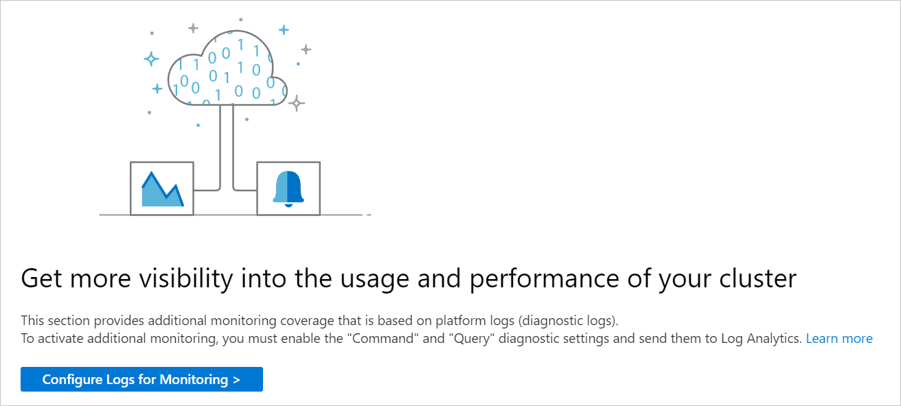
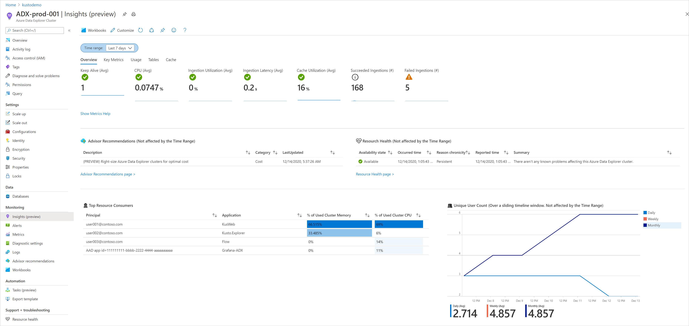
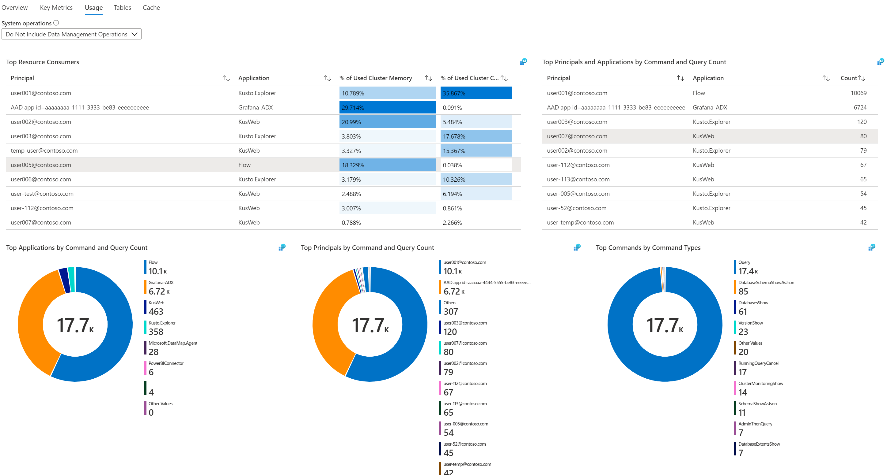
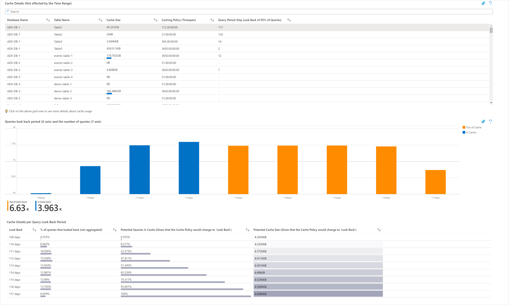

# Monitoring your Azure Data Explorer Cluster with Azure Monitor for Azure Data Explorer (preview)
Azure Monitor for Azure Data Explorer (preview) provides comprehensive monitoring of your clusters by delivering a unified view of your cluster performance, operations, usage, and failures.
This article will help you understand how to onboard and customize the experience of Azure Monitor for Azure Data Explorer (preview).

## Introduction to Azure Monitor for Azure Data Explorer (preview)

Before jumping into the experience, you should understand how it presents and visualizes information.
-    **At scale perspective** showing a snapshot view of your clusters' primary metrics, to easily track performance of queries, ingestion, and export operations.
-   **Drill down analysis** of a particular Azure Data Explorer cluster to help perform detailed analysis.
-    **Customizable** where you can change which metrics you want to see, modify or set thresholds that align with your limits, and save your own custom workbooks. Charts in the workbook can be pinned to Azure dashboards.

## View from Azure Monitor

From Azure Monitor, you can view the main performance metrics for the cluster, including metrics for queries, ingestion, and export operations from multiple clusters in your subscription, and help identify performance problems.

To view the performance of your clusters across all your subscriptions, perform the following steps:

1. Sign into the [Azure portal](https://portal.azure.com/)

2. Select **Monitor** from the left-hand pane in the Azure portal, and under the Insights Hub section, select **Azure Data Explorer Clusters (preview)**.

## Overview tab

On the **Overview** tab for the selected subscription, the table displays interactive  metrics for the Azure Data Explorer clusters grouped within the subscription. You can filter results based on the options you select from the following drop-down lists:

* Subscriptions – only subscriptions that have Azure Data Explorer clusters are listed.

* Azure Data Explorer clusters – by default only up to five clusters are pre-selected. If you select all or multiple clusters in the scope selector, up to 200 clusters will be returned. For example, if you had a total of 573 clusters across three subscriptions that you've selected, only 200 clusters will be displayed.

* Time Range – by default, displays the last 24 hours of information based on the corresponding selections made.

The counter tile, under the drop-down list, rolls-up the total number of Azure Data Explorer clusters in the selected subscriptions and reflects how many are selected. There are conditional color-codings for the columns: Keep alive, CPU, Ingestion Utilization, and Cache Utilization. Orange-coded cells have values that are not sustainable for the cluster. 

To better understand what each of the metrics represent, we recommend reading through the documentation on [Azure Data Explorer metrics - https://docs.microsoft.com/azure/data-explorer/using-metrics](https://docs.microsoft.com/azure/data-explorer/using-metrics).

## Query Performance tab

Select **Query Performance** at the top of the page and the Query Performance tab opens. It shows you the query duration, total number of concurrent queries, and the total number of throttled queries.

## Ingestion Performance tab

Select **Ingestion Performance** at the top of the page and the Ingestion Performance tab opens. It shows you the ingestion latency, succeeded ingestion results, failed ingestion results, ingestion volume, and events processed for Event/IoT Hubs.

## Streaming Ingest Performance tab

This tab provides information on average data rate, average duration, and request rate.

## Export Performance tab

This tab provides information on exported records, lateness, pending count, and utilization percentage for continuous export operations.

## View from an Azure Data Explorer Cluster resource

To access Azure Monitor for Azure Data Explorer Clusters directly from an Azure Data Explorer Cluster:

1. In the Azure portal, select **Azure Data Explorer Clusters**.

2. From the list, choose an Azure Data Explorer Cluster. In the monitoring section, choose **Insights (preview)**.

These views are also accessible by selecting the resource name of an Azure Data Explorer cluster from within the Azure Monitor insights workbooks.

Azure Monitor for Azure Data Explorer combines both logs and metrics to provide a global monitoring solution. All users can access the metrics-based monitoring data, however the inclusion of logs-based visualizations requires users to **enable logging of their Azure Data Explorer cluster]**

### Overview

On the **Overview** workbook for the cluster, it shows several performance metrics that help you quickly assess the health of your cluster:

- Interactive performance charts showing the most essential details related to cluster performance and availability.

- Metrics and status tiles highlighting the availability and overall status of the cluster.

Selecting any of the other tabs for **Key Metrics** or **Commands and Queries** opens their respective tabs.

The **Key Metrics** tab shows a unified view of some of the cluster's metrics, grouped by: general metrics, query-related, ingestion-related, and streaming ingestion-related metrics.

The **Usage** tab allows users to deep dive into the performance of the cluster's commands and queries. You can see the heaviest resource consumers broken down by users, applications, and command types.

The tables tab shows the properties of all the tables in the cluster and historical perspective for the top 10 tables by row count, extent and hot extent size, and total extent count.

The cache tab allows users to analyze their actual queries look back periods, compare it to the configured cache policy (for each table), and adapt the cache policy accordingly. You may get specific cache policy recommendations on specific tables in Azure Advisor. For example, cache reduction recommendations are available for clusters that are "bounded by data"(meaning the cluster has low CPU and low ingestion utilization, but because of high data capacity the cluster couldn't scale-in or scale-down).

## Pin to Azure dashboard

You can pin any one of the metric sections to an Azure dashboard by selecting the pushpin icon at the top right of the section.

## Customize Azure Monitor for Azure Data Explorer Cluster

This section highlights common scenarios for editing the workbook to customize in support of your data analytics needs:
*  Scope the workbook to always select a particular subscription or Azure Data Explorer Cluster(s)
* Change metrics in the grid
* Change the requests threshold
* Change the color rendering/coding

You can begin customizations by enabling the editing mode, by selecting the **Customize** button from the top toolbar.

Customizations are saved to a custom workbook to prevent overwriting the default configuration in our published workbook. Workbooks are saved within a resource group, either in the My Reports section that is private to you or in the Shared Reports section that's accessible to everyone with access to the resource group. After you save the custom workbook, you need to go to the workbook gallery to launch it.

### Specifying a subscription for Azure Data Explorer Cluster

You can configure the multi-subscription and Azure Data Explorer Cluster Overview or Failures workbooks to scope to a particular subscription(s) on every run, by performing the following steps:

1. Select **Monitor** from the portal and then select **Azure Data Explorer Cluster  (preview)** from the left-hand pane.
2. On the **Overview** tab, from the command bar select **Customize**.
3. Select from the **Subscriptions** drop-down list one or more subscriptions you want use as the default. Remember, the workbook supports selecting up to a total of 10 subscriptions.
4. Select from the **Azure Data Explorer Clusters** drop-down list one or more accounts you want it to use as the default. Remember, the workbook supports selecting up to a total of 200 clusters.
5. Select **Save as** from the command bar to save a copy of the workbook with your customizations, and then select **Done editing** to return to reading mode.

## Troubleshooting

For general troubleshooting guidance, refer to the dedicated workbook-based insights [troubleshooting article](troubleshoot-workbooks.md).

This section will help you with the diagnosis and troubleshooting of some of the common issues you may encounter when using Azure Monitor for Azure Data Explorer Cluster (preview). Use the list below to locate the information relevant to your specific issue.

### Resolving performance issues or failures

To help troubleshoot any Azure Data Explorer related issues you identify with Azure Monitor for Azure Data Explorer Clusters (preview), see the [Azure Data Explorer documentation](/azure/data-explorer/).

### Why can I only see 200 Azure Data Explorer Clusters

There is a limit of 200 clusters that can be selected and viewed. Regardless of the number of selected subscriptions, the number of selected clusters has a limit of 200.

### Why don't I see all my subscriptions in the subscription picker

We only show subscriptions that contain Azure Data Explorer Clusters, chosen from the selected subscription filter, which are selected in the "Directory + Subscription" in the Azure portal header.

### I am getting an error message that the "query exceeds the maximum number of workspaces/regions allowed"

Currently, there is a limit to 25 regions and 200 workspaces, to view your data, you will need to reduce the number of subscriptions and/or resource groups.

### I want to make changes or add additional visualizations to Azure Data Explorer Cluster Insights

To make changes, select the "Edit Mode" to modify the workbook, then you can save your work as a new workbook that is tied to a designated subscription and resource group.

### What is the time-grain once we pin any part of the Workbooks

We utilize the "Auto" time grain, therefore it depends on what time range is selected.

### What is the time range when any part of the workbook is pinned

The time range will depend on the dashboard settings.

### Why do I not see any data for my Azure Data Explorer Cluster under the Commands and Queries sections

To view your logs-based data, you will need to enable logs for each of the Azure Data Explorer Clusters you want to monitor. This can be done under the diagnostic settings for each cluster. You will need to send your data to a designated Log Analytics workspace.

### I have already enabled logs for my Azure Data Explorer Cluster, why am I still unable to see my data under Commands and Queries

Currently, diagnostic logs do not work retroactively, so the data will only start appearing once there have been actions taken to your Azure Data Explorer. Therefore, it may take some time, ranging from hours to a day, depending on how active your Azure Data Explorer is.

In addition, if you have a high number of Azure Data Explorer clusters and subscriptions selected, you may not be able to view your data due to query limitations. In order to view your data, you may need to reduce the number of selected subscriptions or Azure Data Explorer Clusters. 

### What if I want to see other data or make my own visualizations? How can I make changes to the Azure Data Explorer Clusters Insights

You can edit the existing workbook, through the use of the edit mode, and then save your work as a new workbook that will have all your new changes.

## Next steps

Learn the scenarios workbooks are designed to support, how to author new and customize existing reports, and more by reviewing [Create interactive reports with Azure Monitor workbooks](../platform/workbooks-overview.md).