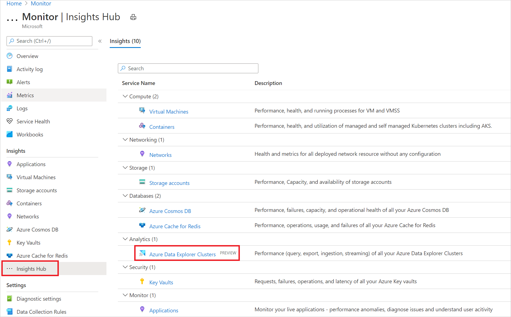
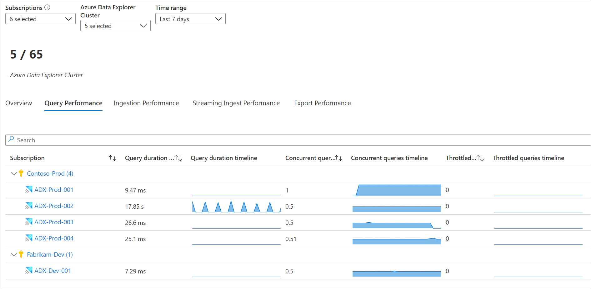
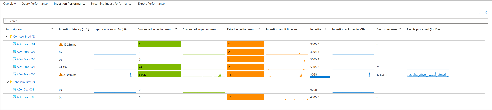
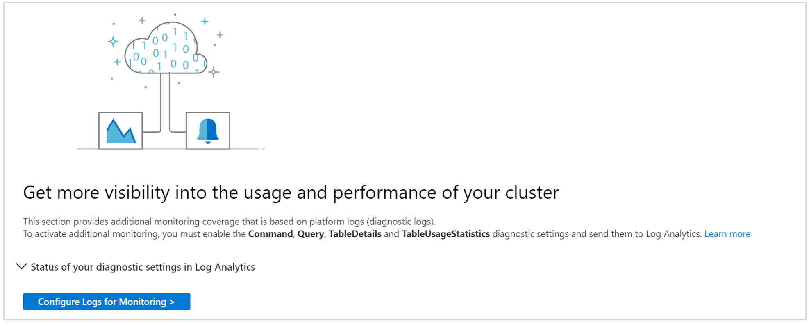
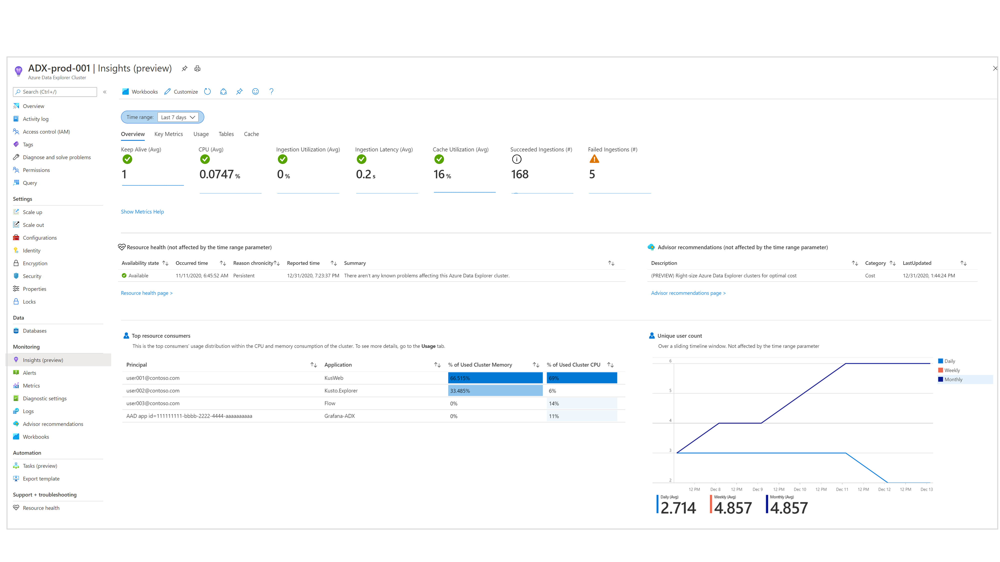
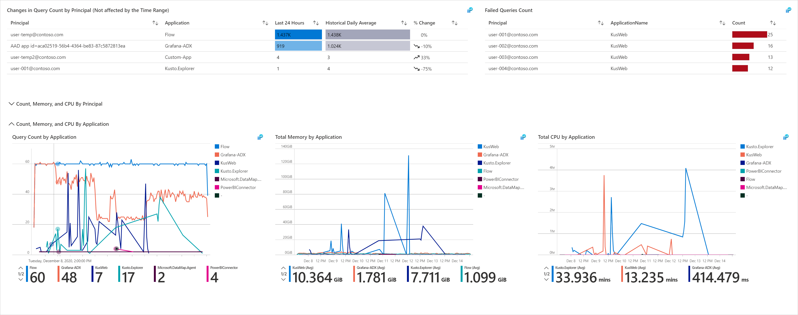
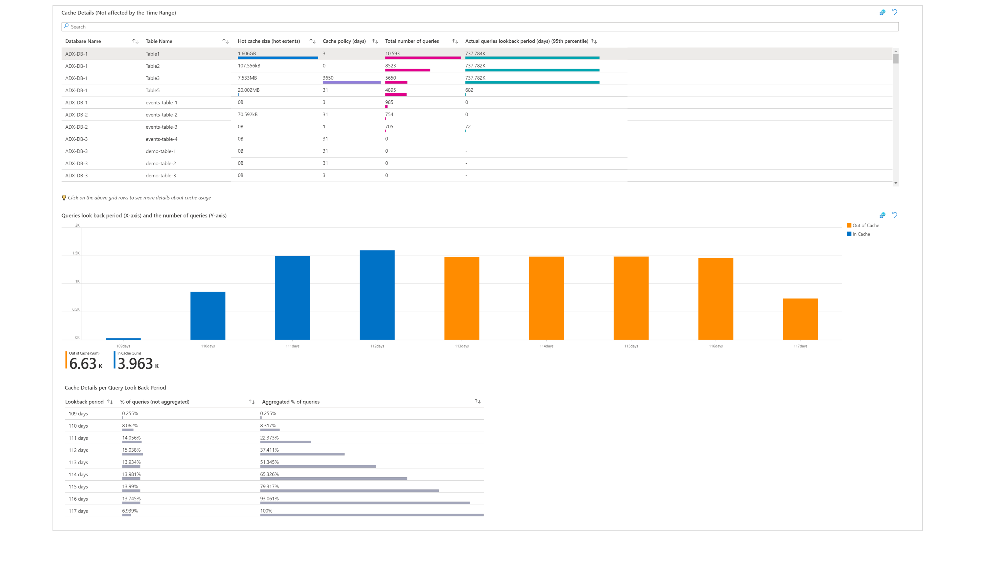
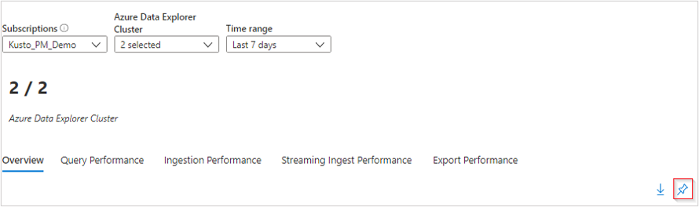
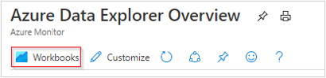

# Azure Monitor for Azure Data Explorer (preview)

Azure Monitor for Azure Data Explorer (preview) provides comprehensive monitoring of your clusters by delivering a unified view of your cluster performance, operations, usage, and failures.
This article will help you understand how to onboard and use Azure Monitor for Azure Data Explorer (preview).

## Introduction to Azure Monitor for Azure Data Explorer (preview)

Before jumping into the experience, you should understand how it presents and visualizes information.
-    **At scale perspective** showing a snapshot view of your clusters' primary metrics, to easily track performance of queries, ingestion, and export operations.
-   **Drill down analysis** of a particular Azure Data Explorer cluster to help perform detailed analysis.
-    **Customizable** where you can change which metrics you want to see, modify or set thresholds that align with your limits, and save your own custom workbooks. Charts in the workbook can be pinned to Azure dashboards.

## View from Azure Monitor (at scale perspective)

From Azure Monitor, you can view the main performance metrics for the cluster, including metrics for queries, ingestion, and export operations from multiple clusters in your subscription, and help identify performance problems.

To view the performance of your clusters across all your subscriptions, perform the following steps:

1. Sign into the [Azure portal](https://portal.azure.com/)

2. Select **Monitor** from the left-hand pane in the Azure portal, and under the Insights Hub section, select **Azure Data Explorer Clusters (preview)**.

### Overview tab

On the **Overview** tab for the selected subscription, the table displays interactive metrics for the Azure Data Explorer clusters grouped within the subscription. You can filter results based on the options you select from the following drop-down lists:

* Subscriptions – only subscriptions that have Azure Data Explorer clusters are listed.

* Azure Data Explorer clusters – by default, only up to five clusters are pre-selected. If you select all or multiple clusters in the scope selector, up to 200 clusters will be returned.

* Time Range – by default, displays the last 24 hours of information based on the corresponding selections made.

The counter tile, under the drop-down list, rolls-up the total number of Azure Data Explorer clusters in the selected subscriptions and reflects how many are selected. There are conditional color-codings for the columns: Keep alive, CPU, Ingestion Utilization, and Cache Utilization. Orange-coded cells have values that are not sustainable for the cluster. 

To better understand what each of the metrics represent, we recommend reading through the documentation on [Azure Data Explorer metrics](/azure/data-explorer/using-metrics#cluster-metrics).

### Query Performance tab

This tab shows the query duration, total number of concurrent queries, and the total number of throttled queries.

### Ingestion Performance tab

This tab shows the ingestion latency, succeeded ingestion results, failed ingestion results, ingestion volume, and events processed for Event/IoT Hubs.

### Streaming Ingest Performance tab

This tab provides information on the average data rate, average duration, and request rate.

### Export Performance tab

This tab provides information on exported records, lateness, pending count, and utilization percentage for continuous export operations.

## View from an Azure Data Explorer Cluster resource (drill down analysis)

To access Azure Monitor for Azure Data Explorer Clusters directly from an Azure Data Explorer Cluster:

1. In the Azure portal, select **Azure Data Explorer Clusters**.

2. From the list, choose an Azure Data Explorer Cluster. In the monitoring section, choose **Insights (preview)**.

These views are also accessible by selecting the resource name of an Azure Data Explorer cluster from within the Azure Monitor insights view.

Azure Monitor for Azure Data Explorer combines both logs and metrics to provide a global monitoring solution. The inclusion of logs-based visualizations requires users to [enable diagnostic logging of their Azure Data Explorer cluster and send them to a Log Analytics workspace.](/azure/data-explorer/using-diagnostic-logs?tabs=commands-and-queries#enable-diagnostic-logs). The diagnostic logs that should be enabled are: **Command**, **Query**, **TableDetails**, and **TableUsageStatistics**.

 The **Overview** tab shows:

- Metrics tiles highlighting the availability and overall status of the cluster to quickly assess its health.

- A summary of active [Advisor recommendations](/azure/data-explorer/azure-advisor) and [resource health](/azure/data-explorer/monitor-with-resource-health) status.

- Charts showing the top CPU and memory consumers and the number of unique users over time.

The **Key Metrics** tab shows a unified view of some of the cluster's metrics, grouped by: general metrics, query-related, ingestion-related, and streaming ingestion-related metrics.

The **Usage** tab allows users to deep dive into the performance of the cluster's commands and queries. On this page, you can:
 
 - See which workload groups, users and applications are sending the most queries or consuming the most CPU and memory (so you can understand which workloads are submitting the heaviest queries for the cluster to process).
 - Identify top workload groups, users and applications by failed queries.
 - Identify recent changes in the number of queries, compared to the historical daily average (over the past 16 days), by workload group, user and application.
 - Identify trends and peaks in the number of queries, memory, and CPU consumption by workload group, user, application and command type.

The **tables** tab shows the latest and historical properties of tables in the cluster. You can see which tables are consuming the most space, track growth history by table size, hot data, and the number of rows over time.

The **cache** tab allows users to analyze their actual queries' look back patterns and compare them to the configured cache policy (for each table). You can identify tables used by the most queries and tables that are not queried at all, and adapt the cache policy accordingly. You may get particular cache policy recommendations on specific tables in Azure Advisor (currently, cache recommendations are available only from the [main Azure Advisor dashboard](/azure/data-explorer/azure-advisor#use-the-azure-advisor-recommendations)), based on actual queries' look back in the past 30 days and an un-optimized cache policy for at least 95% of the queries. Cache reduction recommendations in Azure Advisor are available for clusters that are "bounded by data" (meaning the cluster has low CPU and low ingestion utilization, but because of high data capacity, the cluster could not scale-in or scale-down).

The **cluster boundaries** tab displays the cluster boundaries based on your usage. In this tab you can inspect the CPU, ingestion and cache utilization. These metrics are scored as "Low", "Medium" or "High". These metrics and scores are important when deciding on the optimal SKU and instances count for your cluster, and they are taken into account in Azure Advisor SKU/size recommendation. In this tab you can select a metric tile and deep dive to understand its trend and how its score is decided. You can also view the Azure Advisor SKU/size recommendation for your cluster. For example, in the following image you can see that all metrics are scored as "Low", and thereby the cluster receives a cost recommendation allowing it to scale in/down and save cost.

> [!div class="mx-imgBorder"]
> 

## Pin to Azure dashboard

You can pin any one of the metric sections (of the "at-scale" perspective) to an Azure dashboard by selecting the pushpin icon at the top right of the section.

## Customize Azure Monitor for Azure Data Explorer Cluster

This section highlights common scenarios for editing the workbook to customize in support of your data analytics needs:
* Scope the workbook to always select a particular subscription or Azure Data Explorer Cluster(s)
* Change metrics in the grid
* Change thresholds or color rendering/coding

You can begin customizations by enabling the editing mode, by selecting the **Customize** button from the top toolbar.

Customizations are saved to a custom workbook to prevent overwriting the default configuration in our published workbook. Workbooks are saved within a resource group, either in the My Reports section that is private to you or in the Shared Reports section that's accessible to everyone with access to the resource group. After you save the custom workbook, you need to go to the workbook gallery to launch it.

## Troubleshooting

For general troubleshooting guidance, refer to the dedicated workbook-based insights [troubleshooting article](troubleshoot-workbooks.md).

This section will help you with the diagnosis and troubleshooting of some of the common issues you may encounter when using Azure Monitor for Azure Data Explorer Cluster (preview). Use the list below to locate the information relevant to your specific issue.

### Why don't I see all my subscriptions in the subscription picker?

We only show subscriptions that contain Azure Data Explorer Clusters, chosen from the selected subscription filter, which are selected in the "Directory + Subscription" in the Azure portal header.

### Why do I not see any data for my Azure Data Explorer Cluster under the Usage, Tables or Cache sections?

To view your logs-based data, you will need to [enable diagnostic logs](/azure/data-explorer/using-diagnostic-logs?tabs=commands-and-queries#enable-diagnostic-logs) for each of the Azure Data Explorer Clusters you want to monitor. This can be done under the diagnostic settings for each cluster. You will need to send your data to a Log Analytics workspace. The diagnostic logs that should be enabled are: Command, Query, TableDetails, and TableUsageStatistics.

### I have already enabled logs for my Azure Data Explorer Cluster, why am I still unable to see my data under Commands and Queries?

Currently, diagnostic logs do not work retroactively, so the data will only start appearing once there have been actions taken to your Azure Data Explorer. Therefore, it may take some time, ranging from hours to a day, depending on how active your Azure Data Explorer cluster is.

## Next steps

Learn the scenarios workbooks are designed to support, how to author new and customize existing reports, and more by reviewing [Create interactive reports with Azure Monitor workbooks](../visualize/workbooks-overview.md).
