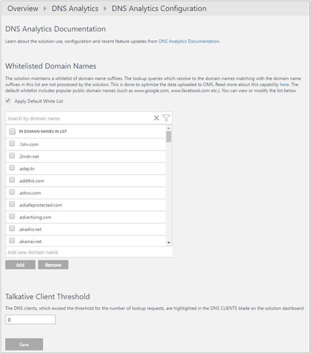
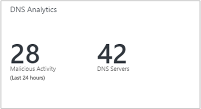
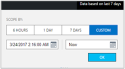
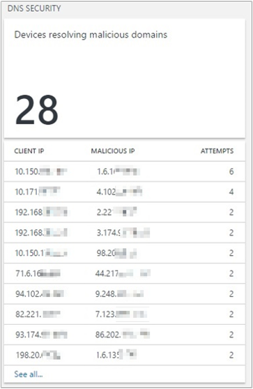
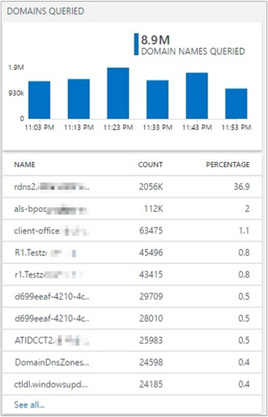
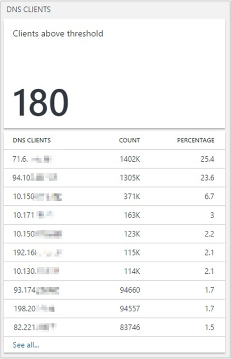
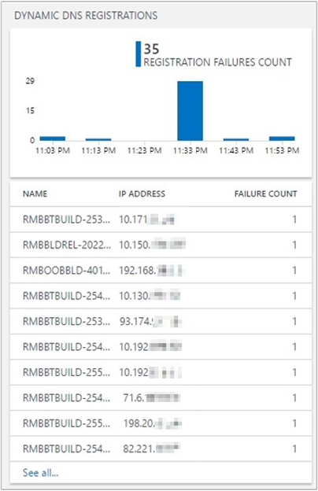
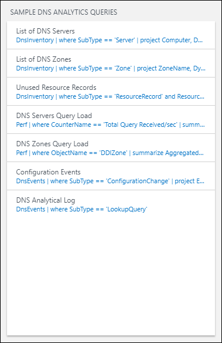
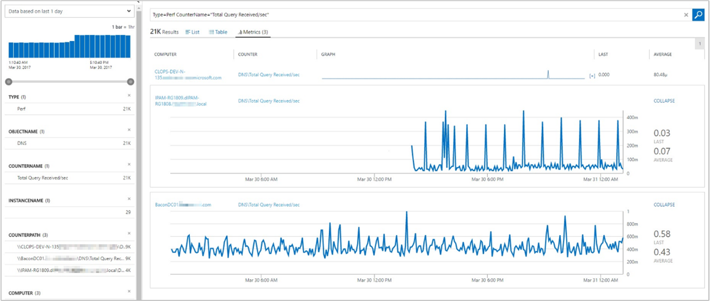
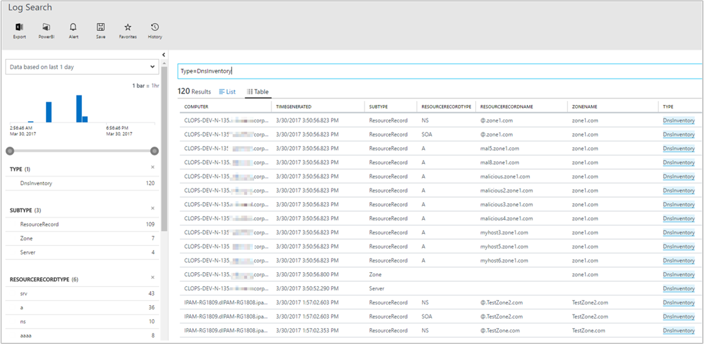

# Gather insights about your DNS infrastructure with the DNS Analytics Preview solution

This article describes how to set up and use the Azure DNS Analytics solution in Azure Monitor to gather insights into DNS infrastructure on security, performance, and operations.

DNS Analytics helps you to:

- Identify clients that try to resolve malicious domain names.
- Identify stale resource records.
- Identify frequently queried domain names and talkative DNS clients.
- View request load on DNS servers.
- View dynamic DNS registration failures.

The solution collects, analyzes, and correlates Windows DNS analytic and audit logs and other related data from your DNS servers.

## Connected sources

The following table describes the connected sources that are supported by this solution:

| **Connected source** | **Support** | **Description** |
| --- | --- | --- |
| [Windows agents](../platform/agent-windows.md) | Yes | The solution collects DNS information from Windows agents. |
| [Linux agents](../learn/quick-collect-linux-computer.md) | No | The solution does not collect DNS information from direct Linux agents. |
| [System Center Operations Manager management group](../platform/om-agents.md) | Yes | The solution collects DNS information from agents in a connected Operations Manager management group. A direct connection from the Operations Manager agent to Azure Monitor is not required. Data is forwarded from the management group to the Log Analytics workspace. |
| [Azure storage account](../platform/collect-azure-metrics-logs.md) | No | Azure storage isn't used by the solution. |

### Data collection details

The solution collects DNS inventory and DNS event-related data from the DNS servers where a Log Analytics agent is installed. This data is then uploaded to Azure Monitor and displayed in the solution dashboard. Inventory-related data, such as the number of DNS servers, zones, and resource records, is collected by running the DNS PowerShell cmdlets. The data is updated once every two days. The event-related data is collected near real time from the [analytic and audit logs](https://technet.microsoft.com/library/dn800669.aspx#enhanc) provided by enhanced DNS logging and diagnostics in Windows Server 2012 R2.

## Configuration

Use the following information to configure the solution:

- You must have a [Windows](../platform/agent-windows.md) or [Operations Manager](../platform/om-agents.md) agent on each DNS server that you want to monitor.
- You can add the DNS Analytics solution to your Log Analytics workspace from the [Azure Marketplace](https://aka.ms/dnsanalyticsazuremarketplace). You can also use the process described in [Add Azure Monitor solutions from the Solutions Gallery](solutions.md).

The solution starts collecting data without the need of further configuration. However, you can use the following configuration to customize data collection.

### Configure the solution

On the solution dashboard, click **Configuration** to open the DNS Analytics Configuration page. There are two types of configuration changes that you can make:

- **Whitelisted Domain Names**. The solution does not process all the lookup queries. It maintains a whitelist of domain name suffixes. The lookup queries that resolve to the domain names that match domain name suffixes in this whitelist are not processed by the solution. Not processing whitelisted domain names helps to optimize the data sent to Azure Monitor. The default whitelist includes popular public domain names, such as www.google.com and www.facebook.com. You can view the complete default list by scrolling.

  You can modify the list to add any domain name suffix that you want to view lookup insights for. You can also remove any domain name suffix that you don't want to view lookup insights for.

- **Talkative Client Threshold**. DNS clients that exceed the threshold for the number of lookup requests are highlighted in the **DNS Clients** blade. The default threshold is 1,000. You can edit the threshold.

    

## Management packs

If you are using the Microsoft Monitoring Agent to connect to your Log Analytics workspace, the following management pack is installed:

- Microsoft DNS Data Collector Intelligence Pack (Microsoft.IntelligencePacks.Dns)

If your Operations Manager management group is connected to your Log Analytics workspace, the following management packs are installed in Operations Manager when you add this solution. There is no required configuration or maintenance of these management packs:

- Microsoft DNS Data Collector Intelligence Pack (Microsoft.IntelligencePacks.Dns)
- Microsoft System Center Advisor DNS Analytics Configuration (Microsoft.IntelligencePack.Dns.Configuration)

For more information on how solution management packs are updated, see [Connect Operations Manager to Log Analytics](../platform/om-agents.md).

## Use the DNS Analytics solution

[!INCLUDE [azure-monitor-solutions-overview-page](../../../includes/azure-monitor-solutions-overview-page.md)]

The DNS tile includes the number of DNS servers where the data is being collected. It also includes the number of requests made by clients to resolve malicious domains in the past 24 hours. When you click the tile, the solution dashboard opens.

### Solution dashboard

The solution dashboard shows summarized information for the various features of the solution. It also includes links to the detailed view for forensic analysis and diagnosis. By default, the data is shown for the last seven days. You can change the date and time range by using the **date-time selection control**, as shown in the following image:

The solution dashboard shows the following blades:

**DNS Security**. Reports the DNS clients that are trying to communicate with malicious domains. By using Microsoft threat intelligence feeds, DNS Analytics can detect client IPs that are trying to access malicious domains. In many cases, malware-infected devices "dial out" to the "command and control" center of the malicious domain by resolving the malware domain name.

When you click a client IP in the list, Log Search opens and shows the lookup details of the respective query. In the following example, DNS Analytics detected that the communication was done with an [IRCbot](https://www.microsoft.com/en-us/wdsi/threats/malware-encyclopedia-description?Name=Backdoor:Win32/IRCbot):

The information helps you to identify the:

- Client IP that initiated the communication.
- Domain name that resolves to the malicious IP.
- IP addresses that the domain name resolves to.
- Malicious IP address.
- Severity of the issue.
- Reason for blacklisting the malicious IP.
- Detection time.

**Domains Queried**. Provides the most frequent domain names being queried by the DNS clients in your environment. You can view the list of all the domain names queried. You can also drill down into the lookup request details of a specific domain name in Log Search.

**DNS Clients**. Reports the clients *breaching the threshold* for number of queries in the chosen time period. You can view the list of all the DNS clients and the details of the queries made by them in Log Search.

**Dynamic DNS Registrations**. Reports name registration failures. All registration failures for address [resource records](https://en.wikipedia.org/wiki/List_of_DNS_record_types) (Type A and AAAA) are highlighted along with the client IPs that made the registration requests. You can then use this information to find the root cause of the registration failure by following these steps:

1. Find the zone that is authoritative for the name that the client is trying to update.

1. Use the solution to check the inventory information of that zone.

1. Verify that the dynamic update for the zone is enabled.

1. Check whether the zone is configured for secure dynamic update or not.

    

**Name registration requests**. The upper tile shows a trendline of successful and failed DNS dynamic update requests. The lower tile lists the top 10 clients that are sending failed DNS update requests to the DNS servers, sorted by the number of failures.

**Sample DDI Analytics Queries**. Contains a list of the most common search queries that fetch raw analytics data directly.

You can use these queries as a starting point for creating your own queries for customized reporting. The queries link to the DNS Analytics Log Search page where results are displayed:

- **List of DNS Servers**. Shows a list of all DNS servers with their associated FQDN, domain name, forest name, and server IPs.
- **List of DNS Zones**. Shows a list of all DNS zones with the associated zone name, dynamic update status, name servers, and DNSSEC signing status.
- **Unused Resource Records**. Shows a list of all the unused/stale resource records. This list contains the resource record name, resource record type, the associated DNS server, record generation time, and zone name. You can use this list to identify the DNS resource records that are no longer in use. Based on this information, you can then remove those entries from the DNS servers.
- **DNS Servers Query Load**. Shows information so that you can get a perspective of the DNS load on your DNS servers. This information can help you plan the capacity for the servers. You can go to the **Metrics** tab to change the view to a graphical visualization. This view helps you understand how the DNS load is distributed across your DNS servers. It shows DNS query rate trends for each server.

    

- **DNS Zones Query Load**. Shows the DNS zone-query-per-second statistics of all the zones on the DNS servers being managed by the solution. Click the **Metrics** tab to change the view from detailed records to a graphical visualization of the results.
- **Configuration Events**. Shows all the DNS configuration change events and associated messages. You can then filter these events based on time of the event, event ID, DNS server, or task category. The data can help you audit changes made to specific DNS servers at specific times.
- **DNS Analytical Log**. Shows all the analytic events on all the DNS servers managed by the solution. You can then filter these events based on time of the event, event ID, DNS server, client IP that made the lookup query, and query type task category. DNS server analytic events enable activity tracking on the DNS server. An analytic event is logged each time the server sends or receives DNS information.

### Search by using DNS Analytics Log Search

On the Log Search page, you can create a query. You can filter your search results by using facet controls. You can also create advanced queries to transform, filter, and report on your results. Start by using the following queries:

1. In the **search query box**, type `DnsEvents` to view all the DNS events generated by the DNS servers managed by the solution. The results list the log data for all events related to lookup queries, dynamic registrations, and configuration changes.

      

    a. To view the log data for lookup queries, select **LookUpQuery** as the **Subtype** filter from the facet control on the left. A table that lists all the lookup query events for the selected time period is displayed.

    b. To view the log data for dynamic registrations, select **DynamicRegistration** as the **Subtype** filter from the facet control on the left. A table that lists all the dynamic registration events for the selected time period is displayed.

    c. To view the log data for configuration changes, select **ConfigurationChange** as the **Subtype** filter from the facet control on the left. A table that lists all the configuration change events for the selected time period is displayed.

1. In the **search query box**, type `DnsInventory` to view all the DNS inventory-related data for the DNS servers managed by the solution. The results list the log data for DNS servers, DNS zones, and resource records.

    

## Feedback

There are two ways you can give feedback:

- **UserVoice**. Post ideas for DNS Analytics features to work on. Visit the [Log Analytics UserVoice page](https://aka.ms/dnsanalyticsuservoice).
- **Join our cohort**. We're always interested in having new customers join our cohorts to get early access to new features and help us improve DNS Analytics. If you are interested in joining our cohorts, fill out [this quick survey](https://aka.ms/dnsanalyticssurvey).

## Next steps

[Query logs](../log-query/log-query-overview.md) to view detailed DNS log records.
