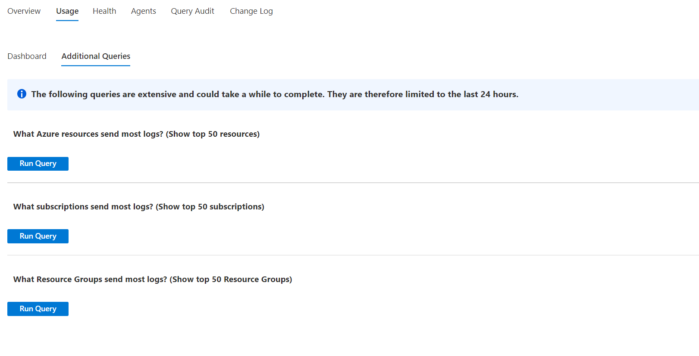

# Log Analytics Workspace Insights (preview)

Log Analytics Workspace Insights (preview) provides comprehensive monitoring of your workspaces through a unified view of your workspace usage, performance, health, agent, queries and change log. This article will help you understand how to onboard and use Log Analytics Workspace Insights (preview).

## Overview your Log Analytics workspaces

When accessing Log Analytics Workspace Insights through the Azure Monitor Insights, the 'At scale' perspective is shown. Here you can see how your workspaces are spread across the globe, review their retention, capping and license details (color coded), and choose a workspace to see its insights.

To launch Log Analytics Workspace Insights at scale, perform the following steps:

1. Sign into the [Azure portal](https://portal.azure.com/)

2. Select **Monitor** from the left-hand pane in the Azure portal, and under the Insights Hub section, select **Log Analytics Workspace Insights (preview)**.

## View Insights for a Log Analytics workspace

Launching Insights in the context of a specific workspace displays rich data and analytics of the workspace performance, usage, health, agents, queries, and change log.

To access Log Analytics Workspace Insights:

1. Open Log Analytics Workspace Insights from Azure Monitor (explained above)

2. Select a workspace to drill into

Or - 

1. In the Azure portal, select **Log Analytics Workspaces**

2. Choose a Log Analytics Workspace

3. Select **Insights** on the Workspace menu (under Monitoring)

The data is organized in tabs, and the time range on top (defaults to 24 hours) applies to all tabs. Some charts and tables use a different time range, as indicated in their titles.

### Overview tab

On the **Overview** tab you can see:

* Main stats and settings - 
    - The monthly ingestion volume of the workspace
    - How many machines sent heartbeats, meaning - machines that are connected to this workspace (in the selected time range)
    - Machines that haven't sent heartbeats in the last hour (in the selected time range)
    - The data retention period set
    - The daily cap set, and how much data was already ingested on the recent day

* Top 5 tables – charts analyzing the 5 most ingested tables, over the past month.
    - Volume of data ingested to each table
    - The daily ingestion to each of them - to visually display spikes or dips
    - Ingestion anomalies - a list of identified spikes and dips in ingestion to these tables

### Usage tab

#### Usage dashboard

This tab provides information on the workspace's usage. 
The dashboard sub-tab shows ingestion data of by tables, and defaults to the 5 most ingested tables in the selected time range (same tables displayed in the Overview page). You can choose which tables to display through the Worksace Tables dropdown. 

* Main grid - here you can see tables grouped by solutions, and information about each table"
    - How much data was ingested to it (during the selected time range)
    - The percentage this table takes, from the entire ingestion volume (during the selected time range). That helps identify the tables that affect your inegstion the most. In the below screenshot you can see AzureDiagnostics and ContainerLog alone stand for over 2 thirds (64%) of the data ingested to this workspace.
    - When was the last update of usage statistics regarding each table - we normally expect usage stats to refresh hourly. Since refreshing usage statistics is a recurrent service-internal operation, a delay in refreshing that data is only noted so you would know to interpret the data correctly. There is no action you (as a user) should take.
    - Billable - indicates which tables are billed for, and which are free.

* Table-specific details

    On the bottom of the page, you can see detailed information on the table selected in the main grid.
    - Ingestion volume - how much data was ingested to the table from each resource, and how it spreads over time. Resources ingesting over 30% of the total volume sent to this table are marked with a warning sign, for you to take note of.
    - Ingestion latency - how much time ingestion took, analyzed for the 50th, 90th or 95th percentiles of requests sent to this table. The top chart in this area depicts the total ingestion time of the reqeusts (for the selected percentile) from end to end - from the time the event occured, and until it was ingested to the workspace.
    The chart below it shows separately the latency of the agent (the time it took the agent to send the log to the workspace) and that of the pipeline (the time it took the service to process the data and push it to the workspace).
    

#### Additional usage queries

The Additional queries sub-tab exposes queries that run across all workspace tables (instead of relying on the usage metadata, refreshed hourly). Since there queries are much more extensive and less efficient, they are not run automatically. However, they can surface interesting information about which resources send most logs to the workspace, and perhaps affect billing.

One such query is 'What Azure resources send most logs to this workspace' (showing top 50).
In our demo workspace, you can clearly see that 3 Kuberbetes clusters send far more data than all other resources combined, and a particular one of them loads the workspace most.

### Health tab

This tab shows the workspace health state and when it was last reported, as well as operational errors and warnings (retrieved from the _LogOperation table).

### Agents tab

This tab provides information on the agents sending logs to this workspace.

* Operation errors and warnings - these are errors and warning related specifically to agents. They are grouped by the error/warning title to help you get a clearer view of different issues that may occur, but can be expanded to show the exact times and resources they refer to. Also note you can click 'Run query in Logs' to query the _LogOperation table through the Logs experience, see the raw data and analyze if further.
* Workspace agents - these are the agents that sent logs to the workspace during the selected time range. You can see the agents' types (Direct, Gateway, SCOM or SCOM management servers) and health state. Agents are marked healthy aren't necessarily working well - it only indicated they sent a heartbeat during the last hour. A more detailed health state is detailed in the below gris.
* Agents activity - this grid shows information on either all agents, healthy or unhealthy agents. Here too "Healthy" only indicated the agent send a heartbeat during the last hour. To understand its state better, review the trend shown in the grid - it shows how many heartbeats this agent sent over time. The true health state can only be inferred if you know how the monitored resource operates, for example - If a computer is intentionally shut down at particular times, you can expect the agent's heartbeats to appear intermittenly, in a matching pattern.

### Query audit tab

Query auditing creates logs about the execution of queries on the workspace. If enabled, this data is greatly beneficial to understanding and improving queries performance, efficiency and load. To enable query auditing on your workspace or learn more about it, see [Audit queries in Azure Monitor Logs](https://docs.microsoft.com/en-us/azure/azure-monitor/logs/query-audit).

#### Performance 
This tab shows:
* Query duration - 95th percentile and 50th percentile (median) duration in ms, over time.
* Number of rows returned - 95th percentile and 50th percentile (median) of rows count, over time.
* The volume of data processed - 95th percentile, 50th percentile, and the total of processed data in all requests, over time.
* Response codes - the distribution of response codes to all queries in the selected time range.

#### Slow and inefficient queries 
This tab shows two grids to help you identify slow and inefficient queries you may want to re-think. These queries should not be used in dashboards or alerts, since they will create unneeded chronic load on your workspace.
* Most resource intensive queries - the 10 most CPU-demanding queries, along with the volume of data processed (KB), the time range and text of each query.
* Slowest queries - the 10 slowest queries, along with the time range and text of each query.

#### Query users 
This tab shows users activity against this workspace:
* Queries by user - how many queries each user ran in the selected time range
* Throttled users - users that ran queries that were throttled (due to over-querying the workspace)

### Change log tab

This tab shows configuration changes made on the workspace during the last 90 days (regardless of the time range selected), and who performed them.
It is intended to help you monitor who changes important workspace settings, such as data capping or workspace license.

## Next steps

Learn the scenarios workbooks are designed to support, how to author new and customize existing reports, and more by reviewing [Create interactive reports with Azure Monitor workbooks](../visualize/workbooks-overview.md).
