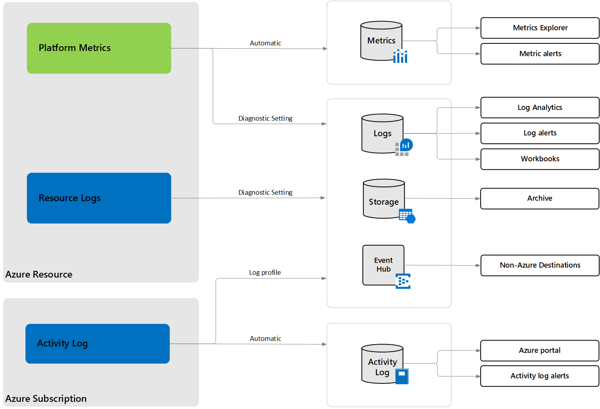
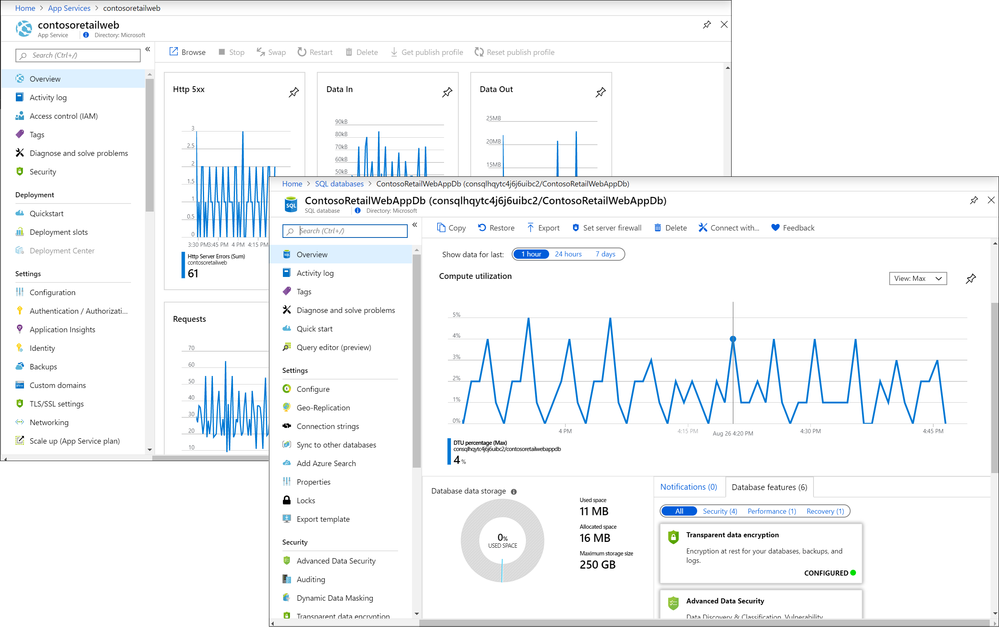
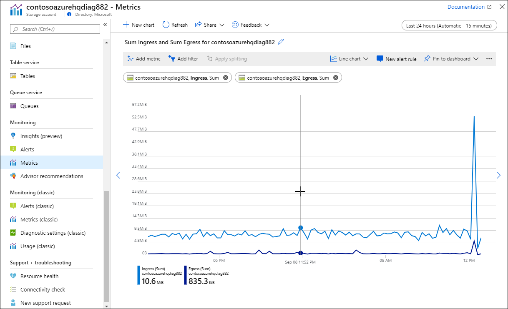
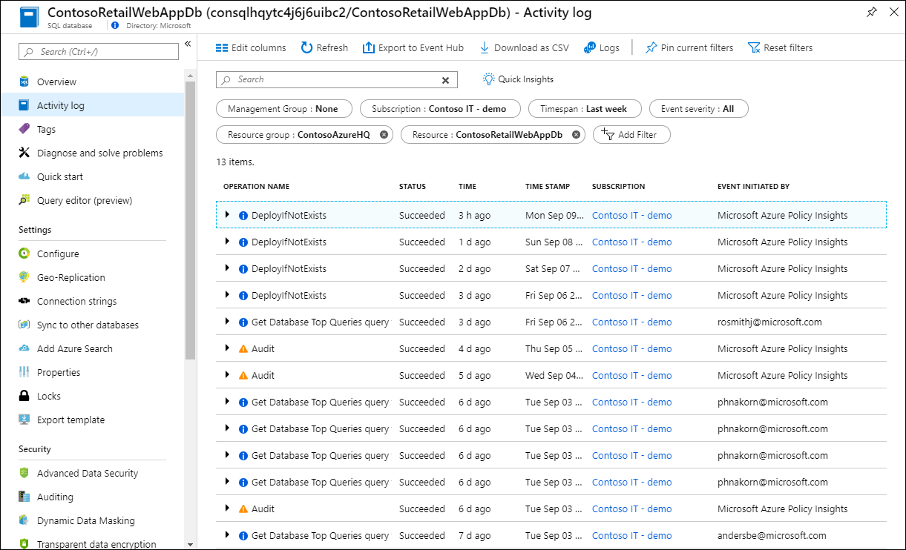
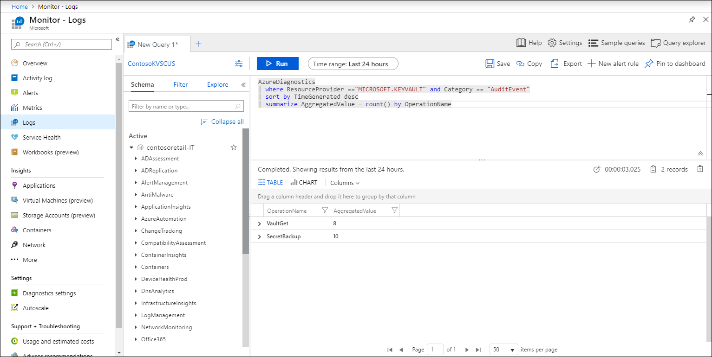

# Monitoring Azure resources with Azure Monitor
When you have critical applications and business processes relying on Azure resources, you want to monitor those resources for their availability, performance, and operation. This article describes the monitoring data generated by Azure resources and how you can use the features of Azure Monitor to analyze and alert on this data.

> [!IMPORTANT]
> This article applies to all services in Azure that use Azure Monitor. Compute resources, including VMs and App Service, generate the same monitoring data described here but also have a guest operating system that may also generate logs and metrics. See the monitoring documentation for these services for details on how to collect and analyze this data.

## What is Azure Monitor?
Azure Monitor is a full stack monitoring service in Azure that provides a complete set of features to monitor your Azure resources in addition to resources in other clouds and on-premises. The [Azure Monitor data platform](../platform/data-platform.md) collects data into [logs](../platform/data-platform-logs.md) and [metrics](../platform/data-platform-metrics.md) where they can be analyzed together using a complete set of monitoring tools as described in the following sections.

- [What can you do with Azure Monitor Metrics?](../platform/data-platform-metrics.md#what-can-you-do-with-azure-monitor-metrics)
- [What can you do with Azure Monitor Logs?](../platform/data-platform-logs.md#what-can-you-do-with-azure-monitor-logs)

As soon as you create an Azure resource, Azure Monitor is enabled and starts collecting metrics and activity logs which you can [view and analyze in the Azure portal](#monitoring-in-the-azure-portal). With some configuration, you can gather additional monitoring data and enable additional features. See [Monitoring Data](#monitoring-data) below for details on any configuration requirements.

## Costs associated with monitoring
There is no cost for analyzing monitoring data that is collected by default. This includes the following:

- Collecting platform metrics and analyzing them with metrics explorer.
- Collecting Activity log and analyzing it in the Azure portal.
- Creating an Activity log alert rule.

There are no Azure Monitor costs for collecting and exporting logs and metrics, but there may be related costs associated with the destination:

- Costs associated with data ingestion and retention when collecting logs and metrics in Log Analytics workspace. See [Azure Monitor pricing for Log Analytics](https://azure.microsoft.com/pricing/details/monitor/).
- Costs associated with data storage when collecting logs and metrics to an Azure storage account. See [Azure Storage pricing for blob storage](https://azure.microsoft.com/pricing/details/storage/blobs/).
- Costs associated with event hub streaming when forwarding logs and metrics to Azure Event Hubs. See [Azure Event Hubs pricing](https://azure.microsoft.com/pricing/details/event-hubs/).

There may be Azure Monitor costs associated with the following. See [Azure Monitor pricing](https://azure.microsoft.com/pricing/details/monitor/):

- Running a log query.
- Creating a metric or log query alert rule.
- Sending a notification from any alert rule.
- Accessing metrics through API.

## Monitoring data
Resources in Azure generate [logs](../platform/data-platform-logs.md) and [metrics](../platform/data-platform-metrics.md) shown in the following diagram. Refer to the documentation for each Azure services for the specific data they generate and any additional solutions or insights they provide.

- [Platform metrics](../platform/data-platform-metrics.md) - Numerical values that are automatically collected at regular intervals and describe some aspect of a resource at a particular time. 
- [Resource logs](../platform/platform-logs-overview.md) - Provide insight into operations that were performed within an Azure resource (the data plane), for example getting a secret from a Key Vault or making a request to a database. The content and structure of resource logs varies by the Azure service and resource type.
- [Activity log](../platform/platform-logs-overview.md) - Provides insight into the operations on each Azure resource in the subscription from the outside (the management plane), for example creating a new resource or starting a virtual machine. This is information about the what, who, and when for any write operations (PUT, POST, DELETE) taken on the resources in your subscription.

## Configuration requirements

### Configure monitoring
Some monitoring data is collected automatically, but you may need to perform some configuration depending on your requirements. See the information below for specific information for each type of monitoring data.

- [Platform metrics](../platform/data-platform-metrics.md) - Platform metrics are collected automatically into [Azure Monitor Metrics](../platform/data-platform-metrics.md) with no configuration required. Create a diagnostic setting to send entries to Azure Monitor Logs or to forward them outside of Azure.
- [Resource logs](../platform/platform-logs-overview.md) - Resource logs are automatically generated by Azure resources but not collected without a diagnostic setting.  Create a diagnostic setting to send entries to Azure Monitor Logs or to forward them outside of Azure.
- [Activity log](../platform/platform-logs-overview.md) - The Activity log is collected automatically with no configuration required and can be view in the Azure portal. Create a diagnostic setting to copy them to Azure Monitor Logs or to forward them outside of Azure.

### Log Analytics workspace
Collecting data into Azure Monitor Logs requires a Log Analytics workspace. You can start monitoring your service quickly by creating a new workspace, but there may be value in using a workspace that's collecting data from other services. See [Create a Log Analytics workspace in the Azure portal](../learn/quick-create-workspace.md) for details on creating a workspace and [Designing your Azure Monitor Logs deployment](../platform/design-logs-deployment.md) to help determine the best workspace design for your requirements. If you use an existing workspace in your organization, then you will require appropriate permissions as described in [Manage access to log data and workspaces in Azure Monitor](../platform/manage-access.md). 

## Diagnostic settings
Diagnostic settings define where resource logs and metrics for a particular resource should be sent. Possible destinations are:

- [Log Analytics workspace](../platform/resource-logs-collect-workspace.md) which allows you to analyze data with other monitoring data collected by Azure Monitor using powerful log queries and also to leverage other Azure Monitor features such as log alerts and visualizations. 
- [Event hubs](../platform/resource-logs-stream-event-hubs.md) to stream data to external systems such as third-party SIEMs and other log analytics solutions. 
- [Azure storage account](../platform/resource-logs-collect-storage.md) which is useful for audit, static analysis, or backup.

Follow the procedure in [Create diagnostic setting to collect platform logs and metrics in Azure](../platform/diagnostic-settings.md) to create and manage diagnostic settings through the Azure portal. See [Create diagnostic setting in Azure using a Resource Manager template](../platform/diagnostic-settings-template.md) to define them in a template and enable complete monitoring for a resource when it's created.

## Monitoring in the Azure portal
 You can access monitoring data for most Azure resources from the resource's menu in the Azure portal. This will give you access to a single resource's data using standard Azure Monitor tools. Some Azure services will provide different options, so you should reference the documentation for that service for additional information. Use the **Azure Monitor** menu to analyze data from all monitored resources. 

### Overview
Many services will include monitoring data on their **Overview** page as a quick glance to their operation. This will typically be based on a subset of platform metrics stored in Azure Monitor Metrics. Other monitoring options will typically be available in a **Monitoring** section of the services. menu.

### Insights and Solutions 
Some services will provide tools beyond the standard features of Azure Monitor. [Insights](../insights/insights-overview.md) provide a customized monitoring experience built on the Azure Monitor data platform and standard features. [Solutions](../insights/solutions.md) provide predefined monitoring logic built on Azure Monitor Logs. 

If a service has an Azure Monitor insight, you can access it from **Monitoring** in each resource's menu. Access all insights and solutions from the **Azure Monitor** menu.

### Metrics
Analyze metrics in the Azure portal using [metrics explorer](../platform/metrics-getting-started.md) which is available from the **Metrics** menu item for most services. This tool allows you to work with individual metrics or combine  multiple to identify correlations and trends. 

- See [Getting started with Azure Metrics Explorer](../platform/metrics-getting-started.md) for the basics of using metrics explorer.
- See [Advanced features of Azure Metrics Explorer](../platform/metrics-charts.md) for advanced features of metrics explorer such as using multiple metrics and applying filters and splitting.

### Activity log 
View entries in the activity log in the Azure portal with the initial filter set to the current resource. Copy the activity log to a Log Analytics workspace to access it to use it in log queries and workbooks. 

- See [View and retrieve Azure Activity log events](../platform/activity-log-view.md) for details on viewing the Activity log and retrieving entries using a variety of methods.
- See the documentation for your Azure service for the specific events that get logged.

### Azure Monitor Logs
Azure Monitor Logs consolidates logs and metrics from multiple services and other data sources for analysis with a powerful query tool. As described above, create a diagnostic setting to collect platform metrics, activity log, and resource logs into a Log Analytics workspace in Azure Monitor.

[Log Analytics](../log-query/get-started-portal.md) allows you to work with [log queries](../log-query/log-query-overview.md), which is a powerful feature of Azure Monitor that allows you to perform advanced analysis of log data using a fully featured query language. Open Log Analytics from **Logs** in the **Monitoring** menu for an Azure resource to work with log queries using the resource as the [query scope](../log-query/scope.md#query-scope). This lets you analyze data across multiple tables for just that resource. Use **Logs** from the Azure Monitor menu to access logs for all resources. 

- See [Get started with log queries in Azure Monitor](../log-query/get-started-queries.md) for a tutorial on using the query language used to write log queries.
- See [Collect Azure resource logs in Log Analytics workspace in Azure Monitor](../platform/resource-logs-collect-workspace.md) for information on how resource logs are collected in Azure Monitor Logs and details for how to access them in a query.
- See [Collection mode](../platform/resource-logs-collect-workspace.md#resource-log-collection-mode) for an explanation of how resource log data is structured in Azure Monitor Logs.
- See the documentation for each Azure service for details on its table in Azure Monitor Logs.

## Monitoring from command line
You can access monitoring data collected from your resource from a command line or include in a script using [Azure PowerShell](/powershell/azure/) or [Azure Command Line Interface](/cli/azure/). 

- See [CLI metrics reference](/cli/azure/monitor/metrics) for accessing metric data from CLI.
- See [CLI Log Analytics reference](/cli/azure/ext/log-analytics/monitor/log-analytics) for accessing Azure Monitor Logs data using a log query from CLI.
- See [Azure PowerShell metrics reference](/powershell/module/azurerm.insights/get-azurermmetric) for accessing metric data from Azure PowerShell.
- See [Azure PowerShell log query reference](/powershell/module/az.operationalinsights/Invoke-AzOperationalInsightsQuery) for accessing Azure Monitor Logs data using a log query from Azure PowerShell.

## Monitoring from REST API
Include monitoring data collected from your resource in a custom application using a REST API.

- See [Azure Monitoring REST API walkthrough](../platform/rest-api-walkthrough.md) for details on accessing metrics from the Azure Monitor REST API.
- See [Azure Log Analytics REST API](https://dev.loganalytics.io/) for information on accessing Azure Monitor Logs data using a log query from Azure PowerShell.

## Alerts
[Alerts](../platform/alerts-overview.md) proactively notify you and potentially take action when important conditions are found in your monitoring data. You create an alert rule that defines a target for the alert, the conditions for whether to create an alert, and any actions to take in response.

Different kinds of monitoring data are used for different kinds of alert rules.

- [Activity log alert](../platform/alerts-activity-log.md) - Create an alert when an entry is created in the activity log that matches specific criteria. This allows you to be notified for example when a particular type of resource is created or if a configuration change fails.
- [Metric alert](../platform/alerts-metric.md) - Create an alert when a metric value exceeds a particular threshold. Metric alerts are more responsive than other alerts and can be automatically resolved when the issue is corrected.
- [Log query alert](../platform/alerts-log.md) - Run a log query at regular intervals and create an alert if a particular condition is found. This allows you to perform complex analysis across multiple sets of data and .

Use **Alerts** from a resource's menu to view alerts and manage alert rules for that resource. Only Activity log alerts and Metric alerts use individual Azure resources as a target. Log query alerts use a Log Analytics workspace as a target and are based on a query that can access any logs stored in that workspace. Use the Azure Monitor menu to view and manage alerts for all resources and the manage log query alert rules.

- See the articles for the different kinds of alerts above for details on creating alert rules.
- See [Create and manage action groups in the Azure portal](../platform/action-groups.md) for details on creating an action group which allows you to manage responses to alerts.

## Next steps

* See [Supported services, schemas, and categories for Azure Resource Logs](../platform/diagnostic-logs-schema.md) for details of resource logs for different Azure services.  
