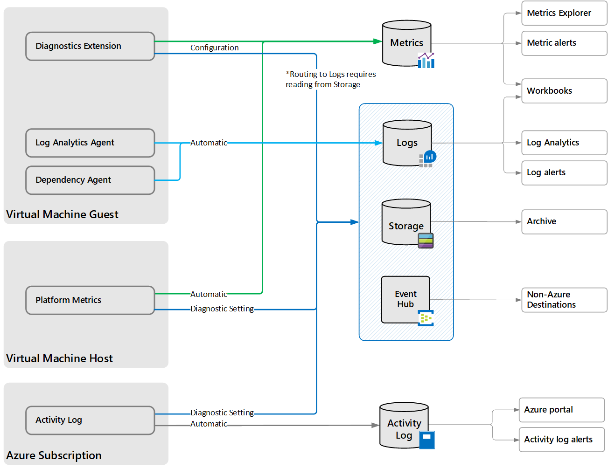
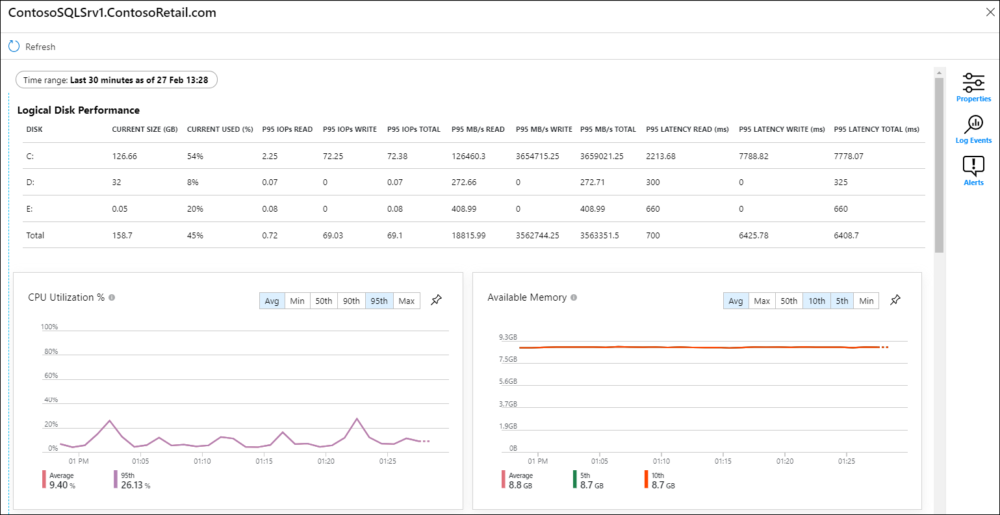
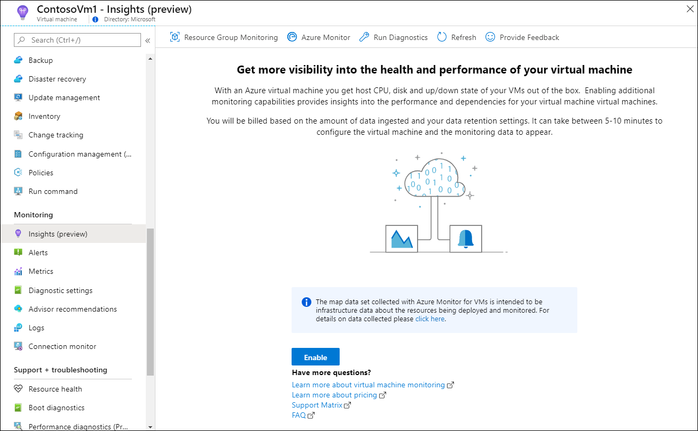
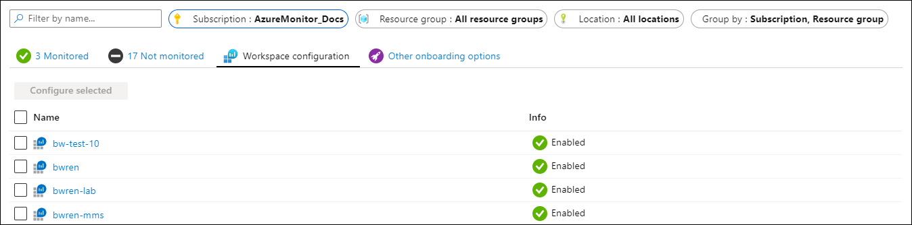
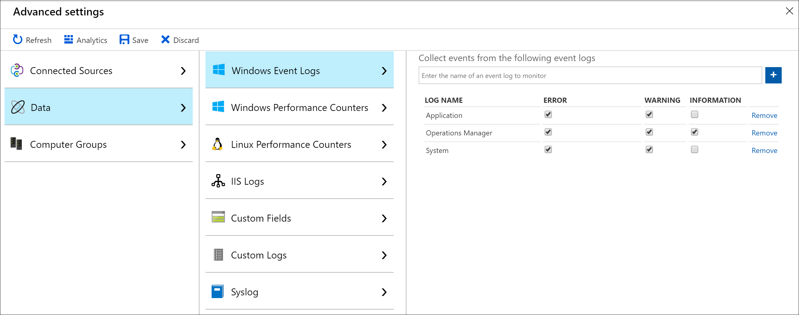
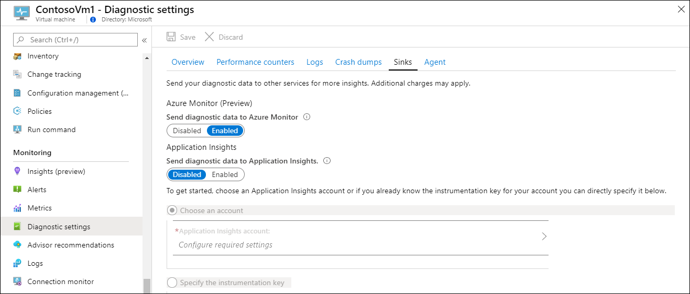
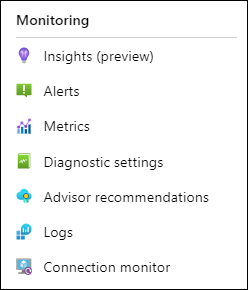
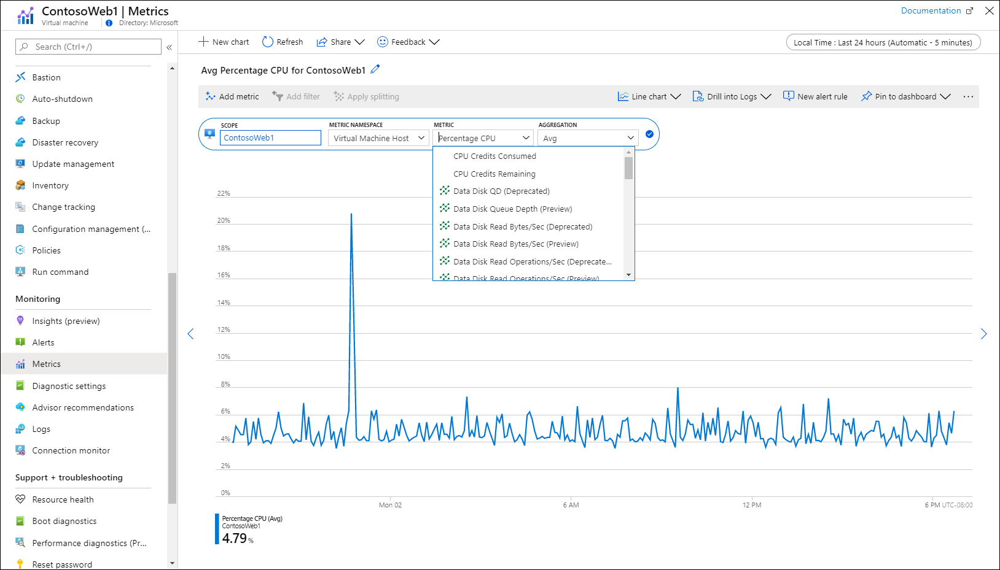
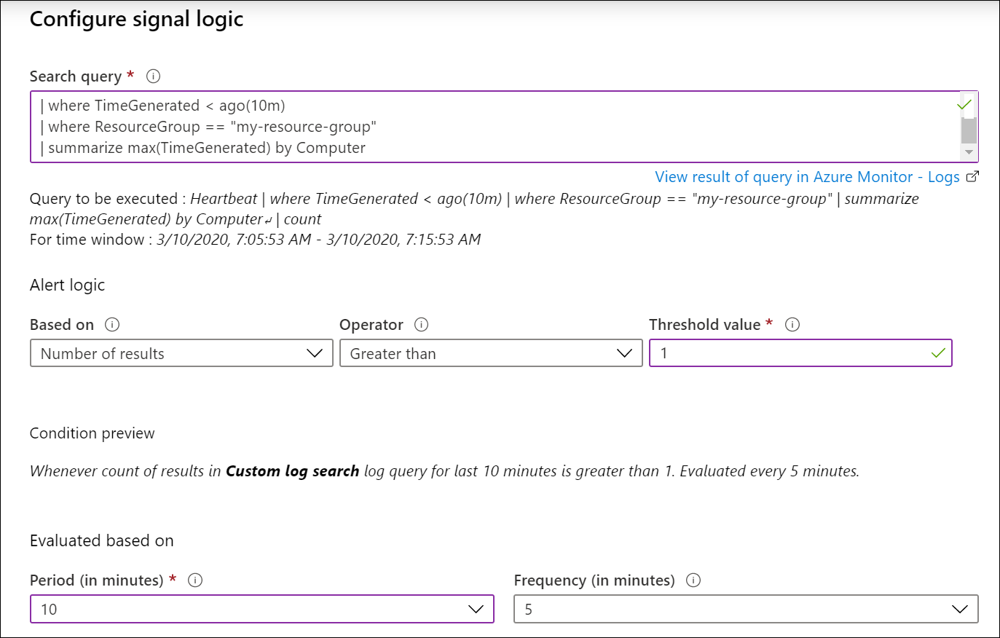
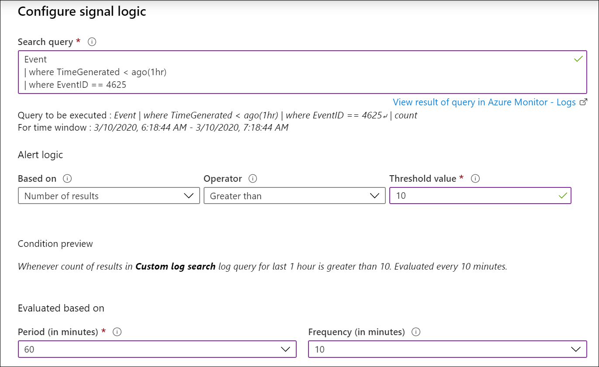

# Monitoring Azure virtual machines with Azure Monitor
This article describes how to use Azure Monitor to collect and analyze monitoring data from Azure virtual machines to maintain their health. Virtual machines can be monitored for availability and performance with Azure Monitor like any [other Azure resource](monitor-azure-resource.md), but they're unique from other resources since you also need to monitor the guest operating and system and the workloads that run in it. 

> [!NOTE]
> This article provides a complete overview of the concepts and options for monitoring virtual machines in Azure Monitor. To start monitoring your virtual machines quickly without focusing on the underlying concepts, see [Quickstart: Monitor an Azure virtual machine with Azure Monitor](../learn/quick-monitor-azure-vm.md).


## Differences from other Azure resources
[Monitoring Azure resources with Azure Monitor](monitor-azure-resource.md) describes the monitoring data generated by Azure resources and how you can use the features of Azure Monitor to analyze and alert on this data. You can collect and act on the same monitoring data from Azure virtual machines with the following differences:

-  [Platform metrics](../platform/data-platform-metrics.md) are collected automatically for virtual machines but only for the [virtual machine host](#monitoring-data). You need an agent to collect performance data from the guest operating system. 
- Virtual machines don't generate [resource logs](../platform/platform-logs-overview.md) which provide insight into operations that were performed within an Azure resource. You use an agent to collect log data from the guest operating system.
- You can create [diagnostic settings](../platform/diagnostic-settings.md) for a virtual machine to send platform metrics to other destinations such as storage and event hubs, but you can't configure these diagnostic settings in the Azure portal. 

## Monitoring data
Virtual machines in Azure in Azure generate [logs](../platform/data-platform-logs.md) and [metrics](../platform/data-platform-metrics.md) shown the following diagram.




### Virtual machine host
Virtual machines in Azure generate the following data for the virtual machine host the same as other Azure resources as described in [Monitoring data](monitor-azure-resource.md#monitoring-data).

- [Platform metrics](../platform/data-platform-metrics.md) - Numerical values that are automatically collected at regular intervals and describe some aspect of a resource at a particular time. Platform metrics are collected for the virtual machine host, but you require the diagnostics extension to collect metrics for the guest operating system.
- [Activity log](../platform/platform-logs-overview.md) - Provides insight into the operations on each Azure resource in the subscription from the outside (the management plane). For a virtual machine, this includes such information as when it was started and any configuration changes.


### Guest operating system
To collect data from the guest operating system of a virtual machine, you require an agent, which runs locally on each virtual machine and sends data to Azure Monitor. Multiple agents are available for Azure Monitor with each collecting different data and writing data to different locations. Get a detailed comparison of the different agents at [Overview of the Azure Monitor agents](../platform/agents-overview.md). 

- [Log Analytics agent](../platform/agents-overview.md#log-analytics-agent) - Available for virtual machines in Azure, other cloud environments, and on-premises. Collects data to Azure Monitor Logs. Supports Azure Monitor for VMs and monitoring solutions. This is the same agent used for System Center Operations Manager.
- [Dependency agent](../platform/agents-overview.md#dependency-agent) - Collects data about the processes running on the virtual machine and their dependencies. Relies on the Log Analytics agent to transmit data into Azure and supports Azure Monitor for VMs, Service Map, and Wire Data 2.0 solutions.
- [Azure Diagnostic extension](../platform/agents-overview.md#azure-diagnostics-extension) - Available for Azure Monitor virtual machines only. Can collect data to multiple locations but primarily used to collect guest performance data into Azure Monitor Metrics for Windows virtual machines.
- [Telegraf agent](../platform/collect-custom-metrics-linux-telegraf.md) - Collect performance data from Linux VMs into Azure Monitor Metrics.


## Configuration requirements
To enable all features of Azure Monitor for monitoring a virtual machine, you need to collect monitoring data from the virtual machine host and guest operating system to both [Azure Monitor Metrics](../platform/data-platform-logs.md) and [Azure Monitor Logs](../platform/data-platform-logs.md). The following table lists the configuration that must be performed to enable this collection. You may choose to not perform all of these steps depending on your particular requirements.

| Configuration step | Actions completed | Features enabled |
|:---|:---|:---|
| No configuration | - Host platform metrics collected to Metrics.<br>- Activity log collected. | - Metrics explorer for host.<br>- Metrics alerts for host.<br>- Activity log alerts. |
| [Enable Azure Monitor for VMs](#enable-azure-monitor-for-vms) | - Log Analytics agent installed.<br>- Dependency agent installed.<br>- Guest performance data collected to Logs.<br>- Process and dependency details collected to Logs. | - Performance charts and workbooks for guest performance data.<br>- Log queries for guest performance data.<br>- Log alerts for guest performance data.<br>- Dependency map. |
| [Install the diagnostics extension and telegraf agent](#enable-diagnostics-extension-and-telegraf-agent) | - Guest performance data collected to Metrics. | - Metrics explorer for guest.<br>- Metrics alerts for guest.  |
| [Configure Log Analytics workspace](#configure-log-analytics-workspace) | - Events collected from guest. | - Log queries for guest events.<br>- Log alerts for guest events. |
| [Create diagnostic setting for virtual machine](#collect-platform-metrics-and-activity-log) | - Platform metrics collected to Logs.<br>- Activity log collected to Logs. | - Loq queries for host metrics.<br>- Log alerts for host metrics.<br>- Log queries for Activity log.

Each of these configuration steps is described in the following sections.

### Enable Azure Monitor for VMs
[Azure Monitor for VMs](vminsights-overview.md) is an [insight](insights-overview.md) in Azure Monitor that is the primary tool for monitoring virtual machines in Azure Monitor. It provides the following additional value over standard Azure Monitor features.

- Simplified onboarding of Log Analytics agent and Dependency agent to enable monitoring of a virtual machine guest operating system and workloads. 
- Pre-defined trending performance charts and workbooks that allow you to analyze core performance metrics from the virtual machine's guest operating system.
- Dependency map that displays processes running on each virtual machine and the interconnected components with other machines and external sources.




Enable Azure Monitor for VMs from the **Insights** option in the virtual machine menu of the Azure portal. See [Enable Azure Monitor for VMs overview](vminsights-enable-overview.md) for details and other configuration methods.



### Configure Log Analytics workspace
The Log Analytics agent used by Azure Monitor for VMs sends data to a [Log Analytics workspace](../platform/data-platform-logs.md#how-is-data-in-azure-monitor-logs-structured). You can enable the collection of additional performance data, events, and other monitoring data from the agent by configuring the Log Analytics workspace. It only needs to be configured once, since any agent connecting to the workspace will automatically download the configuration and immediately start collecting the defined data. 

You can access the configuration for the workspace directly from Azure Monitor for VMs by selecting **Workspace configuration** from the **Get Started**. Click on the workspace name to open its menu.



Select **Advanced Settings** from the workspace menu and then **Data** to configure data sources. For Windows agents, select **Windows Event Logs** and add common event logs such as *System* and *Application*. For Linux agents, select **Syslog** and add common facilities such as *kern* and *daemon*. See [Agent data sources in Azure Monitor](../platform/agent-data-sources.md) for a list of the data sources available and details on configuring them. 




> [!NOTE]
> You can configure performance counters to be collected from the workspace configuration, but this may be redundant with the performance counters collected by Azure Monitor for VMs. Azure Monitor for VMs collects the most common set of counters at a frequency of once per minute. Only configure performance counters to be collected by the workspace if you want to collect counters not already collected by Azure Monitor for VMs or if you have existing queries using performance data.


### Enable diagnostics extension and Telegraf agent
Azure Monitor for VMs is based on the Log Analytics agent that collects data into a Log Analytics workspace. This supports [multiple features of Azure Monitor](../platform/data-platform-logs.md#what-can-you-do-with-azure-monitor-logs) such as [log queries](../log-query/log-query-overview.md), [log alerts](../platform/alerts-log.md), and [workbooks](../platform/workbooks-overview.md). The [diagnostics extension](../platform/diagnostics-extension-overview.md) collects performance data from the guest operating system of Windows virtual machines to Azure Storage and optionally sends performance data to [Azure Monitor Metrics](../platform/data-platform-metrics.md). For Linux virtual machines, the [Telegraf agent](../platform/collect-custom-metrics-linux-telegraf.md) is required to send data to Azure Metrics.  This enables other features of Azure Monitor such as [metrics explorer](../platform/metrics-getting-started.md) and [metrics alerts](../platform/alerts-metric.md). You can also configure the diagnostics extension to send events and performance data outside of Azure Monitor using Azure Event Hubs.

Install the diagnostics extension for a single Windows virtual machine in the Azure portal from the **Diagnostics setting** option in the VM menu. Select the option to enable **Azure Monitor** in the **Sinks** tab. To enable the extension from a template or command line for multiple virtual machines, see [Installation and configuration](../platform/diagnostics-extension-overview.md#installation-and-configuration). Unlike the Log Analytics agent, the data to collect is defined in the configuration for the extension on each virtual machine.



See [Install and configure Telegraf](../platform/collect-custom-metrics-linux-telegraf.md#install-and-configure-telegraf) for details on configuring the Telegraf agents on Linux virtual machines. The **Diagnostic setting** menu option is available for Linux, but it will only allow you to send data to Azure storage.

### Collect platform metrics and Activity log
You can view the platform metrics and Activity log collected for each virtual machine host in the Azure portal. Collect this data into the same Log Analytics workspace as Azure Monitor for VMs to analyze it with the other monitoring data collected for the virtual machine. This collection is configured with a [diagnostic setting](../platform/diagnostic-settings.md). Collect the Activity log with a [diagnostic setting for the subscription](../platform/diagnostic-settings.md#create-diagnostic-settings-in-azure-portal).

Collect platform metrics with a diagnostic setting for the virtual machine. Unlike other Azure resources, you cannot create a diagnostic setting for a virtual machine in the Azure portal but must use [another method](../platform/diagnostic-settings.md#create-diagnostic-settings-using-powershell). The following examples show how to collect metrics for a virtual machine using both PowerShell and CLI.

```powershell
Set-AzDiagnosticSetting -Name vm-diagnostics -ResourceId "/subscriptions/xxxxxxxx-xxxx-xxxx-xxxx-xxxxxxxxxxxx/resourceGroups/my-resource-group/providers/Microsoft.Compute/virtualMachines/my-vm" -Enabled $true -MetricCategory AllMetrics -workspaceId "/subscriptions/xxxxxxxx-xxxx-xxxx-xxxx-xxxxxxxxxxxx/resourcegroups/my-resource-group/providers/microsoft.operationalinsights/workspaces/my-workspace"
```

```CLI
az monitor diagnostic-settings create \
--name VM-Diagnostics 
--resource /subscriptions/xxxxxxxx-xxxx-xxxx-xxxx-xxxxxxxxxxxx/resourceGroups/my-resource-group/providers/Microsoft.Compute/virtualMachines/my-vm \
--metrics '[{"category": "AllMetrics","enabled": true}]' \
--workspace /subscriptions/xxxxxxxx-xxxx-xxxx-xxxx-xxxxxxxxxxxx/resourcegroups/my-resource-group/providers/microsoft.operationalinsights/workspaces/my-workspace
```

## Monitoring in the Azure portal 
Once you configure collection of monitoring data for a virtual machine, you have multiple options for accessing it in the Azure portal:

- Use the **Azure Monitor** menu to access data from all monitored resources. 
- Use Azure Monitor for VMs for monitoring sets of virtual machines at scale.
- Analyze data for a single virtual machine from its menu in the Azure portal. The table below lists different options for monitoring the virtual machines menu.



| Menu option | Description |
|:---|:---|
| Overview | Displays [platform metrics](../platform/data-platform-metrics.md) for the virtual machine host. Click on a graph to work with this data in [metrics explorer](../platform/metrics-getting-started.md). |
| Activity log | [Activity log](../platform/activity-log-view.md) entries filtered for the current virtual machine. |
| Insights | Opens [Azure Monitor for VMs](../insights/vminsights-overview.md) with the map for the current virtual machine selected. |
| Alerts | Views [alerts](../platform/alerts-overview.md) for the current virtual machine.  |
| Metrics | Open [metrics explorer](../platform/metrics-getting-started.md) with the scope set to the current virtual machine. |
| Diagnostic settings | Enable and configure [diagnostics extension](../platform/diagnostics-extension-overview.md) for the current virtual machine. |
| Advisor recommendations | Recommendations for the current virtual machine from [Azure Advisor](/azure/advisor/). |
| Logs | Open [Log Analytics](../log-query/log-query-overview.md#what-is-log-analytics) with the [scope](../log-query/scope.md) set to the current virtual machine. |
| Connection monitor | Open [Network Watcher Connection Monitor](../../network-watcher/connection-monitor-preview.md) to monitor connections between the current virtual machine and other virtual machines. |


## Analyzing metric data
You can analyze metrics for virtual machines using metrics explorer by opening **Metrics** from the virtual machine's menu. See [Getting started with Azure Metrics Explorer](../platform/metrics-getting-started.md) for details on using this tool. 

There are three namespaces used by virtual machines for metrics:

| Namespace | Description | Requirement |
|:---|:---|:---|
| Virtual Machine Host | Host metrics automatically collected for all Azure virtual machines. Detailed list of metrics at [Microsoft.Compute/virtualMachines](../platform/metrics-supported.md#microsoftcomputevirtualmachines). | Collected automatically with no configuration required. |
| Guest (classic) | Limited set of guest operating system and application performance data. Available in metrics explorer but not other Azure Monitor features such as metric alerts.  | [Diagnostic extension](../platform/diagnostics-extension-overview.md) installed. Data is read from Azure storage.  |
| Virtual Machine Guest | Guest operating system and application performance data available to all Azure Monitor features using metrics. | For Windows, [diagnostic extension installed](../platform/diagnostics-extension-overview.md) installed with Azure Monitor sink enabled. For Linux, [Telegraf agent installed](../platform/collect-custom-metrics-linux-telegraf.md). |



## Analyzing log data
Azure virtual machines will collect the following data to Azure Monitor Logs. 

Azure Monitor for VMs enables the collection of a predetermined set of performance counters that are written to the *InsightsMetrics* table. This is the same table used by [Azure Monitor for Containers](container-insights-overview.md). 

| Data source | Requirements | Tables |
|:---|:---|:---|
| Azure Monitor for VMs | Enable on each virtual machine. | InsightsMetrics<br>VMBoundPort<br>VMComputer<br>VMConnection<br>VMProcess<br>See [How to query logs from Azure Monitor for VMs](vminsights-log-search.md) for details. |
| Activity log | Diagnostic setting for the subscription. | AzureActivity |
| Host metrics | Diagnostic setting for the virtual machine. | AzureMetrics |
| Data sources from the guest operating system | Enable Log Analytics agent and configure data sources. | See documentation for each data source. |


> [!NOTE]
> Performance data collected by the Log Analytics agent writes to the *Perf* table while Azure Monitor for VMs will collect it to the *InsightsMetrics* table. This is the same data, but the tables have a different structure. If you have existing queries based on *Perf*, the will need to be rewritten to use *InsightsMetrics*.


## Alerts
[Alerts](../platform/alerts-overview.md) in Azure Monitor proactively notify you when important conditions are found in your monitoring data and potentially launch an action such as starting a Logic App or calling a webhook. Alert rules define the logic used to determine when an alert should be created. Azure Monitor collects the data used by alert rules, but you need to create rules to define alerting conditions in your Azure subscription.

The following sections describe the types of alert rules and recommendations on when you should use each. This recommendation is based on the functionality and cost of the alert rule type. For details pricing of alerts, see [Azure Monitor pricing](https://azure.microsoft.com/pricing/details/monitor/).


### Activity log alert rules
[Activity log alert rules](../platform/alerts-activity-log.md) fire when an entry matching particular criteria is created in the activity log. They have no cost so they should be your first choice if the logic you require is in the activity log. 

The target resource for activity log alerts can be a specific virtual machine, all virtual machines in a resource group, or all virtual machines in a subscription.

For example, create an alert if a critical virtual machine is stopped by selecting the *Power Off Virtual Machine* for the signal name.


### Metric alert rules
[Metric alert rules](../platform/alerts-metric.md) fire when a metric value exceeds a threshold. You can define a specific threshold value or allow Azure Monitor to dynamically determine a threshold based on historical data.  Use metric alerts whenever possible with metric data since they cost less and are more responsive than log alert rules. They are also stateful meaning they will resolve themselves when the metric drops below the threshold.

The target resource for activity log alerts can be a specific virtual machine or all virtual machines in a resource group.

For example, to create an alert when the processor of a virtual machine exceeds a particular value, create a metric alert rule using *Percentage CPU* as the signal type. Set either a specific threshold value or allow Azure Monitor to set a dynamic threshold. 


### Log alerts
[Log alert rules](../platform/alerts-log.md) fire when the results of a scheduled log query match certain criteria. Log query alerts are the most expensive and least responsive of the alert rules, but they have access to the most diverse data and can perform complex logic that can't be performed by the other alert rules. 

The target resource for a log query is a Log Analytics workspace. Filter for specific computers in the query.

For example, to create an alert that checks if any virtual machines in a particular resource group are offline, use the following query which returns a record for each computer that's missed a heartbeat in the last ten minutes. Use a threshold of 1 which fires if at least one computer has a missed heartbeat.

```kusto
Heartbeat
| where TimeGenerated < ago(10m)
| where ResourceGroup == "my-resource-group"
| summarize max(TimeGenerated) by Computer
```



To create an alert if an excessive number of failed logons have occurred on any Windows virtual machines in the subscription, use the following query which returns a record for each failed logon event in the past hour. Use a threshold set to the number of failed logons that you'll allow. 

```kusto
Event
| where TimeGenerated < ago(1hr)
| where EventID == 4625
```




## System Center Operations Manager
System Center Operations Manager (SCOM) provides granular monitoring of workloads on virtual machines. See the [Cloud Monitoring Guide](https://docs.microsoft.com/azure/cloud-adoption-framework/manage/monitor/) for a comparison of monitoring platforms and different strategies for implementation.

If you have an existing SCOM environment that you intend to keep using, you can integrate it with Azure Monitor to provide additional functionality. The Log Analytics agent used by Azure Monitor is the same one used for SCOM so that you have monitored virtual machines send data to both. You still need to add the agent to Azure Monitor for VMs and configure the workspace to collect additional data as specified above, but the virtual machines can continue to run their existing management packs in a SCOM environment without modification.

Features of Azure Monitor that augment an existing SCOM features include the following:

- Use Log Analytics to interactively analyze your log and performance data.
- Use log alerts to define alerting conditions across multiple virtual machines and using long term trends that aren't possible using alerts in SCOM.   

See [Connect Operations Manager to Azure Monitor](../platform/om-agents.md) for details on connecting your existing SCOM management group to your Log Analytics workspace.


## Next steps

* [Learn how to analyze data in Azure Monitor logs using log queries.](../log-query/get-started-queries.md)
* [Learn about alerts using metrics and logs in Azure Monitor.](../platform/alerts-overview.md)

