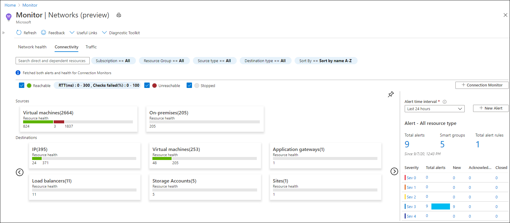
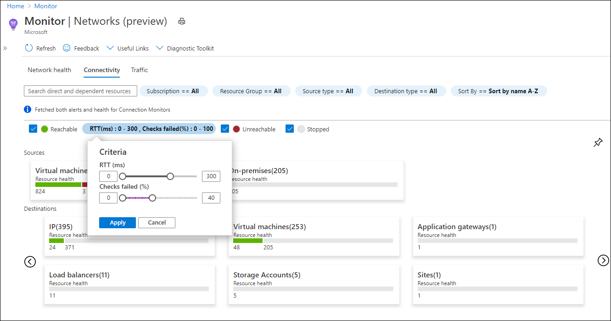
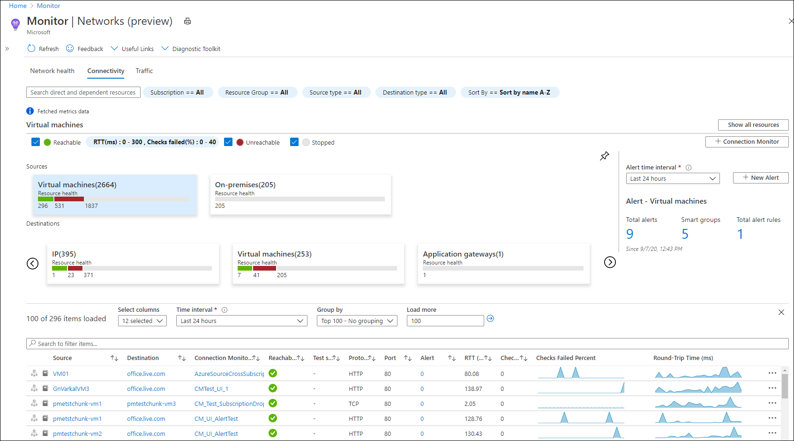
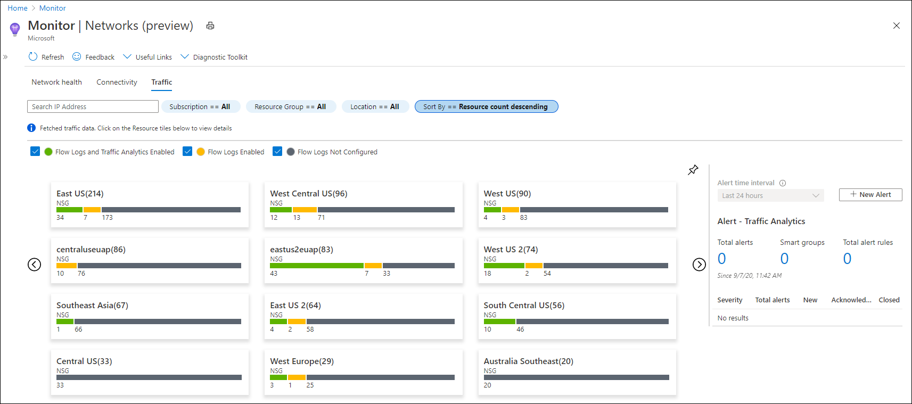
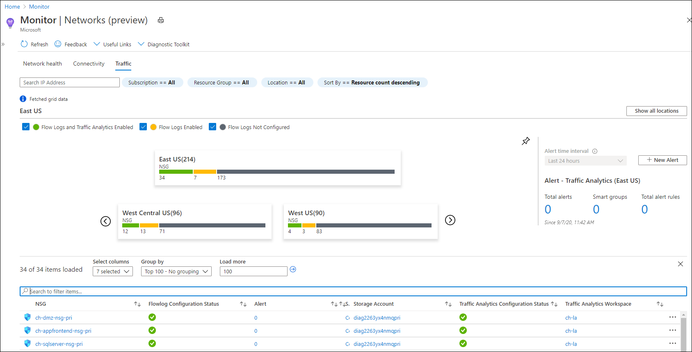
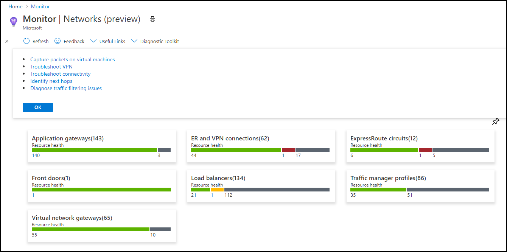

# Azure Monitor for Networks Preview
Azure Monitor for Networks provides a comprehensive view of [health](../../service-health/resource-health-checks-resource-types.md) and [metrics](../platform/metrics-supported.md) for all deployed network resources, without requiring  any configuration. It also provides access to network monitoring capabilities like [Connection Monitor](../../network-watcher/connection-monitor-preview.md), [flow logging for network security groups (NSGs)](../../network-watcher/network-watcher-nsg-flow-logging-overview.md), and [Traffic Analytics](../../network-watcher/traffic-analytics.md). And it provides other network [diagnostic](../../network-watcher/network-watcher-monitoring-overview.md#diagnostics) features.

Azure Monitor for Networks is structured around these key components of monitoring:
- [Network health and metrics](#networkhealth)
- [Connectivity](#connectivity)
- [Traffic](#traffic)
- [Diagnostic Toolkit](#diagnostictoolkit)

## Network health and metrics

The Azure Monitor for Networks **Overview** page provides an easy way to visualize the inventory of your networking resources, together with resource health and alerts. It's divided into four key functional areas: search and filtering, resource health and metrics, alerts, and dependency view.

### Search and filtering
You can customize the resource health and alerts view by using filters like **Subscription**, **Resource Group**, and **Type**.

You can use the search box to search for resources and their associated resources. For example, a public IP is associated with an application gateway. A search for the public IP's DNS name will return both the public IP and the associated application gateway:

### Resource health and metrics
In the following example, each tile represents a resource type. The tile displays the number of instances of that resource type deployed across all selected subscriptions. It also displays the health status of the resource. In this example, there are 105 ER and VPN connections deployed. 103 are healthy, and 2 are unavailable.

If you select the unavailable ER and VPN connections, you'll see a metric view: 

You can select any item in the grid view. Select the icon in the **Health** column to get resource health for that connection. Select the value in the **Alert** column to go to the alerts and metrics page for the connection. 

### Alerts
The **Alert** box on the right side of the page provides a view of all alerts generated for the selected resources across all subscriptions. Select the alert counts to go to a detailed alerts page.

### Dependency view
Dependency view helps you visualize how a resource is configured. Dependency view is currently available for Azure Application Gateway, Azure Virtual WAN, and Azure Load Balancer. For example, for Application Gateway, you can access dependency view by selecting the Application Gateway resource name in the metrics grid view. You can do the same thing for Virtual WAN and Load Balancer.

The dependency view for Application Gateway provides a simplified view of how the front-end IPs are connected to the listeners, rules, and backend pool. The connecting lines are color coded and provide additional details based on the backend pool health. The view also provides a detailed view of Application Gateway metrics and metrics for all related backend pools, like virtual machine scale set and VM instances.

The dependency graph provides easy navigation to configuration settings. Right-click a backend pool to access other information. For example, if the backend pool is a VM, you can directly access VM Insights and Azure Network Watcher connection troubleshooting to identify connectivity issues:

The search and filter bar on the dependency view provides an easy way to search through the graph. For example, if you search for **AppGWTestRule** in the previous example, the view will scale down to all nodes connected via AppGWTestRule:

Various filters help you scale down to a specific path and state. For example, select only **Unhealthy** from the **Health status** list to show all edges for which the state is unhealthy.

Select **View detailed metrics** to open a preconfigured workbook that provides detailed metrics for the application gateway, all backend pool resources, and front-end IPs. 

## Connectivity

The **Connectivity** tab provides an easy way to visualize all tests configured via Connection Monitor and [Connection Monitor (Preview)](../../network-watcher/connection-monitor-preview.md) for the selected set of subscriptions.

Tests are grouped by **Sources** and **Destinations** tiles and display the reachability status for each test. Reachable settings provide easy access to configurations for your reachability criteria, based on checks failed (%) and RTT (ms). After you set the values, the status for each test updates based on the selection criteria.

You can select any source or destination tile to open a metric view:

You can select any item in the grid view. Select the icon in the **Reachability** column to go to the Connection Monitor portal page and view the hop-by-hop topology and connectivity affecting issues identified. Select the value in the **Alert** column to go to alerts. Select the graphs in the **Checks Failed Percent** and **Round-Trip Time (ms)** columns to go to the metrics page for the selected connection monitor.

The **Alert** box on the right side of the page provides a view of all alerts generated for the connectivity tests configured across all subscriptions. Select the alert counts to go to a detailed alerts page.

## Traffic
The **Traffic** tab provides access to all NSGs configured for [NSG flow logs](../../network-watcher/network-watcher-nsg-flow-logging-overview.md) and [Traffic Analytics](../../network-watcher/traffic-analytics.md) for the selected set of subscriptions, grouped by location. The search functionality provided on this tab enables you to identify the NSGs configured for the searched IP address. You can search for any IP address in your environment. The tiled regional view will display all NSGs along with the NSG flow logs and Traffic Analytics configuration status.

If you select any region tile, a grid view appears. The grid provides NSG flow logs and Traffic Analytics in a view that's easy to read and configure:  

You can select any item in the grid view. Select the icon in the **Flowlog Configuration Status** column to edit the NSG flow log and Traffic Analytics configuration. Select the value in the **Alert** column to go to the traffic alerts configured for the selected NSG. Similarly, you can go to the Traffic Analytics view by selecting the **Traffic Analytics Workspace**.  

The **Alert** box on the right side of the page provides a view of all Traffic Analytics workspace-based alerts across all subscriptions. Select the alert counts to go to a detailed alerts page.

##  Diagnostic Toolkit
Diagnostic Toolkit provides access to all the diagnostic features available for troubleshooting the network. You can use this drop-down list to access features like [packet capture](../../network-watcher/network-watcher-packet-capture-overview.md), [VPN troubleshooting](../../network-watcher/network-watcher-troubleshoot-overview.md), [connection troubleshooting](../../network-watcher/network-watcher-connectivity-overview.md), [next hop](../../network-watcher/network-watcher-next-hop-overview.md), and [IP flow verify](../../network-watcher/network-watcher-ip-flow-verify-overview.md):

## Troubleshooting 

For general troubleshooting guidance, see the dedicated workbook-based insights [troubleshooting article](troubleshoot-workbooks.md).

This section will help you diagnose and troubleshoot some common problems you might encounter when you use Azure Monitor for Networks. 

### How do I resolve performance problems or failures?

To learn about troubleshooting any networking-related problems you identify with Azure Monitor for Networks, see the troubleshooting documentation for the malfunctioning resource. 

Here are some links to troubleshooting articles for frequently used services:
* Azure Virtual Network
* Azure Application Gateway
* Azure VPN Gateway
* Azure ExpressRoute 
* Azure Load Balancer 

### Why don't I see the resources for all the subscriptions I've selected?

Network Insights can show resources for only five subscriptions at a time. 

### How do I make changes or add visualizations to Network Insights?

To make changes, select **Edit Mode** to modify the workbook. You can then save your changes as a new workbook that's tied to a designated subscription and resource group.

### What's the time grain after I pin any part of the workbooks?

Network Insights uses the **Auto** time grain, so the time grain is based on the selected time range.

### What's the time range when any part of a workbook is pinned?

The time range depends on the dashboard settings.

### What if I want to see other data or make my own visualizations? How can I make changes to Network Insights?

You can edit the workbook you see in any side-panel or detailed metric view by using the edit mode. You can then save your changes as a new workbook.

## Next steps

- Learn more about network monitoring: [What is Azure Network Watcher?](../../network-watcher/network-watcher-monitoring-overview.md)
- Learn the scenarios workbooks are designed to support, how to create reports and customize existing reports, and more: [Create interactive reports with Azure Monitor workbooks](../platform/workbooks-overview.md)
