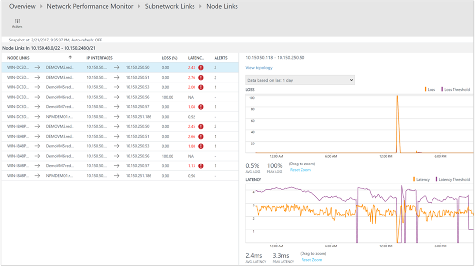

# Network Performance Monitor solution: Performance monitoring

The Performance Monitor capability in [Network Performance Monitor](network-performance-monitor.md) helps you monitor network connectivity across various points in your network. You can monitor cloud deployments and on-premises locations, multiple data centers and branch offices, and mission-critical multitier applications or microservices. With Performance Monitor, you can detect network issues before your users complain. Key advantages are that you can: 

- Monitor loss and latency across various subnets and set alerts.
- Monitor all paths (including redundant paths) on the network.
- Troubleshoot transient and point-in-time network issues, which are difficult to replicate.
- Determine the specific segment on the network, which is responsible for degraded performance.
- Monitor the health of the network, without the need for SNMP.

## Configuration
To open the configuration for Network Performance Monitor, open the [Network Performance Monitor solution](network-performance-monitor.md), and select **Configure**.

### Create new networks

A network in Network Performance Monitor is a logical container for subnets. It helps you organize the monitoring of your network infrastructure according to your needs. You can create a network with a friendly name and add subnets to it according to your business logic. For example, you can create a network named London and add all the subnets in your London data center. Or you can create a network named *ContosoFrontEnd* and add to this network all the subnets named Contoso that serve the front end of your app. The solution automatically creates a default network, which contains all the subnets discovered in your environment. 

Whenever you create a network, you add a subnet to it. Then that subnet is removed from the default network. If you delete a network, all its subnets are automatically returned to the default network. The default network acts as a container for all the subnets that aren't contained in any user-defined network. You can't edit or delete the default network. It always remains in the system. You can create as many custom networks as you need. In most cases, the subnets in your organization are arranged in more than one network. Create one or more networks to group your subnets for your business logic.

To create a new network:

1. Select the **Networks** tab.
1. Select **Add network**, and then enter the network name and description. 
2. Select one or more subnets, and then select **Add**. 
3. Select **Save** to save the configuration. 

### Create monitoring rules 

Performance Monitor generates health events when the threshold of the performance of network connections between two subnetworks or between two networks is breached. The system can learn these thresholds automatically. You also can provide custom thresholds. The system automatically creates a default rule, which generates a health event whenever loss or latency between any pair of network or subnetwork links breaches the system-learned threshold. This process helps the solution monitor your network infrastructure until you haven't created any monitoring rules explicitly. If the default rule is enabled, all the nodes send synthetic transactions to all the other nodes that you enabled for monitoring. The default rule is useful with small networks. An example is a scenario where you have a small number of servers running a microservice and you want to make sure that all the servers have connectivity to each other.

>[!NOTE]
> We recommend that you disable the default rule and create custom monitoring rules, especially with large networks where you use a large number of nodes for monitoring. Custom monitoring rules can reduce the traffic generated by the solution and help you organize the monitoring of your network.

Create monitoring rules according to your business logic. An example is if you want to monitor the performance of the network connectivity of two office sites to headquarters. Group all the subnets in office site1 in network O1. Then group all the subnets in office site2 in network O2. Finally, group all the subnets in the headquarters in network H. Create two monitoring rules--one between O1 and H and the other between O2 and H. 

To create custom monitoring rules:

1. Select **Add Rule** on the **Monitor** tab, and enter the rule name and description.
2. Select the pair of network or subnetwork links to monitor from the lists. 
3. Select the network that contains the subnetworks you want from the network drop-down list. Then select the subnetworks from the corresponding subnetwork drop-down list. If you want to monitor all the subnetworks in a network link, select **All subnetworks**. Similarly, select the other subnetworks you want. To exclude monitoring for particular subnetwork links from the selections you made, select **Add Exception**. 
4. Choose between ICMP and TCP protocols to execute synthetic transactions. 
5. If you don't want to create health events for the items you selected, clear **Enable Health Monitoring on the links covered by this rule**. 
6. Choose monitoring conditions. To set custom thresholds for health-event generation, enter threshold values. Whenever the value of the condition exceeds its selected threshold for the selected network or subnetwork pair, a health event is generated. 
7. Select **Save** to save the configuration. 

After you save a monitoring rule, you can integrate that rule with Alert Management by selecting **Create Alert**. An alert rule is automatically created with the search query. Other required parameters are automatically filled in. Using an alert rule, you can receive e-mail-based alerts, in addition to the existing alerts within Network Performance Monitor. Alerts also can trigger remedial actions with runbooks, or they can integrate with existing service management solutions by using webhooks. Select **Manage Alert** to edit the alert settings. 

You can now create more Performance Monitor rules or move to the solution dashboard to use the capability.

### Choose the protocol

Network Performance Monitor uses synthetic transactions to calculate network performance metrics like packet loss and link latency. To understand this concept better, consider a Network Performance Monitor agent connected to one end of a network link. This Network Performance Monitor agent sends probe packets to a second Network Performance Monitor agent connected to another end of the network. The second agent replies with response packets. This process repeats a few times. By measuring the number of replies and the time taken to receive each reply, the first Network Performance Monitor agent assesses link latency and packet drops. 

The format, size, and sequence of these packets is determined by the protocol that you choose when you create monitoring rules. Based on the protocol of the packets, the intermediate network devices, such as routers and switches, might process these packets differently. Consequently, your protocol choice affects the accuracy of the results. Your protocol choice also determines whether you must take any manual steps after you deploy the Network Performance Monitor solution. 

Network Performance Monitor offers you the choice between ICMP and TCP protocols for executing synthetic transactions. If you choose ICMP when you create a synthetic transaction rule, the Network Performance Monitor agents use ICMP ECHO messages to calculate the network latency and packet loss. ICMP ECHO uses the same message that's sent by the conventional ping utility. When you use TCP as the protocol, Network Performance Monitor agents send TCP SYN packets over the network. This step is followed by a TCP handshake completion, and the connection is removed by using RST packets. 

Consider the following information before you choose a protocol: 

* **Discovery of multiple network routes.** TCP is more accurate when discovering multiple routes, and it needs fewer agents in each subnet. For example, one or two agents that use TCP can discover all redundant paths between subnets. You need several agents that use ICMP to achieve similar results. Using ICMP, if you have a number of routes between two subnets, you need more than 5N agents in either a source or destination subnet.

* **Accuracy of results.** Routers and switches tend to assign lower priority to ICMP ECHO packets compared to TCP packets. In certain situations, when network devices are heavily loaded, the data obtained by TCP more closely reflects the loss and latency experienced by applications. This occurs because most of the application traffic flows over TCP. In such cases, ICMP provides less-accurate results compared to TCP. 

* **Firewall configuration.** TCP protocol requires that TCP packets are sent to a destination port. The default port used by Network Performance Monitor agents is 8084. You can change the port when you configure agents. Make sure that your network firewalls or network security group (NSG) rules (in Azure) allow traffic on the port. You also need to make sure that the local firewall on the computers where agents are installed is configured to allow traffic on this port. You can use PowerShell scripts to configure firewall rules on your computers running Windows, but you need to configure your network firewall manually. In contrast, ICMP doesn't operate by using a port. In most enterprise scenarios, ICMP traffic is permitted through the firewalls to allow you to use network diagnostics tools like the ping utility. If you can ping one machine from another, you can use the ICMP protocol without having to configure firewalls manually.

>[!NOTE] 
> Some firewalls might block ICMP, which might lead to retransmission that results in a large number of events in your security information and event management system. Make sure the protocol that you choose isn't blocked by a network firewall or NSG. Otherwise, Network Performance Monitor can't monitor the network segment. We recommend that you use TCP for monitoring. Use ICMP in scenarios where you can't use TCP, such as when: 
>
> - You use Windows client-based nodes, because TCP raw sockets aren't allowed in Windows clients.
> - Your network firewall or NSG blocks TCP.
> - You don't know how to switch the protocol.

If you chose to use ICMP during deployment, you can switch to TCP at any time by editing the default monitoring rule.

1. Go to **Network Performance** > **Monitor** > **Configure** > **Monitor**. Then select **Default rule**. 
2. Scroll to the **Protocol** section, and select the protocol that you want to use. 
3. Select **Save** to apply the setting. 

Even if the default rule uses a specific protocol, you can create new rules with a different protocol. You can even create a mix of rules where some rules use ICMP and others use TCP. 

## Walkthrough 

Now look at a simple investigation into the root cause for a health event.

On the solution dashboard, a health event shows that a network link is unhealthy. To investigate the issue, select the **Network links being monitored** tile.

The drill-down page shows that the **DMZ2-DMZ1** network link is unhealthy. Select **View subnet links** for this network link. 

The drill-down page shows all the subnetwork links in the **DMZ2-DMZ1** network link. For both subnetwork links, the latency crossed the threshold, which makes the network link unhealthy. You also can see the latency trends of both subnetwork links. Use the time selection control in the graph to focus on the required time range. You can see the time of day when latency reached its peak. Search the logs later for this time period to investigate the issue. Select **View node links** to drill down further. 
 
  

Similar to the previous page, the drill-down page for the particular subnetwork link lists its constituent node links. You can perform similar actions here as you did in the previous step. Select **View topology** to view the topology between the two nodes. 
 
  

All the paths between the two selected nodes are plotted in the topology map. You can visualize the hop-by-hop topology of routes between two nodes on the topology map. It gives you a clear picture of how many routes exist between the two nodes and what paths the data packets take. Network performance bottlenecks are shown in red. To locate a faulty network connection or a faulty network device, look at the red elements on the topology map. 

  

You can review the loss, latency, and the number of hops in each path in the **Action** pane. Use the scrollbar to view the details of the unhealthy paths. Use the filters to select the paths with the unhealthy hop so that the topology for only the selected paths is plotted. To zoom in or out of the topology map, use your mouse wheel. 

In the following image, the root cause of the problem areas to the specific section of the network appear in the red paths and hops. Select a node in the topology map to reveal the properties of the node, which includes the FQDN and IP address. Selecting a hop shows the IP address of the hop. 
 
 

## Next steps
[Search logs](../../azure-monitor/log-query/log-query-overview.md) to view detailed network performance data records.
