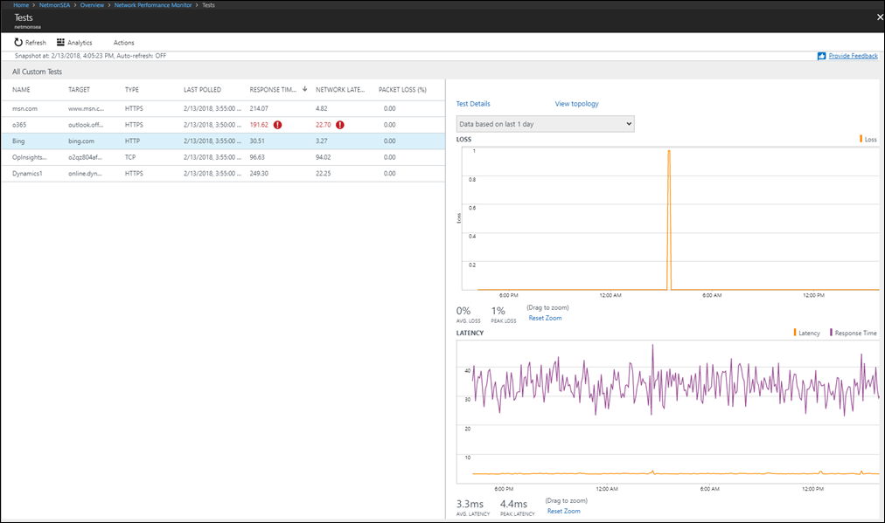
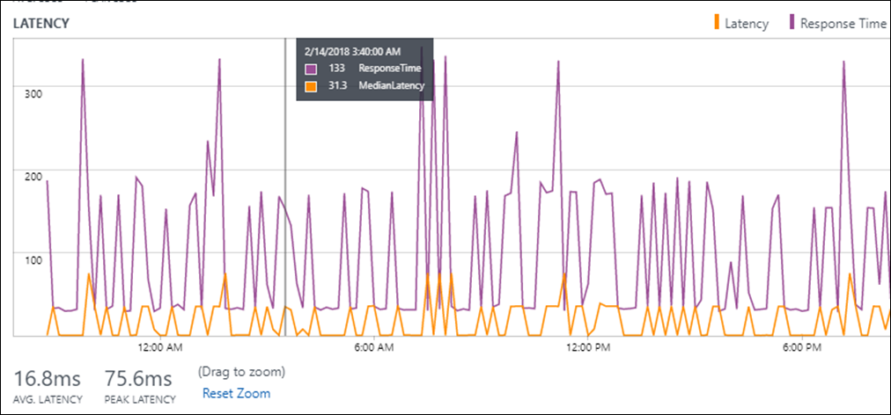

# Service Connectivity Monitor

You can use the Service Connectivity Monitor capability in [Network Performance Monitor](network-performance-monitor.md) to monitor network connectivity to any endpoint that has an open TCP port. Such endpoints include websites, SaaS applications, PaaS applications, and SQL databases. 

You can perform the following functions with Service Connectivity Monitor: 

- Monitor the network connectivity to your applications and network services from multiple branch offices or locations. Applications and network services include Office 365, Dynamics CRM, internal line-of-business applications, and SQL databases.
- Use built-in tests to monitor network connectivity to Office 365 and Dynamics 365 endpoints. 
- Determine the response time, network latency, and packet loss experienced when connecting to the endpoint.
- Determine whether poor application performance is because of the network or because of some issue on the application provider's end.
- Identify hot spots on the network that might be causing poor application performance by viewing the latency contributed by each hop on a topology map.


## Configuration 
To open the configuration for Network Performance Monitor, open the [Network Performance Monitor solution](network-performance-monitor.md) and select **Configure**.


### Configure Log Analytics agents for monitoring
Enable the following firewall rules on the nodes used for monitoring so that the solution can discover the topology from your nodes to the service endpoint: 

```
netsh advfirewall firewall add rule name="NPMDICMPV4Echo" protocol="icmpv4:8,any" dir=in action=allow 
netsh advfirewall firewall add rule name="NPMDICMPV6Echo" protocol="icmpv6:128,any" dir=in action=allow 
netsh advfirewall firewall add rule name="NPMDICMPV4DestinationUnreachable" protocol="icmpv4:3,any" dir=in action=allow 
netsh advfirewall firewall add rule name="NPMDICMPV6DestinationUnreachable" protocol="icmpv6:1,any" dir=in action=allow 
netsh advfirewall firewall add rule name="NPMDICMPV4TimeExceeded" protocol="icmpv4:11,any" dir=in action=allow 
netsh advfirewall firewall add rule name="NPMDICMPV6TimeExceeded" protocol="icmpv6:3,any" dir=in action=allow 
```

### Create Service Connectivity Monitor tests 

Start creating your tests to monitor network connectivity to the service endpoints.

1. Select the **Service Connectivity Monitor** tab.
2. Select **Add Test**, and enter the test name and description. You can create maximum 450 tests per workspace. 
3. Select the type of test:<br>

    * Select **Web** to monitor connectivity to a service that responds to HTTP/S requests, such as outlook.office365.com or bing.com.<br>
    * Select **Network** to monitor connectivity to a service that responds to TCP requests but doesn't respond to HTTP/S requests, such as a SQL server, FTP server, or SSH port. 
    * For example: To create a web test to a blob storage account, select **Web** and enter target as *yourstorageaccount*.blob.core.windows.net. Similarly you can create tests for other table storage, queue storage and Azure Files using [this link.](https://docs.microsoft.com/azure/storage/common/storage-account-overview#storage-account-endpoints)
4. If you don't want to perform network measurements, such as network latency, packet loss, and topology discovery, clear the **Perform network measurements** check box. Keep it selected to get maximum benefit from the capability. 
5. In **Target**, enter the URL/FQDN/IP address to which you want to monitor network connectivity.
6. In **Port number**, enter the port number of the target service. 
7. In **Test Frequency**, enter a value for how frequently you want the test to run. 
8. Select the nodes from which you want to monitor the network connectivity to service. Ensure that the number of agents added per test is less than 150. Any agent can test maximum 150 endpoints/agents.

    >[!NOTE]
    > For Windows server-based nodes, the capability uses TCP-based requests to perform the network measurements. For Windows client-based nodes, the capability uses ICMP-based requests to perform the network measurements. In some cases, the target application blocks incoming ICMP-based requests when the nodes are Windows client-based. The solution is unable to perform network measurements. We recommend that you use Windows server-based nodes in such cases. 

9. If you don't want to create health events for the items you select, clear **Enable Health Monitoring in the targets covered by this test**. 
10. Choose monitoring conditions. You can set custom thresholds for health-event generation by entering threshold values. Whenever the value of the condition goes above its selected threshold for the selected network or subnetwork pair, a health event is generated. 
11. Select **Save** to save the configuration. 

    


## Walkthrough 

Go to the Network Performance Monitor dashboard view. To get a summary of the health of the different tests you created, look at the **Service Connectivity Monitor** page. 


Select the tile to view the details of the tests on the **Tests** page. In the table on the left, you can view the point-in-time health and value of the service response time, network latency, and packet loss for all the tests. Use the Network State Recorder control to view the network snapshot at another time in the past. Select the test in the table that you want to investigate. In the charts in the pane on the right, you can view the historical trend of the loss, latency, and response time values. Select the **Test Details** link to view the performance from each node.



In the **Test Nodes** view, you can observe the network connectivity from each node. Select the node that has performance degradation. This is the node where the application is observed to be running slow.

Determine whether poor application performance is because of the network or an issue on the application provider's end by observing the correlation between the response time of the application and the network latency. 

* **Application issue:** A spike in the response time but consistency in the network latency suggests that the network is working fine and the problem might be due to an issue on the application end. 

    

* **Network issue:** A spike in response time accompanied with a corresponding spike in network latency suggests that the increase in response time might be due to an increase in network latency. 

    

After you determine that the problem is because of the network, select the **Topology** view link to identify the troublesome hop on the topology map. An example is shown in the following image. Out of the 105-ms total latency between the node and the application endpoint, 96 ms is because of the hop marked in red. After you identify the troublesome hop, you can take corrective action. 


## Diagnostics 

If you observe an abnormality, follow these steps:

* If the service response time, network loss, and latency are shown as NA, one or more of the following reasons might be the cause:

    - The application is down.
    - The node used for checking network connectivity to the service is down.
    - The target entered in the test configuration is incorrect.
    - The node doesn't have any network connectivity.

* If a valid service response time is shown but network loss as well as latency are shown as NA, one or more of the following reasons might be the cause:

    - If the node used for checking network connectivity to the service is a Windows client machine, either the target service is blocking ICMP requests or a network firewall is blocking ICMP requests that originate from the node.
    - The **Perform network measurements** check box is blank in the test configuration. 

* If the service response time is NA but network loss as well as latency are valid, the target service might not be a web application. Edit the test configuration, and choose the test type as **Network** instead of **Web**. 

* If the application is running slow, determine whether poor application performance is because of the network or an issue on the application provider's end.

## GCC Office URLs for US Government customers
For US Government Virginia region, only DOD URLs are built-in NPM. Customers using GCC URLs need to create custom tests and add each URL individually.

| Field | GCC |
|:---   |:--- |
| Office 365 Portal and shared | portal.apps.mil |
| Office 365 auth and identity | * login.microsoftonline.us <br> * api.login.microsoftonline.com <br> * clientconfig.microsoftonline-p.net <br> * login.microsoftonline.com <br> * login.microsoftonline-p.com <br> * login.windows.net <br> * loginex.microsoftonline.com <br> * login-us.microsoftonline.com <br> * nexus.microsoftonline-p.com <br> * mscrl.microsoft.com <br> * secure.aadcdn.microsoftonline-p.com |
| Office Online | * adminwebservice.gov.us.microsoftonline.com <br>  * adminwebservice-s1-bn1a.microsoftonline.com <br> * adminwebservice-s1-dm2a.microsoftonline.com <br> * becws.gov.us.microsoftonline.com <br> * provisioningapi.gov.us.microsoftonline.com <br> * officehome.msocdn.us <br> * prod.msocdn.us <br> * portal.office365.us <br> * webshell.suite.office365.us <br> * www .office365.us <br> * activation.sls.microsoft.com <br> * crl.microsoft.com <br> * go.microsoft.com <br> * insertmedia.bing.office.net <br> * ocsa.officeapps.live.com <br> * ocsredir.officeapps.live.com <br> * ocws.officeapps.live.com <br> * office15client.microsoft.com <br>* officecdn.microsoft.com <br> * officecdn.microsoft.com.edgesuite.net <br> * officepreviewredir.microsoft.com <br> * officeredir.microsoft.com <br> * ols.officeapps.live.com  <br> * r.office.microsoft.com <br> * cdn.odc.officeapps.live.com <br> * odc.officeapps.live.com <br> * officeclient.microsoft.com |
| Exchange Online | * outlook.office365.us <br> * attachments.office365-net.us <br> * autodiscover-s.office365.us <br> * manage.office365.us <br> * scc.office365.us |
| MS Teams | gov.teams.microsoft.us | 

## Next steps
[Search logs](../../azure-monitor/log-query/log-query-overview.md) to view detailed network performance data records.
