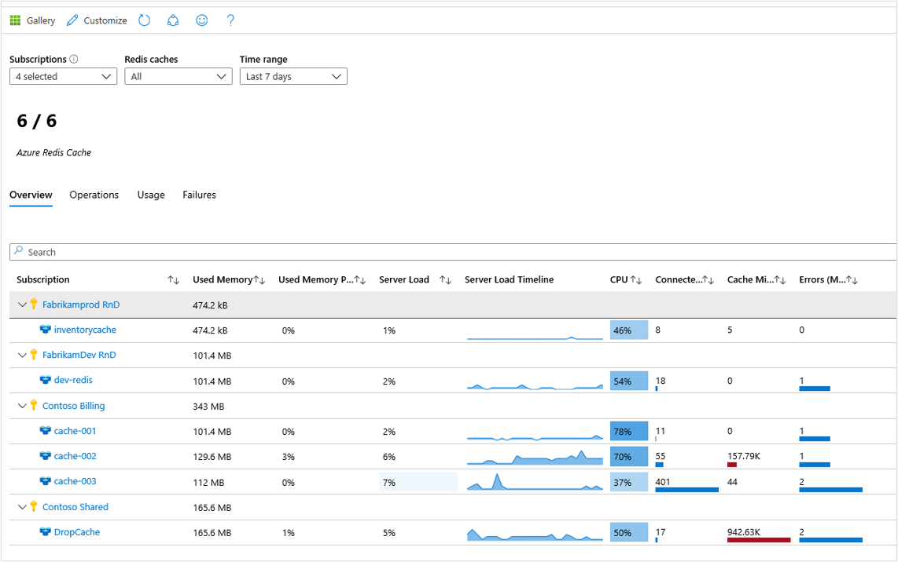
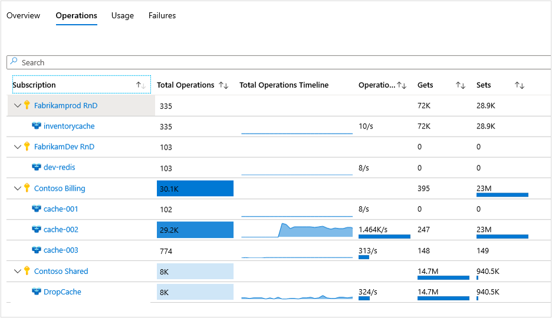
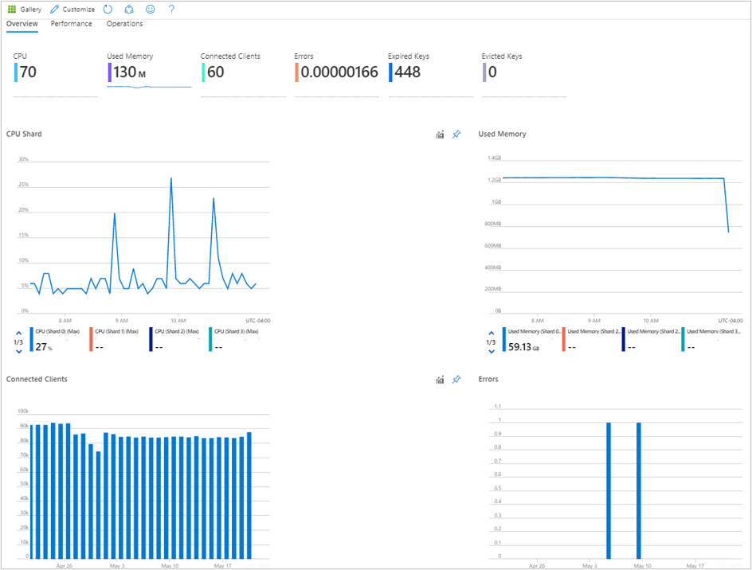
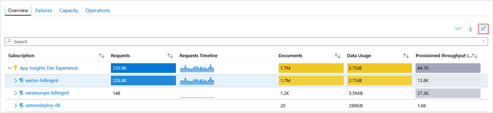

# Explore Azure Monitor for Azure Cache for Redis (preview)

For all of your Azure Cache for Redis resources, Azure Monitor for Azure Cache for Redis (preview) provides a unified, interactive view of:

- Overall performance
- Failures
- Capacity
- Operational health

This article helps you understand the benefits of this new monitoring experience. It also shows how to modify and adapt the experience to fit the unique needs of your organization.

## Introduction

Before starting the experience, you should understand how Azure Monitor for Azure Cache for Redis visually presents information.

It delivers:

- **At scale perspective** of your Azure Cache for Redis resources in a single location across all of your subscriptions. You can selectively scope to only the subscriptions and resources you want to evaluate.

- **Drill-down analysis** of a particular Azure Cache for Redis resource. You can diagnose problems and see detailed analysis of utilization, failures, capacity, and operations. Select any of these categories to see an in-depth view of  relevant information.  

- **Customization** of this experience, which is built atop Azure Monitor workbook templates. The experience lets you change what metrics are displayed and modify or set thresholds that align with your limits. You can save the changes in a custom workbook and then pin workbook charts to Azure dashboards.

This feature doesn't require you to enable or configure anything. Azure Cache for Redis information is collected by default.

>[!NOTE]
>There is no charge to access this feature. You're charged only for the Azure Monitor essential features you configure or enable, as described on the [Azure Monitor pricing details](https://azure.microsoft.com/pricing/details/monitor/) page.

## View utilization and performance metrics for Azure Cache for Redis

To view the utilization and performance of your storage accounts across all of your subscriptions, do the following steps:

1. Sign in to the [Azure portal](https://portal.azure.com).

1. Search for **Monitor**, and select **Monitor**.

    

1. Select **Azure Cache for Redis (preview)**. If this option isn't present, select **More** > **Azure Cache for Redis**.

### Overview

On **Overview**, the table displays interactive Azure Cache for Redis metrics. You can filter the results based on the options you select from the following drop-down lists:

- **Subscriptions**: Only subscriptions that have an Azure Cache for Redis resource are listed.  

- **Azure Cache for Redis**: You can select all, a subset, or a single Azure Cache for Redis resource.

- **Time Range**: By default, the table displays the last four hours of information based on the corresponding selections.

There's a counter tile under the drop-down lists. The tile shows the total number of Azure Cache for Redis resources in the selected subscriptions. Conditional color codes or heat maps for workbook columns report transaction metrics. The deepest color represents the highest value. Lighter colors represent lower values.

Selecting a drop-down list arrow next to one of the Azure Cache for Redis resources reveals a breakdown of the performance metrics at the individual resource level.

When you select the Azure Cache for Redis resource name highlighted in blue, you see the default **Overview** table for the associated account. It shows these columns:

- **Used Memory**
- **Used Memory Percentage**
- **Server Load**
- **Server Load Timeline**
- **CPU**
- **Connected Clients**
- **Cache Misses**
- **Errors (Max)**

### Operations

When you select **Operations** at the top of the page, the **Operations** table of the workbook template opens. It shows these columns:

- **Total Operations**
- **Total Operations Timeline**
- **Operations Per Second**
- **Gets**
- **Sets**

### Usage

When you select **Usage** at the top of the page, the **Usage** table of the workbook template opens. It shows these columns:

- **Cache Read**
- **Cache Read Timeline**
- **Cache Write**
- **Cache Hits**
- **Cache Misses**

### Failures

When you select **Failures** at the top of the page, the **Failures** table of the workbook template opens. It shows these columns:

- **Total Errors**
- **Failover/Errors**
- **UnresponsiveClient/Errors**
- **RDB/Errors**
- **AOF/Errors**
- **Export/Errors**
- **Dataloss/Errors**
- **Import/Errors**

### Metric definitions

For a full list of the metric definitions that form these workbooks, check out the [article on available metrics and reporting intervals](https://docs.microsoft.com/azure/azure-cache-for-redis/cache-how-to-monitor#available-metrics-and-reporting-intervals).

## View from an Azure Cache for Redis resource

To access Azure Monitor for Azure Cache for Redis directly from an individual resource:

1. In the Azure portal, select Azure Cache for Redis.

2. From the list, choose an individual Azure Cache for Redis resource. In the monitoring section, choose Insights (preview).

    

These views are also accessible by selecting the resource name of an Azure Cache for Redis resource from the Azure Monitor level workbook.

### Resource-level overview

On the **Overview** workbook for the Azure Redis Cache, it shows several performance metrics that give you access to:

- Interactive performance charts showing the most essential details related to Azure Cache for Redis performance.

- Metrics and status tiles highlighting shard performance, total number of connected clients, and overall latency.

Selecting any of the other tabs for **Performance** or **Operations** opens the respective workbooks.

### Resource-level performance

### Resource-level operations

## Pin, export, and expand

To pin any metric section to an [Azure dashboard](https://docs.microsoft.com/azure/azure-portal/azure-portal-dashboards), select the pushpin symbol in the section's upper right.

To export your data into an Excel format, select the down arrow symbol to the left of the pushpin symbol.

To expand or collapse all views in a workbook, select the expand symbol to the left of the export symbol.

## Customize Azure Monitor for Azure Cache for Redis (preview)

Because this experience is built atop Azure Monitor workbook templates, you can select **Customize** > **Edit** > **Save** to save a copy of your modified version into a custom workbook.

Workbooks are saved within a resource group in either the **My Reports** section or the **Shared Reports** section. **My Reports** is available only to you. **Shared Reports** is available to everyone with access to the resource group.

After you save a custom workbook, go to the workbook gallery to open it.

## Next steps

* Configure [metric alerts](../platform/alerts-metric.md) and [service health notifications](../../service-health/alerts-activity-log-service-notifications.md) to set up automated alerts that aid in detecting problems.

* Learn the scenarios that workbooks support, how to author or customize reports, and more by reviewing [Create interactive reports with Azure Monitor workbooks](../platform/workbooks-overview.md).
