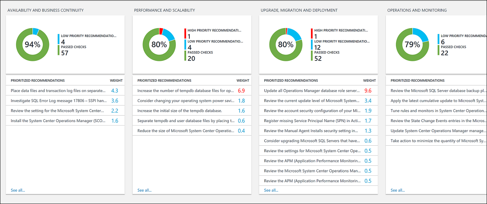
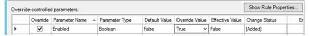
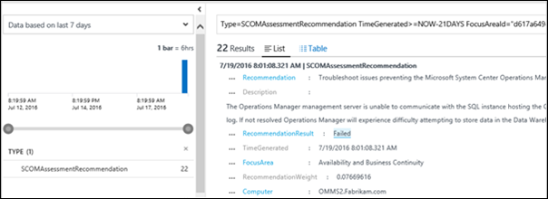

# Optimize your environment with the System Center Operations Manager Health Check (Preview) solution


You can use the System Center Operations Manager Health Check solution to assess the risk and health of your System Center Operations Manager management group on a regular interval. This article helps you install, configure, and use the solution so that you can take corrective actions for potential problems.

This solution provides a prioritized list of recommendations specific to your deployed server infrastructure. The recommendations are categorized across four focus areas, which help you quickly understand the risk and take corrective action.

The recommendations made are based on the knowledge and experience gained by Microsoft engineers from thousands of customer visits. Each recommendation provides guidance about why an issue might matter to you and how to implement the suggested changes.

You can choose focus areas that are most important to your organization and track your progress toward running a risk free and healthy environment.

After you've added the solution and an assessment is performed, summary information for focus areas is shown on the **System Center Operations Manager Health Check** dashboard for your infrastructure. The following sections describe how to use the information on the **System Center Operations Manager Health Check** dashboard, where you can view and then take recommended actions for your Operations Manager environment.




## Installing and configuring the solution

The solution works with Microsoft System Center 2012 Operations Manager Service Pack 1, Microsoft System Center 2012 R2 Operations Manager, Microsoft System Center 2016 Operations Manager, Microsoft System Center 2016 Operations Manager and Microsoft System Center Operations Manager 1807. A supported version of .NET Framework 4.6.2 must be installed on each management server.

Use the following information to install and configure the solution.

- Before you can use the Health Check solution in Log Analytics, you must have the solution installed. Install the solution from [Azure marketplace](https://azuremarketplace.microsoft.com/marketplace/apps/Microsoft.SCOMAssessmentOMS?tab=Overview).

- After adding the solution to the workspace, the **System Center Operations Manager Health Check** tile on the dashboard displays an additional configuration required message. Click on the tile and follow the configuration steps mentioned in the page

  

> [!NOTE]
> Configuration of System Center Operations Manager can be done using a script by following the steps mentioned in the configuration page of the solution in Log Analytics.

 To configure the assessment through Operations Manager Operations console, perform the steps below in the following order:
1. [Set the Run As account for System Center Operations Manager Health Check](#operations-manager-run-as-accounts-for-log-analytics)  
2. Configure the System Center Operations Manager Health Check rule

## System Center Operations Manager Health Check data collection details

The System Center Operations Manager Health Check solution collects data from the following sources:

* Registry
* Windows Management Instrumentation (WMI)
* Event log
* File data
* Directly from Operations Manager using PowerShell and SQL queries, from a management server that you have specified.  

Data is collected on the management server and forwarded to Log Analytics every seven days.  

## Operations Manager run-as accounts for Log Analytics

Log Analytics builds on management packs for workloads to provide value-add services. Each workload requires workload-specific privileges to run management packs in a different security context, such as a domain user account. Configure an Operations Manager Run As account with privileged credentials. For additional information, see [How to create a Run As account](/previous-versions/system-center/system-center-2012-R2/hh321655(v=sc.12)) in the Operations Manager documentation.

Use the following information to set the Operations Manager Run As account for System Center Operations Manager Health Check.

### Set the Run As account

The Run As account must meet following requirements before proceeding:

* A domain user account that is a member of the local Administrators group on all servers supporting any Operations Manager role - Management server, SQL Server hosting the operational, data warehouse and ACS database, Reporting, Web console, and Gateway server.
* Operation Manager Administrator Role for the management group being assessed
* If the account does not have SQL sysadmin rights, then execute the [script](#sql-script-to-grant-granular-permissions-to-the-run-as-account) to grant granular permissions to the account on each SQL Server instance hosting one or all of the Operations Manager databases.

1. In the Operations Manager Console, select the **Administration** navigation button.
2. Under **Run As Configuration**, click **Accounts**.
3. In the **Create Run As Account** Wizard, on the **Introduction** page click **Next**.
4. On the **General Properties** page, select **Windows** in the **Run As Account type:** list.
5. Type a display name in the **Display Name** text box and optionally type a description in the **Description** box, and then click **Next**.
6. On the **Distribution Security** page, select **More secure**.
7. Click **Create**.  

Now that the Run As account is created, it needs to target management servers in the management group and associated with a pre-defined Run As profile so workflows will run using the credentials.  

1. Under **Run As Configuration**, **Accounts**, in the results pane, double-click the account you created earlier.
2. On the **Distribution** tab, click **Add** for the **Selected computers** box and add the management server to distribute the account to.  Click **OK** twice to save your changes.
3. Under **Run As Configuration**, click **Profiles**.
4. Search for the *SCOM Assessment Profile*.
5. The profile name should be: *Microsoft System Center Operations Manager Health Check Run As Profile*.
6. Right-click and update its properties and add the recently created Run As Account you created earlier.

### SQL script to grant granular permissions to the Run As account

Execute the following SQL script to grant required permissions to the Run As account on the SQL Server instance used by Operations Manager hosting the operational, data warehouse, and ACS database.

```
-- Replace <UserName> with the actual user name being used as Run As Account.
USE master

-- Create login for the user, comment this line if login is already created.
CREATE LOGIN [UserName] FROM WINDOWS


--GRANT permissions to user.
GRANT VIEW SERVER STATE TO [UserName]
GRANT VIEW ANY DEFINITION TO [UserName]
GRANT VIEW ANY DATABASE TO [UserName]

-- Add database user for all the databases on SQL Server Instance, this is required for connecting to individual databases.
-- NOTE: This command must be run anytime new databases are added to SQL Server instances.
EXEC sp_msforeachdb N'USE [?]; CREATE USER [UserName] FOR LOGIN [UserName];'

Use msdb
GRANT SELECT To [UserName]
Go

--Give SELECT permission on all Operations Manager related Databases

--Replace the Operations Manager database name with the one in your environment
Use [OperationsManager];
GRANT SELECT To [UserName]
GO

--Replace the Operations Manager DatawareHouse database name with the one in your environment
Use [OperationsManagerDW];
GRANT SELECT To [UserName]
GO

--Replace the Operations Manager Audit Collection database name with the one in your environment
Use [OperationsManagerAC];
GRANT SELECT To [UserName]
GO

--Give db_owner on [OperationsManager] DB
--Replace the Operations Manager database name with the one in your environment
USE [OperationsManager]
GO
ALTER ROLE [db_owner] ADD MEMBER [UserName]

```

### Configure the health check rule

The System Center Operations Manager Health Check solution’s management pack includes a rule named *Microsoft System Center Operations Manager Run Health Check Rule*. This rule is responsible for running the health check. To enable the rule and configure the frequency, use the procedures below.

By default, the Microsoft System Center Operations Manager Run Health Check Rule is disabled. To run the health check, you must enable the rule on a management server. Use the following steps.

#### Enable the rule for a specific management server

1. In the **Authoring** workspace of the Operations Manager Operations console, search for the rule *Microsoft System Center Operations Manager Run Health Check Rule* in the **Rules** pane.
2. In the search results, select the one that includes the text *Type: Management Server*.
3. Right-click the rule and then click **Overrides** > **For a specific object of class: Management Server**.
4.	In the available management servers list, select the management server where the rule should run.  This should be the same management server you configured earlier to associate the Run As account with.
5.	Ensure that you change override value to **True** for the **Enabled** parameter value.<br><br> 

    While still in this window, configure the run frequency using the next procedure.

#### Configure the run frequency

The assessment is configured to run every 10,080 minutes (or seven days) by default. You can override the value to a minimum value of 1440 minutes (or one day). The value represents the minimum time gap required between successive assessment runs. To override the interval, use the steps below.

1. In the **Authoring** workspace of the Operations Manager console, search for the rule *Microsoft System Center Operations Manager Run Health Check Rule* in the **Rules** section.
2. In the search results, select the one that includes the text *Type: Management Server*.
3. Right-click the rule and then click **Override the Rule** > **For all objects of class: Management Server**.
4. Change the **Interval** parameter value to your desired interval value. In the example below, the value is set to 1440 minutes (one day).<br><br> <br>  

    If the value is set to less than 1440 minutes, then the rule runs on a one day interval. In this example, the rule ignores the interval value and runs at a frequency of one day.


## Understanding how recommendations are prioritized

Every recommendation made is given a weighting value that identifies the relative importance of the recommendation. Only the 10 most important recommendations are shown.

### How weights are calculated

Weightings are aggregate values based on three key factors:

- The *probability* that an issue identified will cause problems. A higher probability equates to a larger overall score for the recommendation.
- The *impact* of the issue on your organization if it does cause a problem. A higher impact equates to a larger overall score for the recommendation.
- The *effort* required to implement the recommendation. A higher effort equates to a smaller overall score for the recommendation.

The weighting for each recommendation is expressed as a percentage of the total score available for each focus area. For example, if a recommendation in the Availability and Business Continuity focus area has a score of 5%, implementing that recommendation increases your overall Availability and Business Continuity score by 5%.

### Focus areas

**Availability and Business Continuity** - This focus area shows recommendations for service availability, resiliency of your infrastructure, and business protection.

**Performance and Scalability** - This focus area shows recommendations to help your organization's IT infrastructure grow, ensure that your IT environment meets current performance requirements, and is able to respond to changing infrastructure needs.

**Upgrade, Migration, and Deployment** - This focus area shows recommendations to help you upgrade, migrate, and deploy SQL Server to your existing infrastructure.

**Operations and Monitoring** - This focus area shows recommendations to help streamline your IT operations, implement preventative maintenance, and maximize performance.

### Should you aim to score 100% in every focus area?

Not necessarily. The recommendations are based on the knowledge and experiences gained by Microsoft engineers across thousands of customer visits. However, no two server infrastructures are the same, and specific recommendations may be more or less relevant to you. For example, some security recommendations might be less relevant if your virtual machines are not exposed to the Internet. Some availability recommendations may be less relevant for services that provide low priority ad hoc data collection and reporting. Issues that are important to a mature business may be less important to a start-up. You may want to identify which focus areas are your priorities and then look at how your scores change over time.

Every recommendation includes guidance about why it is important. Use this guidance to evaluate whether implementing the recommendation is appropriate for you, given the nature of your IT services and the business needs of your organization.

## Use health check focus area recommendations

Before you can use a health check solution in Log Analytics, you must have the solution installed. To read more about installing solutions, see [Install a management solution](./solutions.md). After it is installed, you can view the summary of recommendations by using the System Center Operations Manager Health Check tile on the **Overview** page for your workspace in the Azure portal.

View the summarized compliance assessments for your infrastructure and then drill-into recommendations.

### To view recommendations for a focus area and take corrective action
1. Log in to the Azure portal at [https://portal.azure.com](https://portal.azure.com).
2. In the Azure portal, click **More services** found on the lower left-hand corner. In the list of resources, type **Log Analytics**. As you begin typing, the list filters based on your input. Select **Log Analytics**.
3. In the Log Analytics subscriptions pane, select a workspace and then click the **Workspace summary (deprecated)** menu item.  
4. On the **Overview** page, click the **System Center Operations Manager Health Check** tile.
5. On the **System Center Operations Manager Health Check** page, review the summary information in one of the focus area sections and then click one to view recommendations for that focus area.
6. On any of the focus area pages, you can view the prioritized recommendations made for your environment. Click a recommendation under **Affected Objects** to view details about why the recommendation is made.<br><br> <br>
7. You can take corrective actions suggested in **Suggested Actions**. When the item has been addressed, later assessments will record that recommended actions were taken and your compliance score will increase. Corrected items appear as **Passed Objects**.

## Ignore recommendations

If you have recommendations that you want to ignore, you can create a text file that Log Analytics uses to prevent recommendations from appearing in your assessment results.

### To identify recommendations that you want to ignore
1. In the Azure portal on the Log Analytics workspace page for your selected workspace, click the **Log Search** menu item.
2. Use the following query to list recommendations that have failed for computers in your environment.

    ```
    Type=SCOMAssessmentRecommendationRecommendationResult=Failed | select Computer, RecommendationId, Recommendation | sort Computer
    ```

    >[!NOTE]
    > If your workspace has been upgraded to the [new Log Analytics query language](../logs/log-query-overview.md), then the above query would change to the following.
    >
    > `SCOMAssessmentRecommendationRecommendation | where RecommendationResult == "Failed" | sort by Computer asc | project Computer, RecommendationId, Recommendation`

    Here's a screenshot showing the Log Search query:<br><br> <br>

3. Choose recommendations that you want to ignore. You'll use the values for RecommendationId in the next procedure.

### To create and use an IgnoreRecommendations.txt text file

1. Create a file named IgnoreRecommendations.txt.
2. Paste or type each RecommendationId for each recommendation that you want Log Analytics to ignore on a separate line and then save and close the file.
3. Put the file in the following folder on each computer where you want Log Analytics to ignore recommendations.
4. On the Operations Manager management server - *SystemDrive*:\Program Files\Microsoft System Center 2012 R2\Operations Manager\Server.

### To verify that recommendations are ignored

1. After the next scheduled assessment runs, by default every seven days, the specified recommendations are marked Ignored and will not appear on the health check dashboard.
2. You can use the following Log Search queries to list all the ignored recommendations.

    ```
    Type=SCOMAssessmentRecommendationRecommendationResult=Ignored | select  Computer, RecommendationId, Recommendation | sort  Computer
    ```

    >[!NOTE]
    > If your workspace has been upgraded to the [new Log Analytics query language](../logs/log-query-overview.md), then the above query would change to the following.
    >
    > `SCOMAssessmentRecommendationRecommendation | where RecommendationResult == "Ignore" | sort by Computer asc | project Computer, RecommendationId, Recommendation`

3. If you decide later that you want to see ignored recommendations, remove any IgnoreRecommendations.txt files, or you can remove RecommendationIDs from them.

## Frequently asked questions

*I added the Health Check solution to my Log Analytics workspace. But I don’t see the recommendations. Why not?* After adding the solution, use the following steps view the recommendations on the Log Analytics dashboard.  

- [Set the Run As account for System Center Operations Manager Health Check](#operations-manager-run-as-accounts-for-log-analytics)  
- [Configure the System Center Operations Manager Health Check rule](#configure-the-health-check-rule)


*Is there a way to configure how often the check runs?* Yes. See [Configure the run frequency](#configure-the-run-frequency).

*If another server is discovered after I’ve added the System Center Operations Manager Health Check solution, will it be checked?* Yes, after discovery it is checked from then on, by default every seven days.

*What is the name of the process that does the data collection?* AdvisorAssessment.exe

*Where does the AdvisorAssessment.exe process run?* AdvisorAssessment.exe runs under the HealthService process of the management server where the health check rule is enabled. Using that process, discovery of your entire environment is achieved through remote data collection.

*How long does it take for data collection?* Data collection on the server takes about one hour. It may take longer in environments that have many Operations Manager instances or databases.

*What if I set the interval of the assessment to less than 1440 minutes?* The assessment is pre-configured to run at a maximum of once per day. If you override the interval value to a value less than 1440 minutes, then the assessment uses 1440 minutes as the interval value.

*How to know if there are prerequisite failures?* If the health check ran and you don't see results, then it is likely that some of the prerequisites for the check failed. You can execute queries: `Operation Solution=SCOMAssessment` and `SCOMAssessmentRecommendation FocusArea=Prerequisites` in Log Search to see the failed prerequisites.

*There is a `Failed to connect to the SQL Instance (….).` message in prerequisite failures. What is the issue?* AdvisorAssessment.exe, the process that collects data, runs under the HealthService process on the management server. As part of the health check, the process attempts to connect to the SQL Server where the Operations Manager database is present. This error can occur when firewall rules block the connection to the SQL Server instance.

*What type of data is collected?* The following types of data are collected: - WMI data - Registry data - EventLog data - Operations Manager data through Windows PowerShell, SQL Queries and File information collector.

*Why do I have to configure a Run As Account?* With Operations Manager, various SQL queries are run. In order for them to run, you must use a Run As Account with necessary permissions. In addition, local administrator credentials are required to query WMI.

*Why display only the top 10 recommendations?* Instead of giving you an exhaustive, overwhelming list of tasks, we recommend that you focus on addressing the prioritized recommendations first. After you address them, additional recommendations will become available. If you prefer to see the detailed list, you can view all recommendations using Log Search.

*Is there a way to ignore a recommendation?* Yes, see the [Ignore recommendations](#ignore-recommendations).


## Next steps

- [Search logs](../logs/log-query-overview.md) to learn how to analyze detailed System Center Operations Manager Health Check data and recommendations.

