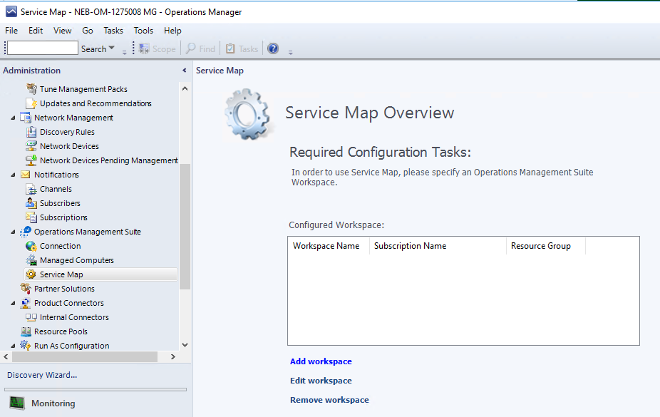
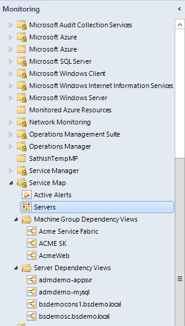

# Service Map integration with System Center Operations Manager

Service Map automatically discovers application components on Windows and Linux systems and maps the communication between services. Service Map allows you to view your servers the way you think of them, as interconnected systems that deliver critical services. Service Map shows connections between servers, processes, and ports across any TCP-connected architecture, with no configuration required besides the installation of an agent. For more information, see the [Service Map documentation]( service-map.md).

With this integration between Service Map and System Center Operations Manager, you can automatically create distributed application diagrams in Operations Manager that are based on the dynamic dependency maps in Service Map.

## Prerequisites
* An Operations Manager management group (2012 R2 or later) that is managing a set of servers.
* A Log Analytics workspace with the Service Map solution enabled.
* A set of servers (at least one) that are being managed by Operations Manager and sending data to Service Map. Windows and Linux servers are supported.
* A service principal with access to the Azure subscription that is associated with the Log Analytics workspace. For more information, go to [Create a service principal](#create-a-service-principal).

## Install the Service Map management pack
You enable the integration between Operations Manager and Service Map by importing the Microsoft.SystemCenter.ServiceMap management pack bundle (Microsoft.SystemCenter.ServiceMap.mpb). You can download the management pack bundle from the [Microsoft Download Center](https://www.microsoft.com/download/details.aspx?id=55763). The bundle contains the following management packs:
* Microsoft Service Map Application Views
* Microsoft System Center Service Map Internal
* Microsoft System Center Service Map Overrides
* Microsoft System Center Service Map

## Configure the Service Map integration
After you install the Service Map management pack, a new node, **Service Map**, is displayed under **Operations Management Suite** in the **Administration** pane.

>[!NOTE]
>[Operations Management Suite was a collection of services](https://github.com/MicrosoftDocs/azure-docs-pr/pull/azure-monitor/azure-monitor-rebrand.md#retirement-of-operations-management-suite-brand) that included Log Analytics, which is now part of [Azure Monitor](https://github.com/MicrosoftDocs/azure-docs-pr/pull/azure-monitor/overview.md).

To configure Service Map integration, do the following:

1. To open the configuration wizard, in the **Service Map Overview** pane, click **Add workspace**.  

    

2. In the **Connection Configuration** window, enter the tenant name or ID, application ID (also known as the username or clientID), and password of the service principal, and then click **Next**. For more information, go to Create a service principal.

    

3. In the **Subscription Selection** window, select the Azure subscription, Azure resource group (the one that contains the Log Analytics workspace), and Log Analytics workspace, and then click **Next**.

    

4. In the **Machine Group Selection** window, you choose which Service Map Machine Groups you want to sync to Operations Manager. Click **Add/Remove Machine Groups**, choose groups from the list of **Available Machine Groups**, and click **Add**.  When you are finished selecting groups, click **Ok** to finish.

    

5. In the **Server Selection** window, you configure the Service Map Servers Group with the servers that you want to sync between Operations Manager and Service Map. Click **Add/Remove Servers**.   

    For the integration to build a distributed application diagram for a server, the server must be:

   * Managed by Operations Manager
   * Managed by Service Map
   * Listed in the Service Map Servers Group

     

6. Optional: Select the Management Server resource pool to communicate with Log Analytics, and then click **Add Workspace**.

    

    It might take a minute to configure and register the Log Analytics workspace. After it is configured, Operations Manager initiates the first Service Map sync.

    

## Monitor Service Map
After the Log Analytics workspace is connected, a new folder, Service Map, is displayed in the **Monitoring** pane of the Operations Manager console.

The Service Map folder has four nodes:
* **Active Alerts**: Lists all the active alerts about the communication between Operations Manager and Service Map.  Note that these alerts are not Log Analytics alerts being synced to Operations Manager.

* **Servers**: Lists the monitored servers that are configured to sync from Service Map.

    

* **Machine Group Dependency Views**: Lists all machine groups that are synced from Service Map. You can click any group to view its distributed application diagram.

    

* **Server Dependency Views**: Lists all servers that are synced from Service Map. You can click any server to view its distributed application diagram.

    

## Edit or delete the workspace
You can edit or delete the configured workspace through the **Service Map Overview** pane (**Administration** pane > **Operations Management Suite** > **Service Map**).

>[!NOTE]
>[Operations Management Suite was a collection of services](https://github.com/MicrosoftDocs/azure-docs-pr/pull/azure-monitor/azure-monitor-rebrand.md#retirement-of-operations-management-suite-brand) that included Log Analytics, which is now part of [Azure Monitor](https://github.com/MicrosoftDocs/azure-docs-pr/pull/azure-monitor/overview.md).

You can configure only one Log Analytics workspace for now.

## Configure rules and overrides
A rule, _Microsoft.SystemCenter.ServiceMapImport.Rule_, is created to periodically fetch information from Service Map. To change sync timings, you can configure overrides of the rule (**Authoring** pane > **Rules** > **Microsoft.SystemCenter.ServiceMapImport.Rule**).

* **Enabled**: Enable or disable automatic updates.
* **IntervalMinutes**: Reset the time between updates. The default interval is one hour. If you want to sync server maps more frequently, you can change the value.
* **TimeoutSeconds**: Reset the length of time before the request times out.
* **TimeWindowMinutes**: Reset the time window for querying data. Default is a 60-minute window. The maximum value allowed by Service Map is 60 minutes.

## Known issues and limitations

The current design presents the following issues and limitations:
* You can only connect to a single Log Analytics workspace.
* Although you can add servers to the Service Map Servers Group manually through the **Authoring** pane, the maps for those servers are not synced immediately.  They will be synced from Service Map during the next sync cycle.
* If you make any changes to the Distributed Application Diagrams created by the management pack, those changes will likely be overwritten on the next sync with Service Map.

## Create a service principal
For official Azure documentation about creating a service principal, see:
* [Create a service principal by using PowerShell](https://docs.microsoft.com/azure/azure-resource-manager/resource-group-authenticate-service-principal)
* [Create a service principal by using Azure CLI](https://docs.microsoft.com/azure/azure-resource-manager/resource-group-authenticate-service-principal-cli)
* [Create a service principal by using the Azure portal](https://docs.microsoft.com/azure/azure-resource-manager/resource-group-create-service-principal-portal)

### Feedback
Do you have any feedback for us about Service Map or this documentation? Visit our [User Voice page](https://feedback.azure.com/forums/267889-log-analytics/category/184492-service-map), where you can suggest features or vote on existing suggestions.
