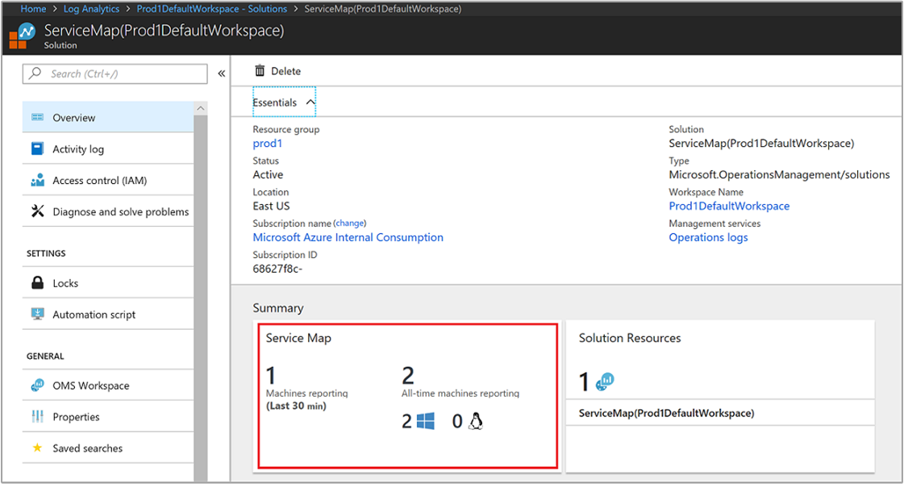
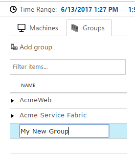
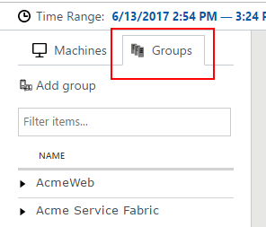
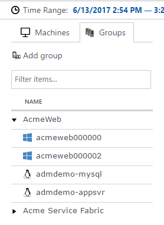
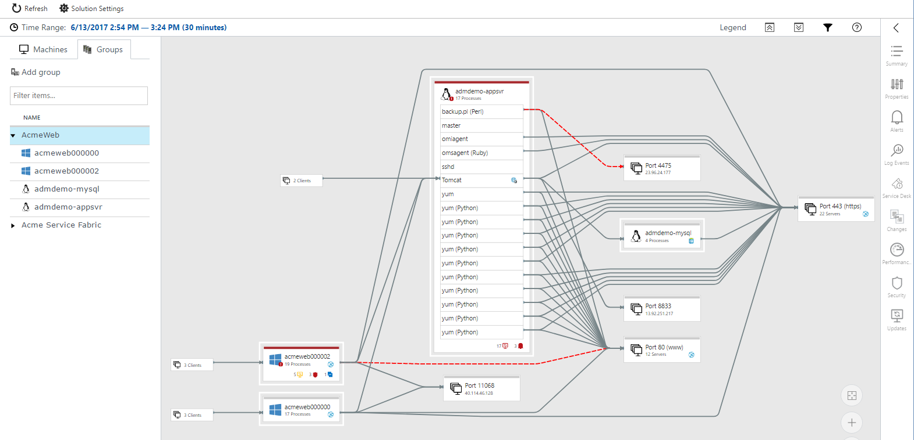
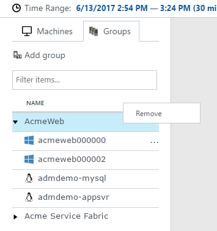
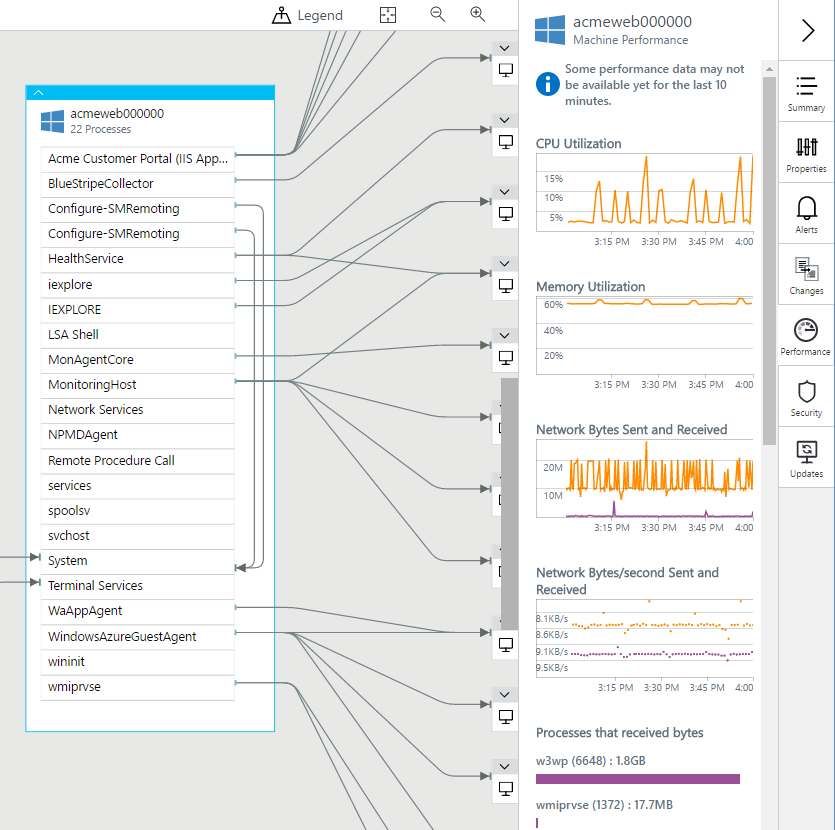
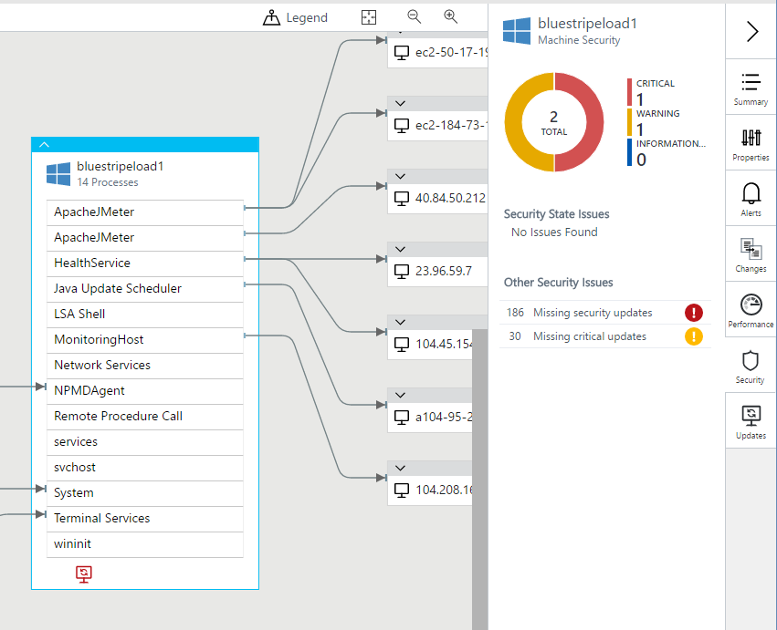
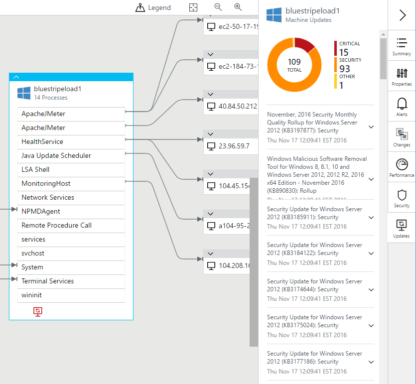

# Using Service Map solution in Azure

Service Map automatically discovers application components on Windows and Linux systems and maps the communication between services. With Service Map, you can view your servers in the way that you think of them: as interconnected systems that deliver critical services. Service Map shows connections between servers, processes, inbound and outbound connection latency, and ports across any TCP-connected architecture, with no configuration required other than the installation of an agent.

This article describes the details of onboarding and using Service Map. For information about configuring the prerequisites for this solution, see [Enable the Azure Monitor for VMs overview](vminsights-enable-overview.md#prerequisites). To summarize, you need the following:

* A Log Analytics workspace to enable this solution.

* The Log Analytics agent installed on the Windows computer or Linux server configured to report the same workspace that you enabled the solution with.

* The Dependency agent installed on the Windows computer or Linux server.

>[!NOTE]
>If you have already deployed Service Map, you can now also view your maps in Azure Monitor for VMs, which includes additional features to monitor VM health and performance. To learn more, see [Azure Monitor for VMs overview](../../azure-monitor/insights/vminsights-overview.md). To learn about the differences between the Service Map solution and Azure Monitor for VMs Map feature, see the following [FAQ](../faq.md#azure-monitor-for-vms).

## Sign in to Azure

Sign in to the Azure portal at [https://portal.azure.com](https://portal.azure.com).

## Enable Service Map

1. Enable the Service Map solution from the [Azure marketplace](https://azuremarketplace.microsoft.com/marketplace/apps/Microsoft.ServiceMapOMS?tab=Overview) or by using the process described in [Add monitoring solutions from the Solutions Gallery](solutions.md).
1. [Install the Dependency agent on Windows](vminsights-enable-hybrid-cloud.md#install-the-dependency-agent-on-windows) or [Install the Dependency agent on Linux](vminsights-enable-hybrid-cloud.md#install-the-dependency-agent-on-linux) on each computer where you want to get data. The Dependency Agent can monitor connections to immediate neighbors, so you might not need an agent on every computer.

You access Service Map in the Azure portal from your Log Analytics workspace, and select the option **Solutions** from the left pane.<br><br> .<br> From the list of solutions, select **ServiceMap(workspaceName)** and in the Service Map solution overview page click on the Service Map summary tile.<br><br> .

## Use cases: Make your IT processes dependency aware

### Discovery

Service Map automatically builds a common reference map of dependencies across your servers, processes, and third-party services. It discovers and maps all TCP dependencies, identifying surprise connections, remote third-party systems you depend on, and dependencies to traditional dark areas of your network, such as Active Directory. Service Map discovers failed network connections that your managed systems are attempting to make, helping you identify potential server misconfiguration, service outage, and network issues.

### Incident management

Service Map helps eliminate the guesswork of problem isolation by showing you how systems are connected and affecting each other. In addition to identifying failed connections, it helps identify misconfigured load balancers, surprising or excessive load on critical services, and rogue clients, such as developer machines talking to production systems. By using integrated workflows with Change Tracking, you can also see whether a change event on a back-end machine or service explains the root cause of an incident.

### Migration assurance

By using Service Map, you can effectively plan, accelerate, and validate Azure migrations, which helps ensure that nothing is left behind and surprise outages do not occur. You can discover all interdependent systems that need to migrate together, assess system configuration and capacity, and identify whether a running system is still serving users or is a candidate for decommissioning instead of migration. After the move is complete, you can check on client load and identity to verify that test systems and customers are connecting. If your subnet planning and firewall definitions have issues, failed connections in Service Map maps point you to the systems that need connectivity.

### Business continuity

If you are using Azure Site Recovery and need help defining the recovery sequence for your application environment, Service Map can automatically show you how systems rely on each other to ensure that your recovery plan is reliable. By choosing a critical server or group and viewing its clients, you can identify which front-end systems to recover after the server is restored and available. Conversely, by looking at critical servers' back-end dependencies, you can identify which systems to recover before your focus systems are restored.

### Patch management

Service Map enhances your use of the System Update Assessment by showing you which other teams and servers depend on your service, so you can notify them in advance before you take down your systems for patching. Service Map also enhances patch management by showing you whether your services are available and properly connected after they are patched and restarted.

## Mapping overview

Service Map agents gather information about all TCP-connected processes on the server where they're installed and details about the inbound and outbound connections for each process.

From the list in the left pane, you can select machines or groups that have Service Map agents to visualize their dependencies over a specified time range. Machine dependency maps focus on a specific machine, and they show all the machines that are direct TCP clients or servers of that machine.  Machine Group maps show sets of servers and their dependencies.


Machines can be expanded in the map to show the running process groups and processes with active network connections during the selected time range. When a remote machine with a Service Map agent is expanded to show process details, only those processes that communicate with the focus machine are shown. The count of agentless front-end machines that connect into the focus machine is indicated on the left side of the processes they connect to. If the focus machine is making a connection to a back-end machine that has no agent, the back-end server is included in a Server Port Group, along with other connections to the same port number.

By default, Service Map maps show the last 30 minutes of dependency information. By using the time controls at the upper left, you can query maps for historical time ranges of up to one hour to show how dependencies looked in the past (for example, during an incident or before a change occurred). Service Map data is stored for 30 days in paid workspaces, and for 7 days in free workspaces.

## Status badges and border coloring

At the bottom of each server in the map can be a list of status badges conveying status information about the server. The badges indicate that there is some relevant information for the server from one of the solution integrations. Clicking a badge takes you directly to the details of the status in the right pane. The currently available status badges include Alerts, Service Desk, Changes, Security, and Updates.

Depending on the severity of the status badges, machine node borders can be colored red (critical), yellow (warning), or blue (informational). The color represents the most severe status of any of the status badges. A gray border indicates a node that has no status indicators.


## Process Groups

Process Groups combine processes that are associated with a common product or service into a process group.  When a machine node is expanded it will display standalone processes along with process groups.  If any inbound and outbound connections to a process within a process group has failed then the connection is shown as failed for the entire process group.

## Machine Groups

Machine Groups allow you to see maps centered around a set of servers, not just one so you can see all the members of a multi-tier application or server cluster in one map.

Users select which servers belong in a group together and choose a name for the group.  You can then choose to view the group with all of its processes and connections, or view it with only the processes and connections that directly relate to the other members of the group.


### Creating a Machine Group

To create a group, select the machine or machines you want in the Machines list and click **Add to group**.


There, you can choose **Create new** and give the group a name.



>[!NOTE]
>Machine groups are limited to 10 servers.

### Viewing a Group

Once you've created some groups, you can view them by choosing the Groups tab.



Then select the Group name to view the map for that Machine Group.
 
The machines that belong to the group are outlined in white in the map.

Expanding the Group will list the machines that make up the Machine Group.



### Filter by processes

You can toggle the map view between showing all processes and connections in the Group and only the ones that directly relate to the Machine Group.  The default view is to show all processes.  You can change the view by clicking the filter icon above the map.


When **All processes** is selected, the map will include all processes and connections on each of the machines in the Group.



If you change the view to show only **group-connected processes**, the map will be narrowed down to only those processes and connections that are directly connected to other machines in the group, creating a simplified view.


 
### Adding machines to a group

To add machines to an existing group, check the boxes next to the machines you want and then click **Add to group**.  Then, choose the group you want to add the machines to.
 
### Removing machines from a group

In the Groups List, expand the group name to list the machines in the Machine Group.  Then, click on the ellipsis menu next to the machine you want to remove and choose **Remove**.



### Removing or renaming a group

Click on the ellipsis menu next to the group name in the Group List.


## Role icons

Certain processes serve particular roles on machines: web servers, application servers, database, and so on. Service Map annotates process and machine boxes with role icons to help identify at a glance the role a process or server plays.

| Role icon | Description |
|:--|:--|
|  | Web server |
|  | Application server |
|  | Database server |
|  | LDAP server |
|  | SMB server |


## Failed connections

Failed connections are shown in Service Map maps for processes and computers, with a dashed red line indicating that a client system is failing to reach a process or port. Failed connections are reported from any system with a deployed Service Map agent if that system is the one attempting the failed connection. Service Map measures this process by observing TCP sockets that fail to establish a connection. This failure could result from a firewall, a misconfiguration in the client or server, or a remote service being unavailable.


Understanding failed connections can help with troubleshooting, migration validation, security analysis, and overall architectural understanding. Failed connections are sometimes harmless, but they often point directly to a problem, such as a failover environment suddenly becoming unreachable, or two application tiers being unable to talk after a cloud migration.

## Client Groups

Client Groups are boxes on the map that represent client machines that do not have Dependency Agents. A single Client Group represents the clients for an individual process or machine.


To see the IP addresses of the servers in a Client Group, select the group. The contents of the group are listed in the **Client Group Properties** pane.


## Server Port Groups

Server Port Groups are boxes that represent server ports on servers that do not have Dependency Agents. The box contains the server port and a count of the number of servers with connections to that port. Expand the box to see the individual servers and connections. If there is only one server in the box, the name or IP address is listed.


## Context menu

Clicking the ellipsis (...) at the top right of any server displays the context menu for that server.


### Load server map

Clicking **Load Server Map** takes you to a new map with the selected server as the new focus machine.

### Show self-links

Clicking **Show Self-Links** redraws the server node, including any self-links, which are TCP connections that start and end on processes within the server. If self-links are shown, the menu command changes to **Hide Self-Links**, so that you can turn them off.

## Computer summary

The **Machine Summary** pane includes an overview of a server's operating system, dependency counts, and data from other solutions. Such data includes performance metrics, service desk tickets, change tracking, security, and updates.


## Computer and process properties

When you navigate a Service Map map, you can select machines and processes to gain additional context about their properties. Machines provide information about DNS name, IPv4 addresses, CPU and memory capacity, VM type, operating system and version, last reboot time, and the IDs of their OMS and Service Map agents.


You can gather process details from operating-system metadata about running processes, including process name, process description, user name and domain (on Windows), company name, product name, product version, working directory, command line, and process start time.


The **Process Summary** pane provides additional information about the process's connectivity, including its bound ports, inbound and outbound connections, and failed connections.


## Alerts integration

Service Map integrates with Azure Alerts to show fired alerts for the selected server in the selected time range. The server displays an icon if there are current alerts, and the **Machine Alerts** pane lists the alerts.


To enable Service Map to display relevant alerts, create an alert rule that fires for a specific computer. To create proper alerts:
- Include a clause to group by computer (for example, **by Computer interval 1 minute**).
- Choose to alert based on metric measurement.

## Log events integration

Service Map integrates with Log Search to show a count of all available log events for the selected server during the selected time range. You can click any row in the list of event counts to jump to Log Search and see the individual log events.


## Service Desk integration

Service Map integration with the IT Service Management Connector is automatic when both solutions are enabled and configured in your Log Analytics workspace. The integration in Service Map is labeled "Service Desk." For more information, see [Centrally manage ITSM work items using IT Service Management Connector](https://docs.microsoft.com/azure/log-analytics/log-analytics-itsmc-overview).

The **Machine Service Desk** pane lists all IT Service Management events for the selected server in the selected time range. The server displays an icon if there are current items and the Machine Service Desk pane lists them.


To open the item in your connected ITSM solution, click **View Work Item**.

To view the details of the item in Log Search, click **Show in Log Search**.
Connection metrics are written to two new tables in Log Analytics 

## Change Tracking integration

Service Map integration with Change Tracking is automatic when both solutions are enabled and configured in your Log Analytics workspace.

The **Machine Change Tracking** pane lists all changes, with the most recent first, along with a link to drill down to Log Search for additional details.


The following image is a detailed view of a ConfigurationChange event that you might see after you select **Show in Log Analytics**.


## Performance integration

The **Machine Performance** pane displays standard performance metrics for the selected server. The metrics include CPU utilization, memory utilization, network bytes sent and received, and a list of the top processes by network bytes sent and received.



To see performance data, you may need to [enable the appropriate Log Analytics performance counters](https://docs.microsoft.com/azure/log-analytics/log-analytics-data-sources-performance-counters).  The counters you will want to enable:

Windows:
- Processor(*)\\% Processor Time
- Memory\\% Committed Bytes In Use
- Network Adapter(*)\\Bytes Sent/sec
- Network Adapter(*)\\Bytes Received/sec

Linux:
- Processor(*)\\% Processor Time
- Memory(*)\\% Used Memory
- Network Adapter(*)\\Bytes Sent/sec
- Network Adapter(*)\\Bytes Received/sec

To get the network performance data, you must also have enabled the Wire Data 2.0 solution in your workspace.
 
## Security integration

Service Map integration with Security and Audit is automatic when both solutions are enabled and configured in your Log Analytics workspace.

The **Machine Security** pane shows data from the Security and Audit solution for the selected server. The pane lists a summary of any outstanding security issues for the server during the selected time range. Clicking any of the security issues drills down into a Log Search for details about them.



## Updates integration

Service Map integration with Update Management is automatic when both solutions are enabled and configured in your Log Analytics workspace.

The **Machine Updates** pane displays data from the Update Management solution for the selected server. The pane lists a summary of any missing updates for the server during the selected time range.



## Log Analytics records

Service Map computer and process inventory data is available for [search](../../azure-monitor/log-query/log-query-overview.md) in Log Analytics. You can apply this data to scenarios that include migration planning, capacity analysis, discovery, and on-demand performance troubleshooting.

One record is generated per hour for each unique computer and process, in addition to the records that are generated when a process or computer starts or is on-boarded to Service Map. These records have the properties in the following tables. The fields and values in the ServiceMapComputer_CL events map to fields of the Machine resource in the ServiceMap Azure Resource Manager API. The fields and values in the ServiceMapProcess_CL events map to the fields of the Process resource in the ServiceMap Azure Resource Manager API. The ResourceName_s field matches the name field in the corresponding Resource Manager resource. 

>[!NOTE]
>As Service Map features grow, these fields are subject to change.

There are internally generated properties you can use to identify unique processes and computers:

- Computer: Use *ResourceId* or *ResourceName_s* to uniquely identify a computer within a Log Analytics workspace.
- Process: Use *ResourceId* to uniquely identify a process within a Log Analytics workspace. *ResourceName_s* is unique within the context of the machine on which the process is running (MachineResourceName_s) 

Because multiple records can exist for a specified process and computer in a specified time range, queries can return more than one record for the same computer or process. To include only the most recent record, add "| dedup ResourceId" to the query.

### Connections

Connection metrics are written to a new table in Log Analytics - VMConnection. This table provides information about the connections for a machine (inbound and outbound). Connection Metrics are also exposed with APIs that provide the means to obtain a specific metric during a time window.  TCP connections resulting from accepting on a listening socket are inbound, while those created by connecting to a given IP and port are outbound. The direction of a connection is represented by the Direction property, which can be set to either **inbound** or **outbound**. 

Records in these tables are generated from data reported by the Dependency agent. Every record represents an observation over a one minute time interval. The TimeGenerated property indicates the start of the time interval. Each record contains information to identify the respective entity, that is, connection or port, as well as metrics associated with that entity. Currently, only network activity that occurs using TCP over IPv4 is reported.

To manage cost and complexity, connection records do not represent individual physical network connections. Multiple physical network connections are grouped into a logical connection, which is then reflected in the respective table.  Meaning, records in *VMConnection* table represent a logical grouping and not the individual physical connections that are being observed. Physical network connection sharing the same value for the following attributes during a given one minute interval, are aggregated into a single logical record in *VMConnection*. 

| Property | Description |
|:--|:--|
| `Direction` |Direction of the connection, value is *inbound* or *outbound* |
| `Machine` |The computer FQDN |
| `Process` |Identity of process or groups of processes, initiating/accepting the connection |
| `SourceIp` |IP address of the source |
| `DestinationIp` |IP address of the destination |
| `DestinationPort` |Port number of the destination |
| `Protocol` |Protocol used for the connection.  Values is *tcp*. |

To account for the impact of grouping, information about the number of grouped physical connections is provided in the following properties of the record:

| Property | Description |
|:--|:--|
| `LinksEstablished` |The number of physical network connections that have been established during the reporting time window |
| `LinksTerminated` |The number of physical network connections that have been terminated during the reporting time window |
| `LinksFailed` |The number of physical network connections that have failed during the reporting time window. This information is currently available only for outbound connections. |
| `LinksLive` |The number of physical network connections that were open at the end of the reporting time window|

#### Metrics

In addition to connection count metrics, information about the volume of data sent and received on a given logical connection or network port are also included in the following properties of the record:

| Property | Description |
|:--|:--|
| `BytesSent` |Total number of bytes that have been sent during the reporting time window |
| `BytesReceived` |Total number of bytes that have been received during the reporting time window |
| `Responses` |The number of responses observed during the reporting time window. 
| `ResponseTimeMax` |The largest response time (milliseconds) observed during the reporting time window.  If no value, the property is blank.|
| `ResponseTimeMin` |The smallest response time (milliseconds) observed during the reporting time window.  If no value, the property is blank.|
| `ResponseTimeSum` |The sum of all response times (milliseconds) observed during the reporting time window.  If no value, the property is blank|

The third type of data being reported is response time - how long does a caller spend waiting for a request sent over a connection to be processed and responded to by the remote endpoint. The response time reported is an estimation of the true response time of the underlying application protocol. It is computed using heuristics based on the observation of the flow of data between the source and destination end of a physical network connection. Conceptually, it is the difference between the time the last byte of a request leaves the sender, and the time when the last byte of the response arrives back to it. These two timestamps are used to delineate request and response events on a given physical connection. The difference between them represents the response time of a single request. 

In this first release of this feature, our algorithm is an approximation that may work with varying degree of success depending on the actual application protocol used for a given network connection. For example, the current approach works well for request-response based protocols such as HTTP(S), but does not work with one-way or message queue-based protocols.

Here are some important points to consider:

1. If a process accepts connections on the same IP address but over multiple network interfaces, a separate record for each interface will be reported. 
2. Records with wildcard IP will contain no activity. They are included to represent the fact that a port on the machine is open to inbound traffic.
3. To reduce verbosity and data volume, records with wildcard IP will be omitted when there is a matching record (for the same process, port, and protocol) with a specific IP address. When a wildcard IP record is omitted, the IsWildcardBind record property with the specific IP address, will be set to "True" to indicate that the port is exposed over every interface of the reporting machine.
4. Ports that are bound only on a specific interface have IsWildcardBind set to "False".

#### Naming and Classification

For convenience, the IP address of the remote end of a connection is included in the RemoteIp property. For inbound connections, RemoteIp is the same as SourceIp, while for outbound connections, it is the same as DestinationIp. The RemoteDnsCanonicalNames property represents the DNS canonical names reported by the machine for RemoteIp. The RemoteDnsQuestions and RemoteClassification properties are reserved for future use. 

#### Geolocation

*VMConnection* also includes geolocation information for the remote end of each connection record in the following properties of the record: 

| Property | Description |
|:--|:--|
| `RemoteCountry` |The name of the country/region hosting RemoteIp.  For example, *United States* |
| `RemoteLatitude` |The geolocation latitude.  For example, *47.68* |
| `RemoteLongitude` |The geolocation longitude.  For example, *-122.12* |

#### Malicious IP

Every RemoteIp property in *VMConnection* table is checked against a set of IPs with known malicious activity. If the RemoteIp is identified as malicious the following properties will be populated (they are empty, when the IP is not considered malicious) in the following properties of the record:

| Property | Description |
|:--|:--|
| `MaliciousIp` |The RemoteIp address |
| `IndicatorThreadType` |Threat indicator detected is one of the following values, *Botnet*, *C2*, *CryptoMining*, *Darknet*, *DDos*, *MaliciousUrl*, *Malware*, *Phishing*, *Proxy*, *PUA*, *Watchlist*.   |
| `Description` |Description of the observed threat. |
| `TLPLevel` |Traffic Light Protocol (TLP) Level is one of the defined values, *White*, *Green*, *Amber*, *Red*. |
| `Confidence` |Values are *0 – 100*. |
| `Severity` |Values are *0 – 5*, where *5* is the most severe and *0* is not severe at all. Default value is *3*.  |
| `FirstReportedDateTime` |The first time the provider reported the indicator. |
| `LastReportedDateTime` |The last time the indicator was seen by Interflow. |
| `IsActive` |Indicates indicators are deactivated with *True* or *False* value. |
| `ReportReferenceLink` |Links to reports related to a given observable. |
| `AdditionalInformation` |Provides additional information, if applicable, about the observed threat. |

### ServiceMapComputer_CL records

Records with a type of *ServiceMapComputer_CL* have inventory data for servers with Service Map agents. These records have the properties in the following table:

| Property | Description |
|:--|:--|
| `Type` | *ServiceMapComputer_CL* |
| `SourceSystem` | *OpsManager* |
| `ResourceId` | The unique identifier for a machine within the workspace |
| `ResourceName_s` | The unique identifier for a machine within the workspace |
| `ComputerName_s` | The computer FQDN |
| `Ipv4Addresses_s` | A list of the server's IPv4 addresses |
| `Ipv6Addresses_s` | A list of the server's IPv6 addresses |
| `DnsNames_s` | An array of DNS names |
| `OperatingSystemFamily_s` | Windows or Linux |
| `OperatingSystemFullName_s` | The full name of the operating system  |
| `Bitness_s` | The bitness of the machine (32-bit or 64-bit)  |
| `PhysicalMemory_d` | The physical memory in MB |
| `Cpus_d` | The number of CPUs |
| `CpuSpeed_d` | The CPU speed in MHz|
| `VirtualizationState_s` | *unknown*, *physical*, *virtual*, *hypervisor* |
| `VirtualMachineType_s` | *hyperv*, *vmware*, and so on |
| `VirtualMachineNativeMachineId_g` | The VM ID as assigned by its hypervisor |
| `VirtualMachineName_s` | The name of the VM |
| `BootTime_t` | The boot time |

### ServiceMapProcess_CL Type records

Records with a type of *ServiceMapProcess_CL* have inventory data for TCP-connected processes on servers with Service Map agents. These records have the properties in the following table:

| Property | Description |
|:--|:--|
| `Type` | *ServiceMapProcess_CL* |
| `SourceSystem` | *OpsManager* |
| `ResourceId` | The unique identifier for a process within the workspace |
| `ResourceName_s` | The unique identifier for a process within the machine on which it is running|
| `MachineResourceName_s` | The resource name of the machine |
| `ExecutableName_s` | The name of the process executable |
| `StartTime_t` | The process pool start time |
| `FirstPid_d` | The first PID in the process pool |
| `Description_s` | The process description |
| `CompanyName_s` | The name of the company |
| `InternalName_s` | The internal name |
| `ProductName_s` | The name of the product |
| `ProductVersion_s` | The product version |
| `FileVersion_s` | The file version |
| `CommandLine_s` | The command line |
| `ExecutablePath _s` | The path to the executable file |
| `WorkingDirectory_s` | The working directory |
| `UserName` | The account under which the process is executing |
| `UserDomain` | The domain under which the process is executing |

## Sample log searches

### List all known machines

ServiceMapComputer_CL | summarize arg_max(TimeGenerated, *) by ResourceId

### List the physical memory capacity of all managed computers.

ServiceMapComputer_CL | summarize arg_max(TimeGenerated, *) by ResourceId | project PhysicalMemory_d, ComputerName_s

### List computer name, DNS, IP, and OS.

ServiceMapComputer_CL | summarize arg_max(TimeGenerated, *) by ResourceId | project ComputerName_s, OperatingSystemFullName_s, DnsNames_s, Ipv4Addresses_s

### Find all processes with "sql" in the command line

ServiceMapProcess_CL | where CommandLine_s contains_cs "sql" | summarize arg_max(TimeGenerated, *) by ResourceId

### Find a machine (most recent record) by resource name

search in (ServiceMapComputer_CL) "m-4b9c93f9-bc37-46df-b43c-899ba829e07b" | summarize arg_max(TimeGenerated, *) by ResourceId

### Find a machine (most recent record) by IP address

search in (ServiceMapComputer_CL) "10.229.243.232" | summarize arg_max(TimeGenerated, *) by ResourceId

### List all known processes on a specified machine

ServiceMapProcess_CL | where MachineResourceName_s == "m-559dbcd8-3130-454d-8d1d-f624e57961bc" | summarize arg_max(TimeGenerated, *) by ResourceId

### List all computers running SQL

ServiceMapComputer_CL | where ResourceName_s in ((search in (ServiceMapProcess_CL) "\*sql\*" | distinct MachineResourceName_s)) | distinct ComputerName_s

### List all unique product versions of curl in my datacenter

ServiceMapProcess_CL | where ExecutableName_s == "curl" | distinct ProductVersion_s

### Create a computer group of all computers running CentOS

ServiceMapComputer_CL | where OperatingSystemFullName_s contains_cs "CentOS" | distinct ComputerName_s

### Summarize the outbound connections from a group of machines

```
// the machines of interest
let machines = datatable(m: string) ["m-82412a7a-6a32-45a9-a8d6-538354224a25"];
// map of ip to monitored machine in the environment
let ips=materialize(ServiceMapComputer_CL
| summarize ips=makeset(todynamic(Ipv4Addresses_s)) by MonitoredMachine=ResourceName_s
| mvexpand ips to typeof(string));
// all connections to/from the machines of interest
let out=materialize(VMConnection
| where Machine in (machines)
| summarize arg_max(TimeGenerated, *) by ConnectionId);
// connections to localhost augmented with RemoteMachine
let local=out
| where RemoteIp startswith "127."
| project ConnectionId, Direction, Machine, Process, ProcessName, SourceIp, DestinationIp, DestinationPort, Protocol, RemoteIp, RemoteMachine=Machine;
// connections not to localhost augmented with RemoteMachine
let remote=materialize(out
| where RemoteIp !startswith "127."
| join kind=leftouter (ips) on $left.RemoteIp == $right.ips
| summarize by ConnectionId, Direction, Machine, Process, ProcessName, SourceIp, DestinationIp, DestinationPort, Protocol, RemoteIp, RemoteMachine=MonitoredMachine);
// the remote machines to/from which we have connections
let remoteMachines = remote | summarize by RemoteMachine;
// all augmented connections
(local)
| union (remote)
//Take all outbound records but only inbound records that come from either //unmonitored machines or monitored machines not in the set for which we are computing dependencies.
| where Direction == 'outbound' or (Direction == 'inbound' and RemoteMachine !in (machines))
| summarize by ConnectionId, Direction, Machine, Process, ProcessName, SourceIp, DestinationIp, DestinationPort, Protocol, RemoteIp, RemoteMachine
// identify the remote port
| extend RemotePort=iff(Direction == 'outbound', DestinationPort, 0)
// construct the join key we'll use to find a matching port
| extend JoinKey=strcat_delim(':', RemoteMachine, RemoteIp, RemotePort, Protocol)
// find a matching port
| join kind=leftouter (VMBoundPort 
| where Machine in (remoteMachines) 
| summarize arg_max(TimeGenerated, *) by PortId 
| extend JoinKey=strcat_delim(':', Machine, Ip, Port, Protocol)) on JoinKey
// aggregate the remote information
| summarize Remote=makeset(iff(isempty(RemoteMachine), todynamic('{}'), pack('Machine', RemoteMachine, 'Process', Process1, 'ProcessName', ProcessName1))) by ConnectionId, Direction, Machine, Process, ProcessName, SourceIp, DestinationIp, DestinationPort, Protocol
```

## REST API

All the server, process, and dependency data in Service Map is available via the [Service Map REST API](https://docs.microsoft.com/rest/api/servicemap/).

## Diagnostic and usage data

Microsoft automatically collects usage and performance data through your use of the Service Map service. Microsoft uses this data to provide and improve the quality, security, and integrity of the Service Map service. To provide accurate and efficient troubleshooting capabilities, the data includes information about the configuration of your software, such as operating system and version, IP address, DNS name, and workstation name. Microsoft does not collect names, addresses, or other contact information.

For more information about data collection and usage, see the [Microsoft Online Services Privacy Statement](https://go.microsoft.com/fwlink/?LinkId=512132).

## Next steps

Learn more about [log searches](../../azure-monitor/log-query/log-query-overview.md) in Log Analytics to retrieve data that's collected by Service Map.

## Troubleshooting

If you have any problems installing or running Service Map, this section can help you. If you still can't resolve your problem, please contact Microsoft Support.

### Dependency agent installation problems

#### Installer prompts for a reboot
The Dependency agent *generally* does not require a reboot upon installation or removal. However, in certain rare cases, Windows Server requires a reboot to continue with an installation. This happens when a dependency, usually the Microsoft Visual C++ Redistributable library requires a reboot because of a locked file.

#### Message "Unable to install Dependency agent: Visual Studio Runtime libraries failed to install (code = [code_number])" appears

The Microsoft Dependency agent is built on the Microsoft Visual Studio runtime libraries. You'll get a message if there's a problem during installation of the libraries. 

The runtime library installers create logs in the %LOCALAPPDATA%\temp folder. The file is `dd_vcredist_arch_yyyymmddhhmmss.log`, where *arch* is `x86` or `amd64` and *yyyymmddhhmmss* is the date and time (24-hour clock) when the log was created. The log provides details about the problem that's blocking installation.

It might be useful to install the [latest runtime libraries](https://support.microsoft.com/help/2977003/the-latest-supported-visual-c-downloads) first.

The following table lists code numbers and suggested resolutions.

| Code | Description | Resolution |
|:--|:--|:--|
| 0x17 | The library installer requires a Windows update that hasn't been installed. | Look in the most recent library installer log.<br><br>If a reference to `Windows8.1-KB2999226-x64.msu` is followed by a line `Error 0x80240017: Failed to execute MSU package,` you don't have the prerequisites to install KB2999226. Follow the instructions in the prerequisites section in [Universal C Runtime in Windows](https://support.microsoft.com/kb/2999226) article. You might need to run Windows Update and reboot multiple times in order to install the prerequisites.<br><br>Run the Microsoft Dependency agent installer again. |

### Post-installation issues

#### Server doesn't appear in Service Map

If your Dependency agent installation succeeded, but you don't see your machine in the Service Map solution:
* Is the Dependency agent installed successfully? You can validate this by checking to see if the service is installed and running.<br><br>
**Windows**: Look for the service named **Microsoft Dependency agent**.
**Linux**: Look for the running process **microsoft-dependency-agent**.

* Are you on the [Log Analytics free tier](https://azure.microsoft.com/pricing/details/monitor/)? The Free plan allows for up to five unique Service Map machines. Any subsequent machines won't appear in Service Map, even if the prior five are no longer sending data.

* Is your server sending log and perf data to Azure Monitor Logs? Go to Azure Monitor\Logs and run the following query for your computer: 

    ```kusto
    Usage | where Computer == "admdemo-appsvr" | summarize sum(Quantity), any(QuantityUnit) by DataType
    ```

Did you get a variety of events in the results? Is the data recent? If so, your Log Analytics agent is operating correctly and communicating with the workspace. If not, check the agent on your machine: [Log Analytics agent for Windows troubleshooting](../platform/agent-windows-troubleshoot.md) or [Log Analytics agent for Linux troubleshooting](../platform/agent-linux-troubleshoot.md).

#### Server appears in Service Map but has no processes

If you see your machine in Service Map, but it has no process or connection data, that indicates that the Dependency agent is installed and running, but the kernel driver didn't load. 

Check the `C:\Program Files\Microsoft Dependency Agent\logs\wrapper.log file` (Windows) or `/var/opt/microsoft/dependency-agent/log/service.log file` (Linux). The last lines of the file should indicate why the kernel didn't load. For example, the kernel might not be supported on Linux if you updated your kernel.

## Feedback

Do you have any feedback for us about Service Map or this documentation?  Visit our [User Voice page](https://feedback.azure.com/forums/267889-log-analytics/category/184492-service-map), where you can suggest features or vote up existing suggestions.
