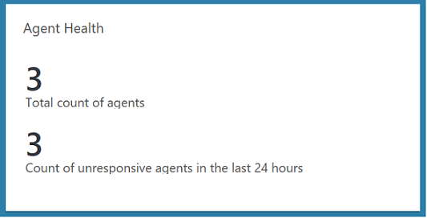

#  Agent Health solution in Azure Monitor
The Agent Health solution in Azure helps you understand, for all of the agents reporting directly to the Log Analytics workspace in Azure Monitor or a System Center Operations Manager management group  connected to Azure Monitor, which are unresponsive and submitting operational data.  You can also keep track of how many agents are deployed, where they are distributed geographically, and perform other queries to maintain awareness of the distribution of agents deployed in Azure, other cloud environments, or on-premises.    

## Prerequisites
Before you deploy this solution, confirm you have currently supported [Windows agents](../../log-analytics/log-analytics-windows-agent.md) reporting to the Log Analytics workspace or reporting to an [Operations Manager management group](../../azure-monitor/platform/om-agents.md) integrated with your workspace.

## Solution components
This solution consists of the following resources that are added to your workspace and directly connected agents or Operations Manager connected management group.

### Management packs
If your System Center Operations Manager management group is connected to a Log Analytics workspace,  the following management packs are installed in Operations Manager.  These management packs are also installed on directly connected Windows computers after adding this solution. There is nothing to configure or manage with these management packs.

* Microsoft System Center Advisor HealthAssessment Direct Channel Intelligence Pack  (Microsoft.IntelligencePacks.HealthAssessmentDirect)
* Microsoft System Center Advisor HealthAssessment Server Channel Intelligence Pack (Microsoft.IntelligencePacks.HealthAssessmentViaServer).  

For more information on how solution management packs are updated, see [Connect Operations Manager to Log Analytics](../../azure-monitor/platform/om-agents.md).

## Configuration
Add the Agent Health solution to your Log Analytics workspace using the process described in [Add solutions](solutions.md). There is no further configuration required.

## Data collection
### Supported agents
The following table describes the connected sources that are supported by this solution.

| Connected Source | Supported | Description |
| --- | --- | --- |
| Windows agents | Yes | Heartbeat events are collected from direct Windows agents.|
| System Center Operations Manager management group | Yes | Heartbeat events are collected from  agents reporting to the management group every 60 seconds and then forwarded to Azure Monitor. A direct connection from Operations Manager agents to Azure Monitor is not required. Heartbeat event data is forwarded from the management group to the Log Analytics workspace.|

## Using the solution
When you add the solution to your Log Analytics workspace, the **Agent Health** tile will be added to your dashboard. This tile shows the total number of agents and the number of unresponsive agents in the last 24 hours.   

Click on the **Agent Health** tile to open the **Agent Health** dashboard.  The dashboard includes the columns in the following table. Each column lists the top ten events by count that match that column’s criteria for the specified time range. You can run a log search that provides the entire list by selecting **See all** at the right bottom of each column, or by clicking the column header.

| Column | Description |
|--------|-------------|
| Agent count over time | A trend of your agent count over a period of seven days for both Linux and Windows agents.|
| Count of unresponsive agents | A list of agents that haven’t sent a heartbeat in the past 24 hours.|
| Distribution by OS Type | A partition of how many Windows and Linux agents you have in your environment.|
| Distribution by Agent Version | A partition of the different agent versions installed in your environment and a count of each one.|
| Distribution by Agent Category | A partition of the different categories of agents that are sending up heartbeat events: direct agents, OpsMgr agents, or the OpsMgr Management Server.|
| Distribution by Management Group | A partition of the different Operations Manager Management groups in your environment.|
| Geo-location of Agents | A partition of the different countries/regions where you have agents and a total count of the number of agents that have been installed in each country/region.|
| Count of Gateways Installed | The number of servers that have the Log Analytics gateway installed, and a list of these servers.|

  

## Azure Monitor log records
The solution creates one type of record in the Log Analytics workspace.  

### Heartbeat records
A record with a type of **Heartbeat** is created.  These records have the properties in the following table.  

| Property | Description |
| --- | --- |
| `Type` | *Heartbeat*|
| `Category` | Value is *Direct Agent*, *SCOM Agent*, or *SCOM Management Server*.|
| `Computer` | Computer name.|
| `OSType` | Windows or Linux operating system.|
| `OSMajorVersion` | Operating system major version.|
| `OSMinorVersion` | Operating system minor version.|
| `Version` | Log Analytics Agent or Operations Manager Agent version.|
| `SCAgentChannel` | Value is *Direct* and/or *SCManagementServer*.|
| `IsGatewayInstalled` | If Log Analytics gateway is installed, value is *true*, otherwise value is *false*.|
| `ComputerIP` | The public IP address of the computer. On Azure VMs, this will show the public IP if one is available. For VMs using private IPs, this will display the Azure SNAT address (not the private IP address). |
| `RemoteIPCountry` | Geographic location where computer is deployed.|
| `ManagementGroupName` | Name of Operations Manager management group.|
| `SourceComputerId` | Unique ID of computer.|
| `RemoteIPLongitude` | Longitude of computer's geographic location.|
| `RemoteIPLatitude` | Latitude of computer's geographic location.|

Each agent reporting to an Operations Manager management server will send two heartbeats, and SCAgentChannel property's value will include both **Direct** and **SCManagementServer** depending on what data sources and monitoring solutions you have enabled in your subscription. If you recall, data from solutions are either sent directly from an Operations Manager management server to Azure Monitor, or because of the volume of data collected on the agent, are sent directly from the agent to Azure Monitor. For heartbeat events which have the value **SCManagementServer**, the ComputerIP value is the IP address of the management server since the data is actually uploaded by it.  For heartbeats where SCAgentChannel is set to **Direct**, it is the public IP address of the agent.  

## Sample log searches
The following table provides sample log searches for records collected by this solution.

| Query | Description |
|:---|:---|
| Heartbeat &#124; distinct Computer |Total number of agents |
| Heartbeat &#124; summarize LastCall = max(TimeGenerated) by Computer &#124; where LastCall < ago(24h) |Count of unresponsive agents in the last 24 hours |
| Heartbeat &#124; summarize LastCall = max(TimeGenerated) by Computer &#124; where LastCall < ago(15m) |Count of unresponsive agents in the last 15 minutes |
| Heartbeat &#124; where TimeGenerated > ago(24h) and Computer in ((Heartbeat &#124; where TimeGenerated > ago(24h) &#124; distinct Computer)) &#124; summarize LastCall = max(TimeGenerated) by Computer |Computers online (in the last 24 hours) |
| Heartbeat &#124; where TimeGenerated > ago(24h) and Computer !in ((Heartbeat &#124; where TimeGenerated > ago(30m) &#124; distinct Computer)) &#124; summarize LastCall = max(TimeGenerated) by Computer |Total Agents Offline in Last 30 minutes (for the last 24 hours) |
| Heartbeat &#124; summarize AggregatedValue = dcount(Computer) by OSType |Get a trend of number of agents over time by OSType|
| Heartbeat &#124; summarize AggregatedValue = dcount(Computer) by OSType |Distribution by OS Type |
| Heartbeat &#124; summarize AggregatedValue = dcount(Computer) by Version |Distribution by Agent Version |
| Heartbeat &#124; summarize AggregatedValue = count() by Category |Distribution by Agent Category |
| Heartbeat &#124; summarize AggregatedValue = dcount(Computer) by ManagementGroupName | Distribution by Management Group |
| Heartbeat &#124; summarize AggregatedValue = dcount(Computer) by RemoteIPCountry |Geo-location of Agents |
| Heartbeat &#124; where iff(isnotnull(toint(IsGatewayInstalled)), IsGatewayInstalled == true, IsGatewayInstalled == "true") == true &#124; distinct Computer |Number of Log Analytics Gateways Installed |

## Next steps

* Learn about [Alerts in Azure Monitor](../platform/alerts-overview.md) for details on generating alerts from log queries. 
