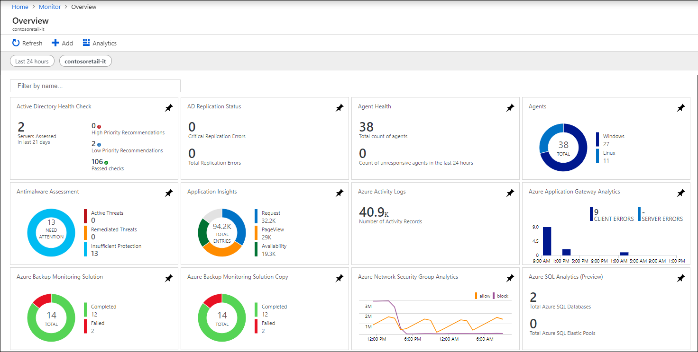
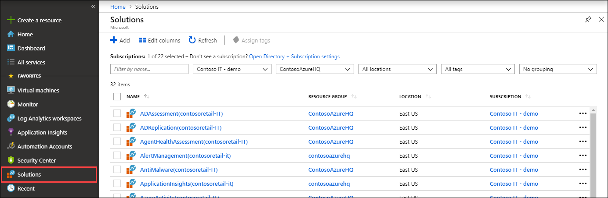
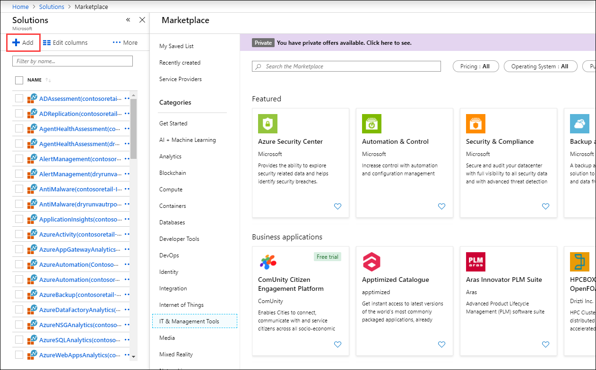

# Monitoring solutions in Azure Monitor

Monitoring solutions leverage services in Azure to provide additional insight into the operation of a particular application or service. This article provides a brief overview of monitoring solutions in Azure and details on using and installing them.

You can add monitoring solutions to Azure Monitor for any applications and services that you use. They're typically available at no cost but collect data that could invoke usage charges. In addition to solutions provided by Microsoft, partners and customers can [create management solutions](solutions-creating.md) to be used in their own environment or made available to customers through the community.

## Use monitoring solutions

Open the **Overview** page in Azure Monitor to display a tile for each solution installed in the workspace. 

1. Go to the [Azure portal](https://ms.portal.azure.com). Search for and select **Monitor**.
1. Under the **Insights** menu, select **More**.
1. Use the dropdown boxes at the top of the screen to change the workspace or the time range used for the tiles.
1. Click on the tile for a solution to open its view that includes more detailed analysis its collected data.

Monitoring solutions can contain multiple types of Azure resources, and you can view any resources included with a solution just like any other resource. For example, any log queries included in the solution are listed under **Solution Queries** in [Query explorer](../log-query/get-started-portal.md#load-queries) You can use those queries when performing ad hoc analysis with [log queries](../log-query/log-query-overview.md).

## List installed monitoring solutions

Use the following procedure to list the monitoring solutions installed in your subscription.

1. Go to the [Azure portal](https://ms.portal.azure.com). Search for and select **Solutions**.
1. Solutions installed in all your workspaces are listed. The name of the solution is followed by the name of the workspace it's installed in.
1. Use the dropdown boxes at the top of the screen to filter by subscription or resource group.

Click on the name of a solution to open its summary page. This page displays any views included in the solution and provides different options for the solution itself and its workspace. View the summary page for a solution by using one of the procedures above to list solutions and then click on the name of the solution.

## Install a monitoring solution

Monitoring solutions from Microsoft and partners are available from the [Azure Marketplace](https://azuremarketplace.microsoft.com). You can search available solutions and install them using the following procedure. When you install a solution, you must select a [Log Analytics workspace](../platform/manage-access.md) where the solution will be installed and where its data will be collected.

1. From the [list of solutions for your subscription](#list-installed-monitoring-solutions), click **Add**.
1. Browse or search for a solution. You can also browse solutions from [this search link](https://azuremarketplace.microsoft.com/en-us/marketplace/apps/category/management-tools?page=1&subcategories=management-solutions).
1. Locate the monitoring solution you want and read through its description.
1. Click **Create** to start the installation process.
1. When the installation process starts, you're prompted to specify the Log Analytics workspace and provide any required configuration for the solution.

### Install a solution from the community

Members of the community can submit management solutions to Azure Quickstart Templates. You can install these solutions directly or download them templates for later installation.

1. Follow the process described in [Log Analytics workspace and Automation account](#log-analytics-workspace-and-automation-account) to link a workspace and account.
2. Go to [Azure Quickstart Templates](https://azure.microsoft.com/documentation/templates/). 
3. Search for a solution that you're interested in.
4. Select the solution from the results to view its details.
5. Click the **Deploy to Azure** button.
6. You're prompted to provide information such as the resource group and location in addition to values for any parameters in the solution.
7. Click **Purchase** to install the solution.

## Log Analytics workspace and Automation account

All monitoring solutions require a [Log Analytics workspace](../platform/manage-access.md) to store data collected by the solution and to host its log searches and views. Some solutions also require an [Automation account](../../automation/automation-security-overview.md) to contain runbooks and related resources. The workspace and account must meet the following requirements.

* Each installation of a solution can only use one Log Analytics workspace and one Automation account. You can install the solution separately into multiple workspaces.
* If a solution requires an Automation account, then the Log Analytics workspace and Automation account must be linked to one another. A Log Analytics workspace may only be linked to one Automation account, and an Automation account may only be linked to one Log Analytics workspace.
* To be linked, the Log Analytics workspace and Automation account must be in the same subscription, but can be in different resource groups deployed to the same region. The exception is a workspace in East US region and Automation account in East US 2.

When you install a solution through the Azure Marketplace, you're prompted for a workspace and Automation account. The link between them is created if they aren't already linked.

### Verify the link between a Log Analytics workspace and Automation account

You can verify the link between a Log Analytics workspace and an Automation account using the following procedure.

1. Select the Automation account in the Azure portal.
1. Scroll to the **Related Resources** section of the menu and select **Linked workspace**.
1. If the **Workspace** is linked to an Automation account, then this page lists the workspace it is linked to. If you select the name of the workspace listed, you are redirected to the overview page for that workspace.

## Remove a monitoring solution

To remove an installed solution, locate it in the [list of installed solutions](#list-installed-monitoring-solutions). Click on the name of the solution to open its summary page and then click on **Delete**.

## Next steps

* Get a [list of monitoring solutions from Microsoft](solutions-inventory.md).
* Learn how to [create queries](../log-query/log-query-overview.md) to analyze data collected by monitoring solutions.