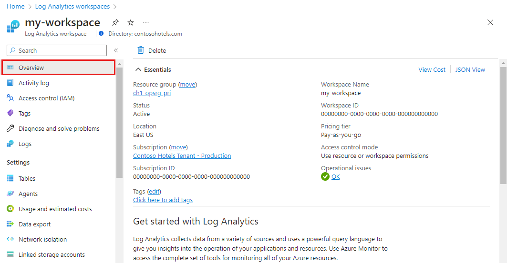

# Monitoring solutions in Azure Monitor

Monitoring solutions in Azure Monitor provide analysis of the operation of a particular Azure application or service. This article provides a brief overview of monitoring solutions in Azure and details on using and installing them. You can add monitoring solutions to Azure Monitor for any applications and services that you use. They're typically available at no cost but collect data that could invoke usage charges.

## Use monitoring solutions

The solutions **Overview** page in Azure Monitor displays a tile for each solution installed in a Log Analytics workspace. To open this page, go to **Azure Monitor** in the [Azure portal](https://ms.portal.azure.com). Under the **Insights** menu, select **More** to open the **Insights Hub**, and then click on **Log Analytics workspaces**.

[](media/solutions/insights-hub.png#lightbox)


Use the dropdown boxes at the top of the screen to change the workspace or the time range used for the tiles. Click on the tile for a solution to open its view that includes more detailed analysis its collected data.

[](media/solutions/overview.png#lightbox)

Monitoring solutions can contain multiple types of Azure resources, and you can view any resources included with a solution just like any other resource. For example, any log queries included in the solution are listed under **Solution Queries** in [Query explorer](../logs/log-analytics-tutorial.md). You can use those queries when performing ad hoc analysis with [log queries](../logs/log-query-overview.md).

## List installed monitoring solutions

### [Portal](#tab/portal)

Use the following procedure to list the monitoring solutions installed in your subscription.

1. Go to the [Azure portal](https://ms.portal.azure.com). Search for and select **Solutions**.
1. Solutions installed in all your workspaces are listed. The name of the solution is followed by the name of the workspace it's installed in.
1. Use the dropdown boxes at the top of the screen to filter by subscription or resource group.


Click on the name of a solution to open its summary page. This page displays any views included in the solution and provides different options for the solution itself and its workspace. View the summary page for a solution by using one of the procedures above to list solutions and then click on the name of the solution.


### [Azure CLI](#tab/azure-cli)

Use the [az monitor log-analytics solution list](/cli/azure/monitor/log-analytics/solution#az_monitor_log_analytics_solution_list) command to list the monitoring solutions installed in your subscription.   Before running the `list` command, follow the prerequisites found in [Install a monitoring solution](#install-a-monitoring-solution).

```azurecli
# List all log-analytics solutions in the current subscription.
az monitor log-analytics solution list

# List all log-analytics solutions for a specific subscription
az monitor log-analytics solution list --subscription MySubscription

# List all log-analytics solutions in a resource group
az monitor log-analytics solution list --resource-group MyResourceGroup
```

### [Azure PowerShell](#tab/azure-powershell)

Use the
[Get-AzMonitorLogAnalyticsSolution](/powershell/module/az.monitoringsolutions/get-azmonitorloganalyticssolution)
cmdlet to list the monitoring solutions installed in your subscription. Before running these
commands, follow the prerequisites found in
[Install a monitoring solution](#install-a-monitoring-solution).

```azurepowershell-interactive
# List all log-analytics solutions in the current subscription.
Get-AzMonitorLogAnalyticsSolution

# List all log-analytics solutions for a specific subscription
Get-AzMonitorLogAnalyticsSolution -SubscriptionId 00000000-0000-0000-0000-000000000000

# List all log-analytics solutions in a resource group
Get-AzMonitorLogAnalyticsSolution -ResourceGroupName MyResourceGroup
```

* * *

## Install a monitoring solution

### [Portal](#tab/portal)

Monitoring solutions from Microsoft and partners are available from the [Azure Marketplace](https://azuremarketplace.microsoft.com). You can search available solutions and install them using the following procedure. When you install a solution, you must select a [Log Analytics workspace](../logs/manage-access.md) where the solution will be installed and where its data will be collected.

1. From the [list of solutions for your subscription](#list-installed-monitoring-solutions), click **Add**.
1. Browse or search for a solution. You can also browse solutions from [this search link](https://azuremarketplace.microsoft.com/en-us/marketplace/apps/category/management-tools?page=1&subcategories=management-solutions).
1. Locate the monitoring solution you want and read through its description.
1. Click **Create** to start the installation process.
1. When the installation process starts, you're prompted to specify the Log Analytics workspace and provide any required configuration for the solution.


### Install a solution from the community

Members of the community can submit management solutions to Azure Quickstart Templates. You can install these solutions directly or download them templates for later installation.

1. Follow the process described in [Log Analytics workspace and Automation account](#log-analytics-workspace-and-automation-account) to link a workspace and account.
2. Go to [Azure Quickstart Templates](https://azure.microsoft.com/documentation/templates/).
3. Search for a solution that you're interested in.
4. Select the solution from the results to view its details.
5. Click the **Deploy to Azure** button.
6. You're prompted to provide information such as the resource group and location in addition to values for any parameters in the solution.
7. Click **Purchase** to install the solution.

### [Azure CLI](#tab/azure-cli)

### Prepare your environment

1. Install the Azure CLI

   You need to [install the Azure CLI](/cli/azure/install-azure-cli) before running CLI reference commands.  If you prefer, you can also use Azure Cloud Shell to complete the steps in this article.  Azure Cloud Shell is an interactive shell environment that you use through your browser.  Start Cloud Shell by using one of these methods:

   - Open Cloud Shell by going to [https://shell.azure.com](https://shell.azure.com)

   - Select the **Cloud Shell** button on the menu bar at the upper right corner in the [Azure portal](https://portal.azure.com)

1. Sign in.

   If you're using a local install of the CLI, sign in using the [az login](/cli/azure/reference-index#az_login) command.  Follow the steps displayed in your terminal to complete the authentication process.

    ```azurecli
    az login
    ```

1. Install the `log-analytics-solution` extension

   The `log-analytics-solution` command is an experimental extension of the core Azure CLI. Learn more about extension references in [Use extension with Azure CLI](/cli/azure/azure-cli-extensions-overview?).

   ```azurecli
   az extension add --name log-analytics-solution
   ```

   The following warning is expected.

   ```output
   The installed extension `log-analytics-solution` is experimental and not covered by customer support.  Please use with discretion.
   ```

### Install a solution with the Azure CLI

When you install a solution, you must select a [Log Analytics workspace](../logs/manage-access.md) where the solution will be installed and where its data will be collected.  With the Azure CLI, you manage workspaces by using the [az monitor log-analytics workspace](/cli/azure/monitor/log-analytics/workspace) reference commands.  Follow the process described in [Log Analytics workspace and Automation account](#log-analytics-workspace-and-automation-account) to link a workspace and account.

Use the [az monitor log-analytics solution create](/cli/azure/monitor/log-analytics/solution) to install a monitoring solution.  Parameters in square brackets are optional.

```azurecli
az monitor log-analytics solution create --name
                                         --plan-product
                                         --plan-publisher
                                         --resource-group
                                         --workspace
                                         [--no-wait]
                                         [--tags]
```

Here is a code sample that creates a log-analytics solution for the plan product of OMSGallery/Containers.

```azurecli
az monitor log-analytics solution create --resource-group MyResourceGroup \
                                         --name Containers({SolutionName}) \
                                         --tags key=value \
                                         --plan-publisher Microsoft  \
                                         --plan-product "OMSGallery/Containers" \
                                         --workspace "/subscriptions/{SubID}/resourceGroups/{ResourceGroup}/providers/ \
                                           Microsoft.OperationalInsights/workspaces/{WorkspaceName}"
```

### [Azure PowerShell](#tab/azure-powershell)

### Prepare your environment

1. Install Azure PowerShell

   You need to [Install Azure PowerShell](/powershell/azure/install-az-ps) before running Azure
   PowerShell reference commands. If you prefer, you can also use Azure Cloud Shell to complete the
   steps in this article. Azure Cloud Shell is an interactive shell environment that you use through
   your browser. Start Cloud Shell by using one of these methods:

   - Open Cloud Shell by going to [https://shell.azure.com](https://shell.azure.com)

   - Select the **Cloud Shell** button on the menu bar at the upper right corner in the [Azure portal](https://portal.azure.com)

   > [!IMPORTANT]
   > While the **Az.MonitoringSolutions** PowerShell module is in preview, you must install it
   > separately using the `Install-Module` cmdlet. After this PowerShell module becomes generally
   > available, it will be part of future Az PowerShell module releases and available by default
   > from within Azure Cloud Shell.

   ```azurepowershell-interactive
   Install-Module -Name Az.MonitoringSolutions
   ```

1. Sign in.

   If you're using a local install of PowerShell, sign in using the
   [Connect-AzAccount](/powershell/module/az.accounts/connect-azaccount) cmdlet. Follow the steps
   displayed in PowerShell to complete the authentication process.

   ```azurepowershell
   Connect-AzAccount
   ```

### Install a solution with Azure PowerShell

When you install a solution, you must select a
[Log Analytics workspace](../logs/manage-access.md) where the solution will be installed and
where its data will be collected. With Azure PowerShell, you manage workspaces by using the cmdlets
in the [Az.MonitoringSolutions](/powershell/module/az.monitoringsolutions) PowerShell module. Follow
the process described in
[Log Analytics workspace and Automation account](#log-analytics-workspace-and-automation-account) to
link a workspace and account.

Use the
[New-AzMonitorLogAnalyticsSolution](/powershell/module/az.monitoringsolutions/new-azmonitorloganalyticssolution)
cmdlet to install a monitoring solution. Parameters in square brackets are optional.

```azurepowershell
New-AzMonitorLogAnalyticsSolution -ResourceGroupName <string> -Type <string> -Location <string>
-WorkspaceResourceId <string> [-SubscriptionId <string>] [-Tag <hashtable>]
[-DefaultProfile <psobject>] [-Break] [-HttpPipelineAppend <SendAsyncStep[]>]
[-HttpPipelinePrepend <SendAsyncStep[]>] [-Proxy <uri>] [-ProxyCredential <pscredential>]
[-ProxyUseDefaultCredentials] [-WhatIf] [-Confirm] [<CommonParameters>]
```

The following example creates a monitor log analytics solution for the log analytics workspace.

```azurepowershell-interactive
$workspace = Get-AzOperationalInsightsWorkspace -ResourceGroupName MyResourceGroup -Name WorkspaceName
New-AzMonitorLogAnalyticsSolution -Type Containers -ResourceGroupName MyResourceGroup -Location $workspace.Location -WorkspaceResourceId $workspace.ResourceId
```

* * *

## Log Analytics workspace and Automation account

All monitoring solutions require a [Log Analytics workspace](../logs/manage-access.md) to store data collected by the solution and to host its log searches and views. Some solutions also require an [Automation account](../../automation/automation-security-overview.md) to contain runbooks and related resources. The workspace and account must meet the following requirements.

* Each installation of a solution can only use one Log Analytics workspace and one Automation account. You can install the solution separately into multiple workspaces.
* If a solution requires an Automation account, then the Log Analytics workspace and Automation account must be linked to one another. A Log Analytics workspace may only be linked to one Automation account, and an Automation account may only be linked to one Log Analytics workspace.

When you install a solution through Azure Marketplace, you're prompted for a workspace and Automation account. The link between them is created if they aren't already linked.

### Verify the link between a Log Analytics workspace and Automation account

You can verify the link between a Log Analytics workspace and an Automation account using the following procedure.

1. Select the Automation account in the Azure portal.
1. Scroll to the **Related Resources** section of the menu and select **Linked workspace**.
1. If the **Workspace** is linked to an Automation account, then this page lists the workspace it is linked to. If you select the name of the workspace listed, you are redirected to the overview page for that workspace.

## Remove a monitoring solution

### [Portal](#tab/portal)

To remove an installed solution using the portal, locate it in the [list of installed solutions](#list-installed-monitoring-solutions). Click on the name of the solution to open its summary page and then click on **Delete**.

### [Azure CLI](#tab/azure-cli)

To remove an installed solution using the Azure CLI, use the [az monitor log-analytics solution delete](/cli/azure/monitor/log-analytics/solution#az_monitor_log_analytics_solution_delete) command.

```azurecli
az monitor log-analytics solution delete --name
                                         --resource-group
                                         [--no-wait]
                                         [--yes]
```

### [Azure PowerShell](#tab/azure-powershell)

To remove an installed solution using Azure PowerShell, use the
[Remove-AzMonitorLogAnalyticsSolution](/powershell/module/az.monitoringsolutions/remove-azmonitorloganalyticssolution)
cmdlet.

```azurepowershell-interactive
Remove-AzMonitorLogAnalyticsSolution  -ResourceGroupName MyResourceGroup -Name WorkspaceName
```

* * *

## Next steps

* Get a [list of monitoring solutions from Microsoft](../monitor-reference.md).
* Learn how to [create queries](../logs/log-query-overview.md) to analyze data collected by monitoring solutions.
* See all [Azure CLI commands for Azure Monitor](/cli/azure/azure-cli-reference-for-monitor).