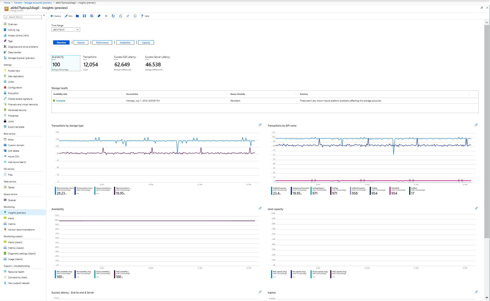

# Review capacity and utilization with Azure Monitor for Storage

Azure Monitor for Storage (preview) provides comprehensive monitoring of Azure Storage accounts by delivering a consolidated and one holistic view of their health and performance that you would otherwise view from [Service Health](../../service-health/service-health-overview.md) and Storage metrics in [Azure Monitor](../../storage/common/storage-metrics-in-azure-monitor.md) independently. You can observe storage health and performance in two ways. View directly from a storage account or view from Azure Monitor to see across groups of storage accounts. This article will help you understand these two viewing methods and how to use this feature.

## Introduction to Azure Monitor for Storage

Before diving into the experience, you should understand how it presents and visualizes information. Whether you select the Storage feature directly from a storage account or from Azure Monitor, Azure Monitor for Storage presents a consistent experience. The only difference is that from Azure Monitor, you can see all storage accounts in your subscriptions.

Combined it delivers:

* **At scale perspective** showing a snapshot view of their availability based on the health of the storage service or the API operation, utilization showing total number of requests that the storage service receives, and latency showing the average time the storage service or API operation type is taking to process requests. You can also view capacity broken for each data service by blob, file, table, and queues.
* **Drill down analysis** of a particular storage account to help diagnose issues or perform detailed analysis by category - availability, performance, failures, and capacity. Selecting any one of those options provides an in-depth view of metrics tailored and delivered in a child workbook.  
* **Customizable** where you can change which metrics you want to see, modify or set thresholds that align with your limits, and save as your own workbook. Charts in the workbook can be pinned to Azure dashboard.  

Azure Monitor for Storage are several Azure Monitor workbooks tied together, which combines text, [log queries](../log-query/query-language.md), metrics, and parameters into rich interactive reports. Workbooks are editable by any other team members who have access to the same Azure resources.

This feature does not require you to enable or configure anything, the metrics are already collected by default. If you are unfamiliar with the comprehensive set of metrics available with Azure Storage and need a description of their purpose and how to interpret their values, review [Monitor, diagnose, and troubleshoot Microsoft Azure Storage](../../storage/common/storage-monitoring-diagnosing-troubleshooting.md).

>[!NOTE]
>There is no charge to access this feature and you will only be charged for the Azure Monitor essential features you configure or enable, as described on the [Azure Monitor pricing details]https://azure.microsoft.com/pricing/details/monitor/) page.

## View from Azure Monitor

From Azure Monitor, you can view utilization and capacity details for multiple storage accounts in your subscription, and identify performance or capacity problems quickly before they affect your applications.

To view the utilization and availability of your storage accounts across all of your subscriptions, perform the following steps.

1. Sign in to the [Azure portal](https://portal.azure.com).

2. Select **Monitor** from the left-hand pane in the Azure portal, and under the **Insights** section, select **Storage Accounts (preview)**.

    

On the Overview workbook for the selected subscription, the table displays interactive storage metrics and service health state for up to ten storage accounts grouped within the subscription. You can filter the results based on the options you select from the following drop down lists:

* **Subscriptions** - only subscriptions that have storage accounts are listed.  

* **Storage Accounts** - by default, only 10 storage accounts are selected. If you select all or multiple storage accounts in the scope selector, up to 200 storage accounts will be returned. For example, if you had a total of 573 storage accounts across three subscriptions that you've selected, only 200 accounts would be displayed. 

* **Time Range** - by default, displays the last 4 hours of information based on the corresponding selections made.

The counter tile under the drop down lists rolls-up the total number of storage accounts in the subscription and reflects how many of the total are selected.  

Select any column, including **Availability**, **E2E Latency**, **Server Latency**, and errors reported.  For details on which errors can be shown in the report, see [Transaction Table schema](https://docs.microsoft.com/rest/api/storageservices/Storage-Analytics-Metrics-Table-Schema?redirectedfrom=MSDN#transactions-table-schema) and look for transaction types such as **ServerOtherError**, **ClientOtherError**, **ClientThrottlingError**.  Depending on the storage accounts selected, if there are more than three types of errors reported, all other errors are represented under the category of **Other**.

You're directed to a report tailored to specific type of storage KPIs that match the column selected. Specifically:

* **Availability** opens the **Availability** workbook. It shows the current health state of Azure Storage service, a table showing the available health state of each object categorized by data service defined in the storage account with a trend line representing the time range selected, and an availability trend chart for each data service in the account.  

    

* **E2E Latency** and **Server Latency** opens the **Performance** workbook. It includes a rollup status tile showing E2E latency and server latency, a performance chart of E2E versus server latency, and a table breaking down latency of successful calls by API categorized by data service defined in the storage account.

    

* Selecting any of the error categories listed in the grid opens the **Failure** workbook. The report shows metric tiles of all other client-side errors except described ones and successful requests, client-throttling errors, a performance chart for the transaction **Response Type** dimension metric specific to ClientOtherError attribute, and two tables - **Transactions by API name** and **Transactions by Response type**.

   

Select **Capacity** at the top of the page and the **Capacity** workbook opens to show the amount of storage used for each device type in the account, and total storage used across the account.  

 

When you select a storage account from the list in the table, you drill down to the **Overview** workbook to help you identify over and under utilized storage for the selected storage account. Note that the [breadcrumb](../../azure-portal/azure-portal-overview.md#getting-around-the-portal) in the portal reflects the workbook is scoped to the selected storage account. If you selected any one of the other column values while it is showing data for that storage account, the [left pane](../../azure-portal/azure-portal-overview.md#getting-around-the-portal) does not reflect you are in Azure Monitor for Storage. 

## View from a storage account

To access Azure Monitor for VMs directly from a storage account:

1. In the Azure portal, select Storage accounts.

2. From the list, choose a storage account. In the Monitoring section, choose Insights (preview).

On the **Overview** workbook for the storage account, it shows several storage key performance indicators (KPIs) that help you quickly assess

* Health of the Storage service to immediately see if an issue outside of your control is affecting the Storage service in the region it is deployed to, which is stated under the **Summary** column.

* Interactive performance charts showing the most essential details related to storage capacity, availability, transactions, and latency.  

* Metric and status tiles highlighting service availability, total count of transactions to the storage service, E2E latency, and server latency.

Selecting any one of buttons for **Failures**, **Performance**, **Availability**, and **Capacity** opens that workbook. The **Capacity** workbook shows the amount of storage used for each device type in the account, and total storage used across the account.  

## Next steps

* Configure [metric alerts](../platform/alerts-metric.md) and [service health notifications](../../service-health/alerts-activity-log-service-notifications.md) to set up automated alerting to aid in detecting issues.

* Learn the scenarios workbooks are designed to support, how to author new and customize existing reports, and more by reviewing [Create interactive reports with Azure Monitor workbooks](../app/usage-workbooks.md). 
