# Monitoring your storage service with Azure Monitor for Storage

Azure Monitor for Storage provides comprehensive monitoring of your Azure Storage accounts by delivering a unified view of your Azure Storage services performance, capacity, and availability. You can observe storage capacity, and performance in two ways, view directly from a storage account or view from Azure Monitor to see across groups of storage accounts. 

This article will help you understand the experience Azure Monitor for Storage delivers to derive actionable knowledge on the health and performance of Storage accounts at scale, with a capability to focus on hotspots and diagnose latency, throttling, and availability issues.

## Introduction to Azure Monitor for Storage

Before diving into the experience, you should understand how it presents and visualizes information. Whether you select the Storage feature directly from a storage account or from Azure Monitor, Azure Monitor for Storage presents a consistent experience. 

Combined it delivers:

* **At scale perspective** showing a snapshot view of their availability based on the health of the storage service or the API operation, utilization showing total number of requests that the storage service receives, and latency showing the average time the storage service or API operation type is taking to process requests. You can also view capacity by blob, file, table, and queue.

* **Drill down analysis** of a particular storage account to help diagnose issues or perform detailed analysis by category - availability, performance, failures, and capacity. Selecting any one of those options provides an in-depth view of metrics.  

* **Customizable** where you can change which metrics you want to see, modify or set thresholds that align with your limits, and save as your own workbook. Charts in the workbook can be pinned to Azure dashboard.  

This feature does not require you to enable or configure anything, the storage metrics from your storage accounts are collected by default. If you are unfamiliar with metrics available on Azure Storage, view the description and definition in Azure Storage metrics by reviewing [Azure storage metrics](../../storage/common/storage-metrics-in-azure-monitor.md).

>[!NOTE]
>There is no charge to access this feature and you will only be charged for the Azure Monitor essential features you configure or enable, as described on the [Azure Monitor pricing details](https://azure.microsoft.com/pricing/details/monitor/) page.

>[!NOTE]
>Azure Monitor for Storage does not support [general-purpose v1 accounts](../../storage/common/storage-account-overview.md#general-purpose-v1-accounts).
>

## View from Azure Monitor

From Azure Monitor, you can view transaction, latency, and capacity details from multiple storage accounts in your subscription, and help identify performance, capacity problems, and failures.

To view the utilization and availability of your storage accounts across all of your subscriptions, perform the following steps.

1. Sign in to the [Azure portal](https://portal.azure.com).

2. Select **Monitor** from the left-hand pane in the Azure portal, and under the **Insights** section, select **Storage Accounts**.

    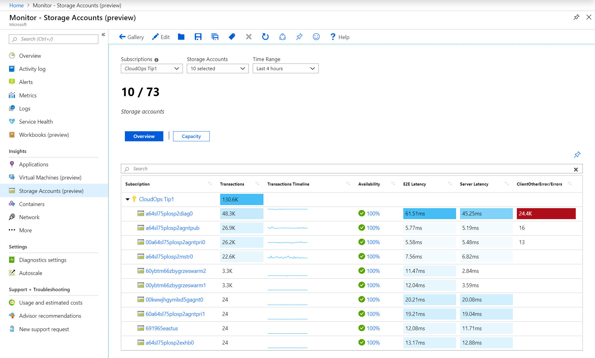

### Overview workbook

On the **Overview** workbook for the selected subscription, the table displays interactive storage metrics and service availability state for up to 10 storage accounts grouped within the subscription. You can filter the results based on the options you select from the following drop-down lists:

* **Subscriptions** - only subscriptions that have storage accounts are listed.  

* **Storage Accounts** - by default, 10 storage accounts are pre-selected. If you select all or multiple storage accounts in the scope selector, up to 200 storage accounts will be returned. For example, if you had a total of 573 storage accounts across three subscriptions that you've selected, only 200 accounts would be displayed. 

* **Time Range** - by default, displays the last 4 hours of information based on the corresponding selections made.

The counter tile under the drop-down lists rolls-up the total number of storage accounts in the subscription and reflects how many of the total are selected. There is conditional color-coding or heatmaps for columns in the workbook that report transaction metrics or errors. The deepest color has the highest value and a lighter color is based on the lowest values. For the error-based columns, the value is in red and for the metric-based columns, the value is in blue.

Select a value in the columns **Availability**, **E2E Latency**, **Server Latency**, and **transaction error type/Errors** directs you to a report tailored to the specific type of storage metrics that match the column selected for that storage account. For more information about the workbooks for each category, see the [Detailed storage workbooks](#detailed-storage-workbooks) section below. 

>[!NOTE]
>For details on which errors can be shown in the report, see [Response Type schema](../../storage/common/monitor-storage-reference.md#metrics-dimensions) and look for response types such as **ServerOtherError**, **ClientOtherError**, **ClientThrottlingError**. Depending on the storage accounts selected, if there are more than three types of errors reported, all other errors are represented under the category of **Other**.

The default **Availability** threshold is:

* Warning - 99%
* Critical - 90%

To set an availability threshold based on the results of your observation or requirements, review [modify the availability threshold](#modify-the-availability-threshold). 

### Capacity workbook

Select **Capacity** at the top of the page and the **Capacity** workbook opens. It shows you the amount of total storage used in the account and capacity used by each data service in the account to help identify over and under utilized storage.

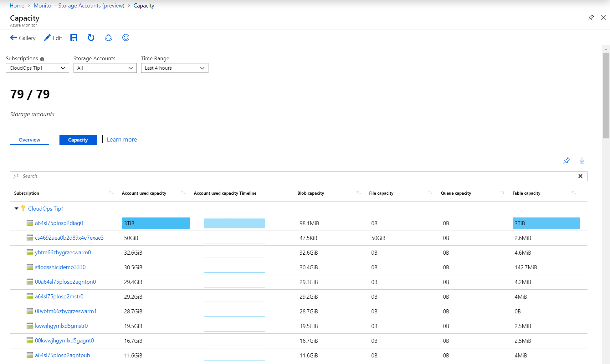 

There is conditional color-coding or heatmaps for columns in the workbook that report capacity metrics with a blue value. The deepest color has the highest value and a lighter color is based on the lowest values.

When you select a value under any one of the columns in the workbook, you drill down to the **Capacity** workbook for the storage account. Further details about the drill-down report are described in the [Detailed storage workbooks](#detailed-storage-workbooks) section below. 

## View from a storage account

To access Azure Monitor for VMs directly from a storage account:

1. In the Azure portal, select Storage accounts.

2. From the list, choose a storage account. In the Monitoring section, choose Insights.

    

On the **Overview** workbook for the storage account, it shows several storage performance metrics that help you quickly assess:

* Health of the Storage service to immediately see if an issue outside of your control is affecting the Storage service in the region it is deployed to, which is stated under the **Summary** column.

* Interactive performance charts showing the most essential details related to storage capacity, availability, transactions, and latency.  

* Metric and status tiles highlighting service availability, total count of transactions to the storage service, E2E latency, and server latency.

Selecting any one of buttons for **Failures**, **Performance**, **Availability**, and **Capacity** opens the respective workbook. 

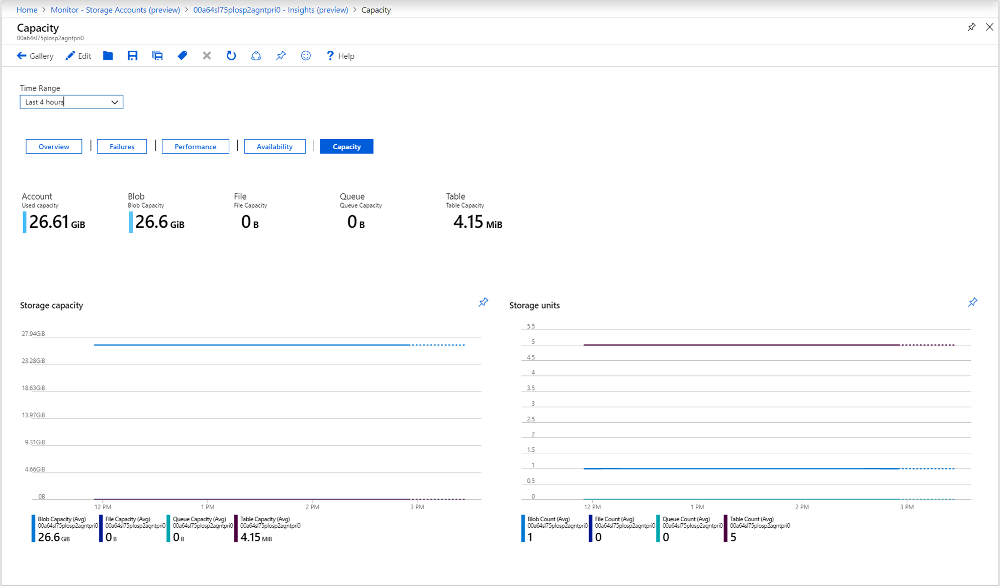

## Detailed storage workbooks

Whether you selected a value in the columns **Availability**, **E2E Latency**, **Server Latency**, and **transaction error type/Errors** from the multiple storage account **Overview** workbook, or selecting any one of buttons for **Failures**, **Performance**, **Availability**, and **Capacity** from the **Overview** workbook from a specific storage account, each deliver a set of interactive storage-related information tailored to that category.  

* **Availability** opens the **Availability** workbook. It shows the current health state of Azure Storage service, a table showing the available health state of each object categorized by data service defined in the storage account with a trend line representing the time range selected, and an availability trend chart for each data service in the account.  

    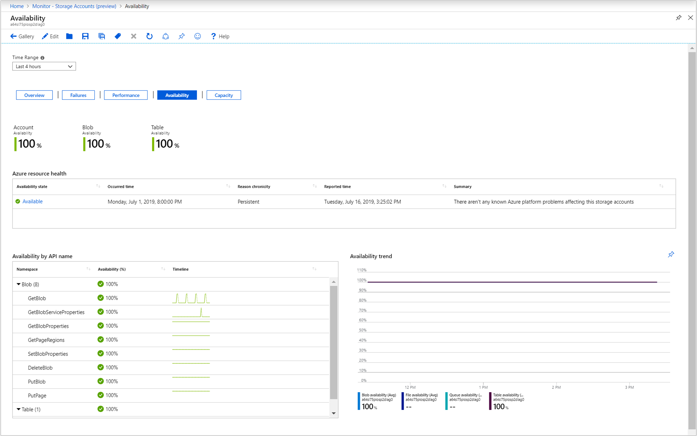

* **E2E Latency** and **Server Latency** opens the **Performance** workbook. It includes a rollup status tile showing E2E latency and server latency, a performance chart of E2E versus server latency, and a table breaking down latency of successful calls by API categorized by data service defined in the storage account.

    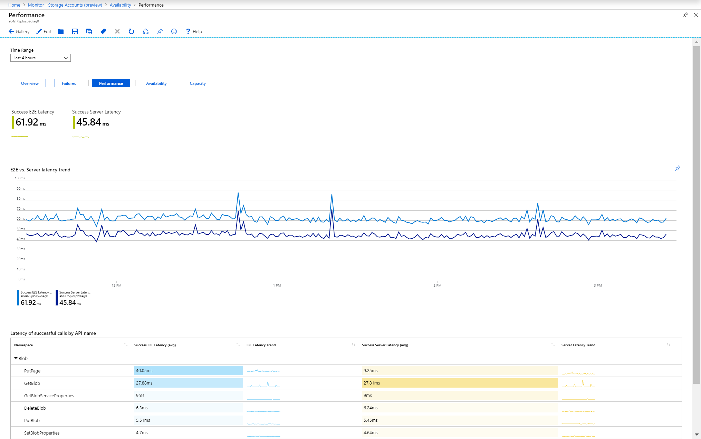

* Selecting any of the error categories listed in the grid open the **Failure** workbook. The report shows metric tiles of all other client-side errors except described ones and successful requests, client-throttling errors, a performance chart for the transaction **Response Type** dimension metric specific to ClientOtherError attribute, and two tables - **Transactions by API name** and **Transactions by Response type**.

   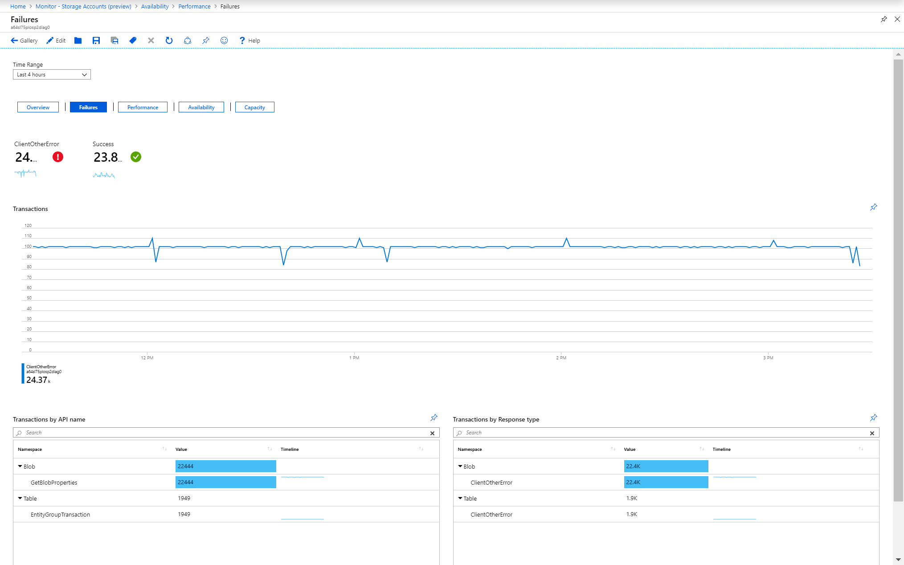

* **Capacity** opens the **Capacity** workbook. It shows the total amount of storage used for each storage data object in the account in the tiles and the chart, and how many data objects are stored in the account.  

     

## Pin and export

You can pin any one of the metric sections to an Azure Dashboard by selecting the pushpin icon at the top right of the section.

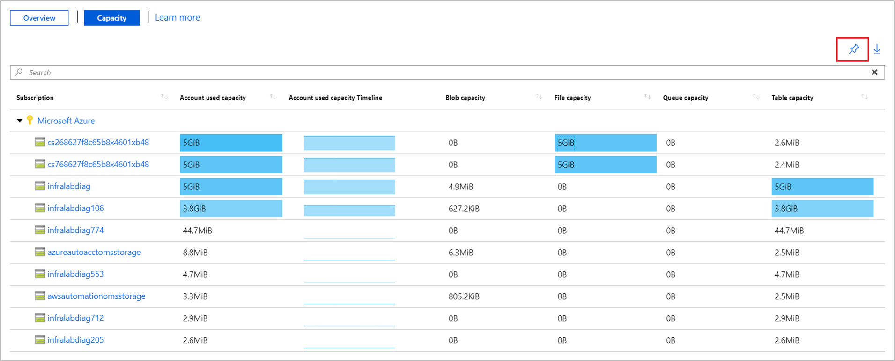

The multi-subscription and storage account **Overview** or **Capacity** workbooks support exporting the results in Excel format by selecting the down arrow icon to the right of the pushpin icon.

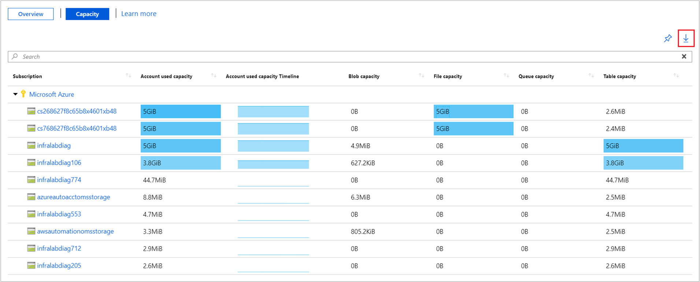

## Customize Azure Monitor for Storage

This section highlights common scenarios for editing the workbook to customize in support of your data analytics needs:

* Scope the workbook to always select a particular subscription or storage account(s)
* Change metrics in the grid
* Change the availability threshold
* Change the color rendering

The customizations are saved to a custom workbook to prevent overwriting the default configuration in our published workbook. Workbooks are saved within a resource group, either in the **My Reports** section that's private to you or in the **Shared Reports** section that's accessible to everyone with access to the resource group. After you save the custom workbook, you need to go to the workbook gallery to launch it.

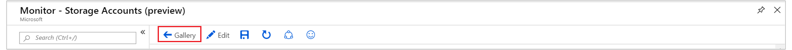

### Specifying a subscription or storage account

You can configure the multi-subscription and storage account **Overview** or **Capacity** workbooks to scope to a particular subscription(s) or storage account(s) on every run, perform the following steps.

1. Select **Monitor** from the portal and then select **Storage Accounts** from the left-hand pane.

2. On the **Overview** workbook, from the command bar select **Edit**.

3. Select from the **Subscriptions** drop-down list one or more subscriptions you want it to default to. Remember, the workbook supports selecting up to a total of 10 subscriptions.  

4. Select from the **Storage Accounts** drop-down list one or more accounts you want it to default to. Remember, the workbook supports selecting up to a total of 200 storage accounts. 

5. Select **Save as** from the command bar to save a copy of the workbook with your customizations, and then click **Done editing** to return to reading mode.  

### Modify metrics and colors in the workbook

The prebuilt workbooks contain metric data and you have the ability to modify or remove any one of the visualizations and customize to your team's specific needs.

In our example, we are working with the multi-subscription and storage account capacity workbook, to demonstrate how to:

* Remove a metric
* Change color rendering

You can perform the same changes against any one of the prebuilt **Failures**, **Performance**, **Availability**, and **Capacity** workbooks.

1. Select **Monitor** from the portal and then select **Storage Accounts** from the left-hand pane.

2. Select **Capacity** to switch to the capacity workbook and from the command bar, select **Edit** from the command bar.

    

3. Next to the metrics section, select **Edit**.

    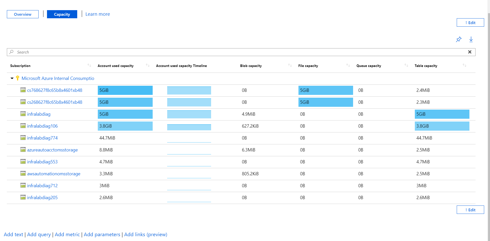

4. We are going to remove the **Account used capacity timeline** column, so select **Column Settings** in the metrics grid.

    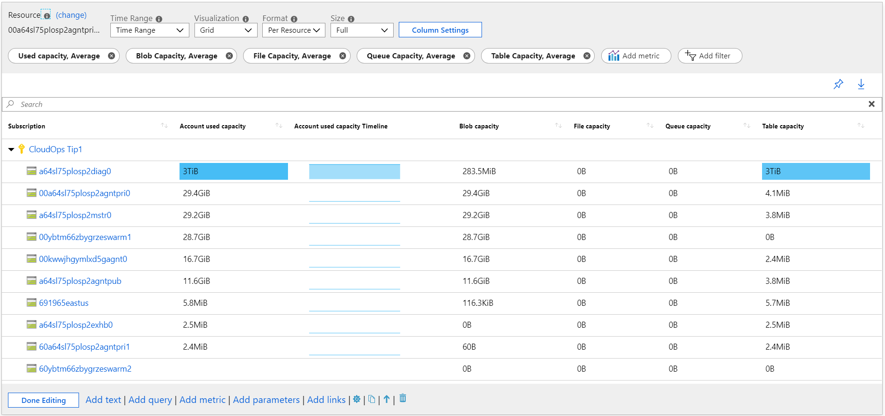

5. In the **Edit column settings** pane, select under the **Columns** section **microsoft.storage/storageaccounts-Capacity-UsedCapacity Timeline$|Account used capacity Timeline$**, and under the drop-down list **Column renderer** select **Hidden**.

6. Select **Save and close** to commit your change.

Now let's change the color theme for the capacity metrics in the report to use green instead of blue.

1. Select **Column Settings** in the metrics grid.

2. In the **Edit column settings** pane, select under the **Columns** section **microsoft.storage/storageaccounts-Capacity-UsedCapacity$|microsoft.storage/storageaccounts/blobservices-Capacity-BlobCapacity$|microsoft.storage/storageaccounts/fileservices-Capacity-FileCapacity$|microsoft.storage/storageaccounts/queueservices-Capacity-QueueCapacity$|microsoft.storage/storageaccounts/tableservices-Capacity-TableCapacity$**. Under the drop-down list **Color palette**, select **Green**.

3. Select **Save and close** to commit your change.

4. Select **Save as** from the command bar to save a copy of the workbook with your customizations, and then click **Done editing** to return to reading mode.  

### Modify the availability threshold

In this example, we are working with the storage account capacity workbook and demonstrating how to modify the availability threshold. By default, the tile and grid reporting percent availability are configured with a minimum threshold of 90 and maximum threshold of 99. We are going to change the minimum threshold value of the **Availability %** in the **Availability by API name** grid to 85%, which means the health state changes to critical if the threshold is less than 85 percent. 

1. Select **Storage accounts** from the portal and then select a storage account from the list.

2. Select **Insights** from the left-hand pane.

3. In the workbook, select **Availability** to switch to the availability workbook, and then select **Edit** from the command bar. 

4. Scroll down to the bottom of the page and on the left-hand side next to the **Availability by API** grid, select **Edit**.

    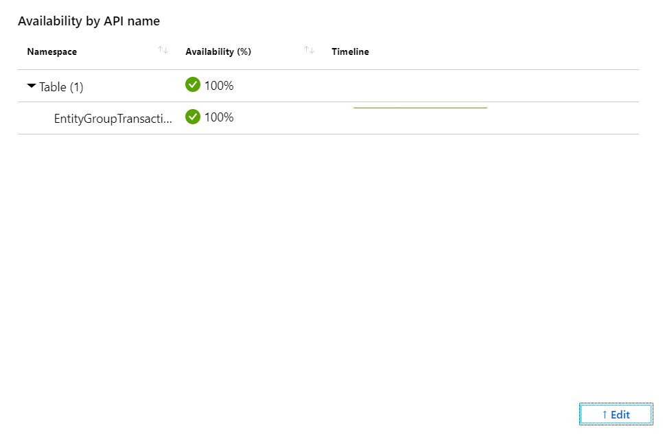

5. Select **Column settings** and then in the **Edit column settings** pane, under the **Columns** section select **Availability (%) (Thresholds + Formatted)**.

6. Change the value for the **Critical** health state from **90** to **85** and then click **Save and Close**.

    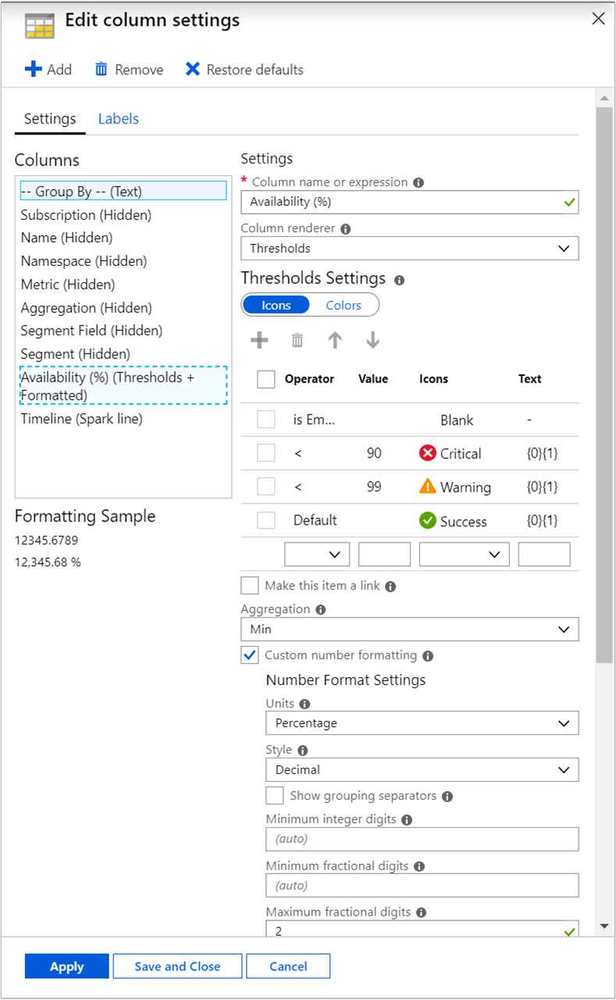

7. Select **Save as** from the command bar to save a copy of the workbook with your customizations, and then click **Done editing** to return to reading mode.

## Troubleshooting

This section will help you with the diagnosis and troubleshooting of some of the common issues you may encounter when using Azure Monitor for Storage. Use the list below to locate the information relevant to your specific issue.

### Resolving performance, capacity, or availability issues

To help troubleshoot any storage-related issues you identify with Azure Monitor for Storage, see the Azure Storage [troubleshooting guidance](../../storage/common/storage-monitoring-diagnosing-troubleshooting.md#troubleshooting-guidance).  

### Why can I only see 200 storage accounts?

The number of selected storage accounts has a limit of 200, regardless of the number of subscriptions that are selected.

### What happens when I click on a recently pinned tile in the dashboard?

* If you click anywhere on the tile, it will take you to the tab where the tile was pinned from. For example, if you pin a graph in the "Storage Account Overview" tab then when you click that tile in the dashboard it will open up that default view, however if you pin a graph from your own saved copy then it will open up your saved copy's view.
* The filter icon in the top left of the title opens the "Configure tile settings" tab.
* The ellipse icon in the top right will give you the options to "Customize title data", "customize", "refresh" and "remove from dashboard".

### What happens when I save a workbook?

* When you save a workbook, it lets you create a new copy of the workbook with your edits and change the title. Saving does not overwrite the workbook, the current workbook will always be the default view.
* An **unsaved** workbook is just the default view.

### Why don’t I see all my subscriptions in the portal?

The portal will show data only for selected subscriptions on portal launch. To change what subscriptions are selected, go to the top right and click on the notebook with a filter icon. This will show the Directory + subscriptions tab.

### How to change the coloring and threshold for availability?

Refer to the [Modify the availability threshold](storage-insights-overview.md#modify-the-availability-threshold)
section for the detailed steps on how to change the coloring and thresholds for availability.

### How to analyze and troubleshoot the data shown in Azure Monitor for Storage?

 Refer to the [Monitor, diagnose, and troubleshoot Microsoft Azure Storage](https://docs.microsoft.com/azure/storage/common/storage-monitoring-diagnosing-troubleshooting) article for details on how to analyze and troubleshoot the Azure Storage data shown in Azure Monitor for Storage.

### Why don’t I see all the types of errors in metrics?

Currently, up to three different types of errors are shown and the rest of the errors are grouped together in a single bucket. It is controlled using splitByLimit and can be modified. For changing this property:

1. Click on edit workbook.
2. Go to metrics, click on edit and then select **Transactions, Sum** or whatever metrics you want to edit.

    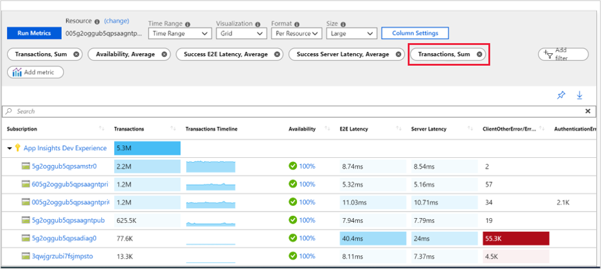

1. Then change the Number of Splits.

    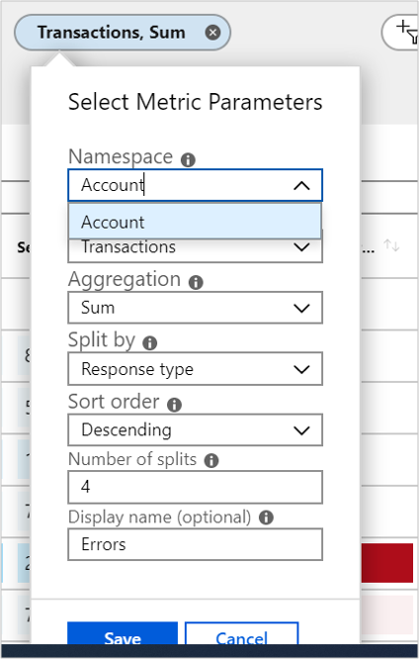

If you want to see n different types of error than specify splitByLimit as n+1, 1 extra for rest of the errors.

###  I saved my workbook while on some Storage Account. Why can’t I find it now?

Each workbook is saved in the storage account that you saved it in. Try to find the specific Storage Account in which the user saved the workbook. Otherwise, there is no way to find a specific workbook without knowing the resource (storage account).

### What is time range?

Time range shows you data from a certain time frame. For example, if the time range is 24 hours, then it's showing data from the past 24 hours.

### What is time granularity (time grain)?

Time granularity is the time difference between two data points. For example, if the time grain is set to 1 second that means metrics are collected each second.

### What is the time granularity once we pin any part of the workbooks to a dashboard?

The default time granularity is set to automatic, it currently can't be changed at this time.

### How do I change the timespan/ time range of the workbook step on my dashboard?

By default the timespan/time range on your dashboard tile is set to 24 hours, to change this click on the ellipses in the top right, select **Customize tile data**, check "override the dashboard time settings at the title level" box and then pick a timespan using the dropdown menu.  

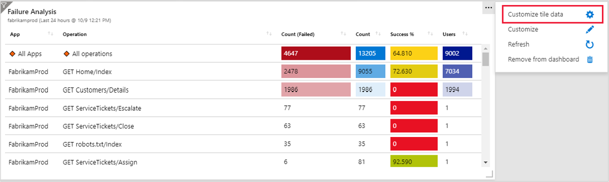

### How do I change the title of the workbook or a workbook step I pinned to a dashboard?

The title of the workbook or workbook step that is pinned to a dashboard retains the same name it had in the workbook. To change the title, you must save your own copy of the workbook. Then you will be able to name the workbook before you press save.

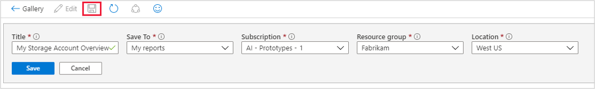

To change the name of a step in your saved workbook select edit under the step and then select the gear at the very bottom of settings.

## Next steps

* Configure [metric alerts](../platform/alerts-metric.md) and [service health notifications](../../service-health/alerts-activity-log-service-notifications.md) to set up automated alerting to aid in detecting issues.

* Learn the scenarios workbooks are designed to support, how to author new and customize existing reports, and more by reviewing [Create interactive reports with Azure Monitor workbooks](../platform/workbooks-overview.md).

* For an in-depth guide on using Storage Analytics and other tools to identify, diagnose, and troubleshoot Azure Storage-related issues, see [Monitor, diagnose, and troubleshoot Microsoft Azure Storage](../../storage/common/storage-monitoring-diagnosing-troubleshooting.md).
