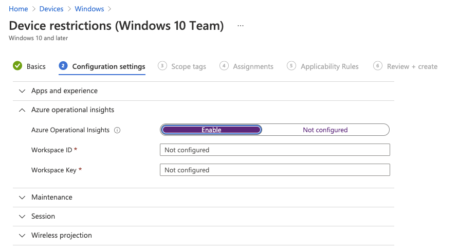
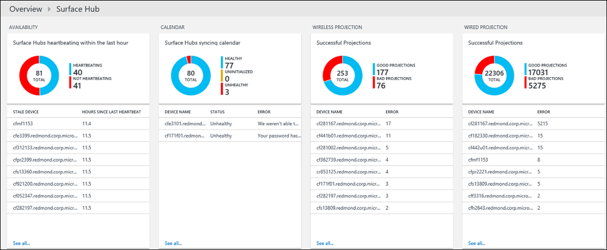

# Monitor Surface Hubs with Azure Monitor to track their health

This article describes how you can use the Surface Hub solution in Azure Monitor to monitor Microsoft Surface Hub devices. The solution helps you track the health of your Surface Hubs as well as understand how they are being used.

Each Surface Hub has the Microsoft Monitoring Agent installed. Its through the agent that you can send data from your Surface Hub to a Log Analytics workspace in Azure Monitor. Log files are read from your Surface Hubs and are then are sent to Azure Monitor. Issues like servers being offline, the calendar not syncing, or if the device account is unable to log into Skype are shown in the Surface Hub dashboard in Azure Monitor. By using the data in the dashboard, you can identify devices that are not running, or that are having other problems, and potentially apply fixes for the detected issues.

## Install and configure the solution
Use the following information to install and configure the solution. In order to manage your Surface Hubs in Azure Monitor, you'll need the following:

* A [Log Analytics subscription](https://azure.microsoft.com/pricing/details/log-analytics/) level that will support the number of devices you want to monitor. Log Analytics pricing varies depending on how many devices are enrolled, and how much data it processes. You'll want to take this into consideration when planning your Surface Hub rollout.

Next, you will either add an existing Log Analytics workspace or create a new one. Detailed instructions for using either method is at [Create a Log Analytics workspace in the Azure portal](../learn/quick-create-workspace.md). Once the Log Analytics workspace is configured, there are two ways to enroll your Surface Hub devices:

* Automatically through Intune
* Manually through **Settings** on your Surface Hub device.

## Set up monitoring
You can monitor the health and activity of your Surface Hub using Azure Monitor. You can enroll the Surface Hub by using Intune, or locally by using **Settings** on the Surface Hub.

## Connect Surface Hubs to Azure Monitor through Intune
You'll need the workspace ID and workspace key for the Log Analytics workspace that will manage your Surface Hubs. You can get those from the workspace settings in the Azure portal.

Intune is a Microsoft product that allows you to centrally manage the Log Analytics workspace configuration settings that are applied to one or more of your devices. Follow these steps to configure your devices through Intune:

1. Sign in to Intune.
2. Navigate to **Settings** > **Connected Sources**.
3. Create or edit a policy based on the Surface Hub template.
4. Navigate to the Azure Operational Insights section of the policy, and add the Log Analytics *Workspace ID* and *Workspace Key* to the policy.
5. Save the policy.
6. Associate the policy with the appropriate group of devices.

   

Intune then syncs the Log Analytics settings with the devices in the target group, enrolling them in your Log Analytics workspace.

## Connect Surface Hubs to Azure Monitor using the Settings app
You'll need the workspace ID and workspace key for the Log Analytics workspace that will manage your Surface Hubs. You can get those from the settings for the Log Analytics workspace in the Azure portal.

If you don't use Intune to manage your environment, you can enroll devices manually through **Settings** on each Surface Hub:

1. From your Surface Hub, open **Settings**.
2. Enter the device admin credentials when prompted.
3. Click **This device**, and the under **Monitoring**, click **Configure Log Analytics Settings**.
4. Select **Enable monitoring**.
5. In the Log Analytics settings dialog, type the Log Analytics **Workspace ID** and type the **Workspace Key**.  
   
6. Click **OK** to complete the configuration.

A confirmation appears telling you whether or not the configuration was successfully applied to the device. If it was, a message appears stating that the agent successfully connected to Azure Monitor. The device then starts sending data to Azure Monitor where you can view and act on it.

## Monitor Surface Hubs
Monitoring your Surface Hubs using Azure Monitor is much like monitoring any other enrolled devices.

[!INCLUDE [azure-monitor-solutions-overview-page](../../../includes/azure-monitor-solutions-overview-page.md)]

When you click on the Surface Hub tile, your device's health is displayed.

   

You can create [alerts](../platform/alerts-overview.md) based on existing or custom log searches. Using the data Azure Monitor collects from your Surface Hubs, you can search for issues and alert on the conditions that you define for your devices.

## Next steps
* Use [Log queries in Azure Monitor](../log-query/log-query-overview.md) to view detailed Surface Hub data.
* Create [alerts](../platform/alerts-overview.md) to notify you when issues occur with your Surface Hubs.
