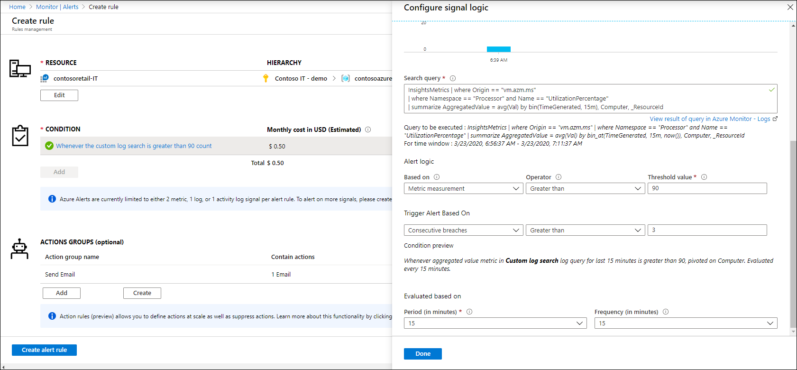

# How to create alerts from Azure Monitor for VMs
[Alerts in Azure Monitor](../platform/alerts-overview.md) proactively notify you of interesting data and patterns in your monitoring data. Azure Monitor for VMs does not include pre-configured alert rules, but you can create your own based on data that it collects. This article provides guidance on creating alert rules, including a set of sample queries.


## Alert rule types
Azure Monitor has [different types of alert rules](../platform/alerts-overview.md#what-you-can-alert-on) based on the data being used to create the alert. All data collected by Azure Monitor for VMs is stored in Azure Monitor Logs which supports [log alerts](../platform/alerts-log.md). You cannot currently use [metric alerts](../platform/alerts-log.md) with performance data collected from Azure Monitor for VMs because the data is not collected into Azure Monitor Metrics. To collect data for metric alerts, install the [diagnostics extension](../platform/diagnostics-extension-overview.md) for Windows VMs or the [Telegraf agent](../platform/collect-custom-metrics-linux-telegraf.md) for Linux VMs to collect performance data into Metrics.

There are two types of log alerts in Azure Monitor:

- [Number of results alerts](../platform/alerts-unified-log.md#number-of-results-alert-rules) create a single alert when a query returns at least a specified number of records. These are ideal for non-numeric data such and Windows and Syslog events collected by the [Log Analytics agent](../platform/log-analytics-agent.md) or for analyzing performance trends across multiple computers.
- [Metric measurement alerts](../platform/alerts-unified-log.md#metric-measurement-alert-rules) create a separate alert for each record in a query that has a value that exceeds a threshold defined in the alert rule. These alert rules are ideal for performance data collected by Azure Monitor for VMs since they can create individual alerts for each computer.


## Alert rule walkthrough
This section walks through the creation of a metric measurement alert rule using performance data from Azure Monitor for VMs. You can use this basic process with a variety of log queries to alert on different performance counters.

Start by creating a new alert rule following the procedure in [Create, view, and manage log alerts using Azure Monitor](../platform/alerts-log.md). For the **Resource**, select the Log Analytics workspace that Azure Monitor VMs uses in your subscription. Since the target resource for log alert rules is always a Log Analytics workspace, the log query must include any filter for particular virtual machines or virtual machine scale sets. 

For the **Condition** of the alert rule, use one of the queries in the [section below](#sample-alert-queries) as the **Search query**. The query must return a numeric property called *AggregatedValue*. It should summarize the data by computer so that you can create a separate alert for each virtual machine that exceeds the threshold.

In the **Alert logic**, select **Metric measurement** and then provide a **Threshold value**. In **Trigger Alert Based On**, specify how many times the threshold must be exceeded before an alert is created. For example, you probably don't care if the processor exceeds a threshold once and then returns to normal, but you do care if it continues to exceed the threshold over multiple consecutive measurements.

The **Evaluated based on** section defines how often the query is run and the time window for the query. In the example shown below, the query will run every 15 minutes and evaluate performance values collected over the previous 15 minutes.




## Sample alert queries
The following queries can be used with a metric measurement alert rule using performance data collected by Azure Monitor for VMs. Each summarizes data by computer so that an alert is created for each computer with a value that exceeds the threshold.

### CPU utilization

```kusto
InsightsMetrics
| where Origin == "vm.azm.ms" 
| where Namespace == "Processor" and Name == "UtilizationPercentage" 
| summarize AggregatedValue = avg(Val) by bin(TimeGenerated, 15m), Computer, _ResourceId
```

### Available Memory in MB

```kusto
InsightsMetrics
| where Origin == "vm.azm.ms"
| where Namespace == "Memory" and Name == "AvailableMB"
| summarize AggregatedValue = avg(Val) by bin(TimeGenerated, 15m), Computer, _ResourceId
```

### Available Memory in percentage

```kusto
InsightsMetrics 
| where Origin == "vm.azm.ms" 
| where Namespace == "Memory" and Name == "AvailableMB" 
| extend TotalMemory = toreal(todynamic(Tags)["vm.azm.ms/memorySizeMB"])
| extend AvailableMemoryPercentage = (toreal(Val) / TotalMemory) * 100.0 
| summarize AggregatedValue = avg(AvailableMemoryPercentage) by bin(TimeGenerated, 15m), Computer, _ResourceId 
```

### Logical disk used - all disks on each computer

```kusto
InsightsMetrics
| where Origin == "vm.azm.ms"
| where Namespace == "LogicalDisk" and Name == "FreeSpacePercentage"
| summarize AggregatedValue = avg(Val) by bin(TimeGenerated, 15m), Computer, _ResourceId 
```

### Logical disk used - individual disks

```kusto
InsightsMetrics
| where Origin == "vm.azm.ms"
| where Namespace == "LogicalDisk" and Name == "FreeSpacePercentage"
| extend Disk=tostring(todynamic(Tags)["vm.azm.ms/mountId"])
| summarize AggregatedValue = avg(Val) by bin(TimeGenerated, 15m), Computer, _ResourceId, Disk
```

### Logical disk IOPS

```kusto
InsightsMetrics
| where Origin == "vm.azm.ms" 
| where Namespace == "LogicalDisk" and Name == "TransfersPerSecond"
| extend Disk=tostring(todynamic(Tags)["vm.azm.ms/mountId"])
| summarize AggregatedValue = avg(Val) by bin(TimeGenerated, 15m) ), Computer, _ResourceId, Disk
```

### Logical disk data rate

```kusto
InsightsMetrics
| where Origin == "vm.azm.ms" 
| where Namespace == "LogicalDisk" and Name == "BytesPerSecond"
| extend Disk=tostring(todynamic(Tags)["vm.azm.ms/mountId"])
| summarize AggregatedValue = avg(Val) by bin(TimeGenerated, 15m) , Computer, _ResourceId, Disk
```

### Network interfaces bytes received - all interfaces

```kusto
InsightsMetrics
| where Origin == "vm.azm.ms"
| where Namespace == "Network" and Name == "ReadBytesPerSecond"
| summarize AggregatedValue = avg(Val) by bin(TimeGenerated, 15m), Computer, _ResourceId 
```

### Network interfaces bytes received - individual interfaces

```kusto
InsightsMetrics
| where Origin == "vm.azm.ms"
| where Namespace == "Network" and Name == "ReadBytesPerSecond"
| extend NetworkInterface=tostring(todynamic(Tags)["vm.azm.ms/networkDeviceId"])
| summarize AggregatedValue = avg(Val) by bin(TimeGenerated, 15m), Computer, _ResourceId, NetworkInterface
```

### Network interfaces bytes sent - all interfaces

```kusto
InsightsMetrics
| where Origin == "vm.azm.ms"
| where Namespace == "Network" and Name == "WriteBytesPerSecond"
| summarize AggregatedValue = avg(Val) by bin(TimeGenerated, 15m), Computer, _ResourceId
```

### Network interfaces bytes sent - individual interfaces

```kusto
InsightsMetrics
| where Origin == "vm.azm.ms"
| where Namespace == "Network" and Name == "WriteBytesPerSecond"
| extend NetworkInterface=tostring(todynamic(Tags)["vm.azm.ms/networkDeviceId"])
| summarize AggregatedValue = avg(Val) by bin(TimeGenerated, 15m), Computer, _ResourceId, NetworkInterface
```

### Virtual machine scale set
Modify with your subscription ID, resource group, and virtual machine scale set name.

```kusto
InsightsMetrics
| where Origin == "vm.azm.ms"
| where _ResourceId startswith "/subscriptions/xxxxxxxx-xxxx-xxxx-xxxx-xxxxxxxxxxxx/resourceGroups/my-resource-group/providers/Microsoft.Compute/virtualMachineScaleSets/my-vm-scaleset" 
| where Namespace == "Processor" and Name == "UtilizationPercentage"
| summarize AggregatedValue = avg(Val) by bin(TimeGenerated, 15m), _ResourceId
```

### Specific virtual machine
Modify with your subscription ID, resource group, and VM name.

```kusto
InsightsMetrics
| where Origin == "vm.azm.ms"
| where _ResourceId =~ "/subscriptions/xxxxxxxx-xxxx-xxxx-xxxx-xxxxxxxxxxxx/resourceGroups/my-resource-group/providers/Microsoft.Compute/virtualMachines/my-vm" 
| where Namespace == "Processor" and Name == "UtilizationPercentage"
| summarize AggregatedValue = avg(Val) by bin(TimeGenerated, 15m)
```

### CPU utilization for all compute resources in a subscription
Modify with your subscription ID.

```kusto
InsightsMetrics
| where Origin == "vm.azm.ms"
| where _ResourceId startswith "/subscriptions/xxxxxxxx-xxxx-xxxx-xxxx-xxxxxxxxxxxx" and (_ResourceId contains "/providers/Microsoft.Compute/virtualMachines/" or _ResourceId contains "/providers/Microsoft.Compute/virtualMachineScaleSets/")
| where Namespace == "Processor" and Name == "UtilizationPercentage"
| summarize AggregatedValue = avg(Val) by bin(TimeGenerated, 15m), _ResourceId
```

### CPU utilization for all compute resources in a resource group
Modify with your subscription ID and resource group.

```kusto
InsightsMetrics
| where Origin == "vm.azm.ms"
| where _ResourceId startswith "/subscriptions/xxxxxxxx-xxxx-xxxx-xxxx-xxxxxxxxxxxx/resourceGroups/my-resource-group/providers/Microsoft.Compute/virtualMachines/"
or _ResourceId startswith "/subscriptions/xxxxxxxx-xxxx-xxxx-xxxx-xxxxxxxxxxxx/resourceGroups/my-resource-group/providers/Microsoft.Compute/virtualMachineScaleSets/" 
| where Namespace == "Processor" and Name == "UtilizationPercentage"
| summarize AggregatedValue = avg(Val) by bin(TimeGenerated, 15m), _ResourceId

```

## Next steps

- Learn more about [alerts in Azure Monitor](../platform/alerts-overview.md).
- Learn more about [log queries using data from Azure Monitor for VMs](vminsights-log-search.md).
