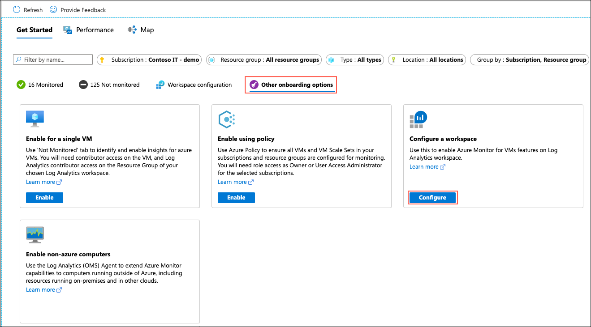
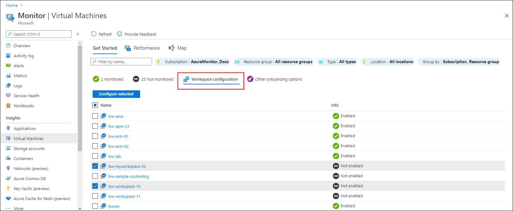

# Configure Log Analytics workspace for Azure Monitor for VMs
Azure Monitor for VMs collects its data from one or more Log Analytics workspaces in Azure Monitor. Prior to onboarding agents, you must create and configure a workspace. This article describes the requirements of the workspace and to configure it for Azure Monitor for VMs.

## Overview
A single subscription can use any number of workspaces depending on your requirements The only requirement of the workspace is that it be located in a supported location and be configured with the *VMInsights* solution.

Once the workspace has been configured, you can use any of the available options to install the required agents on VM and VMMS and specify a workspace for them to send their data. Azure Monitor for VMs will collect data from any configured workspace in its subscription.

> [!NOTE]
> When you enable Azure Monitor for VMs on a single VM or VMMS using the Azure portal, you're given the option to select an existing workspace or create a new one. The *VMInsights* solution will be installed in this workspace if it isn't already. You can then use this workspace for other agents.


## Create Log Analytics workspace

>[!NOTE]
>The information described in this section is also applicable to the [Service Map solution](service-map.md). 

Access Log Analytics workspaces in the Azure portal from the **Log Analytics workspaces** menu.

[](media/vminsights-configure-workspace/log-analytics-workspaces.png#lightbox)

You can create a new Log Analytics workspace using any of the following methods. See [Designing your Azure Monitor Logs deployment](../platform/design-logs-deployment.md) for guidance on determining the number of workspaces you should use in your environment and how to design their access strategy.


* [Azure portal](../../azure-monitor/learn/quick-create-workspace.md)
* [Azure CLI](../../azure-monitor/learn/quick-create-workspace-cli.md)
* [PowerShell](../platform/powershell-workspace-configuration.md)
* [Azure Resource Manager](../../azure-monitor/platform/template-workspace-configuration.md)

## Supported regions

Azure Monitor for VMs supports Log Analytics workspaces in the following regions, although you can monitor virtual machines in any region. The virtual machines themselves aren't limited to the regions supported by the Log Analytics workspace.

- West Central US
- West US
- West US 2
- South Central US
- East US
- East US2
- Central US
- North Central US
- US Gov Az
- US Gov Va
- Canada Central
- UK South
- North Europe
- West Europe
- East Asia
- Southeast Asia
- Central India
- Japan East
- Australia East
- Australia Southeast

## Role-based access control
To enable and access the features in Azure Monitor for VMs, you must have the [Log Analytics contributor role](../platform/manage-access.md#manage-access-using-azure-permissions) in the workspace. To view performance, health, and map data, you must have the [monitoring reader role](../platform/roles-permissions-security.md#built-in-monitoring-roles) for the Azure VM. For more information about how to control access to a Log Analytics workspace, see [Manage workspaces](../platform/manage-access.md).

## Add VMInsights solution to workspace
Before a Log Analytics workspace can be used with Azure Monitor for VMs, it must have the *VMInsights* solution installed. The methods for configuring the workspace are described in the following sections.

> [!NOTE]
> When you add the *VMInsights* solution to the workspace, all existing virtual machines connected to the workspace will start to send data to InsightsMetrics. Data for the other data types won't be collected until you add the Dependency Agent to those existing virtual machines connected to the workspace.

### Azure portal
There are three options for configuring an existing workspace from the Azure portal.

To configure a single workspace, select the **Other onboarding options** and then **Configure a workspace**. Select a subscription and a workspace and then click **Configure**.

[](media/vminsights-enable-at-scale-policy/configure-workspace.png#lightbox)

To configure multiple workspaces, select the **Workspace configuration** tab in the **Virtual Machines** menu in the **Monitor** menu in the Azure portal. Set the filter values to display a list of existing workspaces. Select the box next to each workspace to enable and then click **Configure selected** .

[](media/vminsights-enable-at-scale-policy/workspace-configuration.png#lightbox)


When you enable Azure Monitor for VMs on a single VM or VMMS using the Azure portal, you're given the option to select an existing workspace or create a new one. The *VMInsights* solution will be installed in this workspace if it isn't already. You can then use this workspace for other agents.

[](media/vminsights-enable-single-vm/enable-vminsights-vm-portal.png#lightbox)


### Resource Manager template
The Azure Resource Manager templates for Azure Monitor for VMs are provided in an archive file (.zip) that you can [download from our GitHub repo](https://aka.ms/VmInsightsARMTemplates). This includes a template called **ConfigureWorkspace** that configures a Log Analytics workspace for Azure Monitor for VMs. You deploy this template using any of the standard methods including the sample PowerShell and CLI commands below: 

# [CLI](#tab/CLI)

```azurecli
az deployment group create --name ConfigureWorkspace --resource-group my-resource-group --template-file CreateWorkspace.json  --parameters workspaceResourceId='/subscriptions/00000000-0000-0000-0000-000000000000/resourcegroups/my-resource-group/providers/microsoft.operationalinsights/workspaces/my-workspace' workspaceLocation='eastus'

```

# [PowerShell](#tab/PowerShell)

```powershell
New-AzResourceGroupDeployment -Name ConfigureWorkspace -ResourceGroupName my-resource-group -TemplateFile ConfigureWorkspace.json -workspaceResourceId /subscriptions/00000000-0000-0000-0000-000000000000/resourcegroups/my-resource-group/providers/microsoft.operationalinsights/workspaces/my-workspace -location eastus
```

---


## Next steps
- See [Onboard agents to Azure Monitor for VMs](vminsights-enable-overview.md) to connect agents to Azure Monitor for VMs.
- See [Targeting monitoring solutions in Azure Monitor (Preview)](solution-targeting.md) to limit the amount of data sent from a solution to the workspace.