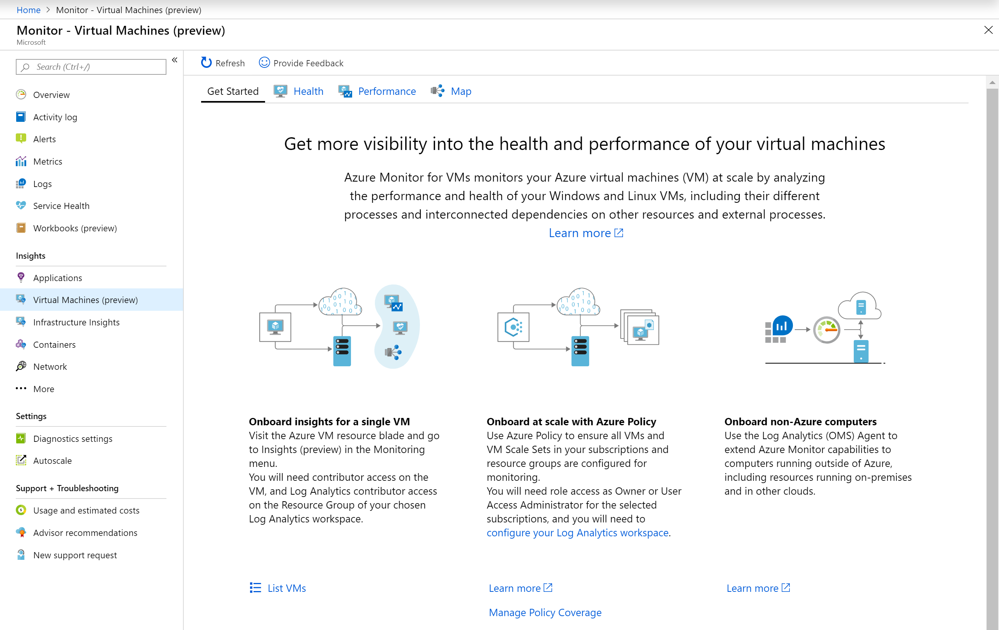
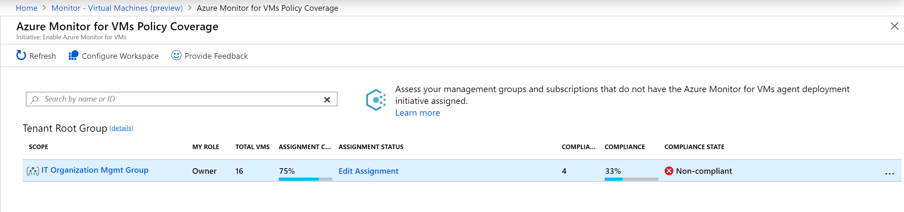
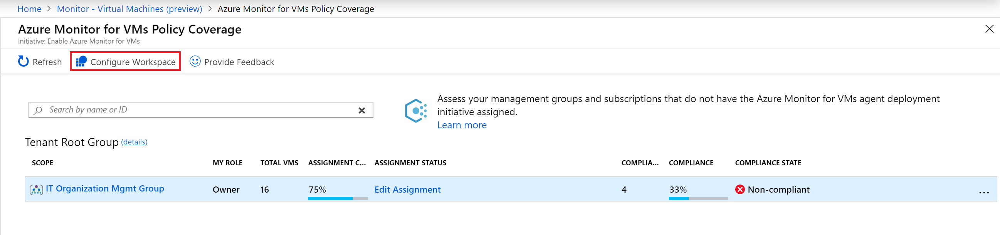

# Enable Azure Monitor for VMs (preview) using Azure Policy

This article explains how to enable Azure Monitor for VMs (preview) for Azure virtual machines or virtual machine scale sets using Azure Policy. At the end of this process you will have successfully configured enabling the Log Analytics and Dependency agents and identify virtual machines which are not compliant.

To discover, manage, and enable Azure Monitor for VMs for all of your Azure virtual machines or virtual machine scale sets, you can use either Azure Policy or Azure PowerShell. Azure Policy is the recommended method because you can manage policy definitions to effectively govern your subscrptions to ensure consistent compliance and automatic enabling of newly provisioned VMs. These policy definitions:

* Deploy the Log Analytics agent and the Dependency agent.
* Report on compliance results.
* Remediate for non-compliant VMs.

If you are interested in accomplishing this with Azure PowerShell or Azure Resource Manager template, see [Enable using Azure PowerShell or Resource Manager template](vminsights-enable-atscale-posh.md). 

## Azure Policy integrated experience overview

Originally the experience with Azure Policy for managing and deploying the policy definitions for Azure Monitor for VMs was performed exclusively from Azure Policy. Now the experience is integrated with Azure Policy to make it simple and easy to discover, manage, and enable at scale the **Enable Azure Monitor for VMs** initiative, which includes the policy definitions mentioned earlier. From the **Get started** tab in Azure Monitor for VMs, when you select **Manage Policy Coverage** the Azure Monitor for VMs Policy Coverage page opens. 

From here you can check and manage coverage for the initiative across your management groups and subscriptions, as well as understand how many VMs exist in each of the management groups and subscriptions and their compliance status.   

You can assign or provision the initiative for Azure Monitor for VMs to the desired scope, review compliance state for an initiative, and edit an assignment if necessary.  

This information is useful to plan and execute your governance scenario for Azure Monitor for VMs from one central location. While Azure Policy provides a compliance view when a policy/initiative is assigned to a scope, with this new page you can discover where the policy/initiative is not assigned and assign it in-place. All actions (assign, view, edit) redirect to Azure Policy directly. Azure Monitor for VMs Policy Coverage page is an expanded and integrated experience for only the initiative **Enable Azure Monitor for VMs**. 

From this page you can also configure your Log Analytics workspace for Azure Monitor for VMs, which performs the following:

- Installs the Installing Service Map and Infrastructure Insights solutions
- Enables the operating system performance counters used by the performance charts, workbooks, and your custom log queries and alerts.

This option isn't related to any policy actions and is available to provide an easy way to satisfy the [prerequisites](vminsights-enable-overview.md) required for enabling Azure Monitor for VMs.  

### What information is available on this page?
The following table provides a breakdown of what information is presented in the policy coverage page and how to interpret it.

| Function | Description | 
|----------|-------------| 
| Scope | Management group and subscriptions that you have or inherited access to with ability to drill down through the Management group hierarchy.|
| Role | Your role to the scope, could be reader owner, or contributor. In some cases, it may appear blank to indicate that you may have access to subscription but not to the management group it belongs. Information in other columns will vary depending on your role as it is key in determining what data you can see and actions you can perform in terms of assigning initiative/ policy (owner), editing them or view compliance. |
| Total VMs | Number of VMs under that scope. For a management group, it is a sum of VMs nested under the subscriptions and/or child management group. |
| Assignment Coverage | Percent of VMs that are covered by initiative/policy. |
| Assignment Status | Under this column, you can find information on the status of your policy/ initiative assignment. |
| Compliant VMs | Number of VMs that are compliant under the policy/initiative. For  the initiative **Enable Azure Monitor for VMs** this is the number of VMs that have both Log Analytics agent and Dependency agent. In some cases, it may appear blank due to either no assignment, or no VMs, or not enough permissions. Information is provided under Compliance State. |
| Compliance | The overall compliance number is the sum of distinct resources that are Compliant divided by the sum of all distinct resources. |
| Compliance State | Information on Compliance state for your policy/ initiative assignment.|

## Enable using Azure Policy

To enable Azure Monitor for VMs by using Azure Policy in your tenant:

- Assign the initiative to a scope: management group, subscription, or resource group
- Review and remediate compliance results

For more information about assigning Azure Policy, see [Azure Policy overview](../../governance/policy/overview.md#policy-assignment) and review the [overview of management groups](../../governance/management-groups/index.md) before you continue.

### Policies for Azure VMs

The policy definitions for an Azure VM are listed in the following table:

|Name |Description |Type |
|-----|------------|-----|
|[Preview]: Enable Azure Monitor for VMs |Enable Azure Monitor for the Virtual Machines (VMs) in the specified scope (management group, subscription, or resource group). Takes Log Analytics workspace as a parameter. |Initiative |
|[Preview]: Audit Dependency Agent Deployment – VM Image (OS) unlisted |Reports VMs as non-compliant if the VM Image (OS) isn't defined in the list and the agent isn't installed. |Policy |
|[Preview]: Audit Log Analytics Agent Deployment – VM Image (OS) unlisted |Reports VMs as non-compliant if the VM Image (OS) isn't defined in the list and the agent isn't installed. |Policy |
|[Preview]: Deploy Dependency Agent for Linux VMs |Deploy Dependency Agent for Linux VMs if the VM Image (OS) is defined in the list and the agent isn't installed. |Policy |
|[Preview]: Deploy Dependency Agent for Windows VMs |Deploy Dependency Agent for Windows VMs if the VM Image (OS) is defined in the list and the agent isn't installed. |Policy |
|[Preview]: Deploy Log Analytics Agent for Linux VMs |Deploy Log Analytics Agent for Linux VMs if the VM Image (OS) is defined in the list and the agent isn't installed. |Policy |
|[Preview]: Deploy Log Analytics Agent for Windows VMs |Deploy Log Analytics Agent for Windows VMs if the VM Image (OS) is defined in the list and the agent isn't installed. |Policy |

### Policies for Azure virtual machine scale sets

The policy definitions for an Azure virtual machine scale set are listed in the following table:

|Name |Description |Type |
|-----|------------|-----|
|[Preview]: Enable Azure Monitor for VM Scale Sets (VMSS) |Enable Azure Monitor for the virtual machine scale sets in the specified scope (Management group, Subscription or resource group). Takes Log Analytics workspace as parameter. Note: if your scale set upgradePolicy is set to Manual, you need to apply the extension to the all VMs in the set by calling upgrade on them. In CLI this would be az vmss update-instances. |Initiative |
|[Preview]: Audit Dependency Agent Deployment in VMSS – VM Image (OS) unlisted |Reports virtual machine scale set as non-compliant if the VM Image (OS) isn't defined in the list and the agent isn't installed. |Policy |
|[Preview]: Audit Log Analytics Agent Deployment in VMSS – VM Image (OS) unlisted |Reports virtual machine scale set as non-compliant if the VM Image (OS) isn't defined in the list and the agent isn't installed. |Policy |
|[Preview]: Deploy Dependency Agent for Linux VM Scale Sets (VMSS) |Deploy Dependency Agent for Linux virtual machine scale sets if the VM Image (OS) is defined in the list and the agent isn't installed. |Policy |
|[Preview]: Deploy Dependency Agent for Windows VM Scale Sets (VMSS) |Deploy Dependency Agent for Windows virtual machine scale sets if the VM Image (OS) is defined in the list and the agent isn't installed. |Policy |
|[Preview]: Deploy Log Analytics Agent for Linux VM Scale Sets (VMSS) |Deploy Log Analytics Agent for Linux virtual machine scale sets if the VM Image (OS) is defined in the list and the agent isn't installed. |Policy |
|[Preview]: Deploy Log Analytics Agent for Windows VM Scale Sets (VMSS) |Deploy Log Analytics Agent for Windows virtual machine scale sets if the VM Image (OS) is defined in the list and the agent isn't installed. |Policy |

Standalone policy (not included with the initiative) is described here:

|Name |Description |Type |
|-----|------------|-----|
|[Preview]: Audit Log Analytics Workspace for VM - Report Mismatch |Report VMs as non-compliant if they aren't logging to the Log Analytics workspace specified in the policy/initiative assignment. |Policy |

### Assign the Azure Monitor initiative
To create the policy assignment from the Azure Monitor for VMs Policy Coverage page, perform the following steps. To understand how to complete these steps, see [Create a policy assignment from the Azure portal](../../governance/policy/assign-policy-portal.md).

1. Sign in to the [Azure portal](https://portal.azure.com).

2. In the Azure portal, select **Monitor**. 

3. Choose **Virtual Machines (preview)** in the **Solutions** section.
 
4. Select the **Get Started** tab, and on the page select **Manage Policy Coverage**.

5. Select either a management group or subscription from the table, and select **Scope** by clicking the ellipse (...). 
        In our example, a scope limits the policy assignment to a grouping of virtual machines for enforcement.

6. On the **Azure Policy assignment** page it is pre-populated with the initiative **Enable Azure Monitor for VMs**. 
    The **Assignment name** box is automatically populated with the initiative name, but you can change it. You can also add an optional description. The **Assigned by** box is automatically populated based on who is logged in, and this value is optional.

7. (Optional) To remove one or more resources from the scope, select **Exclusions**.

8. In the **Log Analytics workspace** drop-down list for the supported region, select a workspace.

   > [!NOTE]
   > If the workspace is beyond the scope of the assignment, grant *Log Analytics Contributor* permissions to the policy assignment's Principal ID. If you don't do this, you might see a deployment failure such as: `The client '343de0fe-e724-46b8-b1fb-97090f7054ed' with object id '343de0fe-e724-46b8-b1fb-97090f7054ed' does not have authorization to perform action 'microsoft.operationalinsights/workspaces/read' over scope ...`
   > To grant access, review [how to manually configure the managed identity](../../governance/policy/how-to/remediate-resources.md#manually-configure-the-managed-identity).
   > 
   >  The **Managed Identity** check box is selected, because the initiative being assigned includes a policy with the *deployIfNotExists* effect.
    
9. In the **Manage Identity location** drop-down list, select the appropriate region.

10. Select **Assign**.

Once you create the assignment, the Azure Monitor for VMs Policy Coverage page will update Assignment Coverage, Assignment Status, Compliance VMs and Compliance State to reflect the changes. 

The following matrix maps each possible compliance state for the initiative.  

| Compliance State | Description | 
|------------------|-------------|
| Compliant | All VMs have the Log Analytics and Dependency agents deployed to them.|
| Not Compliant | Not all VMs have the Log Analytics and Dependency agents deployed to them and may require remediation.|
| Not started | A new assignment has been added. |
| Lock | You do not have sufficient privileges to the management group.1 | 
| Blank | No policy assigned. | 

1 If you don’t have access to the management group, ask an owner to provide access or view Compliance and manage Assignments through the child management groups or subscriptions.  

## Review and remediate the compliance results

The following example is for an Azure VM, but also applies to virtual machine scale sets. You can learn how to review compliance results by reading [identify non-compliance results](../../governance/policy/assign-policy-portal.md#identify-non-compliant-resources). On the Azure Monitor for VMs Policy Coverage page, select either a management group or subscription from the table, and select **View Compliance** by clicking the ellipse (...).   

Based on the results of the policies included with the initiative, VMs are reported as non-compliant in the following scenarios:

* Log Analytics or the Dependency agent isn't deployed.  
    This scenario is typical for a scope with existing VMs. To mitigate it, deploy the required agents by [creating remediation tasks](../../governance/policy/how-to/remediate-resources.md) on a non-compliant policy.  
    - [Preview]: Deploy Dependency Agent for Linux VMs
    - [Preview]: Deploy Dependency Agent for Windows VMs
    - [Preview]: Deploy Log Analytics Agent for Linux VMs
    - [Preview]: Deploy Log Analytics Agent for Windows VMs

* VM Image (OS) isn't identified in the policy definition.  
    The criteria of the deployment policy include only VMs that are deployed from well-known Azure VM images. Check the documentation to see whether the VM OS is supported. If it isn't supported, duplicate the deployment policy and update or modify it to make the image compliant.  
    - [Preview]: Audit Dependency Agent Deployment – VM Image (OS) unlisted
    - [Preview]: Audit Log Analytics Agent Deployment – VM Image (OS) unlisted

* VMs aren't logging in to the specified Log Analytics workspace.  
    It's possible that some VMs in the initiative scope are logging in to a Log Analytics workspace other than the one that's specified in the policy assignment. This policy is a tool to identify which VMs are reporting to a non-compliant workspace.  
    - [Preview]: Audit Log Analytics Workspace for VM - Report Mismatch

## Edit initiative assignment

At any time after assigning an initiative to a management group or subscription, you can edit it to modify the following properties:

- Assignment name
- Description
- Assigned by
- Log Analytics workspace
- Exceptions

## Next steps

Now that monitoring is enabled for your virtual machines, this information is available for analysis with Azure Monitor for VMs. To learn how to use the Health feature, see [View Azure Monitor for VMs Health](vminsights-health.md). To view discovered application dependencies, see [View Azure Monitor for VMs Map](vminsights-maps.md). To identify bottlenecks and overall utilization with your VMs performance, see [View Azure VM Performance](vminsights-performance.md), or to view discovered application dependencies, see [View Azure Monitor for VMs Map](vminsights-maps.md).