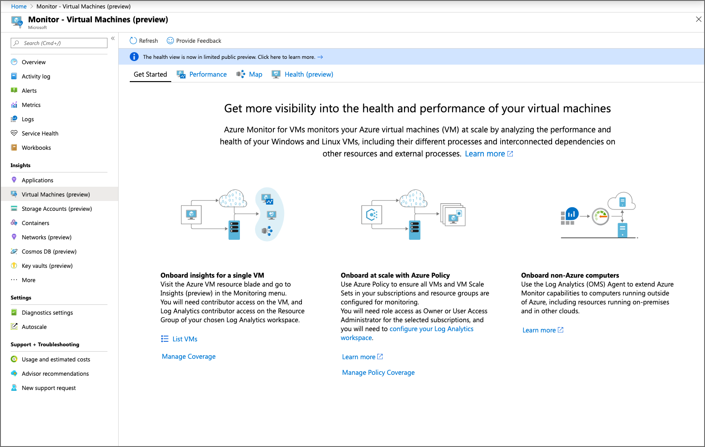
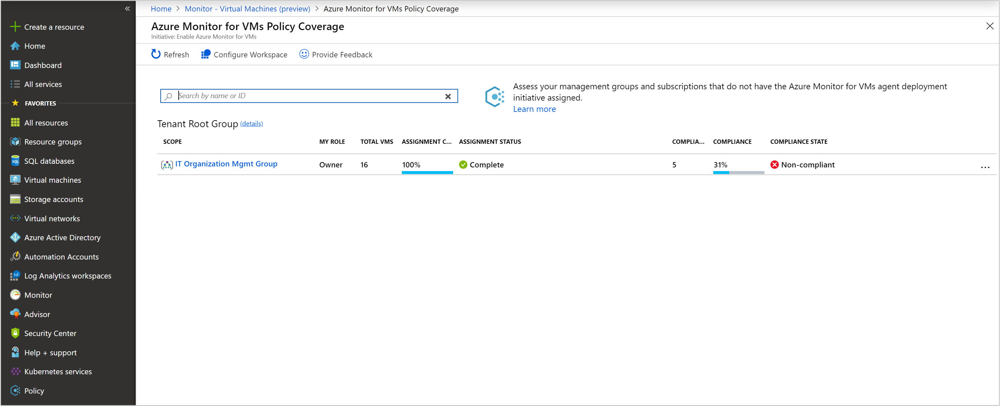
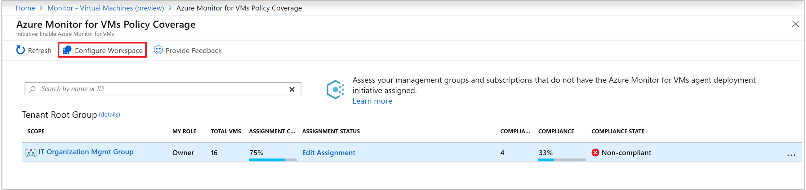
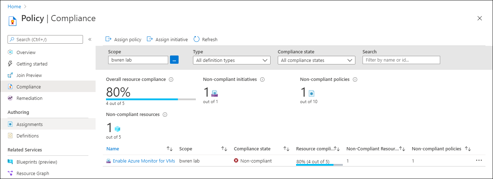

# Enable Azure Monitor for VMs by using Azure Policy
This article explains how to use Azure Policy to enable Azure Monitor for VMs at scale. This allows you to onboard large sets of existing virtual machines (VM) and virtual machine scale sets (VMSS) with minimal effort and to automatically onboard new resources as they're created.

## Manage Policy Coverage feature overview
The Policy Coverage feature simplifies managing the policy definitions that install and configure the agents required for Azure Monitor for VMs. Rather than working with Azure Policy directly, you can use this feature to discover, manage, and enable VMS and VMSS in your environment.

## Open Policy Coverage feature overview
To access this feature,  select **Other onboarding options** from the **Get Started** tab in Azure Monitor for VMs. Select **Enable** under **Enable using policy** to open the **Azure Monitor for VMs Policy Coverage** page.

From this view, you can check and manage coverage for the initiative across your management groups and subscriptions. You can understand how many VMs exist in each of the management groups and subscriptions and their compliance status.

This information is useful to help you plan and execute your governance scenario for Azure Monitor for VMs from one central location. While Azure Policy provides a compliance view when a policy or initiative is assigned to a scope, with this new page you can discover where the policy or initiative isn't assigned and assign it in place. All actions like assign, view, and edit redirect to Azure Policy directly. The **Azure Monitor for VMs Policy Coverage** page is an expanded and integrated experience for only the initiative **Enable Azure Monitor for VMs**.

From this page, you also can configure your Log Analytics workspace for Azure Monitor for VMs, which:

- Installs the Service Map solution.
- Enables the operating system performance counters used by the performance charts, workbooks, and your custom log queries and alerts.

This option isn't related to any policy actions. It's available to provide an easy way to satisfy the [prerequisites](vminsights-enable-overview.md) required for enabling Azure Monitor for VMs.  

### What information is available on this page?

The following table provides a breakdown of the information that's presented on the policy coverage page and how to interpret it.

| Function | Description | 
|----------|-------------| 
| **Scope** | Management group and subscriptions that you have or inherited access to with ability to drill down through the management group hierarchy.|
| **Role** | Your role to the scope, which might be reader, owner, or contributor. This will be blank if you have access to the subscription but not to the management group it belongs to. This role determines what data you can see and actions you can perform in terms of assigning policies or initiatives (owner), editing them, or viewing compliance. |
| **Total VMs** | Total number of VMs in that scope regardless of whether they're onboarded or not. For a management group, this is a sum total of VMs nested under the subscriptions or child management groups. |
| **Assignment Coverage** | Percent of VMs that are covered by the policy or initiative. |
| **Assignment Status** | Information on the status of your policy or  initiative assignment. |
| **Compliant VMs** | Number of VMs that are compliant, which is the number of VMs that have both Log Analytics agent and Dependency agent installed. This will be blank if there are no assignments, no VMs in the scope, or not proper permissions. |
| **Compliance** | The overall compliance number is the sum of distinct resources that are compliant divided by the sum of all distinct resources. |
| **Compliance State** | Information on the compliance state for your policy or initiative assignment.|

When you assign the policy or initiative, the scope selected in the assignment could be the scope listed or a subset of it. For instance, you might have created an assignment for a subscription (policy scope) and not a management group (coverage scope). In this case, the value of **Assignment Coverage** indicates the VMs in the policy or initiative scope divided by the VMs in coverage scope. In another case, you might have excluded some VMs, resource groups, or a subscription from policy scope. If the value is blank, it indicates that either the policy or initiative doesn't exist or you don't have permission. Information is provided under **Assignment Status**.

## Enable by using Azure Policy

To enable Azure Monitor for VMs by using Azure Policy in your tenant:

- Assign the initiative to a scope: management group, subscription, or resource group.
- Review and remediate compliance results.

For more information about assigning Azure Policy, see [Azure Policy overview](../../governance/policy/overview.md#assignments) and review the [overview of management groups](../../governance/management-groups/overview.md) before you continue.

### Policies for Azure VMs

The policy definitions for an Azure VM are listed in the following table.

|Name |Description |Type |
|-----|------------|-----|
|Enable Azure Monitor for VMs |Enable Azure Monitor for the virtual machines in the specified scope (management group, subscription, or resource group). Takes Log Analytics workspace as a parameter. |Initiative |
|Audit Dependency agent deployment – VM image (OS) unlisted |Reports VMs as noncompliant if the VM image (OS) isn't defined in the list and the agent isn't installed. |Policy |
|Audit Log Analytics agent deployment – VM image (OS) unlisted |Reports VMs as noncompliant if the VM image (OS) isn't defined in the list and the agent isn't installed. |Policy |
|Deploy Dependency agent for Linux VMs |Deploy Dependency agent for Linux VMs if the VM image (OS) is defined in the list and the agent isn't installed. |Policy |
|Deploy Dependency agent for Windows VMs |Deploy Dependency agent for Windows VMs if the VM image (OS) is defined in the list and the agent isn't installed. |Policy |
|Deploy Log Analytics agent for Linux VMs |Deploy Log Analytics agent for Linux VMs if the VM image (OS) is defined in the list and the agent isn't installed. |Policy |
|Deploy Log Analytics agent for Windows VMs |Deploy Log Analytics agent for Windows VMs if the VM image (OS) is defined in the list and the agent isn't installed. |Policy |

### Policies for Azure virtual machine scale sets

The policy definitions for an Azure virtual machine scale set are listed in the following table.

|Name |Description |Type |
|-----|------------|-----|
|Enable Azure Monitor for virtual machine scale sets |Enable Azure Monitor for the virtual machine scale sets in the specified scope (management group, subscription, or resource group). Takes Log Analytics workspace as a parameter. Note: If your scale set upgrade policy is set to Manual, apply the extension to all the VMs in the set by calling upgrade on them. In the CLI, this is `az vmss update-instances`. |Initiative |
|Audit Dependency agent deployment in virtual machine scale sets – VM image (OS) unlisted |Reports virtual machine scale set as noncompliant if the VM image (OS) isn't defined in the list and the agent isn't installed. |Policy |
|Audit Log Analytics agent deployment in virtual machine scale sets – VM image (OS) unlisted |Reports virtual machine scale set as noncompliant if the VM image (OS) isn't defined in the list and the agent isn't installed. |Policy |
|Deploy Dependency agent for Linux virtual machine scale sets |Deploy Dependency agent for Linux virtual machine scale sets if the VM image (OS) is defined in the list and the agent isn't installed. |Policy |
|Deploy Dependency agent for Windows virtual machine scale sets |Deploy Dependency agent for Windows virtual machine scale sets if the VM image (OS) is defined in the list and the agent isn't installed. |Policy |
|Deploy Log Analytics agent for Linux virtual machine scale sets |Deploy Log Analytics agent for Linux virtual machine scale sets if the VM Image (OS) is defined in the list and the agent isn't installed. |Policy |
|Deploy Log Analytics agent for Windows virtual machine scale sets |Deploy Log Analytics agent for Windows virtual machine scale sets if the VM image (OS) is defined in the list and the agent isn't installed. |Policy |

Standalone policy (not included with the initiative) is described here:

|Name |Description |Type |
|-----|------------|-----|
|Audit Log Analytics workspace for VM – Report mismatch |Report VMs as noncompliant if they aren't logging to the Log Analytics workspace specified in the policy or initiative assignment. |Policy |

### Assign the Azure Monitor initiative

To create the policy assignment from the **Azure Monitor for VMs Policy Coverage** page, follow these steps. To understand how to complete these steps, see [Create a policy assignment from the Azure portal](../../governance/policy/assign-policy-portal.md).

When you assign the policy or initiative, the scope selected in the assignment could be the scope listed here or a subset of it. For instance, you might have created an assignment for the subscription (policy scope) and not the management group (coverage scope). In this case, the coverage percentage would indicate the VMs in the policy or initiative scope divided by the VMs in the coverage scope. In another case, you might have excluded some VMs, or resource groups, or a subscription from the policy scope. If it's blank, it indicates that either the policy or initiative doesn't exist or you don't have permissions. Information is provided under **Assignment Status**.

1. Sign in to the [Azure portal](https://portal.azure.com).

2. In the Azure portal, select **Monitor**. 

3. Choose **Virtual Machines** in the **Insights** section.
 
4. Select the **Get Started** tab. On the page, select **Manage Policy Coverage**.

5. Select either a management group or a subscription from the table. Select **Scope** by selecting the ellipsis (...). 
        In the example, a scope limits the policy assignment to a grouping of virtual machines for enforcement.

6. On the **Azure Policy assignment** page, it's pre-populated with the initiative **Enable Azure Monitor for VMs**. 
    The **Assignment name** box is automatically populated with the initiative name, but you can change it. You also can add an optional description. The **Assigned by** box is automatically populated based on who is logged in. This value is optional.

7. (Optional) To remove one or more resources from the scope, select **Exclusions**.

8. In the **Log Analytics workspace** drop-down list for the supported region, select a workspace.

   > [!NOTE]
   > If the workspace is beyond the scope of the assignment, grant *Log Analytics Contributor* permissions to the policy assignment's Principal ID. If you don't do this, you might see a deployment failure like `The client '343de0fe-e724-46b8-b1fb-97090f7054ed' with object id '343de0fe-e724-46b8-b1fb-97090f7054ed' does not have authorization to perform action 'microsoft.operationalinsights/workspaces/read' over scope ...`
   > To grant access, review [how to manually configure the managed identity](../../governance/policy/how-to/remediate-resources.md#manually-configure-the-managed-identity).
   > 
   >  The **Managed Identity** check box is selected because the initiative being assigned includes a policy with the *deployIfNotExists* effect.
    
9. In the **Manage Identity location** drop-down list, select the appropriate region.

10. Select **Assign**.

After you create the assignment, the **Azure Monitor for VMs Policy Coverage** page updates **Assignment Coverage**, **Assignment Status**, **Compliant VMs**, and **Compliance State** to reflect the changes. 

The following matrix maps each possible compliance state for the initiative.  

| Compliance state | Description | 
|------------------|-------------|
| **Compliant** | All VMs in the scope have the Log Analytics and Dependency agents deployed to them.|
| **Not Compliant** | Not all VMs in the scope have the Log Analytics and Dependency agents deployed to them and might require remediation.|
| **Not Started** | A new assignment was added. |
| **Lock** | You don't have sufficient privileges to the management group.1 | 
| **Blank** | No policy is assigned. | 

1 If you don't have access to the management group, ask an owner to provide access. Or, view compliance and manage assignments through the child management groups or subscriptions. 

The following table maps each possible assignment status for the initiative.

| Assignment status | Description | 
|------------------|-------------|
| **Success** | All VMs in the scope have the Log Analytics and Dependency agents deployed to them.|
| **Warning** | The subscription isn't under a management group.|
| **Not Started** | A new assignment was added. |
| **Lock** | You don't have sufficient privileges to the management group.1 | 
| **Blank** | No VMs exist or a policy isn't assigned. | 
| **Action** | Assign a policy or edit an assignment. | 

1 If you don't have access to the management group, ask an owner to provide access. Or, view compliance and manage assignments through the child management groups or subscriptions.

## Review and remediate the compliance results

The following example is for an Azure VM, but it also applies to virtual machine scale sets. To learn how to review compliance results, see [Identify noncompliance results](../../governance/policy/assign-policy-portal.md#identify-non-compliant-resources). On the **Azure Monitor for VMs Policy Coverage** page, select either a management group or a subscription from the table. Select **View Compliance** by selecting the ellipsis (...).   

Based on the results of the policies included with the initiative, VMs are reported as noncompliant in the following scenarios:

* Log Analytics agent or Dependency agent isn't deployed.  
    This scenario is typical for a scope with existing VMs. To mitigate it, deploy the required agents by [creating remediation tasks](../../governance/policy/how-to/remediate-resources.md) on a noncompliant policy.  
    - Deploy Dependency agent for Linux VMs
    - Deploy Dependency agent for Windows VMs
    - Deploy Log Analytics agent for Linux VMs
    - Deploy Log Analytics agent for Windows VMs

* VM image (OS) isn't identified in the policy definition.  
    The criteria of the deployment policy include only VMs that are deployed from well-known Azure VM images. Check the documentation to see whether the VM OS is supported. If it isn't supported, duplicate the deployment policy and update or modify it to make the image compliant.  
    - Audit Dependency agent deployment – VM image (OS) unlisted
    - Audit Log Analytics agent deployment – VM image (OS) unlisted

* VMs aren't logging in to the specified Log Analytics workspace.  
    It's possible that some VMs in the initiative scope are logging in to a Log Analytics workspace other than the one that's specified in the policy assignment. This policy is a tool to identify which VMs are reporting to a noncompliant workspace.  
    - Audit Log Analytics workspace for VM – Report mismatch

## Edit an initiative assignment

At any time after you assign an initiative to a management group or subscription, you can edit it to modify the following properties:

- Assignment name
- Description
- Assigned by
- Log Analytics workspace
- Exceptions

## Next steps

Now that monitoring is enabled for your virtual machines, this information is available for analysis with Azure Monitor for VMs. 

- To view discovered application dependencies, see [View Azure Monitor for VMs Map](vminsights-maps.md). 

- To identify bottlenecks and overall utilization with your VM's performance, see [View Azure VM performance](vminsights-performance.md). 
