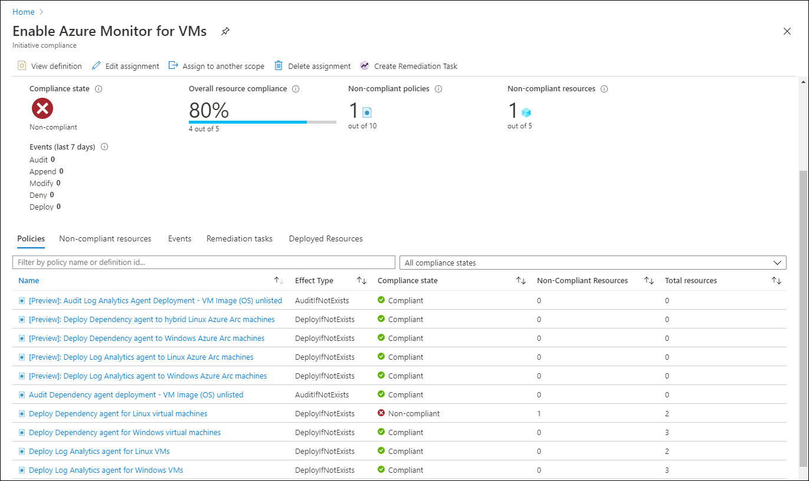
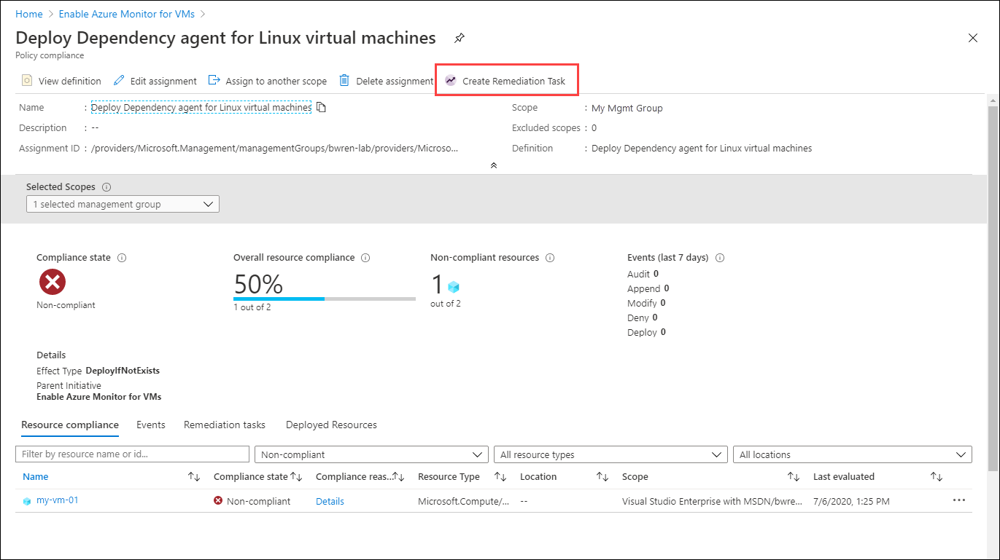

# Enable Azure Monitor for VMs by using Azure Policy
This article explains how to enable Azure Monitor for VMs to enable monitoring for Azure virtual machines using Azure Policy. This allows you to assign policies that will enable monitoring for all VMs across your Azure environment and automatically enable monitoring for VMs as they're created. Azure Monitor for VMs provides a feature that allows you to discover and remediate noncompliant VMs in your environment. You can use this feature rather than working directly with Azure Policy.

If you're not familiar with Azure Policy, get a brief introduction at [Deploy Azure Monitor at scale using Azure Policy](../platform/deploy-scale.md).

> [!NOTE]
> To use Azure Policy with Azure virtual machine scale sets or hybrid virtual machine connected with Azure Arc, or to work with Azure Policy directly to enable Azure virtual machines, see [Deploy Azure Monitor at scale using Azure Policy](deploy-scale.md#azure-monitor-for-vms).

## Prerequisites
- [Create and configure a Log Analytics workspace](vminsights-configure-workspace.md).
- See [Supported operating systems](vminsights-enable-overview#supported-operating-systems) to ensure that the operating system of the VM or VMSS you're enabling is supported. 

## Azure Monitor for VMs initiative
Azure Monitor for VMs provides builtin policy definitions to install the Log Analytics agent and Dependency agent on Azure virtual machines. The initiative **Enable Azure Monitor for VMs** includes each of these policy definitions. Assign the initiative to a management group, subscription, or resource group to automatically install the agents on any Azure virtual machines in that scope.

## Open Policy Coverage feature overview
To access **Azure Monitor for VMs Policy Coverage**, go the **Virtual machines** in the **Azure Monitor** menu in the Azure portal. Select **Other onboarding options** and then **Enable** under **Enable using policy**.

From this view, you can check and manage coverage for the **Enable Azure Monitor for VMs** initiative across your management groups and subscriptions. This will show how many VMs exist in each of the management groups or subscriptions and their compliance status.

The following table provides a breakdown of the information in this view.

| Function | Description | 
|----------|-------------| 
| **Scope** | Management group and subscriptions that you have or inherited access to with ability to drill down through the management group hierarchy.|
| **Role** | Your role in the scope, which might be reader, owner, or contributor. This will be blank if you have access to the subscription but not to the management group it belongs to. This role determines what data you can see and actions you can perform in terms of assigning policies or initiatives (owner), editing them, or viewing compliance. |
| **Total VMs** | Total number of VMs in that scope regardless of their status. For a management group, this is a sum total of VMs nested under the subscriptions or child management groups. |
| **Assignment Coverage** | Percent of VMs that are covered by the initiative. |
| **Assignment Status** | **Success** - All VMs in the scope have the Log Analytics and Dependency agents deployed to them. **Warning** - The subscription isn't under a management group. **Not Started** - A new assignment was added. **Lock** - You don't have sufficient privileges to the management group. **Blank** - No VMs exist or a policy isn't assigned. |
| **Compliant VMs** | Number of VMs that are compliant, which is the number of VMs that have both Log Analytics agent and Dependency agent installed. This will be blank if there are no assignments, no VMs in the scope, or not proper permissions. |
| **Compliance** | The overall compliance number is the sum of distinct resources that are compliant divided by the sum of all distinct resources. |
| **Compliance State** | **Compliant** - All VMs in the scope virtual machines have the Log Analytics and Dependency agents deployed to them or any new VMs in the scope subject to the assignment have not yet been evaluated. **Non-compliant** - There are VMs that have been evaluated but are not enabled and may require remediation. **Not Started** - A new assignment was added. **Lock** - You don't have sufficient privileges to the management group. **Blank** - No policy is assigned.  |

When you assign the initiative, the scope selected in the assignment could be the scope listed or a subset of it. For instance, you might have created an assignment for a subscription (policy scope) and not a management group (coverage scope). In this case, the value of **Assignment Coverage** indicates the VMs in the initiative scope divided by the VMs in coverage scope. In another case, you might have excluded some VMs, resource groups, or a subscription from policy scope. If the value is blank, it indicates that either the policy or initiative doesn't exist or you don't have permission. Information is provided under **Assignment Status**.

When you assign the Azure Monitor for VMs initiative, the scope selected in the assignment could be the scope listed here or a subset of it. For instance, you might have created an assignment for the subscription (policy scope) and not the management group (coverage scope). In this case, the coverage percentage would indicate the VMs in the policy or initiative scope divided by the VMs in the coverage scope. In another case, you might have excluded some VMs, or resource groups, or a subscription from the policy scope. If it's blank, it indicates that either the policy or initiative doesn't exist or you don't have permissions. Information is provided under **Assignment Status**.

## Assign the Azure Monitor for VMs initiative
To create a new assignment, click **Assign Policy**.

This is the same page to assign an initiative in Azure Policy except that it's hardcoded with the scope that you selected and the **Enable Azure Monitor for VMs** initiative definition. You can optionally change the **Assignment name** and add a **Description**. Select **Exclusions** if you want to provide an exclusion to the scope. For example, your scope could be a management group, and you could specify a subscription in that management group to be excluded from the assignment.

On the **Parameters** page, select a **Log Analytics workspace** to be used by all virtual machines in the assignment. If you want to specify different workspaces for different virtual machines, then you must create multiple assignments, each with their own scope. 

   > [!NOTE]
   > If the workspace is beyond the scope of the assignment, grant *Log Analytics Contributor* permissions to the policy assignment's Principal ID. If you don't do this, you might see a deployment failure like `The client '343de0fe-e724-46b8-b1fb-97090f7054ed' with object id '343de0fe-e724-46b8-b1fb-97090f7054ed' does not have authorization to perform action 'microsoft.operationalinsights/workspaces/read' over scope ...`

On the **Remediation** page, check **Create a remediation task** if you have existing virtual machines in scope that should be enabled. Remediation tasks evaluate virtual machines that existed before you 

   > To grant access, review [how to manually configure the managed identity](../../governance/policy/how-to/remediate-resources.md#manually-configure-the-managed-identity).
   > 
   >  The **Managed Identity** check box is selected because the initiative being assigned includes a policy with the *deployIfNotExists* effect.
    
9. In the **Manage Identity location** drop-down list, select the appropriate region.

10. Select **Assign**.

After you create the assignment, the **Azure Monitor for VMs Policy Coverage** page updates **Assignment Coverage**, **Assignment Status**, **Compliant VMs**, and **Compliance State** to reflect the changes. 

## Review and remediate the compliance results

 On the **Azure Monitor for VMs Policy Coverage** page, select either a management group or a subscription from the table. Select **View Compliance** by selecting the ellipsis (...).

The **Compliance** page lists assignments matching the specified filter and whether they're compliant. Click on an assignment to view its details.

The **Initiative compliance** page lists the policy definitions in the initiative and whether each is in compliance. Scenarios that policy definitions will show as out of compliance include the following::

* Log Analytics agent or Dependency agent isn't deployed.  
    This scenario is typical for a scope with existing VMs. To mitigate it, deploy the required agents by [creating remediation tasks](../../governance/policy/how-to/remediate-resources.md) on a noncompliant policy.  
    - Deploy Dependency agent for Linux VMs
    - Deploy Dependency agent for Windows VMs
    - Deploy Log Analytics agent for Linux VMs
    - Deploy Log Analytics agent for Windows VMs

* VM image (OS) isn't identified in the policy definition.  
    The criteria of the deployment policy include only VMs that are deployed from well-known Azure VM images. Check the documentation to see whether the VM OS is supported. If it isn't supported, duplicate the deployment policy and update or modify it to make the image compliant.  
    - Audit Dependency agent deployment – VM image (OS) unlisted
    - Audit Log Analytics agent deployment – VM image (OS) unlisted

* VMs aren't logging in to the specified Log Analytics workspace.  
    It's possible that some VMs in the initiative scope are logging in to a Log Analytics workspace other than the one that's specified in the policy assignment. This policy is a tool to identify which VMs are reporting to a noncompliant workspace.  
    - Audit Log Analytics workspace for VM – Report mismatch

Click on a policy definition to view its details.

Click **Create Remediation Task** to create a remediation task for the scope. 

Click **Remediate** to create the remediation task.

## Next steps

Now that monitoring is enabled for your virtual machines, this information is available for analysis with Azure Monitor for VMs. 

- To view discovered application dependencies, see [View Azure Monitor for VMs Map](vminsights-maps.md). 
- To identify bottlenecks and overall utilization with your VM's performance, see [View Azure VM performance](vminsights-performance.md). 
