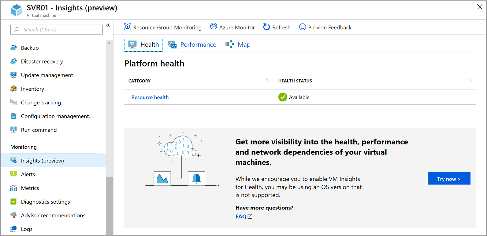
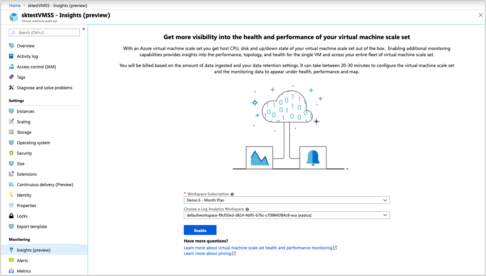
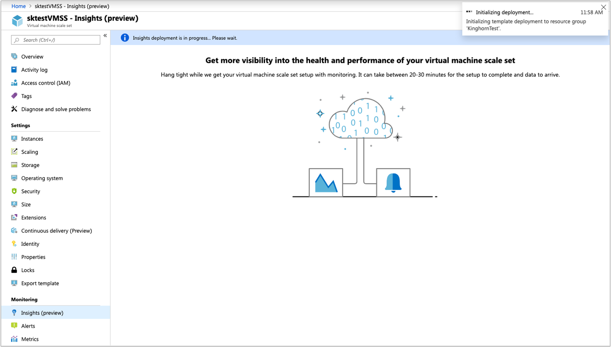

# Enable Azure Monitor for VMs (preview) for evaluation

You can evaluate Azure Monitor for VMs (preview) on a small number of Azure virtual machines (VMs) or on a single VM or virtual machine scale set. The easiest and most direct way to enable monitoring is from the Azure portal. Your goal is to monitor your VMs and discover any performance or availability issues. 

Before you begin, review the [prerequisites](vminsights-enable-overview.md) and make sure your subscription and resources meet the requirements.  

## Enable monitoring for a single Azure VM
To enable monitoring of your Azure VM:

1. Sign in to the [Azure portal](https://portal.azure.com).

1. Select **Virtual Machines**.

1. From the list, select a VM.

1. On the VM page, in the **Monitoring** section, select **Insights (preview)**.

1. On the **Insights (preview)** page, select **Try now**.

    

1. On the **Azure Monitor Insights Onboarding** page, if you have an existing Log Analytics workspace in the same subscription, select it in the drop-down list.  

    The list preselects the default workspace and location where the VM is deployed in the subscription. 

    >[!NOTE]
    >To create a new Log Analytics workspace to store the monitoring data from the VM, see [Create a Log Analytics workspace](../../azure-monitor/learn/quick-create-workspace.md). Your Log Analytics workspace must belong to one of the [supported regions](vminsights-enable-overview.md#log-analytics).

After you've enabled monitoring, you might need to wait about 10 minutes before you can view the health metrics for the VM.

## Enable monitoring for a single virtual machine scale set

To enable monitoring of your Azure virtual machine scale set:

1. Sign in to the [Azure portal](https://portal.azure.com).

2. Select **Virtual Machine Scale Sets**.

3. From the list, select a virtual machine scale set.

4. On the virtual machine scale set page, in the **Monitoring** section, select **Insights (preview)**.

5. On the **Insights (preview)** page, if you want to use an existing Log Analytics workspace, select it in the drop-down list.

    The list preselects the default workspace and location that the VM is deployed to in the subscription. 

    

    >[!NOTE]
    >To create a new Log Analytics workspace to store the monitoring data from the virtual machine scale set, see [Create a Log Analytics workspace](../learn/quick-create-workspace.md). Your Log Analytics workspace must belong to one of the [supported regions](vminsights-enable-overview.md#log-analytics).

After you've enabled monitoring, you might need to wait about 10 minutes before you can view the monitoring data for the scale set.

>[!NOTE]
>If you use a manual upgrade model for your scale set, upgrade the instances to complete the setup. You can start the upgrades from the **Instances** page, in the **Settings** section.

Now that you've enabled monitoring for your VM or virtual machine scale set, the monitoring information is available for analysis in Azure Monitor for VMs. 

## Next steps

* To learn how to use the Health feature, see [Understand the health of your Azure Monitor VMs](vminsights-health.md). 
* To view discovered application dependencies, see [Use Azure Monitor for VMs Map](vminsights-maps.md). 
* To identify bottlenecks, overall utilization, and your VM's performance, see [View Azure VM performance](vminsights-performance.md).