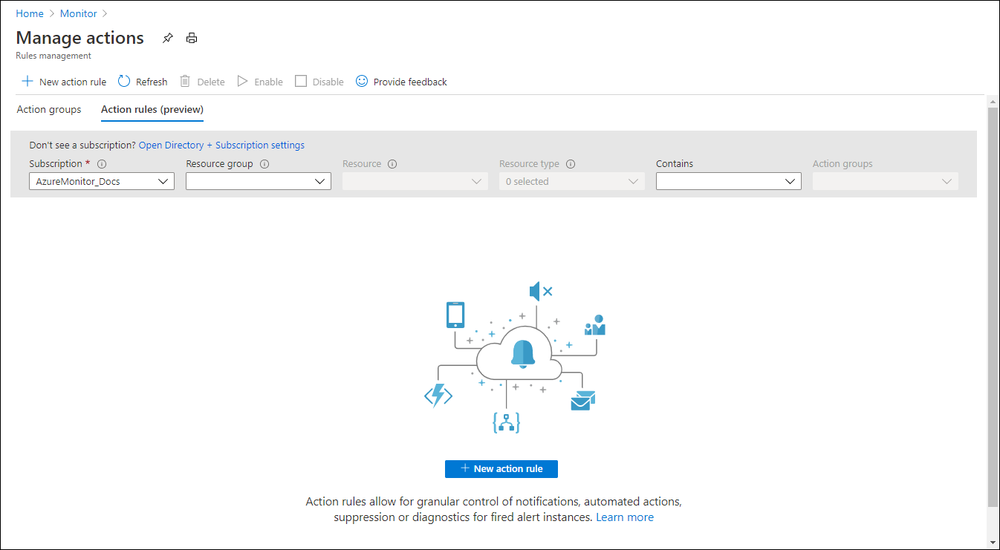
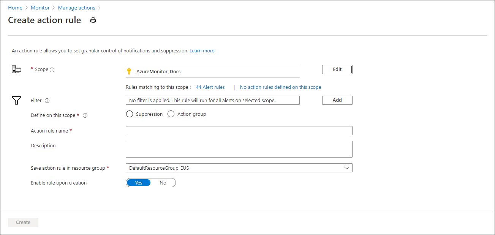
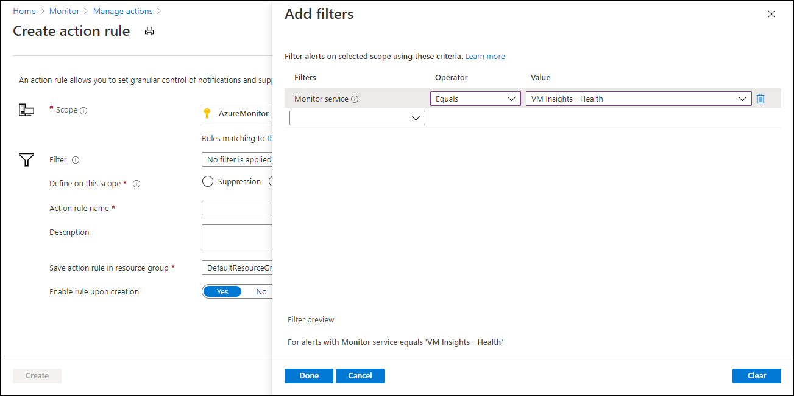
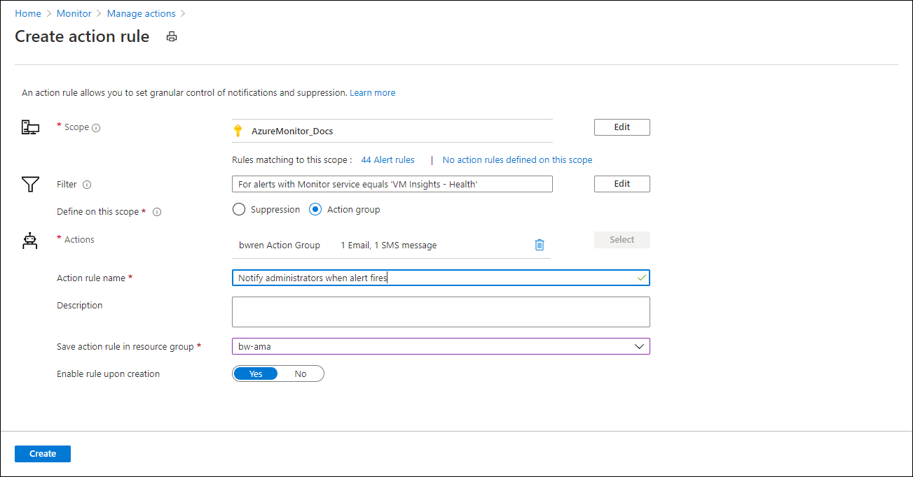

# Azure Monitor for VMs guest health alerts (preview)
Azure Monitor for VMs guest health allows you to view the health of a virtual machine as defined by a set of performance measurements that are sampled at regular intervals. You can choose to have an [Azure alert](../platform/alerts-overview.md) created when a virtual machine or monitor changes to an unhealthy state. You can view and manage this alert with other alerts created by alert rules in Azure Monitor and choose to be proactively notified when an alert is created.

## Configure alerts
By default, alerts will be created for each virtual machine but not for each monitor.  This means that if a monitor changes to a state that doesn't affect the current state of the virtual machine, then no alert is created because the virtual machine state didn't change. 

You can disable alerts for a particular virtual machine or for a particular monitor on a virtual machine from the **Alert status** setting in the configuration for the virtual machine in the Azure portal. See [Configure monitoring in Azure Monitor for VMs guest health (preview)](vminsights-health-configure.md) for details on configuring monitors in the Azure portal. See [Configure monitoring in Azure Monitor for VMs guest health using data collection rules (preview)](vminsights-health-configure-dcr.md) for details on configuring monitors across a set of virtual machines.

## Alert severity
The severity of the alert created by guest health directly maps to the severity of the virtual machine or monitor triggering the alert.

| Monitor state | Alert severity |
|:---|:---|
| Critical | Sev1 |
| Warning  | Sev2 |
| Healthy  | Sev4 |

## Alert lifecycle
An [Azure alert](../platform/alerts-overview.md) will be created for each virtual machine anytime it changes to a **Warning** or **Critical** state. View the alert from **Alerts** in the **Azure Monitor** menu or the virtual machine's menu in the Azure portal.

If an alert is already in **Fired** state when the virtual machine state changes, then a second alert won't be created, but the severity of the same alert will be changed to match the severity of the virtual machine. For example, if the virtual machine changes to **Critical** state when a **Warning** alert was already in **Fired** state, that alert's severity will be changed to **Sev1**. If the virtual machine changes to a **Warning** state when a **Sev1** alert was already in **Fired** state, that alert's severity will be changed to **Sev2**. If the virtual machine moves back to a **Healthy** state, then the alert will be resolved with severity changed to **Sev4**.

## Viewing alerts
View alerts created by Azure Monitor for MVs guest health with other [alerts in the Azure portal](../platform/alerts-overview.md#alerts-experience). You can select **Alerts** from the **Azure Monitor** menu to view alerts for all monitored resources, or select **Alerts** from a virtual machine's menu to view alerts for just that virtual machine.

## Alert properties
The properties of the alert are described in the following table.

| Property | Description |
|:---|:---|
| Monitor state before alert was created | State of monitor or virtual machine before this alert was fired the first time. |
| Monitor state when alert was created | State of monitor or virtual machine when the alert was fired the first time. This is the state that caused the alert to fire. |
| To know more about the state transition when alert was created | Link to VM Health page where you can see the exact state transition. This state transition represents the instance when monitor first went from **Healthy** state to a non-healthy state. |

The values of each property will depending on whether you view them in the Azure portal or receive them from a notification. 

For example, a monitor goes from **Healthy** to **Critical** at time t0, and a new alert is fired with **Sev1**. It then goes from **Critical** to **Warning** at time t1, and the alert severity is updated to **Sev2**. It becomes **Healthy** at time t2, and the alert is resolved.

The alert properties will have these values during this entire sequence.

- Monitor state before alert was created: Healthy
- Monitor state when alert was created: Critical
- To know more about the state transition when alert was created: Navigation link to the state transition happened at time t0.

If you create an action rule to send notifications though, it will have different properties at each time.

Notification received at time t0
- previousMonitorState: Healthy
- currentMonitorState: Critical
- toKnowMoreAboutThisStateTransition: Navigation link to the state transition happened at time t0.

Notification received at time t1
- previousMonitorState: Critical
- currentMonitorState: Warning
- toKnowMoreAboutThisStateTransition: Navigation link to the state transition happened at time t1.

Notification received at time t2
- previousMonitorState: Warning
- currentMonitorState: Healthy
- toKnowMoreAboutThisStateTransition: Navigation link to the state transition happened at time t2.

## Notifications
To be proactively notified of an alert triggered by guest health, create an [action group](../platform/action-groups.md) to define the different actions to perform such as sending an SMS message or starting a Logic App. Then create an [action rule](../platform/alerts-action-rules.md) that specifies the scope of monitors and virtual machines and  uses that action group.

In the **Monitor** menu in the Azure portal, select **Alerts**.  Select **Manage actions** and then **Action rules (preview)**. 

Click **New action rule** to create a new rule. Click **Select** next to scope and select either a subscription, resource group, or one or more specific virtual machines. The notification will only be fired for virtual machines that fall within the scope.

Click **Add** next to **Filter**. Create a filter where **Monitor service Equals VM Insights - Health**. Add other filters to specify the particular alerts that should trigger the notification. For example, you can use **Monitor name** to specify a specific monitor or **Severity** to match alerts from all monitors that match a particular severity.

In **Define on thin scope**, select **Action group** and then select the action group to associate with the monitor. Give the rule a name and select the action group it should be saved in. Click **Create** to create the rule.

## Next steps

- [Enable guest health in Azure Monitor for VMs and onboard agents.](vminsights-health-enable.md)
- [Configure monitors using the Azure portal.](vminsights-health-configure.md)
- [Configure monitors using data collection rules.](vminsights-health-configure-dcr.md)