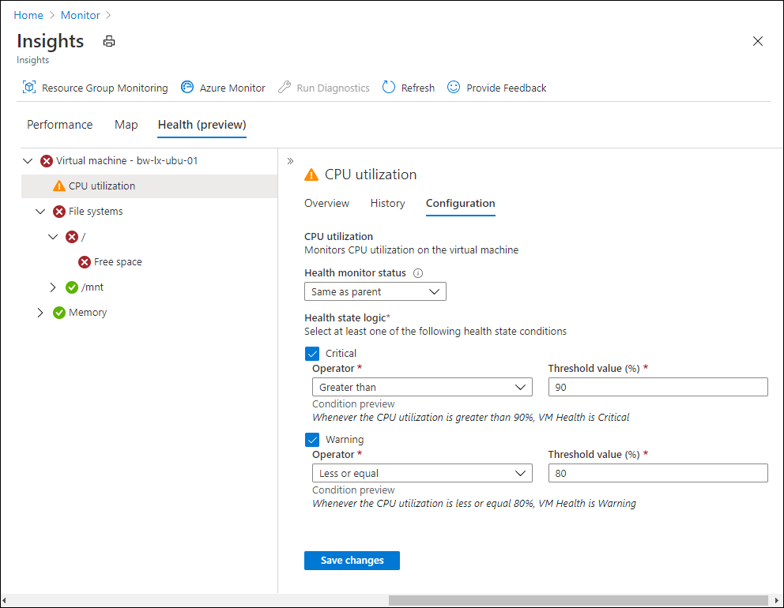
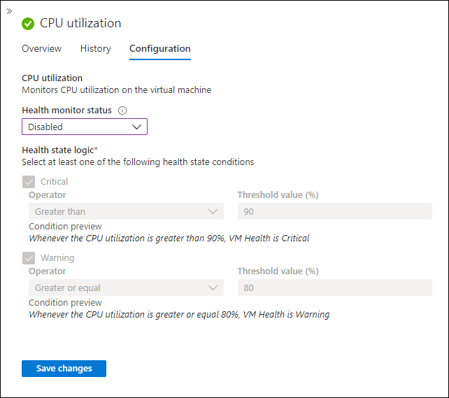
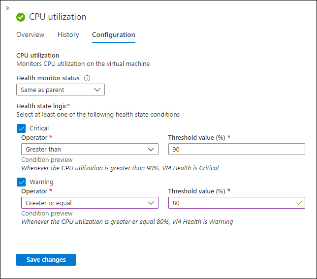

# Configure monitoring in Azure Monitor for VMs guest health (preview)
Azure Monitor for VMs guest health allows you to view the health of a virtual machine as defined by a set of performance measurements that are sampled at regular intervals. This article describes how you can modify default monitoring using the Azure portal. It also describes fundamental concepts of monitors required for [configuring monitoring using resource manager templates](vminsights-health-configure-template.md).

## Open monitor configuration
Open monitor configuration bin the Azure portal by selecting the monitor and then the **Configuration** tab.

## Enable or disable monitors
Both unit monitors and aggregate monitors have a **Health monitor status** setting that allows you to enable or disable the monitor. When a monitor is enabled, then its health is displayed and used to set the health of the VM. When a monitor is disabled, its health is not calculated and is not used to set the health of the VM.

| Setting | Description |
|:---|:---|
| Enabled | The monitor is enabled regardless of the setting of its parent. |
| Disabled | The monitor is disabled regardless of the setting of its parent. |
| Same as parent | The monitor will be enabled or disabled depending on the setting of its parent. |

When a monitor is disable, any criteria are shown as not available as shown in the following example.

## Enable or disable VM
You can disable monitoring for a VM to temporarily stop all monitors. You may disable monitoring for a VM for example when you're performing maintenance on it.

| Setting | Description |
|:---|:---|
| Enabled and alerting | The health state of the computer is displayed. |
| Disabled and not alerting | The health state of the computer is shown as **disabled**. Alerts are not created. |

## Health state logic
The health state logic for a unit monitor defines the criteria for setting its health state. You can specify how many health states a monitor has and the threshold for how each health state is calculated.

Aggregate monitors don't specify any health state logic. Their health state is set by the unit monitors under them according to their health rollup.

Unit monitors each have two or three health states. Each will always have a Healthy state and optionally a Warning state, a Critical state, or both. Warning and Critical states each require unique criteria that define when the monitor is set to this state. The Healthy state doesn't have criteria since this state is set when the criteria for the other states isn't met.

In the following example, CPU utilization is set to following health states:

- Critical if its greater than 90%.
- Warning if its greater than or equal to 80%.
- Healthy if its under 80%. This is implied since it's the condition where neither of the other conditions apply.

## Next steps

- [Configure monitors at scale using data collection rules.](vminsights-health-configure-dcr.md)