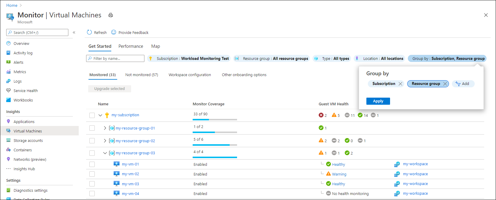
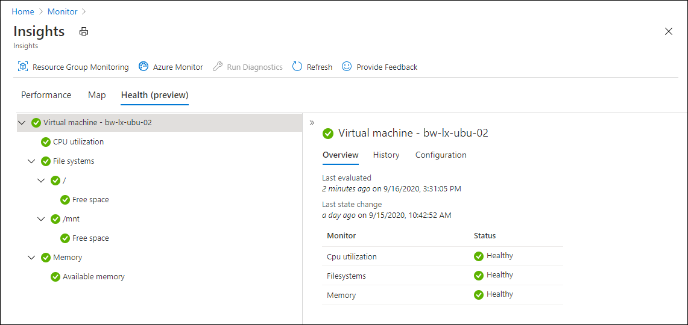
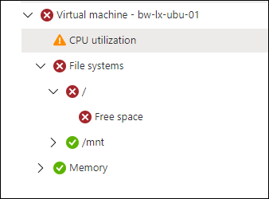
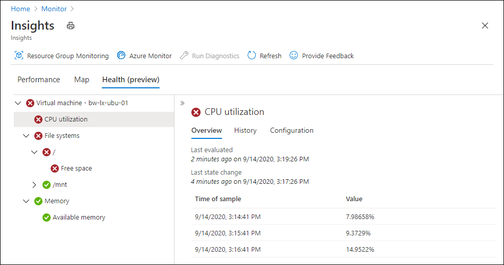
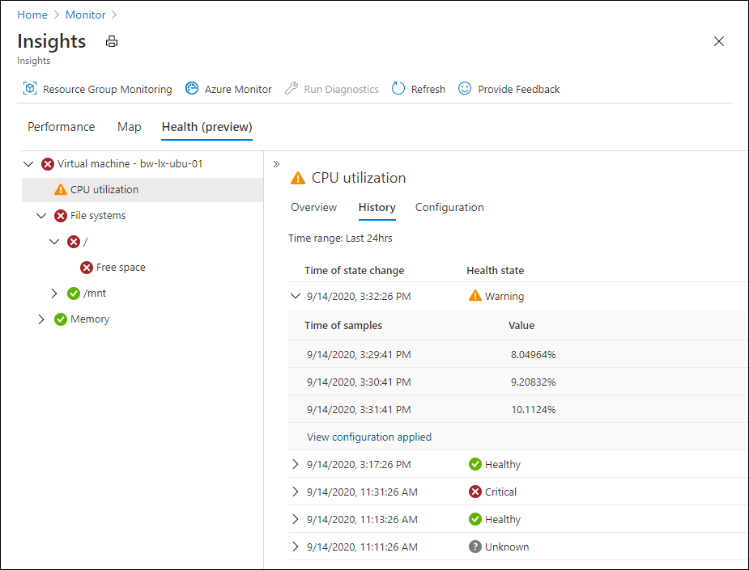

# Azure Monitor for VMs guest health (preview)
Azure Monitor for VMs guest health allows you to view the health of virtual machines based on a set of performance measurements that are sampled at regular intervals from the guest operating system. You can drill down on the detailed health of a particular virtual machine or quickly check the health of all virtual machines in a subscription or resource group. 

## Enable virtual machine health
See [Enable Azure Monitor for VMs guest health (preview)](vminsights-health-enable.md) for details on enabling the guest health feature and onboarding virtual machines.

## View virtual machine health
A **Guest VM Health** column in the **Get Started** page gives you a quick view of the health of each virtual machine in a particular subscription or resource group. The current health of each virtual machine is displayed while icons for each group show the number of virtual machines currently in each state in that group.

## Monitors
Click on a virtual machine's health status to view its detailed health. The overall health of a computer is measured by multiple monitors, which each measures the health of some aspect of a managed object. 

The following table lists the aggregate and unit monitors currently available for each virtual machine. 

| Monitor | Type | Description |
|:---|:---|:---|
| CPU utilization | Unit | Percentage utilization of the processor. |
| File systems | Aggregate | Aggregate health of all file systems on Linux VM. |
| File system  | Aggregate | Health of each individual file system on Linux VM. The name of the monitor is the name of the file system. |
| Free space | Unit | Percentage free space on the file system. |
| Memory | Aggregate | Aggregate health of the memory on the VM. |
| Available memory | Unit | Available megabytes on the VM. |

## Health states
Each monitor samples values on the agent every minute and compares sampled values to the criteria for each health state. If the criteria for particular state is true, then the monitor is set to that state. If none of the criteria are true, then the monitor is set to a healthy state. Data is sent from the agent to Azure Monitor every three minutes or immediately if there is a state change.

Each monitor has a lookback window and analyzes any samples collected within that time using a minimum or maximum value. For example, a monitor may have a lookback window of 240 seconds looking for the maximum value among at least 2 sampled values but no more than the last 3. While values are sampled at a regular rate, the number sampled in a particular window may vary slightly if there is any disruption in the agent operation.

Monitors each have the potential health states in the following table and will be in one and only one at any given time. When a monitor is initialized, it starts in a healthy state.

| Health State | Description |
|:---|:---|
| Healthy  | The monitor doesn't currently exceed the Warning or Critical threshold. |
| Warning  | The monitor exceeded the Warning threshold (if defined). |
| Critical | The monitor exceeded the Critical threshold (if defined). |
| Unknown  | Not enough data has been collected to determine the health state. |
| Disabled | The monitor is currently disabled. |
| None     | Monitor is just started and not yet been evaluated or monitored object no longer exists. |

There are two types of monitors as shown in the following table.

| Monitor | Description |
|:---|:---|
| Unit monitor | Measures some aspect of a resource or application. This might be checking a performance counter to determine the performance of the resource, or its availability. |
| Aggregate Monitor | Groups multiple monitors to provide a single aggregated health state. An aggregate monitor can contain one or more unit monitors and other aggregate monitors. |

  
### Health rollup policy
The health state of a virtual machine is determined by the rollup of health from each of its unit and aggregate monitors. Each aggregate monitor uses a worst state health rollup policy where the state of the aggregate monitor matches the state of the child monitor with the worst health state.  

In the following example, the **Free space** monitor is in a critical state which roles up to the aggregates for its instance and then to **File systems**. Even though **CPU utilization** in in a warning state, the virtual machine is set to critical since this is the worst state underneath it. If the free space were to return to a healthy state, then the virtual machine would change to a warning state since CPU utilization would then become the monitor with the worst state.

## Monitor details
Select a monitor to view its detail which includes the following tabs.

**Overview** provides a description of the monitor, the last time it was evaluated, and values sampled to determine the current health state. The number of samples may vary based on the definition of the monitor and the volatility of the values.

**History** lists the history of state changes for the monitor. You can expand any of the state changes to view values evaluated to determine the health state. Click **View configuration applied** to view the configuration of the monitor at the time that the health state was changed.

### Configuration
View and modify the configuration of the monitor for the selected VM. See [Configure monitoring in Azure Monitor for VMs guest health (preview)](vminsights-health-enable.md) for details.

## Alerts
An [alert](../platform/alerts-overview.md) will be created for each virtual machine anytime it changes to a Warning or Critical state. View the alert from **Alerts** in the **Azure Monitor** menu or the virtual machine's menu in the Azure portal.

Alerts are not created for individual monitors but for the virtual machine itself. This means that if a monitor changes to a state that doesn't effect the current state of the virtual machine (because it's less than or equal to the current state), then no alert is created because the virtual machine state didn't change.

If an alert is already open when the VM state changes, then a second alert won't be created, but the severity of the alert will be changed to match the severity of the VM. For example, if the VM changes to a Critical state when a Warning alert was already open, that alert will be changed to a Critical State. If the VM changes to a Warning state when a Critical alert was already open, that alert will be changed to a Warning State. 

If the VM changes to a Healthy state, then the alert will be closed.

## Next steps

- [Enable guest health in Azure Monitor for VMs and onboard agents.](vminsights-health-enable.md)
- [Configure monitors using the Azure portal.](vminsights-health-configure.md)
- [Configure monitors using data collection rules.](vminsights-health-configure-dcr.md)