# Understand the health of your Azure virtual machines

Azure includes services for specific roles or tasks in the monitoring space, but it doesn't provide in-depth health perspectives of operating systems (OSs) hosted on Azure virtual machines (VMs). Although you can use Azure Monitor for different conditions, it's not designed to model and represent the health of core components, or the overall health of VMs.

By using Azure Monitor for VMs health, you can actively monitor the availability and performance of a Windows or Linux guest OS. The health feature uses a model that represents key components and their relationships, provides criteria that specifies how to measure component health, and sends an alert when it detects an unhealthy condition.

Viewing the overall health state of an Azure VM and the underlying OS can be observed from two perspectives: directly from a VM, or across all VMs in a resource group from Azure Monitor.

This article shows how to quickly assess, investigate, and resolve health issues when they are detected by the Azure Monitor for VMs health feature.

For information about configuring Azure Monitor for VMs, see [Enable Azure Monitor for VMs](vminsights-enable-overview.md).

## Monitoring configuration details

This section outlines the default health criteria to monitor Azure Windows and Linux VMs. All health criteria are pre-configured to send an alert when they detect an unhealthy condition.

### Windows VMs

- Available Megabytes of Memory
- Average Disk Seconds Per Write (Logical Disk)
- Average Disk Seconds Per Write (Disk)
- Average Logical Disk Seconds Per Read
- Average Logical Disk Seconds Per Transfer
- Average Disk Seconds Per Read
- Average Disk Seconds Per Transfer
- Current Disk Queue Length (Logical Disk)
- Current Disk Queue Length (Disk)
- Disk Percent Idle Time
- File system error or corruption
- Logical Disk Free Space (%) Low
- Logical Disk Free Space (MB) Low
- Logical Disk Percent Idle Time
- Memory Pages Per Second
- Percent Bandwidth Used Read
- Percent Bandwidth Used Total
- Percent Bandwidth Used Write
- Percentage of Committed Memory in Use
- Disk Percent Idle Time
- DHCP Client Service Health
- DNS Client Service Health
- RPC Service Health
- Server Service Health
- Total CPU Utilization Percentage
- Windows Event Log Service Health
- Windows Firewall Service Health
- Windows Remote Management Service Health

### Linux VMs

- Disk Avg. Disk sec/Transfer
- Disk Avg. Disk sec/Read
- Disk Avg. Disk sec/Write
- Disk Health
- Logical Disk Free Space
- Logical Disk % Free Space
- Logical Disk % Free Inodes
- Network Adapter Health
- Total Percent Processor Time
- Operating System Available Megabytes of Memory

## Sign in to the Azure portal

To sign in, go to the [Azure portal](https://portal.azure.com).

## Introduction to Azure Monitor for VMs health

Before you use the health feature for a single VM or group of VMs, it's important to understand how the information is presented and what the visualizations represent.

### View health directly from a VM

To view the health of an Azure VM, select **Insights (preview)** in the left pane of the VM. On the VM insights page, the **Health** tab is open by default and shows the health view of the VM.

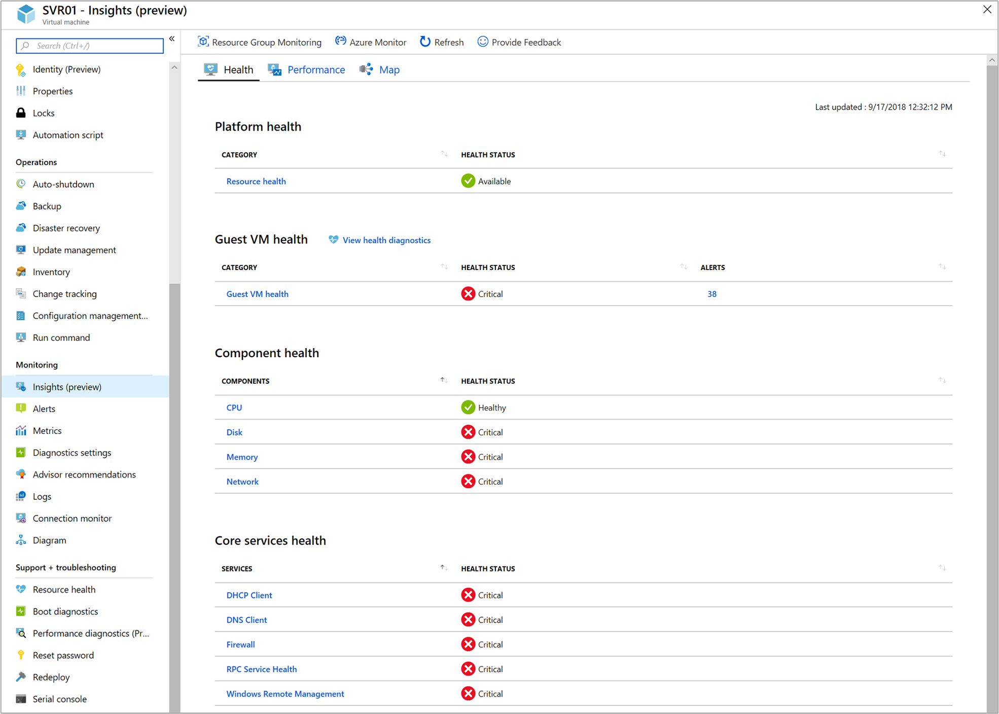

In the **Health** tab, under **Guest VM health**, the table shows the health state of the VM and the total number of VM health alerts raised by an unhealthy component.

For more information, see [Alerts](#alerts).

The health states defined for a VM are described in the following table:

|Icon |Health state |Meaning |
|-----|-------------|---------------|
| |Healthy |The VM is within the defined health conditions. This state indicates there are no issues detected and the VM is functioning normally. With a parent rollup monitor, health rolls up and reflects the best-case or worst-case state of the child.|
| |Critical |The state isn't within the defined health condition, indicating that one or more critical issues were detected. These issues must be addressed to restore normal functionality. With a parent rollup monitor, the health state rolls up and reflects the best-case or worst-case state of the child.|
| |Warning |The state is between two thresholds for the defined health condition, where one indicates a warning state and the other indicates a critical state (three health state thresholds can be configured), or when a non-critical issue can cause critical problems if unresolved. With a parent rollup monitor, if one or more children is in a warning state, the parent will reflect a warning state. If one child is in a critical state and another child in a warning state, the parent rollup will show the health state as critical.|
| |Unknown |The state can't be computed for several reasons. The following section provides additional details and possible solutions. |

An Unknown health state can be caused by the following issues:

- The agent was reconfigured and no longer reports to the workspace specified when Azure Monitor for VMs was enabled. To configure the agent to report to the workspace see, [adding or removing a workspace](../platform/agent-manage.md#adding-or-removing-a-workspace).
- The VM was deleted.
- The workspace associated with Azure Monitor for VMs was deleted. You can recover the workspace if you have Premier support benefits. Go to [Premier](https://premier.microsoft.com/) and open a support request.
- The solution dependencies were deleted. To re-enable the ServiceMap and InfrastructureInsights solutions in your Log Analytics workspace, reinstall these solutions by using the [Azure Resource Manager template](vminsights-enable-at-scale-powershell.md#install-the-servicemap-and-infrastructureinsights-solutions). Or, use the Configure Workspace option found in the Get Started tab.
- The VM was shut down.
- The Azure VM service is unavailable, or maintenance is being performed.
- The workspace [daily data or retention limit](../platform/manage-cost-storage.md) was met.

Select **View health diagnostics** to open a page showing all the components of a VM, associated health criteria, state changes, and other issues detected by monitoring components related to the VM.

For more information, see [Health diagnostics](#health-diagnostics).

In the **Health** section, a table shows the health rollup of performance components monitored by health criteria. These components include **CPU**, **Memory**, **Disk**, and **Network**. Selecting a component opens a page that lists all the monitoring criterion and the health state of that component.

When you access health from an Azure VM that runs Windows, the health state of the top five core Windows services is shown under **Core services health**. Selecting any of the services opens a page that lists the health criteria monitoring for that component along with its health state.

Selecting the name of the health criteria opens the property pane. In this pane, you can review the configuration details, including if the health criteria have a corresponding Azure Monitor alert.

For more information, see [Health Diagnostics and working with health criteria](#health-diagnostics).

### Aggregate VM perspective

To view the health collection for all your VMs in a resource group, select **Azure Monitor** from the navigation list in the portal, and then select **Virtual Machines (preview)**.

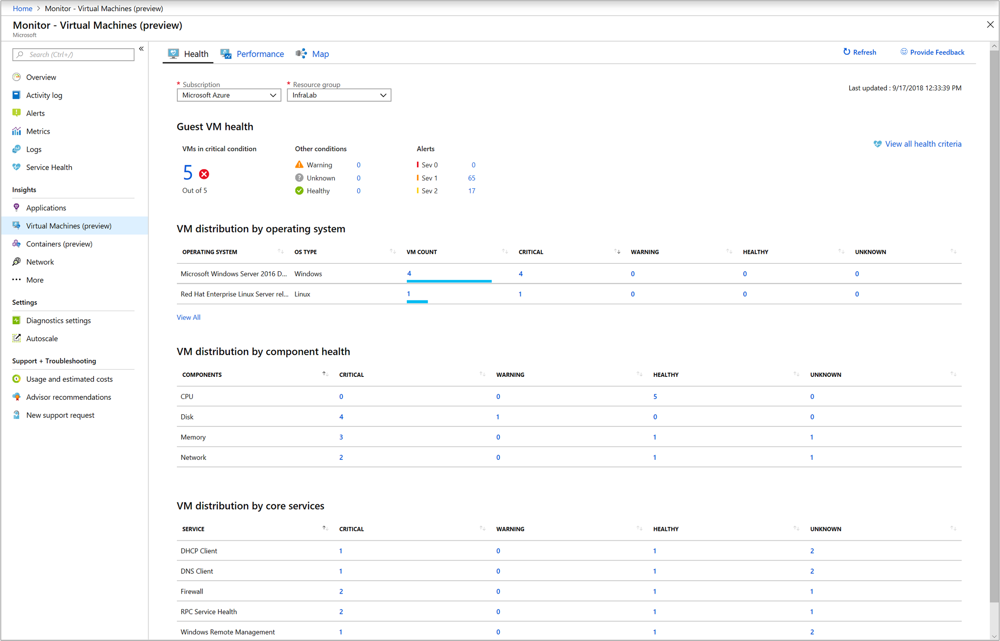

In the **Subscription** and **Resource Group** drop-down lists, select the appropriate resource group that includes the VMs related to the group, to view their reported health state. Your selection only applies to the health feature and doesn't carry over to **Performance** or **Map** tabs.

The **Health** tab provides the following information:

* How many VMs are in a critical or unhealthy state, versus how many are healthy or are not submitting data (referred to as an Unknown state).
* Which and how many VMs by OS are reporting an unhealthy state.
* How many VMs are unhealthy because of an issue detected with a processor, disk, memory, or network adapter, categorized by health state.
* How many VMs are unhealthy because of an issue detected with a core OS service, categorized by health state.

On the **Health** tab, you can identify the critical issues detected by the health criteria monitoring the VM, and review alert details and associated knowledge articles. These articles can assist in the diagnosis and remediation of issues. Select any of the severities to open the [All Alerts](../../azure-monitor/platform/alerts-overview.md#all-alerts-page) page filtered by that severity.

The **VM distribution by operating system** list shows VMs listed by Windows edition or Linux distribution, along with their version. In each OS category, the VMs are broken down further based on the health of the VM.


Select any column including **VM count**, **Critical**, **Warning**, **Healthy**, or **Unknown**. View the list of filtered results in the **Virtual Machines** page that match the column selected.

For example, to review all VMs that run Red Hat Enterprise Linux release 7.5, select the **VM count** value for that OS, and it will list the VMs matching that filter and their current health state.

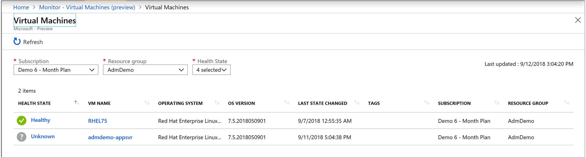

In the **Virtual Machines** page, if you select the name of a VM under the column **VM Name**, you're directed to the **VM instance** page. This page provides more details of the alerts and health criteria issues that are affecting the selected VM. Filter the health state details by selecting **Health State** icon in the upper-left corner of the page to see which components are unhealthy. You can also view VM Health alerts raised by an unhealthy component categorized by alert severity.

From the **VM list** view, select the name of a VM to open the **Health** page for that VM, similarly as if you selected **Insights (preview)** from the VM directly.


The **Insights (preview)** page shows a rollup health status for the VM and alerts. This health status is categorized by severity, which represents VM health alerts raised when the health state changed from healthy to unhealthy, based on criteria. Selecting **VMs in critical condition** opens a page with a list of one or more VMs in a critical health state.

Selecting the health status for one of the VMs shows the **Health Diagnostics** view of the VM. In this view, you can determine which health criteria is reflecting a health-state issue. When the **Health Diagnostics** page opens, it shows all the VM components and their associated health criteria with the current health state.

For more information, see [Health diagnostics](#health-diagnostics).

Selecting **View all health criteria** opens a page showing a list of all the health criteria available with this feature. The information can be further filtered based on the following options:

* **Type**. There are three types of health criteria to assess conditions and roll up the overall health state of a monitored VM:
    - **Unit**. Measures some aspect of a VM. This health criteria type might be checking a performance counter to determine the performance of the component, running a script to perform a synthetic transaction, or watching for an event that indicates an error. The filter is set to unit by default.
    - **Dependency**. Provides a health rollup between different entities. This health criteria allows the health of an entity to depend on the health of another type of entity that it relies on for successful operation.
    - **Aggregate**. Provides a combined health state of similar health criteria. Unit and dependency health criterion are typically configured under an aggregate health criterion. In addition to providing better general organization of the many different health criteria targeted at an entity, aggregate health criterion provides a unique health state for distinct categories of the entities.

* **Category**. The type of health criteria used to group similar criteria for reporting purposes. These categories are **Availability** and **Performance**.

To see which instances are unhealthy, select a value under the **Unhealthy Component** column. In this page, a table lists the components that are in a critical health state.

## Health diagnostics

The **Health Diagnostics** page allows you to visualize the health model of a VM. This page lists all VM components, associated health criteria, state changes, and other significant issues identified by monitored components related to the VM.

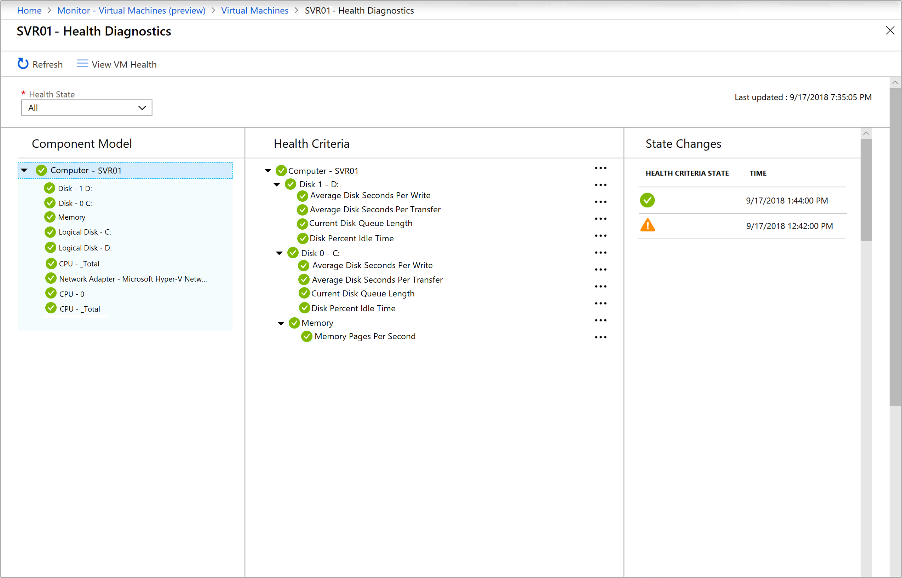

Start health diagnostics by using the following methods:

* By rollup health state for all VMs from the aggregate VM perspective in Azure Monitor:

    1. On the **Health** page, select the icon for **Critical**, **Warning**, **Healthy**, or **Unknown** health state under the section **Guest VM health**.
    2. Go to the page that lists all the VMs matching that filtered category.
    3. Select the value in the **Health State** column to open the health diagnostics scoped to that VM.

* By OS from the aggregate VM perspective in Azure Monitor. Under **VM distribution**, selecting any one of the column values will open the **Virtual Machines** page and return a list in the table matching the filtered category. Selecting the value under **Health State** column opens health diagnostics for the selected VM.
 
* From the guest VM on the Azure Monitor for VMs **Health** tab, by selecting **View health diagnostics**.

Health diagnostics organizes health information into two categories: availability and performance.
 
All health criteria defined for a component, such as logical disk, CPU, and so on, can be viewed without filtering on the two categories. These views can be in an all-up view of criteria, or via filtering the results by either category when you select **Availability** or **Performance**.

Also, the criteria category can be seen next to the **Health Criteria** column. If the criteria don't match the selected category, a message stating **No health criteria available for the selected category** appears in the **Health Criteria** column.

The state of a health criteria is defined by one of four types: **Critical**, **Warning**, **Healthy**, and **Unknown**. The first three are configurable, meaning that you can modify the threshold values of the monitors directly in the **Health Criteria** configuration pane. This is also possible by using the Azure Monitor REST API [update monitor operation](https://docs.microsoft.com/rest/api/monitor/microsoft.workloadmonitor/monitors/update). **Unknown** isn't configurable and is reserved for specific scenarios.

The **Health Diagnostics** page has three main sections:

* Component Model
* Health Criteria
* State Changes

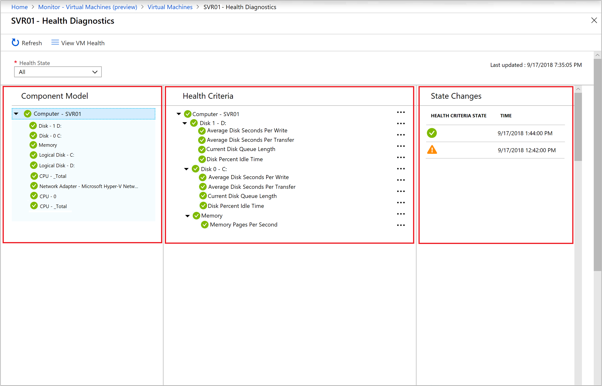

### Component model

The leftmost column in the **Health Diagnostics** page is **Component Model**. All components, which are associated with the VM, are displayed in this column along with their current health state.

In the following example, the discovered components are **Disk**, **Logical Disk**, **Processor**, **Memory**, and **Operating System**. Multiple instances of these components are discovered and displayed in this column.

For example, the following figure shows that the VM has two instances of logical disks, **C:** and **D:**, which are in a healthy state:

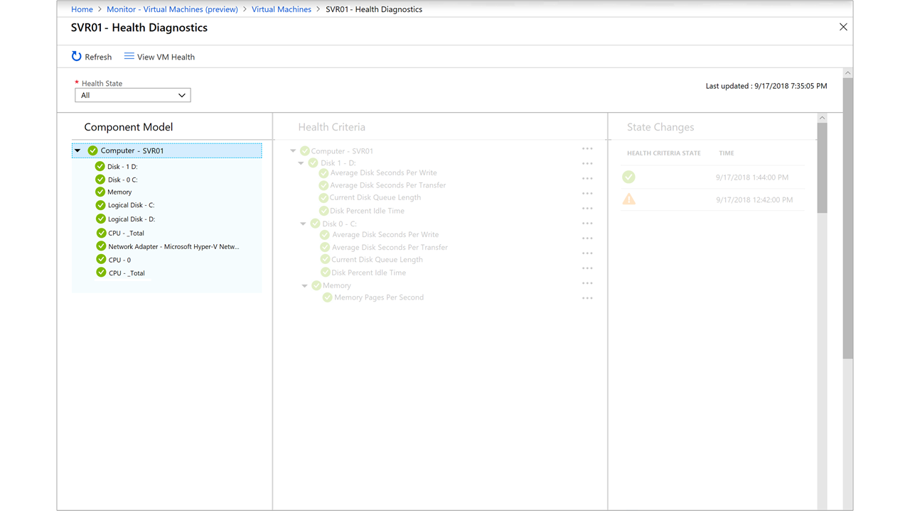

### Health criteria

The center column in the Health Diagnostics page is **Health Criteria**. The health model defined for the VM is displayed in a hierarchical tree. The health model for a VM consists of unit and aggregate health criteria.

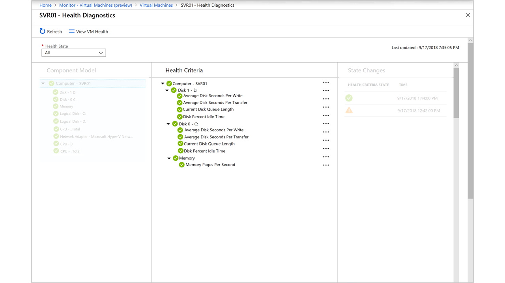

A health criterion measures the health of a monitored instance, which could be a threshold value, state of an entity, and so on. A health criterion has either two or three configurable health state thresholds, as described earlier. At any point, the health criterion can be in only one of its potential states.

The health model defines criteria that determine the health of the overall target and components of the target. The hierarchy of criteria is shown in the **Health Criteria** section on the **Health Diagnostics** page.

The health-rollup policy is part of the configuration of aggregate health criteria (the default is set to **worst-of**). You can find a default set of health criteria running as part of this feature in the [Monitoring configuration details](#monitoring-configuration-details) section of this article.

You can also use the Azure Monitor REST API [monitor instances list by resource](https://docs.microsoft.com/rest/api/monitor/microsoft.workloadmonitor/monitorinstances/listbyresource) to get a list of all health criteria. This criteria includes configuration details running against the Azure VM resource.

The **Unit** health criteria type can have its configuration modified by selecting the ellipsis link to the right side. Select **Show Details** to open the configuration pane.

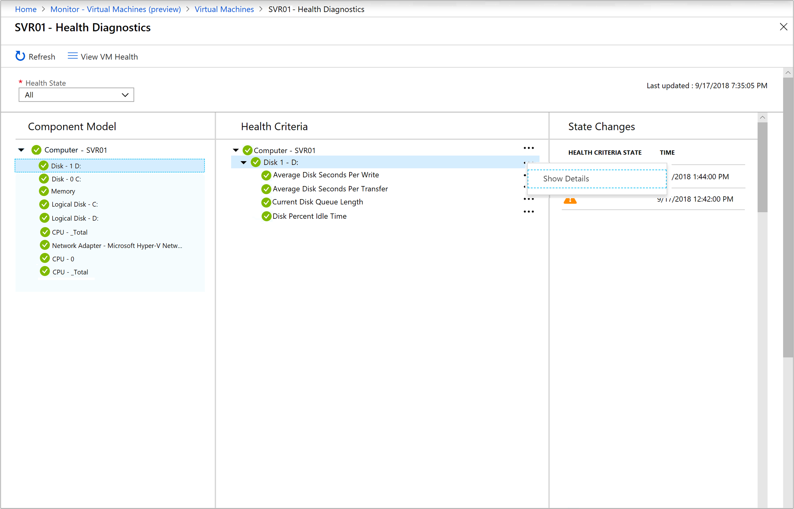

In the configuration pane for the selected health criteria, if you use the example **Average Disk Seconds Per Write**, the threshold can be configured with a different numeric value. It's a two-state monitor, meaning it can change only from **Healthy** to **Warning**.

Other health criteria sometimes use three states, where you can configure the value for warning and critical health-state thresholds. You can also modify a threshold by using Azure Monitor REST API [monitor configuration](https://docs.microsoft.com/rest/api/monitor/microsoft.workloadmonitor/monitors/update).

>[!NOTE]
>Applying health criteria configuration changes to one instance applies them to all monitored instances. For example, if you select **Disk -1 D:** and then modify the **Average Disk Seconds Per Write** threshold, the change applies to all instances discovered and monitored on the VM.


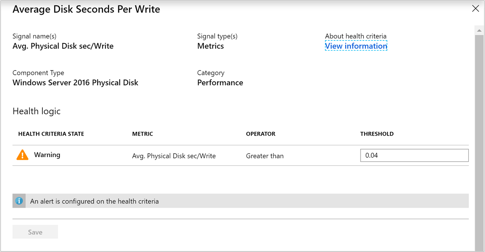

If you want to learn more about health criteria, we've included knowledge articles to help you identify problems, causes, and resolutions. Select **View information** on the page to see the related knowledge article.

To review all the knowledge articles included with Azure Monitor for VMs health, see [Azure Monitor health knowledge documentation](https://docs.microsoft.com/azure/monitoring/infrastructure-health/).

### State changes

The far-right column of the **Health Diagnostics** page is **State Changes**. This column lists all the state changes associated with the health criteria selected in the **Health Criteria** section, or the state change of the VM if a VM was selected from the **Component Model** or **Health Criteria** column of the table.

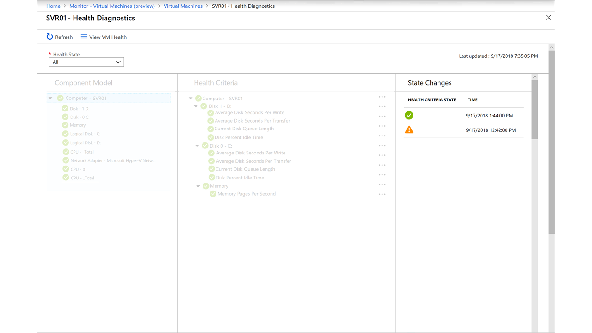

The following section shows the health-criteria state and the associated time. This information shows the latest state at the top of the column.

### Association of Component Model, Health Criteria, and State Changes columns

The three columns are interlinked with each other. When you select an instance in the **Component Model** column, the **Health Criteria** column is filtered to that component view. Correspondingly, the **State Changes** column is updated based on the selected health criteria.

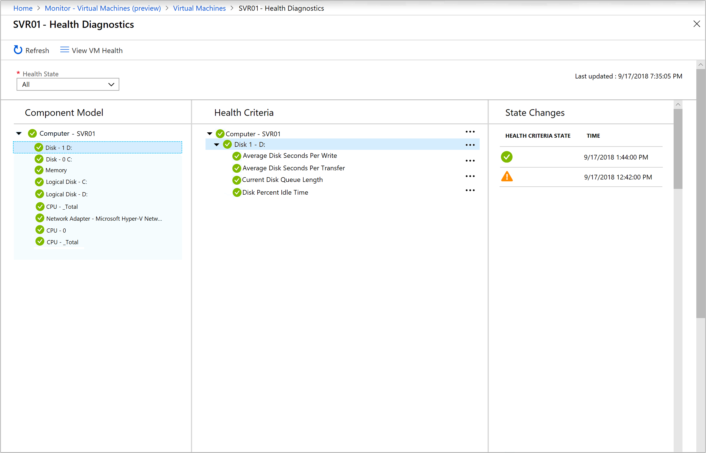

For example, if you select *Disk - 1 D:* from the list under **Component Model**, **Health Criteria** filters to *Disk - 1D:*, and **State Changes** shows the state change based on the availability of *Disk - 1 D:*.

To see an updated health state, you can refresh the Health Diagnostics page by selecting the **Refresh** link. If there is an update to the health criterion's health state based on the pre-defined polling interval, this task allows you to avoid waiting and reflects the latest health state. The **Health Criteria State** is a filter that lets you scope the results based on the selected health state: Healthy, Warning, Critical, Unknown, and All. The **Last Updated** time in the upper-right corner represents the last time the Health Diagnostics page was refreshed.

## Alerts

Azure Monitor for VMs health integrates with [Azure Alerts](../../azure-monitor/platform/alerts-overview.md). It raises an alert when predefined criteria, when detected, change from a healthy state to an unhealthy state. Alerts are categorized by severity, from Sev 0 through Sev 4, with Sev 0 as the highest level.

Alerts aren't associated with an action group to notify you when the alert has been triggered. The subscription owner must configure notifications by following the steps in the [Configure alerts](#configure-alerts) section.

The total number of VM Health alerts categorized by severity is available on the **Health** dashboard under the **Alerts** section. When you select either the total number of alerts or the number corresponding to a severity level, the **Alerts** page opens and lists all alerts matching your selection.

For example, if you select the row corresponding to **Sev level 1**, you'll see the following view:


The **All Alerts** page isn't scoped to show only alerts matching your selection. It's also filtered by **Resource type** to show only health alerts raised by a VM resource. This format is reflected in the alert list, under the column **Target Resource**, where it shows the Azure VM the raised alert when an unhealthy condition was met.

Alerts from other resource types or services are not intended to be included in this view. These alerts include log alerts, which are based on log queries or metric alerts that you'd normally view from the default Azure Monitor [All Alerts](../../azure-monitor/platform/alerts-overview.md#all-alerts-page) page.

You can filter this view by selecting values in the drop-down menus at the top of the page.

|Column |Description |
|-------|------------|
|Subscription |Select an Azure subscription. Only alerts in the selected subscription are included in the view. |
|Resource Group |Select a single resource group. Only alerts with targets in the selected resource group are included in the view. |
|Resource type |Select one or more resource types. By default, only alerts of target **Virtual machines** is selected and included in this view. This column is only available after a resource group has been specified. |
|Resource |Select a resource. Only alerts with that resource as a target are included in the view. This column is available only after a resource type has been specified. |
|Severity |Select an alert severity or select **All** to include alerts of all severities. |
|Monitor Condition |Select a monitor condition to filter alerts if they have been fired or resolved by the system if the condition is no longer active. Or, select **All** to include alerts of all conditions. |
|Alert state |Select an alert state, **New**, **Acknowledge**, **Closed**, or **All** to include alerts of all states. |
|Monitor service |Select a service or select **All** to include all services. Only alerts from VM Insights are supported for this feature.|
|Time range| Only alerts fired within the selected time window are included in the view. Supported values are the past hour, the past 24 hours, the past 7 days, and the past 30 days. |

When you select an alert, the **Alert detail** page is displayed. This page provides details of the alert and allows you to change its state.

To learn more about managing alerts, see [Create, view, and manage alerts using Azure Monitor](../../azure-monitor/platform/alerts-metric.md).

>[!NOTE]
>Creating new alerts based on health criteria or modifying existing health alert rules in Azure Monitor from the portal isn't currently supported.


You can change an alert state for one or multiple alerts by selecting them, and then selecting **Change state** from the **All Alerts** page in the upper-left corner. Select one of the states on the **Change alert state** pane, add a description of the change in the **Comment** field, and then select **Ok** to commit your changes. When the information is verified and the changes are applied, track the progress under **Notifications** in the menu.

### Configure alerts
You can't manage certain alert-management tasks from the Azure portal. These tasks must be performed by using the [Azure Monitor REST API](https://docs.microsoft.com/rest/api/monitor/microsoft.workloadmonitor/components). Specifically:

- Enabling or disabling an alert for health criteria
- Setting up notifications for health criteria alerts

Each example uses [ARMClient](https://github.com/projectkudu/armclient) on your Windows machine. If you are not familiar with this method, see [Using ARMClient](../platform/rest-api-walkthrough.md#use-armclient).

#### Enable or disable an alert rule

To enable or disable an alert for specific health criteria, the property **alertGeneration** must be modified with a value of either **Disabled** or **Enabled**.

To identify the *monitorId* for specific health criteria, the following example shows how to query for that value for the criteria **LogicalDisk\Avg Disk Seconds Per Transfer**:

1. In a terminal window, type **armclient.exe login**. Doing so prompts you to sign in to Azure.

2. Enter the following command to retrieve all the health criterion active on a specific VM and identify the value for *monitorId* property:

    ```
    armclient GET "subscriptions/subscriptionId/resourceGroups/resourcegroupName/providers/Microsoft.Compute/virtualMachines/vmName/providers/Microsoft.WorkloadMonitor/monitors?api-version=2018-08-31-preview”
    ```

    The following example shows the output of the *armclient GET* command. Take note of the value of *MonitorId*. This value is required for the next step, where we must specify the ID of the health criteria and modify its property to create an alert.

    ```
    "id": "/subscriptions/a7f23fdb-e626-4f95-89aa-3a360a90861e/resourcegroups/Lab/providers/Microsoft.Compute/virtualMachines/SVR01/providers/Microsoft.WorkloadMonitor/monitors/ComponentTypeId='LogicalDisk',MonitorId='Microsoft_LogicalDisk_AvgDiskSecPerRead'",
      "name": "ComponentTypeId='LogicalDisk',MonitorId='Microsoft_LogicalDisk_AvgDiskSecPerRead'",
      "type": "Microsoft.WorkloadMonitor/virtualMachines/monitors"
    },
    {
      "properties": {
        "description": "Monitor the performance counter LogicalDisk\\Avg Disk Sec Per Transfer",
        "monitorId": "Microsoft_LogicalDisk_AvgDiskSecPerTransfer",
        "monitorName": "Microsoft.LogicalDisk.AvgDiskSecPerTransfer",
        "monitorDisplayName": "Average Logical Disk Seconds Per Transfer",
        "parentMonitorName": null,
        "parentMonitorDisplayName": null,
        "monitorType": "Unit",
        "monitorCategory": "PerformanceHealth",
        "componentTypeId": "LogicalDisk",
        "componentTypeName": "LogicalDisk",
        "componentTypeDisplayName": "Logical Disk",
        "monitorState": "Enabled",
        "criteria": [
          {
            "healthState": "Warning",
            "comparisonOperator": "GreaterThan",
            "threshold": 0.1
          }
        ],
        "alertGeneration": "Enabled",
        "frequency": 1,
        "lookbackDuration": 17,
        "documentationURL": "https://aka.ms/Ahcs1r",
        "configurable": true,
        "signalType": "Metrics",
        "signalName": "VMHealth_Avg. Logical Disk sec/Transfer"
      },
      "etag": null,
    ```

3. Enter the following command to modify the *alertGeneration* property:

    ```
    armclient patch subscriptions/subscriptionId/resourceGroups/resourcegroupName/providers/Microsoft.Compute/virtualMachines/vmName/providers/Microsoft.WorkloadMonitor/monitors/Microsoft_LogicalDisk_AvgDiskSecPerTransfer?api-version=2018-08-31-preview "{'properties':{'alertGeneration':'Disabled'}}"
    ```   

4. Enter the GET command used in step 2 to verify that the property value is set to **Disabled**.

#### Associate an action group with health criteria

Azure Monitor for VMs health supports SMS and email notifications when alerts are generated from unhealthy health criteria. To configure notifications, note the name of the configured action group to send SMS or email notifications.

>[!NOTE]
>This action must be performed against each monitored VM that you want to receive a notification for. It doesn't apply to all VMs in a resource group.

1. In a terminal window, enter *armclient.exe login*. Doing so prompts you to sign in to Azure.

2. Enter the following command to associate an action group with alert rules:
 
    ```
    $payload = "{'properties':{'ActionGroupResourceIds':['/subscriptions/subscriptionId/resourceGroups/resourcegroupName/providers/microsoft.insights/actionGroups/actiongroupName']}}"
    armclient PUT https://management.azure.com/subscriptions/subscriptionId/resourceGroups/resourcegroupName/providers/Microsoft.Compute/virtualMachines/vmName/providers/Microsoft.WorkloadMonitor/notificationSettings/default?api-version=2018-08-31-preview $payload
    ```

3. To verify that the value of the property **actionGroupResourceIds** was successfully updated, enter the following command:

    ```
    armclient GET "subscriptions/subscriptionName/resourceGroups/resourcegroupName/providers/Microsoft.Compute/virtualMachines/vmName/providers/Microsoft.WorkloadMonitor/notificationSettings?api-version=2018-08-31-preview"
    ```

    The output should look like the following criteria:
    
    ```
    {
	  "value": [
		{
		  "properties": {
			"actionGroupResourceIds": [
			  "/subscriptions/a7f23fdb-e626-4f95-89aa-3a360a90861e/resourceGroups/Lab/providers/microsoft.insights/actionGroups/Lab-IT%20Ops%20Notify"
			]
		  },
		  "etag": null,
		  "id": "/subscriptions/a7f23fdb-e626-4f95-89aa-3a360a90861e/resourcegroups/Lab/providers/Microsoft.Compute/virtualMachines/SVR01/providers/Microsoft.WorkloadMonitor/notificationSettings/default",
		  "name": "notificationSettings/default",
		  "type": "Microsoft.WorkloadMonitor/virtualMachines/notificationSettings"
		}
	  ],
	  "nextLink": null
    }
    ```

## Next steps

- To identify limitations and overall VM performance, see [View Azure VM performance](vminsights-performance.md).
- To learn about discovered application dependencies, see [View Azure Monitor for VMs Map](vminsights-maps.md).
