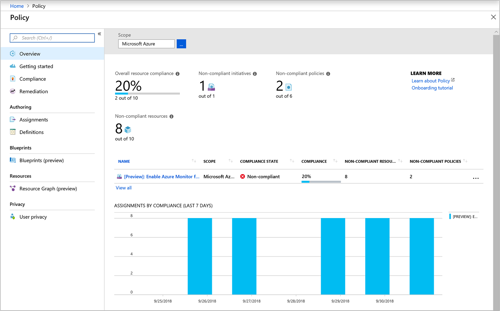

# Deploy Azure Monitor for VMs (preview)
This article describes how to set up Azure Monitor for VMs. The service monitors the operating system health of your Azure virtual machines (VMs) and virtual machine scale sets, and the virtual machines in your environment. This monitoring includes the discovery and mapping of application dependencies that might be hosted on them. 

You enable Azure Monitor for VMs by using one of the following methods:  

* Enable a single Azure virtual machine by selecting **Insights (preview)** directly from the VM.
* Enable two or more Azure VMs by using Azure Policy. Through this method, the required dependencies of existing and new VMs are installed and properly configured. Non-compliant VMs are reported, so you can decide whether to enable them and how you want to remediate them. 
* Enable two or more Azure VMs or virtual machine scale sets across a specified subscription or resource group by using PowerShell.

Additional information about each method is provided later in the article.

## Prerequisites
Before you start, make sure that you understand the information in the following sections.

### Log Analytics 

A Log Analytics workspace is currently supported in the following regions:

  - West Central US  
  - East US  
  - West Europe  
  - Southeast Asia<sup>1</sup>  

<sup>1</sup> This region doesn't currently support the Health feature of Azure Monitor for VMs.   

>[!NOTE]
>Azure virtual machines can be deployed from any region and  aren't limited to the supported regions for the Log Analytics workspace.
>

If you don't have a workspace, you can create one with one of the following methods:
* [The Azure CLI](../../log-analytics/log-analytics-quick-create-workspace-cli.md)
* [PowerShell](../../log-analytics/log-analytics-quick-create-workspace-posh.md)
* [The Azure portal](../../log-analytics/log-analytics-quick-create-workspace.md)
* [Azure Resource Manager](../../log-analytics/log-analytics-template-workspace-configuration.md) 

If you're enabling monitoring for a single Azure VM from the Azure portal, you can create a workspace during this process. 

To enable the solution for the at-scale scenario, first configure the following in your Log Analytics workspace:

* Install the ServiceMap and InfrastructureInsights solutions. You can complete this installation only by using an Azure Resource Manager template that's provided in this article.  
* Configure the Log Analytics workspace to collect performance counters.

To configure your workspace for the at-scale scenario, see [Set up Log Analytics workspace for an at-scale deployment](#setup-log-analytics-workspace).

### Supported operating systems

The following table lists the Windows and Linux operating systems that are supported with Azure Monitor for VMs. A full list that details the major and minor Linux OS release and supported kernel versions is provided later in this section.

|OS version |Performance |Maps |Health |  
|-----------|------------|-----|-------|  
|Windows Server 2016 1803 | X | X | X |
|Windows Server 2016 | X | X | X |  
|Windows Server 2012 R2 | X | X | |  
|Windows Server 2012 | X | X | |  
|Windows Server 2008 R2 | X | X| |  
|Red Hat Enterprise Linux (RHEL) 7, 6| X | X| X |  
|Ubuntu 18.04, 16.04, 14.04 | X | X | X |  
|CentOS Linux 7, 6 | X | X | X |  
|SUSE Linux Enterprise Server (SLES) 12 | X | X | X |  
|Oracle Linux 7 | X<sup>1</sup> | | X |  
|Oracle Linux 6 | X | X | X |  
|Debian 9.4, 8 | X<sup>1</sup> | | X | 

<sup>1</sup> The Performance feature of Azure Monitor for VMs is available only from Azure Monitor. It isn't available when you access it directly from the left pane of the Azure VM. 

>[!NOTE]
>The following information applies to support of the Linux operating system:  
> - Only default and SMP Linux kernel releases are supported. 
> - Nonstandard kernel releases, such as Physical Address Extension (PAE) and Xen, aren't supported for any Linux distribution. For example, a system with the release string of *2.6.16.21-0.8-xen* isn't supported. 
> - Custom kernels, including recompiles of standard kernels, aren't supported. 
> - CentOSPlus kernel isn't supported. 


#### Red Hat Linux 7

| OS version | Kernel version |
|:--|:--|
| 7.0 | 3.10.0-123 |
| 7.1 | 3.10.0-229 |
| 7.2 | 3.10.0-327 |
| 7.3 | 3.10.0-514 |
| 7.4 | 3.10.0-693 |
| 7.5 | 3.10.0-862 |

#### Red Hat Linux 6

| OS version | Kernel version |
|:--|:--|
| 6.0 | 2.6.32-71 |
| 6.1 | 2.6.32-131 |
| 6.2 | 2.6.32-220 |
| 6.3 | 2.6.32-279 |
| 6.4 | 2.6.32-358 |
| 6.5 | 2.6.32-431 |
| 6.6 | 2.6.32-504 |
| 6.7 | 2.6.32-573 |
| 6.8 | 2.6.32-642 |
| 6.9 | 2.6.32-696 |

#### Ubuntu Server

| OS version | Kernel version |
|:--|:--|
| Ubuntu 18.04 | kernel 4.15.* |
| Ubuntu 16.04.3 | kernel 4.15.* |
| 16.04 | 4.4.\*<br>4.8.\*<br>4.10.\*<br>4.11.\*<br>4.13.\* |
| 14.04 | 3.13.\*<br>4.4.\* |

#### Oracle Enterprise Linux 6 with Unbreakable Enterprise Kernel
| OS version | Kernel version
|:--|:--|
| 6.2 | Oracle 2.6.32-300 (UEK R1) |
| 6.3 | Oracle 2.6.39-200 (UEK R2) |
| 6.4 | Oracle 2.6.39-400 (UEK R2) |
| 6.5 | Oracle 2.6.39-400 (UEK R2 i386) |
| 6.6 | Oracle 2.6.39-400 (UEK R2 i386) |

#### Oracle Enterprise Linux 5 with Unbreakable Enterprise Kernel

| OS version | Kernel version
|:--|:--|
| 5.10 | Oracle 2.6.39-400 (UEK R2) |
| 5.11 | Oracle 2.6.39-400 (UEK R2) |

#### SUSE Linux 12 Enterprise Server

| OS version | Kernel version
|:--|:--|
|12 SP2 | 4.4.* |
|12 SP3 | 4.4.* |

### The Microsoft Dependency agent
The Azure Monitor for VMs Map feature gets its data from the Microsoft Dependency agent. The Dependency agent relies on the Log Analytics agent for its connection to Log Analytics. Therefore, your system must have the Log Analytics agent installed and configured with the Dependency agent. 

Whether you enable Azure Monitor for VMs for a single Azure VM or you use the at-scale deployment method, you need to use the Azure VM Dependency agent extension to install the agent as part of the experience. 

In a hybrid environment, you can download and install the Dependency agent in either of two ways: Manually, or by using an automated deployment method for virtual machines that are hosted outside Azure. 

The following table describes the connected sources that the Map feature supports in a hybrid environment.

| Connected source | Supported | Description |
|:--|:--|:--|
| Windows agents | Yes | In addition to the [Log Analytics agent for Windows](../../azure-monitor/platform/log-analytics-agent.md), Windows agents require the Microsoft Dependency agent. For a complete list of operating system versions, see [supported operating systems](#supported-operating-systems). |
| Linux agents | Yes | In addition to the [Log Analytics agent for Linux](../../azure-monitor/platform/log-analytics-agent.md), Linux agents require the Microsoft Dependency agent. For a complete list of operating system versions, see [supported operating systems](#supported-operating-systems). |
| System Center Operations Manager management group | No | |  

The Dependency agent can be downloaded from the following locations:

| File | OS | Version | SHA-256 |
|:--|:--|:--|:--|
| [InstallDependencyAgent-Windows.exe](https://aka.ms/dependencyagentwindows) | Windows | 9.7.1 | 55030ABF553693D8B5112569FB2F97D7C54B66E9990014FC8CC43EFB70DE56C6 |
| [InstallDependencyAgent-Linux64.bin](https://aka.ms/dependencyagentlinux) | Linux | 9.7.1 | 43C75EF0D34471A0CBCE5E396FFEEF4329C9B5517266108FA5D6131A353D29FE |

## Role-based access control
To enable and access the features in Azure Monitor for VMs, you need to be assigned the following access roles: 
  
- To enable the solution, you must have the *Log Analytics contributor* role. 

- To view performance, health, and map data, you must have the *Monitoring Reader* role for the Azure VM. The Log Analytics workspace must be configured for Azure Monitor for VMs.  

For more information about how to control access to a Log Analytics workspace, see [Manage workspaces](../../log-analytics/log-analytics-manage-access.md).

## Enable monitoring from the Azure portal
To enable monitoring of your Azure VM in the Azure portal, do the following:

1. Sign in to the Azure portal at [https://portal.azure.com](https://portal.azure.com). 
1. Select **Virtual Machines**. 
1. From the list, select a VM. 
1. On the VM page, in the **Monitoring** section, select **Insights (preview)**.
1. On the **Insights (preview)** page, select **Try now**.

    

1. On the **Azure Monitor Insights Onboarding** page, if you have an existing Log Analytics workspace in the same subscription, select it in the drop-down list.  
    The list preselects the default workspace and location that the virtual machine is deployed to in the subscription. 

    >[!NOTE]
    >If you want to create a new Log Analytics workspace for storing the monitoring data from the VM, follow the instructions in [Create a Log Analytics workspace](../../log-analytics/log-analytics-quick-create-workspace.md) in one of the supported regions listed earlier.  

After you've enabled monitoring, it might take about 10 minutes before you can view the health metrics for the virtual machine. 


## Deploy at scale
In this section, you deploy Azure Monitor for VMs at scale by using either Azure Policy or Azure PowerShell. 

Before you deploy your VMs, pre-configure your Log Analytics workspace as follows:

1. If you don't already have a workspace, create one that can support Azure Monitor for VMs.  
    Before you proceed, see [Manage workspaces](../../log-analytics/log-analytics-manage-access.md?toc=/azure/azure-monitor/toc.json) to understand the cost, management, and compliance considerations.      

1. Enable performance counters in the workspace for collection on Linux and Windows VMs.

1. Install and enable the ServiceMap and InfrastructureInsights solution in your workspace. 

### Set up a Log Analytics workspace
If you don't have a Log Analytics workspace, create one by reviewing the methods that are suggested in the ["Prerequisites"](#log-analytics) section. 

#### Enable performance counters
If the Log Analytics workspace that's referenced by the solution isn't already configured to collect the performance counters required by the solution, you need to enable them. You can do so in either of two ways:
* Manually, as described in [Windows and Linux performance data sources in Log Analytics](../../azure-monitor/platform/data-sources-performance-counters.md)
* By downloading and running a PowerShell script that's available from [Azure PowerShell Gallery](https://www.powershellgallery.com/packages/Enable-VMInsightsPerfCounters/1.1)
 
#### Install the ServiceMap and InfrastructureInsights solutions
This method includes a JSON template that specifies the configuration for enabling the solution components in your Log Analytics workspace. 

If you're unfamiliar with deploying resources by using a template, see:
* [Deploy resources with Resource Manager templates and Azure PowerShell](../../azure-resource-manager/resource-group-template-deploy.md)
* [Deploy resources with Resource Manager templates and the Azure CLI](../../azure-resource-manager/resource-group-template-deploy-cli.md) 

If you choose to use the Azure CLI, you first need to install and use the CLI locally. You must be running the Azure CLI version 2.0.27 or later. To identify your version, run `az --version`. If you need to install or upgrade the Azure CLI, see [Install the Azure CLI](https://docs.microsoft.com/cli/azure/install-azure-cli). 

1. Copy and paste the following JSON syntax into your file:

    ```json
    {

    "$schema": "https://schema.management.azure.com/schemas/2015-01-01/deploymentTemplate.json#",
    "contentVersion": "1.0.0.0",
    "parameters": {
        "WorkspaceName": {
            "type": "string"
        },
        "WorkspaceLocation": {
            "type": "string"
        }
    },
    "resources": [
        {
            "apiVersion": "2017-03-15-preview",
            "type": "Microsoft.OperationalInsights/workspaces",
            "name": "[parameters('WorkspaceName')]",
            "location": "[parameters('WorkspaceLocation')]",
            "resources": [
                {
                    "apiVersion": "2015-11-01-preview",
                    "location": "[parameters('WorkspaceLocation')]",
                    "name": "[concat('ServiceMap', '(', parameters('WorkspaceName'),')')]",
                    "type": "Microsoft.OperationsManagement/solutions",
                    "dependsOn": [
                        "[concat('Microsoft.OperationalInsights/workspaces/', parameters('WorkspaceName'))]"
                    ],
                    "properties": {
                        "workspaceResourceId": "[resourceId('Microsoft.OperationalInsights/workspaces/', parameters('WorkspaceName'))]"
                    },

                    "plan": {
                        "name": "[concat('ServiceMap', '(', parameters('WorkspaceName'),')')]",
                        "publisher": "Microsoft",
                        "product": "[Concat('OMSGallery/', 'ServiceMap')]",
                        "promotionCode": ""
                    }
                },
                {
                    "apiVersion": "2015-11-01-preview",
                    "location": "[parameters('WorkspaceLocation')]",
                    "name": "[concat('InfrastructureInsights', '(', parameters('WorkspaceName'),')')]",
                    "type": "Microsoft.OperationsManagement/solutions",
                    "dependsOn": [
                        "[concat('Microsoft.OperationalInsights/workspaces/', parameters('WorkspaceName'))]"
                    ],
                    "properties": {
                        "workspaceResourceId": "[resourceId('Microsoft.OperationalInsights/workspaces/', parameters('WorkspaceName'))]"
                    },
                    "plan": {
                        "name": "[concat('InfrastructureInsights', '(', parameters('WorkspaceName'),')')]",
                        "publisher": "Microsoft",
                        "product": "[Concat('OMSGallery/', 'InfrastructureInsights')]",
                        "promotionCode": ""
                    }
                }
            ]
        }
    ]
    ```

1. Save this file as *installsolutionsforvminsights.json* to a local folder.
1. Edit the values for *WorkspaceName*, *ResourceGroupName*, and *WorkspaceLocation*. The value for *WorkspaceName* is the full resource ID of your Log Analytics workspace, which includes the workspace name. The value for *WorkspaceLocation* is the region the workspace is defined in.
1. You're ready to deploy this template by using the following PowerShell command:

    ```powershell
    New-AzureRmResourceGroupDeployment -Name DeploySolutions -TemplateFile InstallSolutionsForVMInsights.json -ResourceGroupName ResourceGroupName> -WorkspaceName <WorkspaceName> -WorkspaceLocation <WorkspaceLocation - example: eastus>
    ```

    The configuration change can take a few minutes to complete. When it's complete, a message is displayed that's similar to the following and includes the result:

    ```powershell
    provisioningState       : Succeeded
    ```

### Enable by using Azure Policy
To enable Azure Monitor for VMs at scale in a way that helps ensure consistent compliance and the automatic enabling of the newly provisioned VMs, we recommend [Azure Policy](../../azure-policy/azure-policy-introduction.md). These policies:

* Deploy the Log Analytics agent and the Dependency agent. 
* Report on compliance results. 
* Remediate for non-compliant VMs.

To enable Azure Monitor for VMs by using Azure Policy in your tenant: 

- Assign the initiative to a scope: management group, subscription, or resource group 
- Review and remediate compliance results  

For more information about assigning Azure Policy, see [Azure Policy overview](../../governance/policy/overview.md#policy-assignment) and review the [overview of management groups](../../governance/management-groups/index.md) before you continue. 

The policy definitions are listed in the following table: 

|Name |Description |Type |  
|-----|------------|-----|  
|[Preview]: Enable Azure Monitor for VMs |Enable Azure Monitor for the Virtual Machines (VMs) in the specified scope (management group, subscription, or resource group). Takes Log Analytics workspace as a parameter. |Initiative |  
|[Preview]: Audit Dependency Agent Deployment – VM Image (OS) unlisted |Reports VMs as non-compliant if the VM Image (OS) isn't in the list defined and the agent isn't installed. |Policy |  
|[Preview]: Audit Log Analytics Agent Deployment – VM Image (OS) unlisted |Reports VMs as non-compliant if the VM Image (OS) isn't in the list defined and the agent isn't installed. |Policy |  
|[Preview]: Deploy Dependency Agent for Linux VMs |Deploy Dependency Agent for Linux VMs if the VM Image (OS) is in the list defined and the agent isn't installed. |Policy |  
|[Preview]: Deploy Dependency Agent for Windows VMs |Deploy Dependency Agent for Windows VMs if the VM Image (OS) is in the list defined and the agent isn't installed. |Policy |  
|[Preview]: Deploy Log Analytics Agent for Linux VMs |Deploy Log Analytics Agent for Linux VMs if the VM Image (OS) is in the list defined and the agent isn't installed. |Policy |  
|[Preview]: Deploy Log Analytics Agent for Windows VMs |Deploy Log Analytics Agent for Windows VMs if the VM Image (OS) is in the list defined and the agent isn't installed. |Policy |  

Standalone policy (not included with the initiative) is described here: 

|Name |Description |Type |  
|-----|------------|-----|  
|[Preview]: Audit Log Analytics Workspace for VM - Report Mismatch |Report VMs as non-compliant if they aren't logging to the Log Analytics workspace specified in the policy/initiative assignment. |Policy |

#### Assign the Azure Monitor initiative
With this initial release, you can create the policy assignment only in the Azure portal. To understand how to complete these steps, see [Create a policy assignment from the Azure portal](../../governance/policy/assign-policy-portal.md). 

1. To launch the Azure Policy service in the Azure portal, select **All services**, and then search for and select **Policy**. 
1. In the left pane of the Azure Policy page, select **Assignments**.  
    An assignment is a policy that has been assigned to take place within a specific scope.
1. At the top of the **Policy - Assignments** page, select **Assign Initiative**.
1. On the **Assign Initiative** page, select the **Scope** by clicking the ellipsis (...), and select a management group or subscription.  
    In our example, a scope limits the policy assignment to a grouping of virtual machines for enforcement.
1. At the bottom of the **Scope** page, save your changes by selecting **Select**.
1. (Optional) To remove one or more resources from the scope, select **Exclusions**. 
1. Select the **Initiative definition** ellipsis (...) to display the list of available definitions, select **[Preview] Enable Azure Monitor for VMs**, and then select **Select**.  
    The **Assignment name** box is automatically populated with the initiative name you selected, but you can change it. You can also add an optional description. The **Assigned by** box is automatically populated based on who is logged in, and this value is optional.
1. In the **Log Analytics workspace** drop-down list for the supported region, select a workspace.

    >[!NOTE]
    >If the workspace is beyond the scope of the assignment, grant *Log Analytics Contributor* permissions to the policy assignment's Principal ID. If you don't do this, you might see a deployment failure such as: `The client '343de0fe-e724-46b8-b1fb-97090f7054ed' with object id '343de0fe-e724-46b8-b1fb-97090f7054ed' does not have authorization to perform action 'microsoft.operationalinsights/workspaces/read' over scope ... ` 
    >To grant access, review [how to manually configure the managed identity](../../governance/policy/how-to/remediate-resources.md#manually-configure-the-managed-identity).
    >  
    The **Managed Identity** check box is selected, because the initiative being assigned includes a policy with the *deployIfNotExists* effect. 
1. In the **Manage Identity location** drop-down list, select the appropriate region. 
1. Select **Assign**.

#### Review and remediate the compliance results 

You can learn how to review compliance results by reading [identify non-compliance results](../../governance/policy/assign-policy-portal.md#identify-non-compliant-resources). In the left pane, select **Compliance**, and then locate the **[Preview] Enable Azure Monitor for VMs** initiative for VMs that aren't compliant according to the assignment you created.



Based on the results of the policies included with the initiative, VMs are reported as non-compliant in the following scenarios:  
  
* Log Analytics or the Dependency agent isn't deployed. 
   This scenario is typical for a scope with existing VMs. To mitigate it, deploy the required agents by [creating remediation tasks](../../governance/policy/how-to/remediate-resources.md) on a non-compliant policy.   
 
    - [Preview]: Deploy Dependency Agent for Linux VMs   
    - [Preview]: Deploy Dependency Agent for Windows VMs  
    - [Preview]: Deploy Log Analytics Agent for Linux VMs  
    - [Preview]: Deploy Log Analytics Agent for Windows VMs  

* VM Image (OS) isn't identified in the policy definition. 
   The criteria of the deployment policy include only VMs that are deployed from well-known Azure VM images. Check the documentation to see whether the VM OS is supported. If it isn't supported, duplicate the deployment policy and update or modify it to make the image compliant. 
  
    - [Preview]: Audit Dependency Agent Deployment – VM Image (OS) unlisted  
    - [Preview]: Audit Log Analytics Agent Deployment – VM Image (OS) unlisted

* VMs aren't logging in to the specified Log Analytics workspace.  
    It's possible that some VMs in the initiative scope are logging in to a Log Analytics workspace other than the one that's specified in the policy assignment. This policy is a tool to identify which VMs are reporting to a non-compliant workspace. 
 
    - [Preview]: Audit Log Analytics Workspace for VM - Report Mismatch  

### Enable with PowerShell
To enable Azure Monitor for VMs for multiple VMs or virtual machine scale sets, you can use the PowerShell script [Install-VMInsights.ps1](https://www.powershellgallery.com/packages/Install-VMInsights/1.0), available from the Azure PowerShell Gallery. This script iterates through every virtual machine and virtual machine scale set in your subscription, in the scoped resource group that's specified by *ResourceGroup*, or to a single VM or virtual machine scale set that's specified by *Name*. For each VM or virtual machine scale set, the script verifies whether the VM extension is already installed. If the VM extension is not installed, the script tries to reinstall it. If the VM extension is installed, the script installs the Log Analytics and Dependency agent VM extensions.  

This script requires Azure PowerShell module version 5.7.0 or later. Run `Get-Module -ListAvailable AzureRM` to find the version. If you need to upgrade, see [Install Azure PowerShell module](https://docs.microsoft.com/powershell/azure/install-azurerm-ps). If you're running PowerShell locally, you also need to run `Connect-AzureRmAccount` to create a connection with Azure.

To get a list of the script's argument details and example usage, run `Get-Help`.  

```powershell
Get-Help .\Install-VMInsights.ps1 -Detailed

SYNOPSIS
    This script installs VM extensions for Log Analytics and the Dependency agent as needed for VM Insights.


SYNTAX
    .\Install-VMInsights.ps1 [-WorkspaceId] <String> [-WorkspaceKey] <String> [-SubscriptionId] <String> [[-ResourceGroup]
    <String>] [[-Name] <String>] [[-PolicyAssignmentName] <String>] [-ReInstall] [-TriggerVmssManualVMUpdate] [-Approve] [-WorkspaceRegion] <String>
    [-WhatIf] [-Confirm] [<CommonParameters>]


DESCRIPTION
    This script installs or re-configures following on VMs and VM Scale Sets:
    - Log Analytics VM Extension configured to supplied Log Analytics Workspace
    - Dependency Agent VM Extension

    Can be applied to:
    - Subscription
    - Resource Group in a Subscription
    - Specific VM/VM Scale Set
    - Compliance results of a policy for a VM or VM Extension

    Script will show you list of VMs/VM Scale Sets that will apply to and let you confirm to continue.
    Use -Approve switch to run without prompting, if all required parameters are provided.

    If the extensions are already installed will not install again.
    Use -ReInstall switch if you need to for example update the workspace.

    Use -WhatIf if you would like to see what would happen in terms of installs, what workspace configured to, and status of the extension.


PARAMETERS
    -WorkspaceId <String>
        Log Analytics WorkspaceID (GUID) for the data to be sent to

    -WorkspaceKey <String>
        Log Analytics Workspace primary or secondary key

    -SubscriptionId <String>
        SubscriptionId for the VMs/VM Scale Sets
        If using PolicyAssignmentName parameter, subscription that VMs are in

    -ResourceGroup <String>
        <Optional> Resource Group to which the VMs or VM Scale Sets belong

    -Name <String>
        <Optional> To install to a single VM/VM Scale Set

    -PolicyAssignmentName <String>
        <Optional> Take the input VMs to operate on as the Compliance results from this Assignment
        If specified will only take from this source.

    -ReInstall [<SwitchParameter>]
        <Optional> If VM/VM Scale Set is already configured for a different workspace, set this to change to the new workspace

    -TriggerVmssManualVMUpdate [<SwitchParameter>]
        <Optional> Set this flag to trigger update of VM instances in a scale set whose upgrade policy is set to Manual

    -Approve [<SwitchParameter>]
        <Optional> Gives the approval for the installation to start with no confirmation prompt for the listed VMs/VM Scale Sets

    -WorkspaceRegion <String>
        Region the Log Analytics Workspace is in
        Supported values: "East US","eastus","Southeast Asia","southeastasia","West Central US","westcentralus","West Europe","westeurope"
        For Health supported is: "East US","eastus","West Central US","westcentralus"

    -WhatIf [<SwitchParameter>]
        <Optional> See what would happen in terms of installs.
        If extension is already installed will show what workspace is currently configured, and status of the VM extension

    -Confirm [<SwitchParameter>]
        <Optional> Confirm every action

    <CommonParameters>
        This cmdlet supports the common parameters: Verbose, Debug,
        ErrorAction, ErrorVariable, WarningAction, WarningVariable,
        OutBuffer, PipelineVariable, and OutVariable. For more information, see
        about_CommonParameters (https:/go.microsoft.com/fwlink/?LinkID=113216).

    -------------------------- EXAMPLE 1 --------------------------
    .\Install-VMInsights.ps1 -WorkspaceRegion eastus -WorkspaceId <WorkspaceId>-WorkspaceKey <WorkspaceKey> -SubscriptionId <SubscriptionId>
    -ResourceGroup <ResourceGroup>

    Install for all VMs in a Resource Group in a subscription

    -------------------------- EXAMPLE 2 --------------------------
    .\Install-VMInsights.ps1 -WorkspaceRegion eastus -WorkspaceId <WorkspaceId>-WorkspaceKey <WorkspaceKey> -SubscriptionId <SubscriptionId>
    -ResourceGroup <ResourceGroup> -ReInstall

    Specify to reinstall extensions even if already installed, for example to update to a different workspace

    -------------------------- EXAMPLE 3 --------------------------
    .\Install-VMInsights.ps1 -WorkspaceRegion eastus -WorkspaceId <WorkspaceId>-WorkspaceKey <WorkspaceKey> -SubscriptionId <SubscriptionId>
    -PolicyAssignmentName a4f79f8ce891455198c08736 -ReInstall

    Specify to use a PolicyAssignmentName for source, and to reinstall (move to a new workspace)
```

The following example demonstrates using the PowerShell commands in the folder to enable Azure Monitor for VMs and understand the expected output:

```powershell
$WorkspaceId = "<GUID>"
$WorkspaceKey = "<Key>"
$SubscriptionId = "<GUID>"
.\Install-VMInsights.ps1 -WorkspaceId $WorkspaceId -WorkspaceKey $WorkspaceKey -SubscriptionId $SubscriptionId -WorkspaceRegion eastus

Getting list of VMs or VM ScaleSets matching criteria specified

VMs or VM ScaleSets matching criteria:

db-ws-1 VM running
db-ws2012 VM running

This operation will install the Log Analytics and Dependency agent extensions on above 2 VMs or VM Scale Sets.
VMs in a non-running state will be skipped.
Extension will not be reinstalled if already installed. Use -ReInstall if desired, for example to update workspace

Confirm
Continue?
[Y] Yes  [N] No  [S] Suspend  [?] Help (default is "Y"): y

db-ws-1 : Deploying DependencyAgentWindows with name DAExtension
db-ws-1 : Successfully deployed DependencyAgentWindows
db-ws-1 : Deploying MicrosoftMonitoringAgent with name MMAExtension
db-ws-1 : Successfully deployed MicrosoftMonitoringAgent
db-ws2012 : Deploying DependencyAgentWindows with name DAExtension
db-ws2012 : Successfully deployed DependencyAgentWindows
db-ws2012 : Deploying MicrosoftMonitoringAgent with name MMAExtension
db-ws2012 : Successfully deployed MicrosoftMonitoringAgent

Summary:

Already Onboarded: (0)

Succeeded: (4)
db-ws-1 : Successfully deployed DependencyAgentWindows
db-ws-1 : Successfully deployed MicrosoftMonitoringAgent
db-ws2012 : Successfully deployed DependencyAgentWindows
db-ws2012 : Successfully deployed MicrosoftMonitoringAgent

Connected to different workspace: (0)

Not running - start VM to configure: (0)

Failed: (0)
```

## Enable for a hybrid environment
This section explains how to deploy virtual machines or physical computers that are hosted in your datacenter or other cloud environments for monitoring by Azure Monitor for VMs. 

The Azure Monitor for VMs Map Dependency agent doesn't transmit any data itself, and it doesn't require any changes to firewalls or ports. The Map data is always transmitted by the Log Analytics agent to the Azure Monitor service, either directly or through the [OMS Gateway](../../azure-monitor/platform/gateway.md) if your IT security policies don't allow computers on the network to connect to the internet.

Review the requirements and deployment methods for the [Log Analytics Linux and Windows agent](../../log-analytics/log-analytics-agent-overview.md). 

[!INCLUDE [log-analytics-agent-note](../../../includes/log-analytics-agent-note.md)]

Summarized steps:

1. Install Log Analytics Agent for Windows or Linux.
1. Download and install the Azure Monitor for VMs Map Dependency agent for [Windows](https://aka.ms/dependencyagentwindows) or [Linux](https://aka.ms/dependencyagentlinux).
1. Enable the collection of performance counters.
1. Deploy Azure Monitor for VMs.

### Install the Dependency agent on Windows 
You can install the Dependency agent manually on Windows computers by running `InstallDependencyAgent-Windows.exe`. If you run this executable file without any options, it starts a setup wizard that you can follow to install the agent interactively. 

>[!NOTE]
>*Administrator* privileges are required to install or uninstall the agent.

The following table highlights the parameters that are supported by setup for the agent from the command line. 

| Parameter | Description |
|:--|:--|
| /? | Returns a list of the command-line options. |
| /S | Performs a silent installation with no user interaction. |

For example, to run the installation program with the `/?` parameter, type **InstallDependencyAgent-Windows.exe /?**.

Files for the Windows Dependency agent are installed in *C:\Program Files\Microsoft Dependency Agent* by default. If the Dependency agent fails to start after setup is complete, check the logs for detailed error information. The log directory is *%Programfiles%\Microsoft Dependency Agent\logs*. 

### Install the Dependency agent on Linux
The Dependency agent is installed on Linux servers from *InstallDependencyAgent-Linux64.bin*, a shell script with a self-extracting binary. You can run the file by using `sh` or add execute permissions to the file itself.

>[!NOTE]
> Root access is required to install or configure the agent.
> 

| Parameter | Description |
|:--|:--|
| -help | Get a list of the command-line options. |
| -s | Perform a silent installation with no user prompts. |
| --check | Check permissions and the operating system but don't install the agent. |

For example, to run the installation program with the `-help` parameter, type **InstallDependencyAgent-Linux64.bin -help**.

Install the Linux Dependency agent as root by running the following command, `sh InstallDependencyAgent-Linux64.bin`.
    
If the Dependency agent fails to start, check the logs for detailed error information. On Linux agents, the log directory is */var/opt/microsoft/dependency-agent/log*.

Files for the Dependency agent are placed in the following directories:

| Files | Location |
|:--|:--|
| Core files | /opt/microsoft/dependency-agent |
| Log files | /var/opt/microsoft/dependency-agent/log |
| Config files | /etc/opt/microsoft/dependency-agent/config |
| Service executable files | /opt/microsoft/dependency-agent/bin/microsoft-dependency-agent<br>/opt/microsoft/dependency-agent/bin/microsoft-dependency-agent-manager |
| Binary storage files | /var/opt/microsoft/dependency-agent/storage |

### Enable performance counters
If the Log Analytics workspace that's referenced by the solution isn't already configured to collect the performance counters required by the solution, you will need to enable them. You can do so in either of two ways: 
* Manually, as described in [Windows and Linux performance data sources in Log Analytics](../../azure-monitor/platform/data-sources-performance-counters.md)
* By downloading and running a PowerShell script that's available from [Azure PowerShell Gallery](https://www.powershellgallery.com/packages/Enable-VMInsightsPerfCounters/1.1)
 
### Deploy Azure Monitor for VMs
This method includes a JSON template that specifies the configuration for enabling the solution components in your Log Analytics workspace. 

If you're unfamiliar with deploying resources by using a template, see:
* [Deploy resources with Resource Manager templates and Azure PowerShell](../../azure-resource-manager/resource-group-template-deploy.md)
* [Deploy resources with Resource Manager templates and the Azure CLI](../../azure-resource-manager/resource-group-template-deploy-cli.md) 

If you choose to use the Azure CLI, you first need to install and use the CLI locally. You must be running the Azure CLI version 2.0.27 or later. To identify your version, run `az --version`. If you need to install or upgrade the Azure CLI, see [Install the Azure CLI](https://docs.microsoft.com/cli/azure/install-azure-cli). 

#### Create and execute a template

1. Copy and paste the following JSON syntax into your file:

    ```json
    {

    "$schema": "https://schema.management.azure.com/schemas/2015-01-01/deploymentTemplate.json#",
    "contentVersion": "1.0.0.0",
    "parameters": {
        "WorkspaceName": {
            "type": "string"
        },
        "WorkspaceLocation": {
            "type": "string"
        }
    },
    "resources": [
        {
            "apiVersion": "2017-03-15-preview",
            "type": "Microsoft.OperationalInsights/workspaces",
            "name": "[parameters('WorkspaceName')]",
            "location": "[parameters('WorkspaceLocation')]",
            "resources": [
                {
                    "apiVersion": "2015-11-01-preview",
                    "location": "[parameters('WorkspaceLocation')]",
                    "name": "[concat('ServiceMap', '(', parameters('WorkspaceName'),')')]",
                    "type": "Microsoft.OperationsManagement/solutions",
                    "dependsOn": [
                        "[concat('Microsoft.OperationalInsights/workspaces/', parameters('WorkspaceName'))]"
                    ],
                    "properties": {
                        "workspaceResourceId": "[resourceId('Microsoft.OperationalInsights/workspaces/', parameters('WorkspaceName'))]"
                    },

                    "plan": {
                        "name": "[concat('ServiceMap', '(', parameters('WorkspaceName'),')')]",
                        "publisher": "Microsoft",
                        "product": "[Concat('OMSGallery/', 'ServiceMap')]",
                        "promotionCode": ""
                    }
                },
                {
                    "apiVersion": "2015-11-01-preview",
                    "location": "[parameters('WorkspaceLocation')]",
                    "name": "[concat('InfrastructureInsights', '(', parameters('WorkspaceName'),')')]",
                    "type": "Microsoft.OperationsManagement/solutions",
                    "dependsOn": [
                        "[concat('Microsoft.OperationalInsights/workspaces/', parameters('WorkspaceName'))]"
                    ],
                    "properties": {
                        "workspaceResourceId": "[resourceId('Microsoft.OperationalInsights/workspaces/', parameters('WorkspaceName'))]"
                    },
                    "plan": {
                        "name": "[concat('InfrastructureInsights', '(', parameters('WorkspaceName'),')')]",
                        "publisher": "Microsoft",
                        "product": "[Concat('OMSGallery/', 'InfrastructureInsights')]",
                        "promotionCode": ""
                    }
                }
            ]
        }
    ]
    ```

1. Save this file as *installsolutionsforvminsights.json* to a local folder.
1. Edit the values for *WorkspaceName*, *ResourceGroupName*, and *WorkspaceLocation*. The value for *WorkspaceName* is the full resource ID of your Log Analytics workspace, which includes the workspace name. The value for *WorkspaceLocation* is the region the workspace is defined in.
1. You're ready to deploy this template by using the following PowerShell command:

    ```powershell
    New-AzureRmResourceGroupDeployment -Name DeploySolutions -TemplateFile InstallSolutionsForVMInsights.json -ResourceGroupName ResourceGroupName> -WorkspaceName <WorkspaceName> -WorkspaceLocation <WorkspaceLocation - example: eastus>
    ```

    The configuration change can take a few minutes to complete. When it's complete, a message is displayed that's similar to the following and includes the result:

    ```powershell
    provisioningState       : Succeeded
    ```
After you've enabled monitoring, it might take about 10 minutes before you can view the health state and metrics for the hybrid computer. 

## Performance counters enabled
Azure Monitor for VMs configures a Log Analytics workspace to collect the performance counters that are used by the solution. The following table lists the objects and counters configured by the solution that are collected every 60 seconds.

### Windows performance counters

|Object name |Counter name |  
|------------|-------------|  
|LogicalDisk |% Free Space |  
|LogicalDisk |Avg. Disk sec/Read |  
|LogicalDisk |Avg. Disk sec/Transfer |  
|LogicalDisk |Avg. Disk sec/Write |  
|LogicalDisk |Disk Bytes/sec |  
|LogicalDisk |Disk Read Bytes/sec |  
|LogicalDisk |Disk Reads/sec |  
|LogicalDisk |Disk Transfers/sec |  
|LogicalDisk |Disk Write Bytes/sec |  
|LogicalDisk |Disk Writes/sec |  
|LogicalDisk |Free Megabytes |  
|Memory |Available MBytes |  
|Network Adapter |Bytes Received/sec |  
|Network Adapter |Bytes Sent/sec |  
|Processor |% Processor Time |  

### Linux performance counters

|Object name |Counter name |  
|------------|-------------|  
|Logical Disk |% Used Space |  
|Logical Disk |Disk Read Bytes/sec |  
|Logical Disk |Disk Reads/sec |  
|Logical Disk |Disk Transfers/sec |  
|Logical Disk |Disk Write Bytes/sec |  
|Logical Disk |Disk Writes/sec |  
|Logical Disk |Free Megabytes |  
|Logical Disk |Logical Disk Bytes/sec |  
|Memory |Available MBytes Memory |  
|Network |Total Bytes Received |  
|Network |Total Bytes Transmitted |  
|Processor |% Processor Time |  

## Diagnostic and usage data
Microsoft automatically collects usage and performance data through your use of the Azure Monitor service. Microsoft uses this data to provide and improve the quality, security, and integrity of the service. To provide accurate and efficient troubleshooting capabilities, data from the Map feature includes information about the configuration of your software, such as the operating system and version, IP address, DNS name, and workstation name. Microsoft doesn't collect names, addresses, or other contact information.

For more information about data collection and usage, see the [Microsoft Online Services Privacy Statement](https://go.microsoft.com/fwlink/?LinkId=512132).

[!INCLUDE [GDPR-related guidance](../../../includes/gdpr-dsr-and-stp-note.md)]
## Next steps

With monitoring enabled for your virtual machine, this information is available for analysis with Azure Monitor for VMs. To learn how to use the Health feature, see [View Azure Monitor for VMs Health](vminsights-health.md). To view discovered application dependencies, see [View Azure Monitor for VMs Map](vminsights-maps.md). 