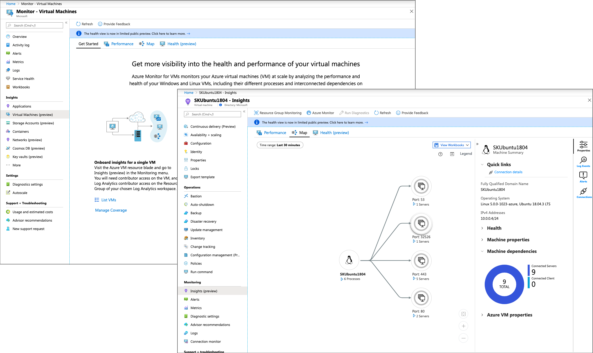

# What is Azure Monitor for VMs?

Azure Monitor for VMs monitors your virtual machines, virtual machine scale sets, and Azure Arc machines at scale. It analyzes the performance and health of your Windows and Linux VMs, and monitors their processes and dependencies on other resources and external processes. It includes support for monitoring performance and application dependencies for VMs that are hosted on-premises or in another cloud provider. The following key features deliver in-depth insight:

- **Pre-defined trending performance charts**: Display core performance metrics from the guest VM operating system.

- **Dependency map**: Displays the interconnected components with the VM from various resource groups and subscriptions.  

>[!NOTE]
>We recently [announced changes](https://azure.microsoft.com/updates/updates-to-azure-monitor-for-virtual-machines-preview-before-general-availability-release/
) we are making to the Health feature based on the feedback we have received from our public preview customers. Given the number of changes we will be making, we are going to stop offering the Health feature for new customers. Existing customers can continue to use the health feature. For more details, please refer to our [General Availability FAQ](vminsights-ga-release-faq.md).  

Integration with Azure Monitor Logs delivers powerful aggregation and filtering, allowing Azure Monitor for VMs to analyze data trends over time. You can view this data in a single VM from the virtual machine directly, or you can use Azure Monitor to deliver an aggregated view of your VMs where the view supports Azure resource-context or workspace-context modes. For more information, see [access modes overview](../platform/design-logs-deployment.md#access-mode).

Azure Monitor for VMs can deliver predictable performance and availability of vital applications. It identifies performance bottlenecks and network issues and can also help you understand whether an issue is related to other dependencies.  

## Data usage

When you deploy Azure Monitor for VMs, the data that's collected by your VMs is ingested and stored in Azure Monitor. Performance and dependency data collected are stored in a Log Analytics workspace. Based on the pricing that's published on the [Azure Monitor pricing page](https://azure.microsoft.com/pricing/details/monitor/), Azure Monitor for VMs is billed for:

- The data that's ingested and stored.
- The alert rules that are created.
- The notifications that are sent. 

The log size varies by the string lengths of performance counters, and it can increase with the number of logical disks and network adapters allocated to the VM. If you already have a workspace and are collecting these counters, no duplicate charges are applied. If you're already using Service Map, the only change you'll see is the additional connection data that's sent to Azure Monitor.​

## Next steps

To understand the requirements and methods that help you monitor your virtual machines, review [Deploy Azure Monitor for VMs](vminsights-enable-overview.md).
