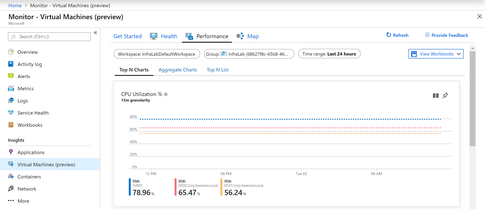
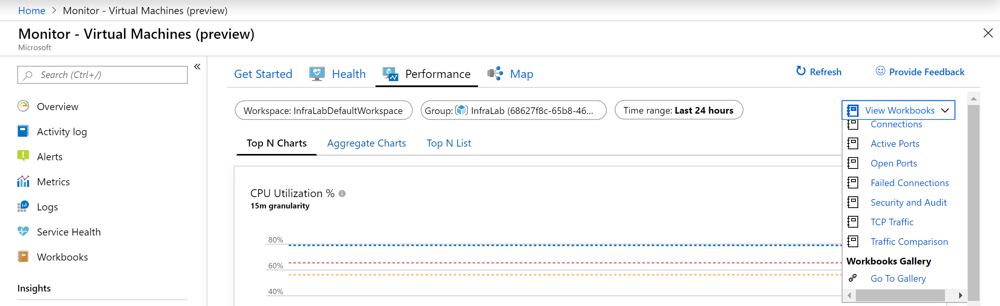
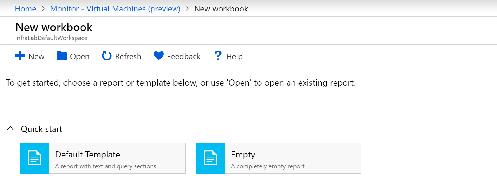
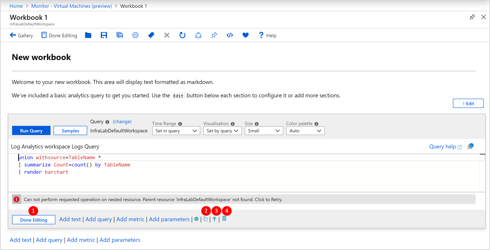
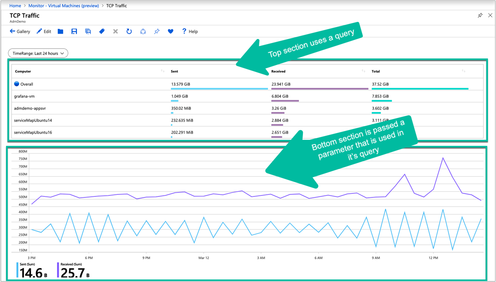
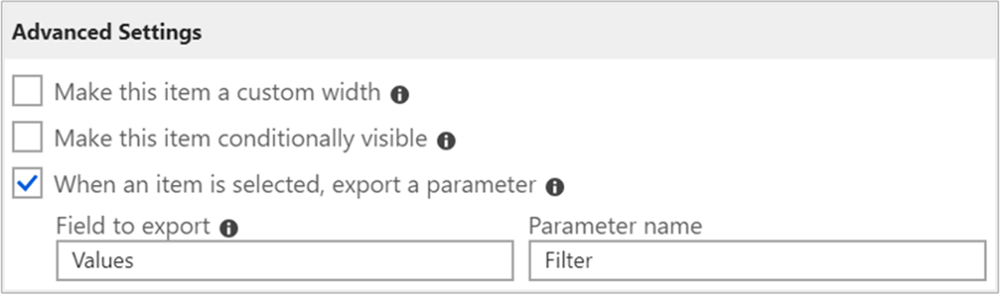
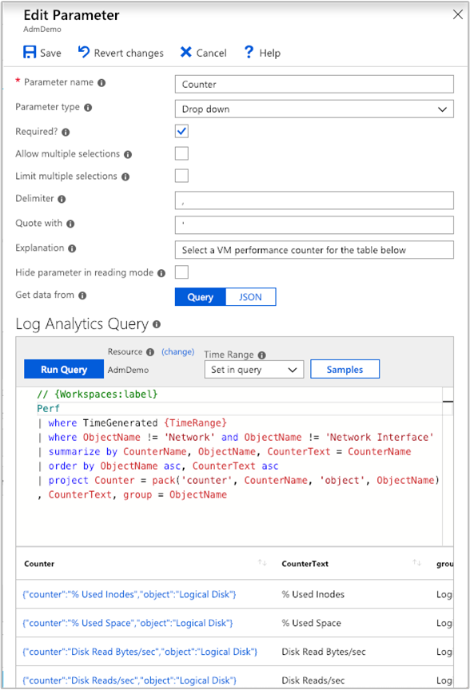
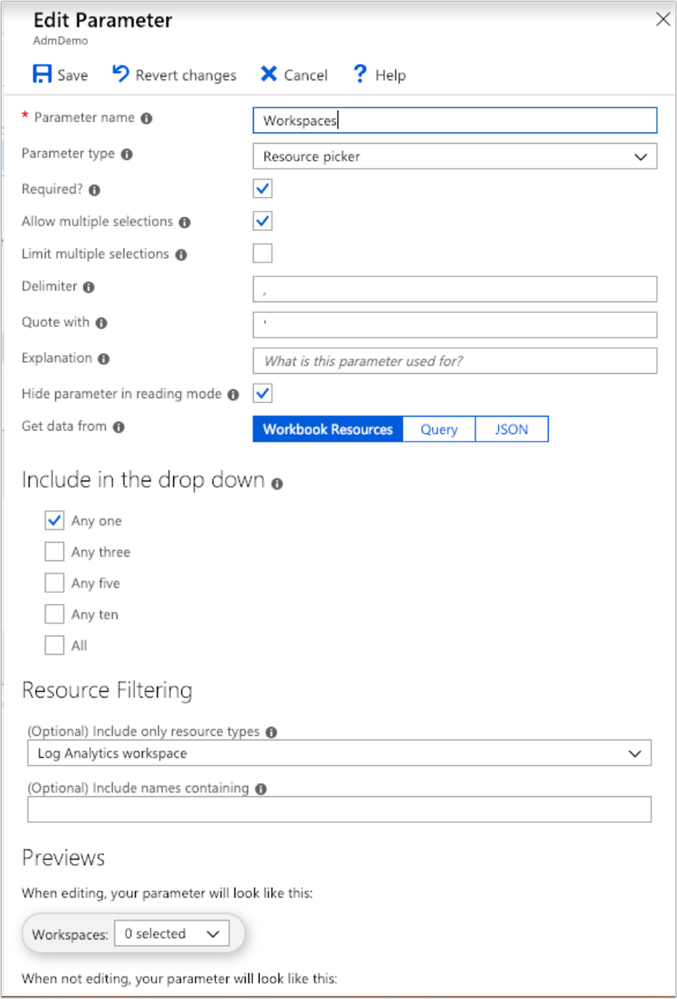

# Create interactive reports with Azure Monitor workbooks

Workbooks combine text, [log queries](../log-query/query-language.md), metrics, and parameters into rich interactive reports. Workbooks are editable by any other team members who have access to the same Azure resources.

Workbooks are helpful for scenarios such as:

* Exploring the usage of your virtual machine when you don't know the metrics of interest in advance: CPU utilization, disk space, memory, network dependencies, etc. Unlike other usage analytics tools, workbooks let you combine multiple kinds of visualizations and analyses, making them great for this kind of free-form exploration.
* Explaining to your team how a recently provisioned VM is performing, by showing metrics for key counters and other log events.
* Sharing the results of a resizing experiment of your VM with other members of your team. You can explain the goals for the experiment with text, then show each usage metric and analytics queries used to evaluate the experiment, along with clear call-outs for whether each metric was above- or below-target.
* Reporting the impact of an outage on the usage of your VM, combining data, text explanation, and a discussion of next steps to prevent outages in the future.

Azure Monitor for VMs includes several workbooks to get you started, and the following table summarizes them.

| Workbook | Description | Scope |
|----------|-------------|-------|
| Performance | Provides a customizable version of our Top N List and Charts view in a single workbook that leverages all of the Log Analytics performance counters that you have enabled.| At scale |
| Performance counters | A Top N chart view across a wide set of performance counters. | At scale |
| Connections | Connections provides an in-depth view of the inbound and outbound connections from your monitored VMs. | At scale |
| Active Ports | Provides a list of the processes that have bound to the ports on the monitored VMs and their activity in the chosen timeframe. | At scale |
| Open Ports | Provides the number of ports open on your monitored VMs and the details on those open ports. | At scale |
| Failed Connections | Display the count of failed connections on your monitored VMs, the failure trend, and if the percentage of failures is increasing over time. | At scale |
| Security and Audit | An analysis of your TCP/IP traffic that reports on overall connections, malicious connections, where the IP endpoints reside globally.  To enable all features, you will need to enable Security Detection. | At scale |
| TCP Traffic | A ranked report for your monitored VMs and their sent, received, and total network traffic in a grid and displayed as a trend line. | At scale |
| Traffic Comparison | This workbooks lets you compare network traffic trends for a single machine or a group of machines. | At scale |
| Performance | Provides a customizable version of our Performance view that leverages all of the Log Analytics performance counters that you have enabled. | Single VM | 
| Connections | Connections provides an in-depth view of the inbound and outbound connections from your VM. | Single VM |
 
## Starting with a template or saved workbook

A workbook is made up of sections consisting of independently editable charts, tables, text, and input controls. To better understand workbooks, let's start by opening a template and walk through creating a custom workbook. 

1. Sign in to the [Azure portal](https://portal.azure.com).

2. Select **Virtual Machines**.

3. From the list, select a VM.

4. On the VM page, in the **Monitoring** section, select **Insights (preview)**.

5. On the VM insights page, select **Performance** or **Maps** tab and then select **View Workbooks** from the link on the page. 

    

6. From the drop-down list, select **Go to Gallery** from the bottom of the list.

    

    It launches the workbook gallery with a number of prebuilt workbooks to help you get started.

7. We'll start with the **Default Template**, which is located under the heading **Quick start**.

    

## Editing workbook sections

Workbooks have two modes: **editing mode**, and **reading mode**. When the default template workbook is first launched, it opens in **editing mode**. It shows all the content of the workbook, including any steps and parameters that are otherwise hidden. **Reading mode** presents a simplified report style view. Reading mode allows you to abstract away the complexity that went into creating a report while still having the underlying mechanics only a few clicks away when needed for modification.



1. When you're done editing a section, click **Done Editing** in the bottom-left corner of the section.

2. To create a duplicate of a section, click the **Clone this section** icon. Creating duplicate sections is a great to way to iterate on a query without losing previous iterations.

3. To move up a section in a workbook, click the **Move up** or **Move down** icon.

4. To remove a section permanently, click the **Remove** icon.

## Adding text and Markdown sections

Adding headings, explanations, and commentary to your workbooks helps turn a set of tables and charts into a narrative. Text sections in workbooks support the [Markdown syntax](https://daringfireball.net/projects/markdown/) for text formatting, like headings, bold, italics, and bulleted lists.

To add a text section to your workbook, use the **Add text** button at the bottom of the workbook, or at the bottom of any section.

## Adding query sections


To add query section to your workbook, use the **Add query** button at the bottom of the workbook, or at the bottom of any section.

Query sections are highly flexible and can be used to answer questions like:

* How was my CPU utilization during the same time period as an increase in network traffic?
* What was the trend in available disk space over the last month?
* How many network connection failures did my VM experience over the last two weeks? 

You also aren't only limited to querying from the context of the virtual machine you launched the workbook from. You can query across multiple virtual machines, as well as Log Analytics workspaces, as long as you have access permission to those resources.

To include data from other Log Analytics workspaces or from a specific Application Insights app using the **workspace** identifier. To learn more about cross-resource queries, refer to the [official guidance](../log-query/cross-workspace-query.md).

### Advanced analytic query settings

Each section has its own advanced settings, which are accessible via the settings  icon located to the right of the **Add parameters** button.


|         |          |
| ---------------- |:-----|
| **Custom width**    | Makes an item an arbitrary size, so you can fit many items on a single line allowing you to better organize your charts and tables into rich interactive reports.  |
| **Conditionally visible** | Specify to hide steps based on a parameter when in reading mode. |
| **Export a parameter**| Allow a selected row in the grid or chart to cause later steps to change values or become visible.  |
| **Show query when not editing** | Displays the query above the chart or table even when in reading mode.
| **Show open in analytics button when not editing** | Adds the blue Analytics icon to the right-hand corner of the chart to allow one-click access.|

Most of these settings are fairly intuitive, but to understand **Export a parameter** it is better to examine a workbook that makes use of this functionality.

One of the prebuilt workbooks - **TCP Traffic**, provides information on connection metrics from a VM.

The first section of the workbook is based on log query data. The second section is also based on log query data, but selecting a row in the first table will interactively update the contents of the charts:



The behavior is possible through use of the **When an item is selected, export a parameter** advanced settings, which are enabled in the table's log query.



The second log query then utilizes the exported values when a row is selected to create a set of values that are then used by the section heading and charts. If no row is selected, it hides the section heading and charts. 

For example, the hidden parameter in the second section uses the following reference from the row selected in the grid:

```
VMConnection
| where TimeGenerated {TimeRange}
| where Computer in ("{ComputerName}") or '*' in ("{ComputerName}") 
| summarize Sent = sum(BytesSent), Received = sum(BytesReceived) by bin(TimeGenerated, {TimeRange:grain})
```

## Adding metrics sections

Metrics sections give you full access to incorporate Azure Monitor metrics data into your interactive reports. In Azure Monitor for VMs, the prebuilt workbooks will typically contain analytic query data rather than metric data.  You may choose to create workbooks with metric data, allowing you to take full advantage of the best of both features all in one place. You also have the ability to pull in metric data from resources in any of the subscriptions you have access to.

Here is an example of virtual machine data being pulled into a workbook to provide a grid visualization of CPU performance:


## Adding parameter sections

Workbook parameters allow you to change values in the workbook without having to manually edit the query or text sections. This removes the requirement of needing to understand the underlying analytics query language and greatly expands the potential audience of workbook-based reporting.

The values of parameters are replaced in query, text or other parameter sections by putting the name of the parameter in braces, like ``{parameterName}``. Parameter names are limited to similar rules as JavaScript identifiers, alphabetic characters or underscores, followed by alphanumeric characters or underscores. For example, **a1** is allowed, but **1a** is not allowed.

Parameters are linear, starting from the top of a workbook and flowing down to later steps.  Parameters declared later in a workbook can override parameters that were declared earlier. This also lets parameters that use queries to access the values from parameters defined earlier. Within a parameter's step itself, parameters are also linear, left to right, where parameters to the right can depend on a parameter declared earlier in that same step.
 
There are four different types of parameters, which are currently supported:

|                  |      |
| ---------------- |:-----|
| **Text**    | Allows the user to edit a text box, and you can optionally supply a query to fill in the default value. |
| **Drop down** | Allows the user to choose from a set of values. |
| **Time range picker**| Allows the user to choose from a predefined set of time range values, or pick from a custom time range.|
| **Resource picker** | Allows the user to choose from the resources selected for the workbook.|

### Using a text parameter

The value a user types in the text box is replaced directly in the query, with no escaping or quoting. If the value you need is a string, the query should have quotes around the parameter (like **'{parameter}'**).

The text parameter allows the value in a text box to be used anywhere. It can be a table name, column name, function name, operator, etc.  The text parameter type has a setting **Get default value from analytics query**, which allows the workbook author to use a query to populate the default value for that text box.

When using the default value from a log query, only the first value of the first row (row 0, column 0) is used as the default value. Therefore it is recommended to limit your query to return just one row and one column. Any other data returned by the query is ignored. 

Whatever value the query returns will be replaced directly with no escaping or quoting. If the query returns no rows, the result of the parameter is either an empty string (if the parameter is not required) or undefined (if the parameter is required).

### Using a drop-down

The dropdown parameter type lets you create a drop-down control, allowing the selection of one or many values.

The dropdown is populated by a log query or JSON. If the query returns one column, the values in that column are both the value and the label in the drop-down control. If the query returns two columns, the first column is the value, and the second column is the label shown in the drop-down. If the query returns three columns, the third column is used to indicate the default selection in that drop-down. This column can be any type, but the simplest is to use bool or numeric types, where 0 is false, and 1 is true.

If the column is a string type, null/empty string is considered false, and any other value is considered true. For single selection drop-downs, the first value with a true value is used as the default selection.  For multiple selection drop-downs, all values with a true value are used as the default selected set. The items in the drop-down are shown in whatever order the query returned rows. 

Let's look at the parameters present in the Connections Overview report. Click the edit symbol next to **Direction**.


This will launch the **Edit Parameter** menu item.


The JSON lets you generate an arbitrary table populated with content. For example, the following JSON generates two values in the drop-down:

```
[
    { "value": "inbound", "label": "Inbound"},
    { "value": "outbound", "label": "Outbound"}
]
```

A more applicable example is using a drop-down to pick from a set of performance counters by name:

```
Perf
| summarize by CounterName, ObjectName
| order by ObjectName asc, CounterName asc
| project Counter = pack('counter', CounterName, 'object', ObjectName), CounterName, group = ObjectName
```

The query will display results as follows:



Drop-downs are incredibly powerful tools for customizing and creating interactive reports.

### Time range parameters

While you can make your own custom time range parameter via the dropdown parameter type, you can also use the out-of-box time range parameter type if you don't need the same degree of flexibility. 

Time range parameter types have 15 default ranges that go from five minutes to the last 90 days. There is also an option to allow custom time range selection, which allows the operator of the report to choose explicit start and stop values for the time range.

### Resource picker

The resource picker parameter type gives you the ability to scope your report to certain types of resources. An example of a prebuilt workbook that leverages the resource picker type is the **Performance** workbook.



## Saving and sharing workbooks with your team

Workbooks are saved within a Log Analytics Workspace or a virtual machine resource, depending on how you access the workbooks gallery. The workbook can be saved to the **My Reports** section that's private to you or in the **Shared Reports** section that's accessible to everyone with access to the resource. To view all the workbooks in the resource, click the **Open** button in the action bar.

To share a workbook that's currently in **My Reports**:

1. Click **Open** in the action bar
2. Click the "..." button beside the workbook you want to share
3. Click **Move to Shared Reports**.

To share a workbook with a link or via email, click **Share** in the action bar. Keep in mind that recipients of the link need access to this resource in the Azure portal to view the workbook. To make edits, recipients need at least Contributor permissions for the resource.

To pin a link to a workbook to an Azure Dashboard:

1. Click **Open** in the action bar
2. Click the "..." button beside the workbook you want to pin
3. Click **Pin to dashboard**.

## Next steps
To learn how to use the health feature, see [View Azure VM Health](vminsights-health.md), or to view discovered application dependencies, see [View Azure Monitor for VMs Map](vminsights-maps.md). 