# VMware Monitoring (Deprecated) solution in Azure Monitor


> [!NOTE]
> The VMware Monitoring solution has been deprecated.  Customers who have already installed the solution can continue to use it, but VMware Monitoring can not be added to any new workspaces.

The VMware Monitoring solution in Azure Monitor is a solution that helps you create a centralized logging and monitoring approach for large VMware logs. This article describes how you can troubleshoot, capture, and manage the ESXi hosts in a single location using the solution. With the solution, you can see detailed data for all your ESXi hosts in a single location. You can see top event counts, status, and trends of VM and ESXi hosts provided through the ESXi host logs. You can troubleshoot by viewing and searching centralized ESXi host logs. And, you can create alerts based on log search queries.

The solution uses native syslog functionality of the ESXi host to push data to a target VM, which has the Log Analytics agent. However, the solution doesn't write files into syslog within the target VM. The Log Analytics agent opens port 1514 and listens to this. Once it receives the data, the Log Analytics agent pushes the data into Azure Monitor.

## Install and configure the solution
Use the following information to install and configure the solution.

* Add the VMware Monitoring solution to your subscription using the process described in [Install a monitoring solution](../insights/solutions.md#install-a-monitoring-solution).

#### Supported VMware ESXi hosts
vSphere ESXi Host 5.5, 6.0, and 6.5

#### Prepare a Linux server
Create a Linux operating system VM to receive all syslog data from the ESXi hosts. The [Log Analytics Linux agent](../learn/quick-collect-linux-computer.md) is the collection point for all ESXi host syslog data. You can use multiple ESXi hosts to forward logs to a single Linux server, as in the following example.

[!INCLUDE [log-analytics-agent-note](../../../includes/log-analytics-agent-note.md)]  

   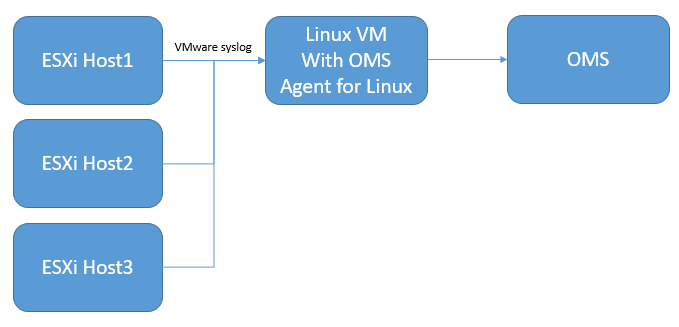

### Configure syslog collection
1. Set up syslog forwarding for VSphere. For detailed information to help set up syslog forwarding, see [Configuring syslog on ESXi 5.0 and higher (2003322)](https://kb.vmware.com/selfservice/microsites/search.do?language=en_US&cmd=displayKC&externalId=2003322). Go to **ESXi Host Configuration** > **Software** > **Advanced Settings** > **Syslog**.
   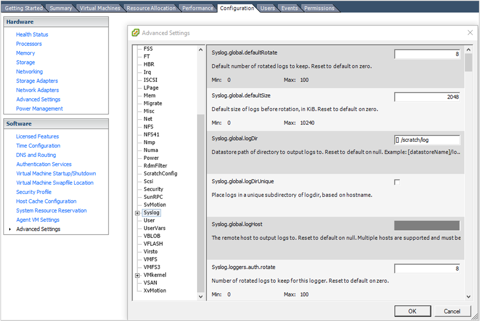  
1. In the *Syslog.global.logHost* field, add your Linux server and the port number *1514*. For example, `tcp://hostname:1514` or `tcp://123.456.789.101:1514`
1. Open the ESXi host firewall for syslog. **ESXi Host Configuration** > **Software** > **Security Profile** > **Firewall** and open **Properties**.  

    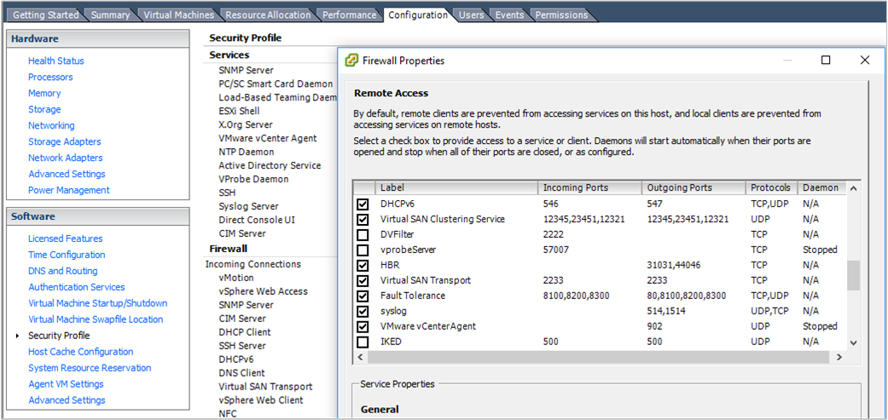  

    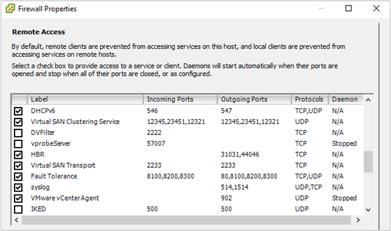  
1. Check the vSphere Console to verify that syslog is properly set up. Confirm on the ESXI host that port **1514** is configured.
1. Download and install the Log Analytics agent for Linux on the Linux server. For more information, see the [Documentation for Log Analytics agent for Linux](https://github.com/Microsoft/OMS-Agent-for-Linux).
1. After the Log Analytics agent for Linux is installed, go to the  /etc/opt/microsoft/omsagent/sysconf/omsagent.d directory and copy the vmware_esxi.conf file to the /etc/opt/microsoft/omsagent/conf/omsagent.d directory and the change the owner/group and permissions of the file. For example:

    ```
    sudo cp /etc/opt/microsoft/omsagent/sysconf/omsagent.d/vmware_esxi.conf /etc/opt/microsoft/omsagent/conf/omsagent.d
   sudo chown omsagent:omiusers /etc/opt/microsoft/omsagent/conf/omsagent.d/vmware_esxi.conf
    ```
1. Restart the Log Analytics agent for Linux by running `sudo /opt/microsoft/omsagent/bin/service_control restart`.
1. Test the connectivity between the Linux server and the ESXi host by using the `nc` command on the ESXi Host. For example:

    ```
    [root@ESXiHost:~] nc -z 123.456.789.101 1514
    Connection to 123.456.789.101 1514 port [tcp/*] succeeded!
    ```

1. In the Azure portal, perform a log query for `VMware_CL`. When Azure Monitor collects the syslog data, it retains the syslog format. In the portal, some specific fields are captured, such as *Hostname* and *ProcessName*.  

    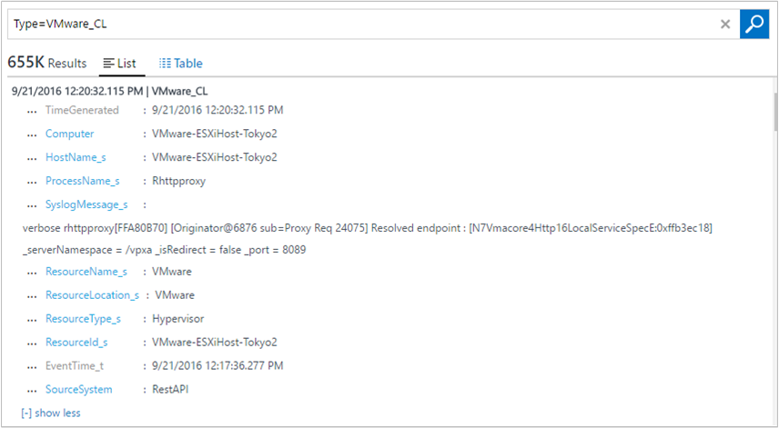  

    If your view log search results are similar to the image above, you're set to use the VMware Monitoring solution dashboard.  

## VMware data collection details
The VMware Monitoring solution collects various performance metrics and log data from ESXi hosts using the Log Analytics agents for Linux that you have enabled.

The following table shows data collection methods and other details about how data is collected.

| platform | Log Analytics agent for Linux | SCOM agent | Azure Storage | SCOM required? | SCOM agent data sent via management group | collection frequency |
| --- | --- | --- | --- | --- | --- | --- |
| Linux |&#8226; |  |  |  |  |every 3 minutes |

The following table show examples of data fields collected by the VMware Monitoring solution:

| field name | description |
| --- | --- |
| Device_s |VMware storage devices |
| ESXIFailure_s |failure types |
| EventTime_t |time when event occurred |
| HostName_s |ESXi host name |
| Operation_s |create VM or delete VM |
| ProcessName_s |event name |
| ResourceId_s |name of the VMware host |
| ResourceLocation_s |VMware |
| ResourceName_s |VMware |
| ResourceType_s |Hyper-V |
| SCSIStatus_s |VMware SCSI status |
| SyslogMessage_s |Syslog data |
| UserName_s |user who created or deleted VM |
| VMName_s |VM name |
| Computer |host computer |
| TimeGenerated |time the data was generated |
| DataCenter_s |VMware datacenter |
| StorageLatency_s |storage latency (ms) |

## VMware Monitoring solution overview
The VMware tile appears in your Log Analytics workspace. It provides a high-level view of any failures. When you click the tile, you go into a dashboard view.

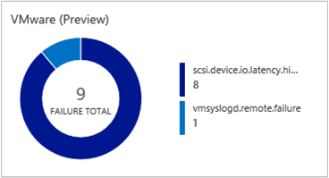

#### Navigate the dashboard view
In the **VMware** dashboard view, blades are organized by:

* Failure Status Count
* Top Host by Event Counts
* Top Event Counts
* Virtual Machine Activities
* ESXi Host Disk Events

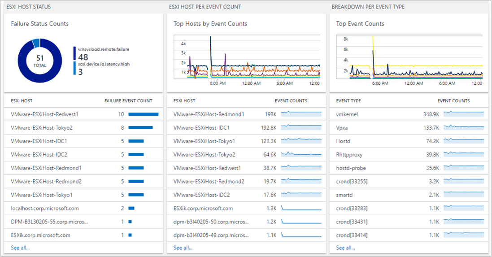

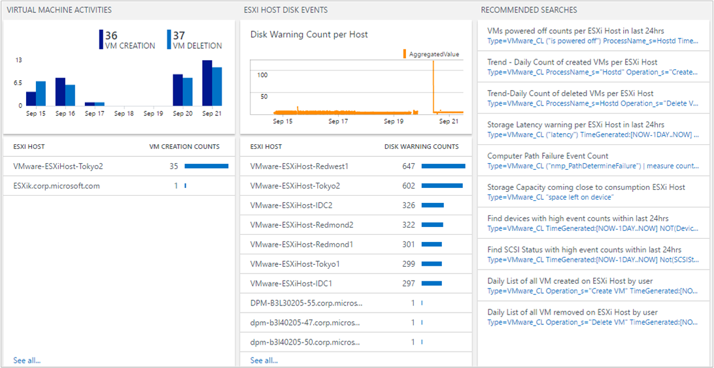

Click any blade to open Log Analytics search pane that shows detailed information specific for the blade.

From here, you can edit the log query to modify it for something specific. For details on creating log queries, see [Find data using log queries in Azure Monitor](../log-query/log-query-overview.md).

#### Find ESXi host events
A single ESXi host generates multiple logs, based on their processes. The VMware Monitoring solution centralizes them and summarizes the event counts. This centralized view helps you understand which ESXi host has a high volume of events and what events occur most frequently in your environment.

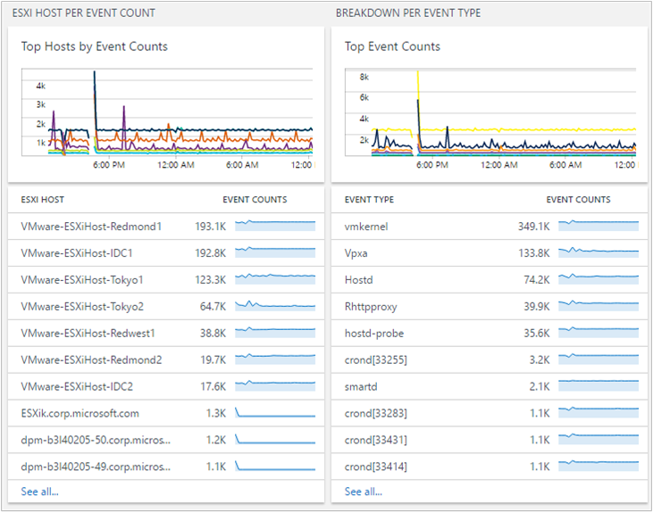

You can drill further by clicking an ESXi host or an event type.

When you click an ESXi host name, you view information from that ESXi host. If you want to narrow results with the event type, add `“ProcessName_s=EVENT TYPE”` in your search query. You can select **ProcessName** in the search filter. That narrows the information for you.

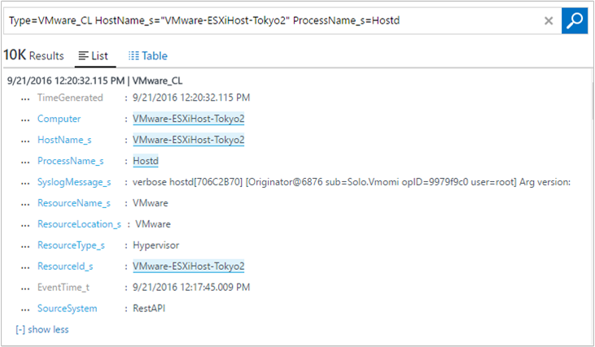

#### Find high VM activities
A virtual machine can be created and deleted on any ESXi host. It's helpful for an administrator to identify how many VMs an ESXi host creates. That in-turn, helps to understand performance and capacity planning. Keeping track of VM activity events is crucial when managing your environment.

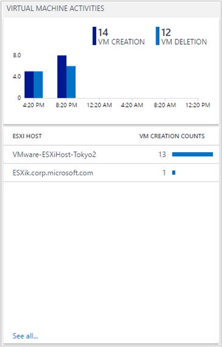

If you want to see additional ESXi host VM creation data, click an ESXi host name.

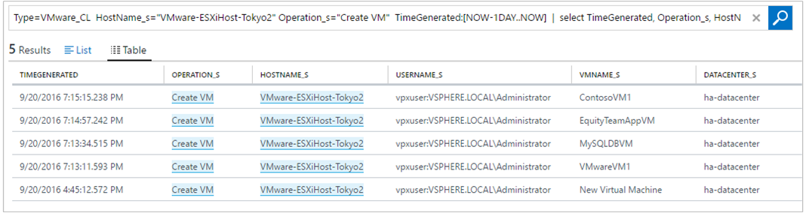

#### Common log queries
The solution includes other useful queries that can help you manage your ESXi hosts, such as high storage space, storage latency, and path failure.

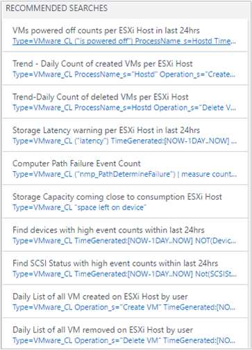


#### Save queries
Saving log queries is a standard feature in Azure Monitor and can help you keep any queries that you’ve found useful. After you create a query that you find useful, save it by clicking the **Favorites**. A saved query lets you easily reuse it later from the [My Dashboard](../learn/tutorial-logs-dashboards.md) page where you can create your own custom dashboards.

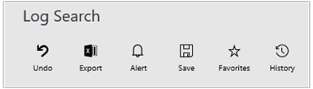

#### Create alerts from queries
After you’ve created your queries, you might want to use the queries to alert you when specific events occur. See [Alerts in Log Analytics](../platform/alerts-overview.md) for information about how to create alerts. For examples of alerting queries and other query examples, see the [Monitor VMware using Log Analytics](https://blogs.technet.microsoft.com/msoms/2016/06/15/monitor-vmware-using-oms-log-analytics) blog post.

## Frequently asked questions
### What do I need to do on the ESXi host setting? What impact will it have on my current environment?
The solution uses the native ESXi Host Syslog forwarding mechanism. You don't need any additional Microsoft software on the ESXi Host to capture the logs. It should have a low impact to your existing environment. However, you do need to set syslog forwarding, which is ESXI functionality.

### Do I need to restart my ESXi host?
No. This process does not require a restart. Sometimes, vSphere does not properly update the syslog. In such a case, log on to the ESXi host and reload the syslog. Again, you don't have to restart the host, so this process isn't disruptive to your environment.

### Can I increase or decrease the volume of log data sent to Log Analytics?
Yes you can. You can use the ESXi Host Log Level settings in vSphere. Log collection is based on the *info* level. So, if you want to audit VM creation or deletion, you need to keep the *info* level on Hostd. For more information, see the [VMware Knowledge Base](https://kb.vmware.com/selfservice/microsites/search.do?&cmd=displayKC&externalId=1017658).

### Why is Hostd not providing data to Log Analytics? My log setting is set to info.
There was an ESXi host bug for the syslog timestamp. For more information, see the [VMware Knowledge Base](https://kb.vmware.com/selfservice/microsites/search.do?language=en_US&cmd=displayKC&externalId=2111202). After you apply the workaround, Hostd should function normally.

### Can I have multiple ESXi hosts forwarding syslog data to a single VM with omsagent?
Yes. You can have multiple ESXi hosts forwarding to a single VM with omsagent.

### Why don't I see data flowing into Log Analytics?
There can be multiple reasons:

* The ESXi host is not correctly pushing data to the VM running omsagent. To test, perform the following steps:

  1. To confirm, log on to the ESXi host using ssh and run the following command: `nc -z ipaddressofVM 1514`

      If this is not successful, vSphere settings in the Advanced Configuration are likely not correct. See [Configure syslog collection](#configure-syslog-collection) for information about how to set up the ESXi host for syslog forwarding.
  1. If syslog port connectivity is successful, but you don't still see any data, then reload the syslog on the ESXi host by using ssh to run the following command: `esxcli system syslog reload`
* The VM with Log Analytics agent is not set correctly. To test this, perform the following steps:

  1. Log Analytics listens to the port 1514. To verify that it is open, run the following command: `netstat -a | grep 1514`
  1. You should see port `1514/tcp` open. If you do not, verify that the omsagent is installed correctly. If you do not see the port information, then the syslog port is not open on the VM.

    a. Verify that the Log Analytics agent is running by using `ps -ef | grep oms`. If it is not running, start the process by running the command `sudo /opt/microsoft/omsagent/bin/service_control start`

     b. Open the `/etc/opt/microsoft/omsagent/conf/omsagent.d/vmware_esxi.conf` file.

     c. Verify that the proper user and group setting is valid, similar to: `-rw-r--r-- 1 omsagent omiusers 677 Sep 20 16:46 vmware_esxi.conf`

     d. If the file does not exist or the user and group setting is wrong, take corrective action by [Preparing a Linux server](#prepare-a-linux-server).

## Next steps
* Use [log queries](../log-query/log-query-overview.md) in Log Analytics to view detailed VMware host data.
* [Create your own dashboards](../learn/tutorial-logs-dashboards.md) showing VMware host data.
* [Create alerts](../platform/alerts-overview.md) when specific VMware host events occur.
