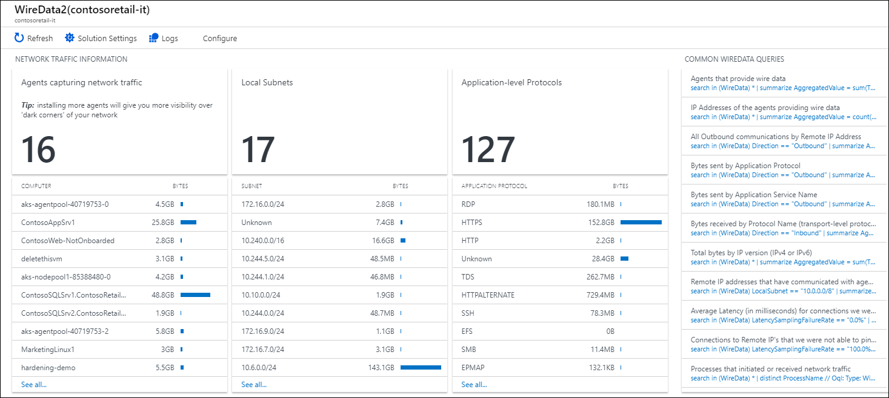
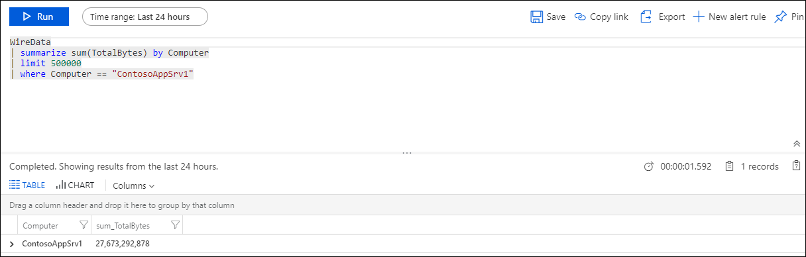
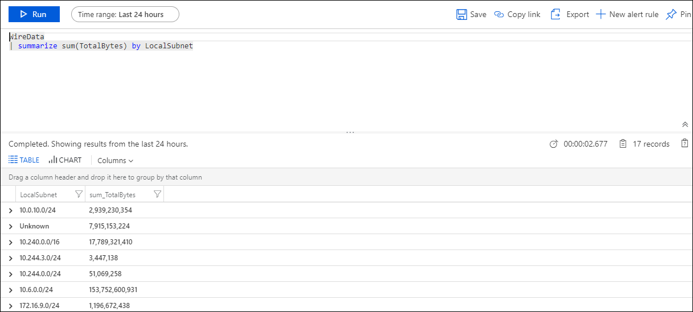
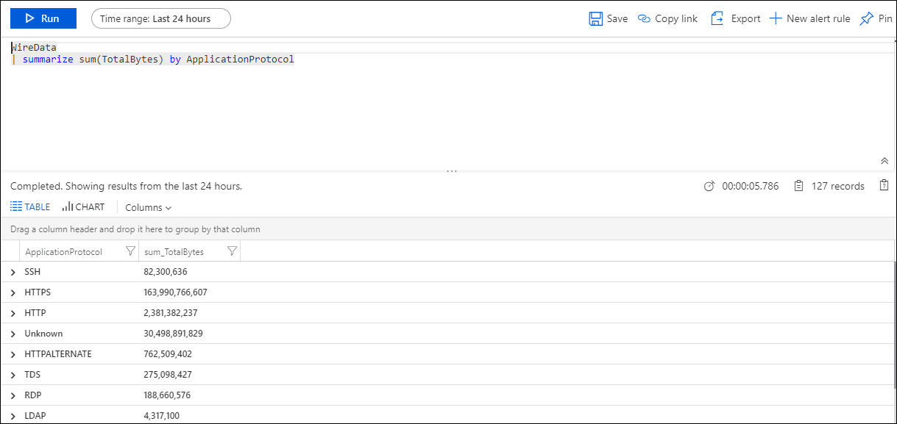

# Wire Data 2.0 (Preview) solution in Azure Monitor (Retired)


>[!NOTE]
>The Wire Data solution has been replaced with [VM insights](../vm/vminsights-overview.md) and [Service Map solution](../vm/service-map.md).  Both use the Log Analytics agent and Dependency agent to collect network connection data into Azure Monitor.
>
>Support for Wire Data solution will end on **March 31, 2022**.  Until the retirement date, existing customers using the Wire Data 2.0 (preview) solution may continue to use it.
>
>New and existing customers should install the [VM insights](../vm/vminsights-enable-overview.md) or [Service Map solution](../vm/service-map.md).  The Map data set they collect is comparable to the Wire Data 2.0 (preview) data set.  VM insights includes the Service Map data set along with additional performance data and features for analysis. Both offerings have [connections with Azure Sentinel](../../sentinel/connect-data-sources.md#map-data-types-with-azure-sentinel-connection-options).
 

Wire data is consolidated network and performance data collected from Windows-connected and Linux-connected computers with the Log Analytics agent, including those monitored by Operations Manager in your environment. Network data is combined with your other log data to help you correlate data.

In addition to the Log Analytics agent, the Wire Data solution uses Microsoft Dependency Agents that you install on computers in your IT infrastructure. Dependency Agents monitor network data sent to and from your computers for network levels 2-3 in the [OSI model](https://en.wikipedia.org/wiki/OSI_model), including the various protocols and ports used. Data is then sent to Azure Monitor using agents.

## Migrate to Azure Monitor VM insights or Service Map

In many cases, we see that customers often have both Wire Data 2.0 (preview) and  [VM insights](../vm/vminsights-overview.md) or [Service Map solution](../vm/service-map.md) already enabled on the same VMs.  This means you have the replacement offering enabled on your VM.  You can simply [remove the Wire Data 2.0 (preview) solution from your Log Analytics workspace](./solutions.md?tabs=portal#remove-a-monitoring-solution).

If you have VMs that only have Wire Data 2.0 (preview) enabled on them, then you can onboard the VMs to [VM insights](../vm/vminsights-enable-overview.md) or [Service Map solution](../vm/service-map.md) and then [remove the Wire Data 2.0 (preview) solution from your Log Analytics workspace](./solutions.md?tabs=portal#remove-a-monitoring-solution).

## Migrate your queries to the VMConnection table from Azure Monitor VM insights

### Agents providing data

#### Wire Data 2.0 query

```
WireData
| summarize AggregatedValue = sum(TotalBytes) by Computer
| limit 500000
```

#### VM insights and Service Map query

```
VMConnection
| summarize AggregatedValue = sum(BytesReceived + BytesSent) by Computer
| limit 500000
```

### IP Addresses of the agents providing data

#### Wire Data 2.0 query

```
WireData
| summarize AggregatedValue = count() by LocalIP
```

#### VM insights and Service Map query

```
VMComputer
| distinct Computer, tostring(Ipv4Addresses)
```

### All Outbound communications by Remote IP Address

#### Wire Data 2.0 query

```
WireData
| where Direction == "Outbound"
| summarize AggregatedValue = count() by RemoteIP
```

#### VM insights and Service Map query

```
VMConnection
| where Direction == "outbound"
| summarize AggregatedValue = count() by RemoteIp
```

### Bytes received by Protocol Name

#### Wire Data 2.0 query

```
WireData 
| where Direction == "Inbound"
| summarize AggregatedValue = sum(ReceivedBytes) by ProtocolName
```

#### VM insights and Service Map query

```
VMConnection
| where Direction == "inbound"
| summarize AggregatedValue = sum(BytesReceived) by Protocol
```

### Amount of Network Traffic (in Bytes) by Process

#### Wire Data 2.0 query

```
WireData
| summarize AggregatedValue = sum(TotalBytes) by ProcessName
```

#### VM insights and Service Map query

```
VMConnection
| summarize sum(BytesReceived), sum(BytesSent) by ProcessName
```

### More examples queries

Refer to the [VM insights log search documentation](../vm/vminsights-log-search.md) and the [VM insights alert documentation](../vm/monitor-virtual-machine-alerts.md) for additional example queries.

## Uninstall Wire Data 2.0 Solution

To uninstall Wire Data 2.0 you simply need to remove the Solution from your Log Analytics Workspace(s).  This will result in the following:

* the Wire Data Management pack being removed from the VMs that are connected to the Workspace 
* the Wire Data data type no longer appearing in your Workspace

Follow [these instructions](./solutions.md?tabs=portal#remove-a-monitoring-solution) to remove the Wire Data solution.

>[!NOTE]
>If you have either the Service Map or VM insights solution on your workspace then the management pack will not be removed, as these solutions also use this management pack.

### Wire Data 2.0 Management packs

When Wire Data is activated in a Log Analytics workspace, a 300-KB management pack is sent to all the Windows servers in that workspace. If you are using System Center Operations Manager agents in a [connected management group](../agents/om-agents.md), the Dependency Monitor management pack is deployed from System Center Operations Manager. If the agents are directly connected, Azure Monitor delivers the management pack.

The management pack is named Microsoft.IntelligencePacks.ApplicationDependencyMonitor. It's written to: %Programfiles%\Microsoft Monitoring Agent\Agent\Health Service State\Management Packs. The data source that the management pack uses is: %Program files%\Microsoft Monitoring Agent\Agent\Health Service State\Resources&lt;AutoGeneratedID&gt;\Microsoft.EnterpriseManagement.Advisor.ApplicationDependencyMonitorDataSource.dll.

## Uninstall the Dependency agent

>[!NOTE]
>If you plan to replace Wire Data with either Service Map or VM insights, you should not remove the Dependency agent.

Use the following sections to help you remove the Dependency agent.  

### Uninstall the Dependency agent on Windows

An administrator can uninstall the Dependency agent for Windows through Control Panel.

An administrator can also run %Programfiles%\Microsoft Dependency Agent\Uninstall.exe to uninstall the Dependency agent.

### Uninstall the Dependency agent on Linux

To completely uninstall the Dependency agent from Linux, you must remove the agent itself and the connector, which is installed automatically with the agent. You can uninstall both by using the following single command:

```
rpm -e dependency-agent dependency-agent-connector
```

## Using the Wire Data 2.0 solution

In the **Overview** page for your Log Analytics workspace in the Azure portal, click the **Wire Data 2.0** tile to open the Wire Data dashboard. The dashboard includes the blades in the following table. Each blade lists up to 10 items matching that blade's criteria for the specified scope and time range. You can run a log search that returns all records by clicking **See all** at the bottom of the blade or by clicking the blade header.

| **Blade** | **Description** |
| --- | --- |
| Agents capturing network traffic | Shows the number of agents that are capturing network traffic and lists the top 10 computers that are capturing traffic. Click the number to run a log search for <code>WireData \| summarize sum(TotalBytes) by Computer \| take 500000</code>. Click a computer in the list to run a log search returning the total number of bytes captured. |
| Local Subnets | Shows the number of local subnets that agents have discovered.  Click the number to run a log search for <code>WireData \| summarize sum(TotalBytes) by LocalSubnet</code> that lists all subnets with the number of bytes sent over each one. Click a subnet in the list to run a log search returning the total number of bytes sent over the subnet. |
| Application-level Protocols | Shows the number of application-level protocols in use, as discovered by agents. Click the number to run a log search for <code>WireData \| summarize sum(TotalBytes) by ApplicationProtocol</code>. Click a protocol to run a log search returning the total number of bytes sent using the protocol. |



You can use the **Agents capturing network traffic** blade to determine how much network bandwidth is being consumed by computers. This blade can help you easily find the _chattiest_ computer in your environment. Such computers could be overloaded, acting abnormally, or using more network resources than normal.



Similarly, you can use the **Local Subnets** blade to determine how much network traffic is moving through your subnets. Users often define subnets around critical areas for their applications. This blade offers a view into those areas.



The **Application-level Protocols** blade is useful because it's helpful know what protocols are in use. For example, you might expect SSH to not be in use in your network environment. Viewing information available in the blade can quickly confirm or disprove your expectation.



It's also useful to know if protocol traffic is increasing or decreasing over time. For example, if the amount of data being transmitted by an application is increasing, that might be something you should be aware of, or that you might find noteworthy.

## Input data

Wire data collects metadata about network traffic using the agents that you have enabled. Each agent sends data about every 15 seconds.

## Output data

A record with a type of _WireData_ is created for each type of input data. WireData records have properties shown in the following table:

| Property | Description |
|---|---|
| Computer | Computer name where data was collected |
| TimeGenerated | Time of the record |
| LocalIP | IP address of the local computer |
| SessionState | Connected or disconnected |
| ReceivedBytes | Amount of bytes received |
| ProtocolName | Name of the network protocol used |
| IPVersion | IP version |
| Direction | Inbound or outbound |
| MaliciousIP | IP address of a known malicious source |
| Severity | Suspected malware severity |
| RemoteIPCountry | Country/region of the remote IP address |
| ManagementGroupName | Name of the Operations Manager management group |
| SourceSystem | Source where data was collected |
| SessionStartTime | Start time of session |
| SessionEndTime | End time of session |
| LocalSubnet | Subnet where data was collected |
| LocalPortNumber | Local port number |
| RemoteIP | Remote IP address used by the remote computer |
| RemotePortNumber | Port number used by the remote IP address |
| SessionID | A unique value that identifies communication session between two IP addresses |
| SentBytes | Number of bytes sent |
| TotalBytes | Total number of bytes sent during session |
| ApplicationProtocol | Type of network protocol used   |
| ProcessID | Windows process ID |
| ProcessName | Path and file name of the process |
| RemoteIPLongitude | IP longitude value |
| RemoteIPLatitude | IP latitude value |

## Next steps

- See [Deploy VM insights](../vm/vminsights-enable-overview.md) for requirements and methods that to enable monitoring for your virtual machines.
- [Search logs](../logs/log-query-overview.md) to view detailed wire data search records.