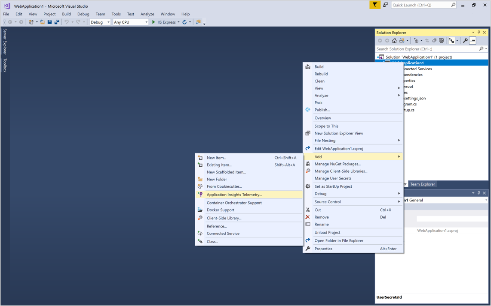
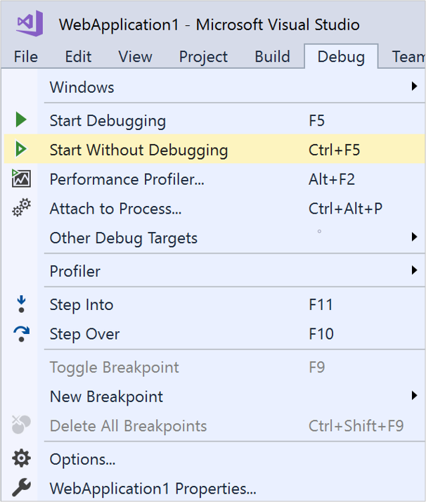
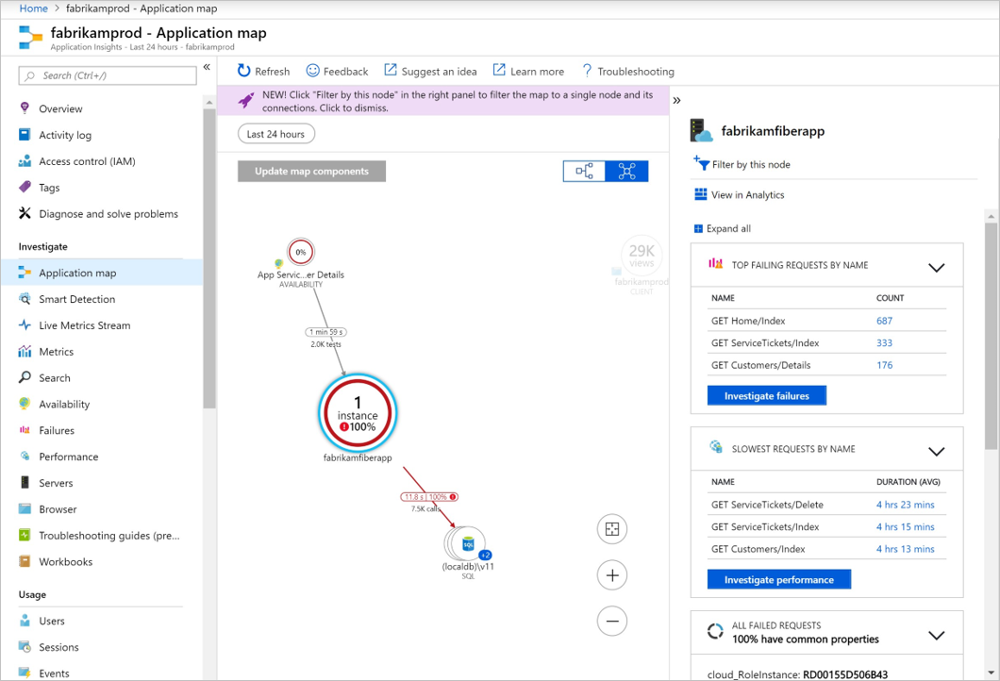
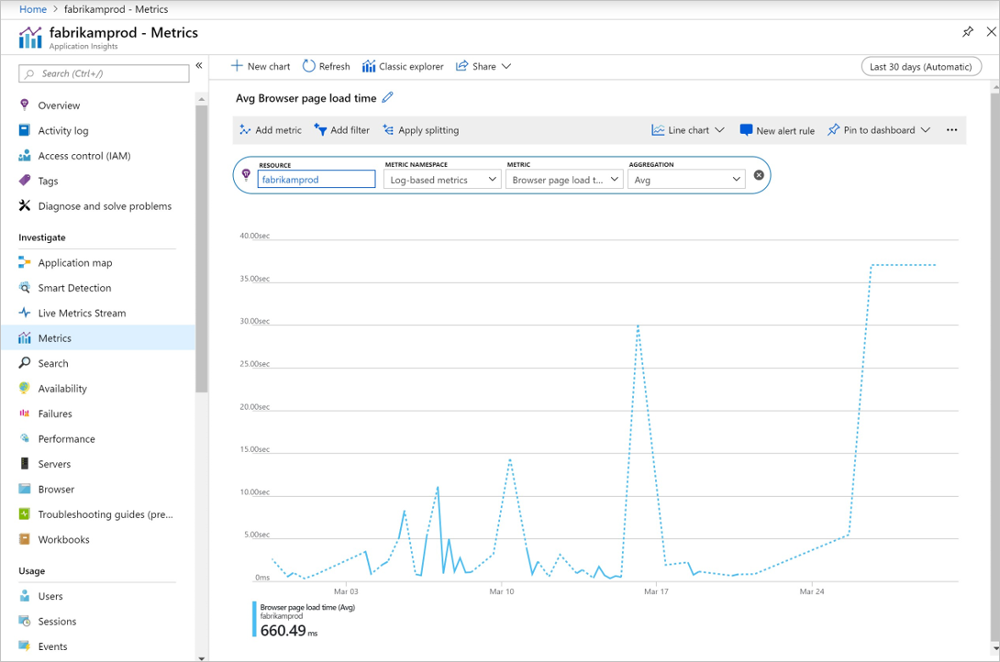

# Start Monitoring Your ASP.NET Core Web Application

With Azure Application Insights, you can easily monitor your web application for availability, performance, and usage. You can also quickly identify and diagnose errors in your application without waiting for a user to report them. 

This quickstart guides you through adding the Application Insights SDK to an existing ASP.NET Core web application. To learn about configuring Application Insights without Visual Studio checkout this [article](https://docs.microsoft.com/azure/azure-monitor/app/asp-net-core).

## Prerequisites

To complete this quickstart:

- [Install Visual Studio 2019](https://visualstudio.microsoft.com/downloads/?utm_medium=microsoft&utm_source=docs.microsoft.com&utm_campaign=inline+link&utm_content=download+vs2019) with the following workloads:
  - ASP.NET and web development
  - Azure development
- [Install .NET Core 2.0 SDK](https://dotnet.microsoft.com/download)
- You will need an Azure subscription and an existing .NET Core web application.

If you don't have an ASP.NET Core web application, you can use our step-by-step guide to [create an ASP.NET Core app and add Application Insights.](../../azure-monitor/app/asp-net-core.md)

If you don't have an Azure subscription, create a [free](https://azure.microsoft.com/free/) account before you begin.

## Sign in to the Azure portal

Sign in to the [Azure portal](https://portal.azure.com/).

## Enable Application Insights

Application Insights can gather telemetry data from any internet-connected application, regardless of whether it's running on-premises or in the cloud. Use the following steps to start viewing this data.

1. Select **Create a resource** > **Developer tools** > **Application Insights**.

   > [!NOTE]
   >If this is your first time creating an Application Insights resource you can learn more by visiting the [Create an Application Insights Resource](https://docs.microsoft.com/azure/azure-monitor/app/create-new-resource) doc.

    A configuration box appears; use the following table to fill out the input fields.

   | Settings        |  Value           | Description  |
   | ------------- |:-------------|:-----|
   | **Name**      | Globally Unique Value | Name that identifies the app you are monitoring |
   | **Resource Group**     | myResourceGroup      | Name for the new resource group to host App Insights data. You can create a new resource group or use an existing one. |
   | **Location** | East US | Choose a location near you, or near where your app is hosted |

2. Click **Create**.

## Configure App Insights SDK

1. Open your ASP.NET Core Web App **project** in Visual Studio > Right-click on the AppName in the **Solution Explorer** > Select **Add** > **Application Insights Telemetry**.

    

2. Click the **Get Started** button

3. Select your account and subscription > Select the **Existing resource** you created in the Azure portal > Click **Register**.

4. Select **Project** > **Manage NuGet Packages** > **Package source: nuget.org** > **Update** the Application Insights SDK packages to the latest stable release.

5. Select **Debug** > **Start without Debugging** (Ctrl+F5) to Launch your app

    

> [!NOTE]
> It takes 3-5 minutes before data begins appearing in the portal. If this app is a low-traffic test app, keep in mind that most metrics are only captured when there are active requests or operations.

## Start monitoring in the Azure portal

1. Reopen the Application Insights **Overview** page in the Azure portal by selecting **Home** and under recent resources select the resource you created earlier, to view details about your currently running application.

   

2. Click **Application map** for a visual layout of the dependency relationships between your application components. Each component shows KPIs such as load, performance, failures, and alerts.

   

3. Click on the **App Analytics** icon  **View in Analytics**. This opens **Application Insights Analytics**, which provides a rich query language for analyzing all data collected by Application Insights. In this case, a query is generated for you that renders the request count as a chart. You can write your own queries to analyze other data.

   

4. Return to the **Overview** page and examine the KPI Dashboards.  This dashboard provides statistics about your application health, including the number of incoming requests, the duration of those requests, and any failures that occur. 

   

5. On the left click on **Metrics**. Use the metrics explorer to investigate the health and utilization of your resource. You can click **Add new chart** to create additional custom views or select **Edit** to modify the existing chart types, height, color palette, groupings, and metrics. For example, you can make a chart that displays the average browser page load time by picking "Browser page load time" from the metrics drop down and "Avg" from aggregation. To learn more about Azure Metrics Explorer visit [Getting started with Azure Metrics Explorer](../../azure-monitor/platform/metrics-getting-started.md).

     

## Clean up resources
When you are done testing, you can delete the resource group and all related resources. To do so follow the steps below.

> [!NOTE]
> If you used an existing resource group the instructions below will not work and you will need to just delete the individual Application Insights resource. Keep in mind anytime you delete a resource group all underyling resources that are members of that group will be deleted.

1. From the left-hand menu in the Azure portal, click **Resource groups** and then click **myResourceGroup**.
2. On your resource group page, click **Delete**, type **myResourceGroup** in the text box, and then click **Delete**.

## Next steps

> [!div class="nextstepaction"]
> [Find and diagnose run-time exceptions](https://docs.microsoft.com/azure/application-insights/app-insights-tutorial-runtime-exceptions)
