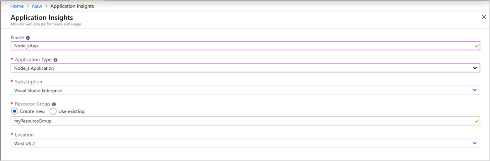
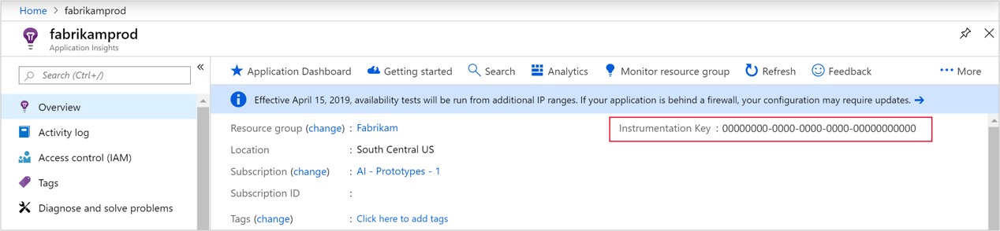

# Start Monitoring Your Node.js Web Application

With Azure Application Insights, you can easily monitor your web application for availability, performance, and usage. You can also quickly identify and diagnose errors in your application without waiting for a user to report them. With the version 0.20 SDK release onward, you can monitor common third-party packages, including MongoDB, MySQL, and Redis.

This quickstart guides you through adding the version 0.22 Application Insights SDK for Node.js to an existing Node.js web application.

## Prerequisites

To complete this quickstart:

- You need an Azure Subscription and an existing Node.js web application.

If you don't have a Node.js web application, you can create one by following the [Create a Node.js web app quickstart](https://docs.microsoft.com/azure/app-service/app-service-web-get-started-nodejs).

If you don't have an Azure subscription, create a [free](https://azure.microsoft.com/free/) account before you begin.

## Sign in to the Azure portal

Sign in to the [Azure portal](https://portal.azure.com/).

## Enable Application Insights

Application Insights can gather telemetry data from any internet-connected application, regardless of whether it's running on-premises or in the cloud. Use the following steps to start viewing this data.

1. Select **Create a resource** > **Developer tools** > **Application Insights**.

   

   


   A configuration box appears; use the following table to fill out the input fields.

    | Settings        | Value           | Description  |
   | ------------- |:-------------|:-----|
   | **Name**      | Globally Unique Value | Name that identifies the app you are monitoring |
   | **Application Type** | Node.js Application | Type of app you are monitoring |
   | **Resource Group**     | myResourceGroup      | Name for the new resource group to host App Insights data |
   | **Location** | East US | Choose a location near you, or near where your app is hosted |

2. Click **Create**.

## Configure App Insights SDK

1. Select **Overview** and copy your application's **Instrumentation Key**.

   

2. Add the Application Insights SDK for Node.js to your application. From your app's root folder run:

   ```bash
   npm install applicationinsights --save
   ```

3. Edit your app's first .js file and add the two lines below to the topmost part of your script. If you are using the [Node.js quickstart app](https://docs.microsoft.com/azure/app-service/app-service-web-get-started-nodejs), you would modify the index.js file. Replace &lt;instrumentation_key&gt; with your application's instrumentation key. 

   ```JavaScript
   const appInsights = require('applicationinsights');
   appInsights.setup('<instrumentation_key>').start();
   ```

4. Restart your app.

> [!NOTE]
> It takes 3-5 minutes before data begins appearing in the portal. If this app is a low-traffic test app, keep in mind that most metrics are only captured when there are active requests or operations occurring.

## Start monitoring in the Azure portal

1. You can now reopen the Application Insights **Overview** page in the Azure portal, where you retrieved your instrumentation key, to view details about your currently running application.

   

2. Click **Application map** for a visual layout of the dependency relationships between your application components. Each component shows KPIs such as load, performance, failures, and alerts.

   

3. Click on the **App Analytics** icon  **View in Analytics**.  This opens **Application Insights Analytics**, which provides a rich query language for analyzing all data collected by Application Insights. In this case, a query is generated for you that renders the request count as a chart. You can write your own queries to analyze other data.

   

4. Return to the **Overview** page and examine the KPI graphs.  This dashboard provides statistics about your application health, including the number of incoming requests, the duration of those requests, and any failures that occur.

   

   To enable the **Page View Load Time** chart to populate with **client-side telemetry** data, add this script to each page that you want to track:

   ```HTML
   <!-- 
   To collect user behavior analytics tools about your application, 
   insert the following script into each page you want to track.
   Place this code immediately before the closing </head> tag,
   and before any other scripts. Your first data will appear 
   automatically in just a few seconds.
   -->
   <script type="text/javascript">
     var appInsights=window.appInsights||function(config){
       function i(config){t[config]=function(){var i=arguments;t.queue.push(function(){t[config].apply(t,i)})}}var t={config:config},u=document,e=window,o="script",s="AuthenticatedUserContext",h="start",c="stop",l="Track",a=l+"Event",v=l+"Page",y=u.createElement(o),r,f;y.src=config.url||"https://az416426.vo.msecnd.net/scripts/a/ai.0.js";u.getElementsByTagName(o)[0].parentNode.appendChild(y);try{t.cookie=u.cookie}catch(p){}for(t.queue=[],t.version="1.0",r=["Event","Exception","Metric","PageView","Trace","Dependency"];r.length;)i("track"+r.pop());return i("set"+s),i("clear"+s),i(h+a),i(c+a),i(h+v),i(c+v),i("flush"),config.disableExceptionTracking||(r="onerror",i("_"+r),f=e[r],e[r]=function(config,i,u,e,o){var s=f&&f(config,i,u,e,o);return s!==!0&&t["_"+r](config,i,u,e,o),s}),t
       }({
           instrumentationKey:"<insert instrumentation key>"
       });
       
       window.appInsights=appInsights;
       appInsights.trackPageView();
   </script>
   ```

5. On the left click on **Metrics**. Use the metrics explorer to investigate the health and utilization of your resource. You can click **Add new chart** to create additional custom views or select **Edit** to modify the existing chart types, height, color palette, groupings, and metrics. For example, you can make a chart that displays the average browser page load time by picking "Browser page load time" from the metrics drop down and "Avg" from aggregation. To learn more about Azure Metrics Explorer visit [Getting started with Azure Metrics Explorer](../../azure-monitor/platform/metrics-getting-started.md).

   

To learn more about monitoring Node.js, check out the [additional App Insights Node.js documentation](../../azure-monitor/app/nodejs.md).

## Clean up resources

When you are done testing, you can delete the resource group and all related resources. To do so follow the steps below.

1. From the left-hand menu in the Azure portal, click **Resource groups** and then click **myResourceGroup**.
2. On your resource group page, click **Delete**, type **myResourceGroup** in the text box, and then click **Delete**.

## Next steps

> [!div class="nextstepaction"]
> [Find and diagnose performance problems](https://docs.microsoft.com/azure/application-insights/app-insights-analytics)
