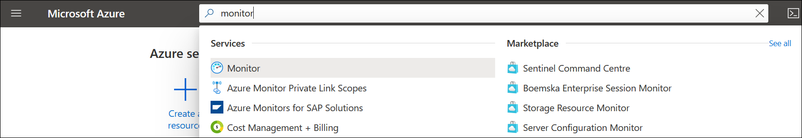
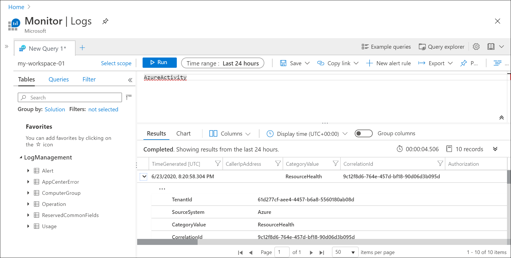

# Send Azure Activity log to Log Analytics workspace using Azure Resource Manager template
The Activity log is a platform log in Azure that provides insight into subscription-level events. This includes such information as when a resource is modified or when a virtual machine is started. You can view the Activity log in the Azure portal or retrieve entries with PowerShell and CLI. This quickstart shows how to use ARM templates to create a Log Analytics workspace and a diagnostic setting to send the Activity log to Azure Monitor Logs where you can analyze it using [log queries](../log-query/log-query-overview.md) and enable other features such as [log alerts](../platform/alerts-log-query.md) and [workbooks](../platform/workbooks-overview.md). 

[!INCLUDE [About Azure Resource Manager](../../../includes/resource-manager-quickstart-introduction.md)]

## Create a Log Analytics workspace

### Review the template
The following template creates an empty Log Analytics workspace. Save this template as *CreateWorkspace.json*.

```json
{
  "$schema": "https://schema.management.azure.com/schemas/2015-01-01/deploymentTemplate.json#",
  "contentVersion": "1.0.0.0",
  "parameters": {
      "workspaceName": {
          "type": "string",
          "metadata": {
            "description": "Name of the workspace."
          }
      },
      "sku": {
          "type": "string",
          "allowedValues": [
            "pergb2018",
            "Free",
            "Standalone",
            "PerNode",
            "Standard",
            "Premium"
            ],
          "defaultValue": "pergb2018",
          "metadata": {
          "description": "Pricing tier: PerGB2018 or legacy tiers (Free, Standalone, PerNode, Standard or Premium) which are not available to all customers."
          }
        },
        "location": {
          "type": "string",
          "allowedValues": [
          "australiacentral", 
          "australiaeast", 
          "australiasoutheast", 
          "brazilsouth",
          "canadacentral", 
          "centralindia", 
          "centralus", 
          "eastasia", 
          "eastus", 
          "eastus2", 
          "francecentral", 
          "japaneast", 
          "koreacentral", 
          "northcentralus", 
          "northeurope", 
          "southafricanorth", 
          "southcentralus", 
          "southeastasia",
          "switzerlandnorth",
          "switzerlandwest",
          "uksouth", 
          "ukwest", 
          "westcentralus", 
          "westeurope", 
          "westus", 
          "westus2" 
          ],
          "metadata": {
              "description": "Specifies the location for the workspace."
              }
        },
        "retentionInDays": {
          "type": "int",
          "defaultValue": 120,
          "metadata": {
            "description": "Number of days to retain data."
          }
        },
        "resourcePermissions": {
          "type": "bool",
          "defaultValue": true,
          "metadata": {
            "description": "true to use resource or workspace permissions. false to require workspace permissions."
          }
        }
      },
      "resources": [
      {
          "type": "Microsoft.OperationalInsights/workspaces",
          "name": "[parameters('workspaceName')]",
          "apiVersion": "2020-03-01-preview",
          "location": "[parameters('location')]",
          "properties": {
              "sku": {
                  "name": "[parameters('sku')]"
              },
              "retentionInDays": "[parameters('retentionInDays')]",
              "features": {
                  "searchVersion": 1,
                  "legacy": 0,
                  "enableLogAccessUsingOnlyResourcePermissions": "[parameters('resourcePermissions')]"
              }
          }
      }
  ]
}
```

### Deploy the template
Deploy the template using any standard method for [deploying an ARM template](../../azure-resource-manager/templates/deploy-portal.md) such as the following examples using CLI and PowerShell. Replace the sample values for **Resource Group**, **workspaceName**, and **location** with appropriate values for your environment. The workspace name must be unique among all Azure subscriptions.

# [CLI](#tab/CLI1)

```azurecli
az login
az deployment group create \
    --name CreateWorkspace \
    --resource-group my-resource-group \
    --template-file CreateWorkspace.json \
    --parameters workspaceName='my-workspace-01' location='eastus'

```

# [PowerShell](#tab/PowerShell1)

```powershell
Connect-AzAccount
Select-AzSubscription -SubscriptionName my-subscription
New-AzResourceGroupDeployment -Name AzureMonitorDeployment -ResourceGroupName my-resource-group -TemplateFile CreateWorkspace.json -workspaceName my-workspace-01 -location eastus
```

---

### Verify the deployment
Verify that the workspace has been created using one of the following commands. Replace the sample values for **Resource Group** and **workspaceName** with the values you used above.

# [CLI](#tab/CLI2)

```azurecli
az monitor log-analytics workspace show --resource-group my-workspace-01 --workspace-name my-resource-group
```

# [PowerShell](#tab/PowerShell2)

```powershell
Get-AzOperationalInsightsWorkspace -Name my-workspace-01 -ResourceGroupName my-resource-group
```

---

## Create diagnostic setting
The following template creates a diagnostic setting that sends the Activity log to a Log Analytics workspace. Save this template as *CreateDiagnosticSetting.json*.

```json
{
    "$schema": "https://schema.management.azure.com/schemas/2019-04-01/deploymentTemplate.json#",
    "contentVersion": "1.0.0.0",
    "parameters": {
        "settingName": {
            "type": "String"
        },
        "workspaceId": {
            "type": "String"
        }
    },
    "resources": [
        {
          "type": "Microsoft.Insights/diagnosticSettings",
          "apiVersion": "2017-05-01-preview",
          "name": "[parameters('settingName')]",
          "dependsOn": [],
          "properties": {
            "workspaceId": "[parameters('workspaceId')]",
            "logs": [
              {
                "category": "Administrative",
                "enabled": true
              },
              {
                "category": "Alert",
                "enabled": true
              },
              {
                "category": "Autoscale",
                "enabled": true
              },
              {
                "category": "Policy",
                "enabled": true
              },
              {
                "category": "Recommendation",
                "enabled": true
              },
              {
                "category": "ResourceHealth",
                "enabled": true
              },
              {
                "category": "Security",
                "enabled": true
              },
              {
                "category": "ServiceHealth",
                "enabled": true
              }
            ]
          }
        }
    ]
}
```

### Deploy the template
Deploy the template using any standard method for [deploying an ARM template](/azure-resource-manager/templates/deploy-portal) such as the following examples using CLI and PowerShell. Replace the sample values for **Resource Group**, **workspaceName**, and **location** with appropriate values for your environment. The workspace name must be unique among all Azure subscriptions.

# [CLI](#tab/CLI3)

```azurecli
az deployment sub create --name CreateDiagnosticSetting --location eastus --template-file CreateDiagnosticSetting.json --parameters settingName='Send Activity log to workspace' workspaceId='/subscriptions/00000000-0000-0000-0000-000000000000/resourcegroups/my-resource-group/providers/microsoft.operationalinsights/workspaces/my-workspace-01'

```

# [PowerShell](#tab/PowerShell3)

```powershell
New-AzSubscriptionDeployment -Name CreateDiagnosticSetting -location eastus -TemplateFile CreateDiagnosticSetting.json -settingName="Send Activity log to workspace" -workspaceId "/subscriptions/00000000-0000-0000-0000-000000000000/resourcegroups/my-resource-group/providers/microsoft.operationalinsights/workspaces/my-workspace-01"
```
---

### Verify the deployment
Verify that the diagnostic setting has been created using one of the following commands. Replace the sample values for the subscription and setting name with the values you used above.

> [!NOTE]
> You cannot currently retrieve subscription level diagnostic settings using PowerShell.

```azurecli
az monitor diagnostic-settings show --resource '/subscriptions/00000000-0000-0000-0000-000000000000' --name 'Send Activity log to workspace'
```


## Generate log data
Only new Activity log entries will be sent to the Log Analytics workspace, so perform some actions in your subscription that will be logged such as starting or stopping a virtual machine or creating or modifying another resource. You may need to wait a few minutes for the diagnostic setting to be created and for data to initially be written to the workspace. After this delay, all events written to the Activity log will be sent to the workspace within a few seconds.

## Retrieve data with a log query
Use the Azure portal to use Log Analytics to retrieve data from the workspace. In the Azure portal, search for and then select **Monitor**. 



Select **Logs** in the **Azure Monitor** menu. Close the **Example queries** page. If the scope isn't set to the workspace you created, then click **Select scope** and locate it.


In the query window, type `AzureActivity` and click **Run**. This is a simple query that returns all records in the *AzureActivity* table, which contains all the records sent from the Activity log.


Expand one of the records to view its detailed properties.



Try a more complex query such as `AzureActivity | summarize count() by CategoryValue` which gives a count of events summarized by category.


## Clean up resources
If you plan to continue working with subsequent quickstarts and tutorials, you might want to leave these resources in place. When no longer needed, delete the resource group, which deletes the alert rule and the related resources. To delete the resource group by using Azure CLI or Azure PowerShell


 
# [CLI](#tab/CLI3)

```azurecli
az group delete --name my-resource-group
```

# [PowerShell](#tab/PowerShell3)

```powershell
Remove-AzResourceGroup -Name my-resource-group
```

---

## Next steps
In this quickstart, you configured the Activity log to be sent to a Log Analytics workspace. You can now configure other data to be collected into the workspace where you can analyze it together using [log queries](../log-query/log-query-overview.md) in Azure Monitor and leverage features such as [log alerts](../platform/alerts-log-query.md) and [workbooks](../platform/workbooks-overview.md). You should next gather [resource logs](../platform/resource-logs.md) from your Azure resources which compliment the data in the Activity log providing insight into the operations that were performed within each resource.


> [!div class="nextstepaction"]
> [Collect and analyze resource logs with Azure Monitor](tutorial-resource-logs.md)